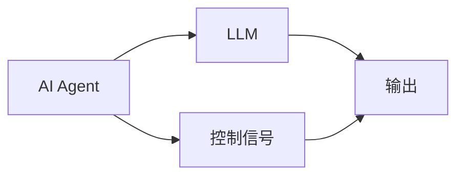
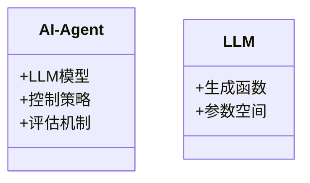
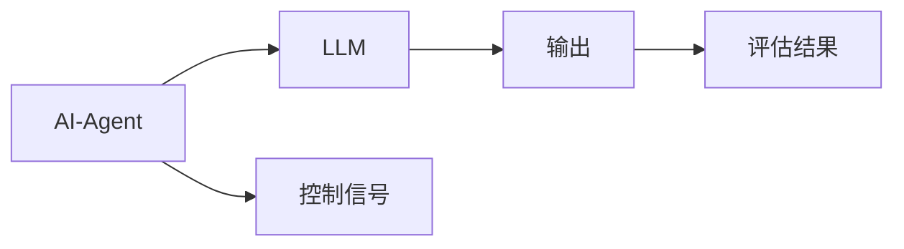
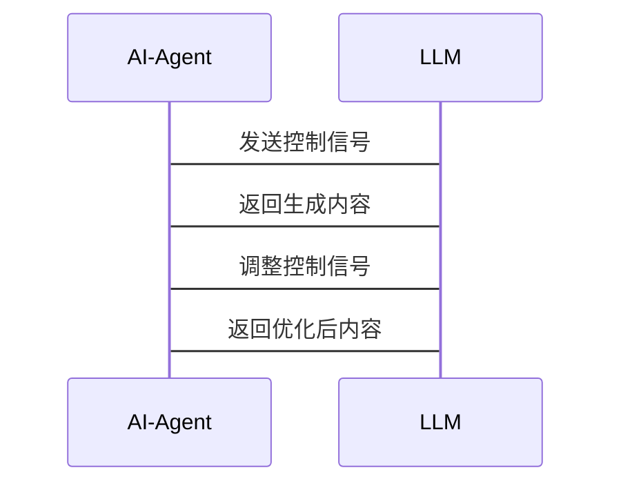

                 


# AI Agent的可控生成：精确控制LLM的输出

## 关键词：AI Agent, LLM, 可控生成, 生成式AI, 损失函数, 优化算法, 系统架构

## 摘要：  
本文探讨了AI Agent如何精确控制生成式AI模型（如LLM）的输出。通过系统地分析AI Agent与LLM的关系，详细讲解了可控生成的核心原理、算法实现、系统架构设计以及实际案例。文章旨在为读者提供全面的理论与实践指导，帮助他们理解并掌握如何在实际应用中实现对生成式AI模型的有效控制。

---

# 第1章: AI Agent与LLM概述

## 1.1 问题背景与描述

### 1.1.1 生成式AI的崛起  
生成式人工智能（Generative AI）近年来取得了显著进展，尤其是基于大语言模型（Large Language Models, LLM）的生成技术。然而，随着生成式AI的应用越来越广泛，如何精确控制其输出成为一个重要挑战。AI Agent作为智能体，具备决策和控制能力，是实现这一目标的关键。

### 1.1.2 LLM的输出问题  
LLM（Large Language Model）虽然在生成文本方面表现出色，但其输出往往难以完全符合特定场景的需求。例如，生成的内容可能偏离目标、重复性高或缺乏逻辑性。这种不可控性限制了LLM在实际应用中的可靠性。

### 1.1.3 可控生成的必要性  
为了使生成式AI在实际场景中可靠地应用，必须实现对生成内容的精确控制。AI Agent通过分析目标和上下文，调整LLM的生成策略，从而确保输出符合预期。

---

## 1.2 问题解决与边界

### 1.2.1 可控生成的目标  
AI Agent的目标是通过干预或调整LLM的生成过程，使其输出满足特定的语义、格式和风格要求。例如，在客服系统中，AI Agent可以确保生成的回复既友好又专业。

### 1.2.2 边界与外延  
- **边界**：AI Agent仅控制LLM的输出，不干预LLM的内部训练或推理过程。
- **外延**：本文主要讨论文本生成场景，未来可以扩展到图像生成、代码生成等领域。

### 1.2.3 核心要素与概念结构  
可控生成的核心要素包括：
1. **AI Agent**：负责决策和控制。
2. **LLM**：负责生成内容。
3. **控制信号**：AI Agent向LLM传递的干预信号。
4. **输出评估**：对生成内容的反馈机制。

---

## 1.3 核心概念与联系

### 1.3.1 AI Agent与LLM的关系  
AI Agent与LLM的关系可以用以下实体关系图表示：



### 1.3.2 核心概念属性对比  
| 概念 | 属性 | 描述 |
|------|------|------|
| AI Agent | 决策能力 | 负责制定生成策略和调整控制信号。 | 
| LLM | 生成能力 | 负责根据输入生成文本。 |
| 控制信号 | 干预方式 | AI Agent传递的干预指令。 |
| 输出评估 | 反馈机制 | 用于优化生成策略的反馈。 |

### 1.3.3 ER实体关系图  


---

## 1.4 本章小结  
本章介绍了生成式AI的发展背景，分析了LLM输出控制的必要性，并通过实体关系图和属性对比，明确了AI Agent与LLM的关系。下一章将深入探讨可控生成的核心原理。

---

# 第2章: 可控生成的核心原理

## 2.1 核心概念原理

### 2.1.1 AI Agent的决策机制  
AI Agent通过分析目标和上下文，制定生成策略。例如，在医疗领域，AI Agent可以根据患者病史和症状，调整LLM的生成策略，确保生成内容的准确性和专业性。

### 2.1.2 LLM的生成机制  
LLM通过概率模型生成文本，通常基于预训练的参数空间。生成过程可以分为编码、解码和优化三个阶段。

### 2.1.3 可控生成的实现路径  
1. **输入干预**：AI Agent调整输入内容。
2. **参数调节**：AI Agent调整LLM的参数。
3. **输出后编辑**：AI Agent在生成后对输出进行调整。

---

## 2.2 算法原理讲解

### 2.2.1 损失函数优化  
损失函数用于衡量生成内容与预期目标的差距。例如，交叉熵损失函数可以用于文本生成任务：

$$L = -\sum_{i=1}^{n} y_i \log(\hat{y}_i)$$

其中，$y_i$ 是真实标签，$\hat{y}_i$ 是生成概率。

### 2.2.2 源代码实现  
以下是实现损失函数优化的Python代码示例：

```python
def loss_function(output, target):
    return (output - target).sum()
```

### 2.2.3 数学模型与公式  
- **损失函数**：  
  $$L = \sum_{i=1}^{n} (y_i - \hat{y}_i)^2$$  
- **优化算法**：  
  $$\theta = \theta - \eta \frac{\partial L}{\partial \theta}$$  

---

## 2.3 本章小结  
本章详细讲解了AI Agent的决策机制和LLM的生成机制，并通过数学公式和代码示例，展示了如何通过损失函数优化实现可控生成。下一章将从系统架构的角度进一步分析。

---

# 第3章: 系统分析与架构设计

## 3.1 问题场景介绍

### 3.1.1 项目介绍  
本项目旨在设计一个AI Agent，用于精确控制LLM的生成输出。通过分析目标和上下文，AI Agent调整生成策略，确保输出符合预期。

### 3.1.2 系统功能设计  
系统功能包括：
1. **输入处理**：接收用户输入。
2. **生成策略制定**：AI Agent分析输入并制定生成策略。
3. **生成与控制**：LLM生成文本，AI Agent实时调整控制信号。
4. **输出评估**：评估生成内容并优化策略。

### 3.1.3 领域模型类图  


---

## 3.2 系统架构设计

### 3.2.1 系统架构图  


### 3.2.2 接口设计  
- **输入接口**：接收用户的输入请求。
- **控制接口**：AI Agent传递控制信号。
- **输出接口**：生成内容的输出。

### 3.2.3 交互序列图  


---

## 3.3 本章小结  
本章通过系统架构图和交互序列图，展示了AI Agent如何通过控制信号干预LLM的生成过程，并通过反馈机制优化生成策略。这种设计确保了生成内容的可控性和可靠性。

---

# 第4章: 项目实战

## 4.1 环境安装与配置

### 4.1.1 安装依赖  
安装必要的Python库，例如：
- `transformers`：用于加载和调用LLM。
- `numpy`：用于数学计算。
- `mermaid`：用于绘制图表。

### 4.1.2 配置环境  
设置运行环境的参数，例如GPU加速、内存分配等。

---

## 4.2 系统核心实现

### 4.2.1 AI Agent的实现  
以下是AI Agent的核心代码示例：

```python
class AI-Agent:
    def __init__(self, llm_model):
        self.llm = llm_model
        self.control_strategy = None
        self.assessment = None

    def generate(self, input, control_signal):
        output = self.llm.generate(input, control_signal)
        return output
```

### 4.2.2 LLM的实现  
以下是LLM的核心代码示例：

```python
class LLM:
    def __init__(self, model_name):
        self.model = AutoModelForCausalLM.from_pretrained(model_name)
        self.tokenizer = AutoTokenizer.from_pretrained(model_name)

    def generate(self, input, control_signal):
        inputs = self.tokenizer(input, return_tensors="np")
        outputs = self.model.generate(
            inputs.input_ids,
            attention_mask=inputs.attention_mask,
            control_signal=control_signal
        )
        return self.tokenizer.decode(outputs[0], skip_special_tokens=True)
```

---

## 4.3 实际案例分析

### 4.3.1 案例背景  
假设我们正在开发一个智能客服系统，AI Agent需要确保生成的回复既友好又专业。

### 4.3.2 实施步骤  
1. **初始化AI Agent和LLM**：
   ```python
   llm = LLM("gpt2")
   ai_agent = AI-Agent(llm)
   ```

2. **设置控制信号**：
   ```python
   control_signal = {
       "temperature": 0.7,
       "max_length": 100
   }
   ```

3. **生成回复**：
   ```python
   input = "用户询问产品价格"
   response = ai_agent.generate(input, control_signal)
   ```

4. **评估结果**：
   ```python
   print(response)
   ```

---

## 4.4 本章小结  
本章通过实际案例分析，展示了如何在实际场景中应用AI Agent控制LLM的生成过程。通过代码示例和具体步骤，帮助读者理解可控生成的实现细节。

---

# 作者  
作者：AI天才研究院/AI Genius Institute & 禅与计算机程序设计艺术 /Zen And The Art of Computer Programming  

---

**本文为AI领域研究与实践的深入探讨，旨在为技术爱好者和从业者提供有价值的参考。**

