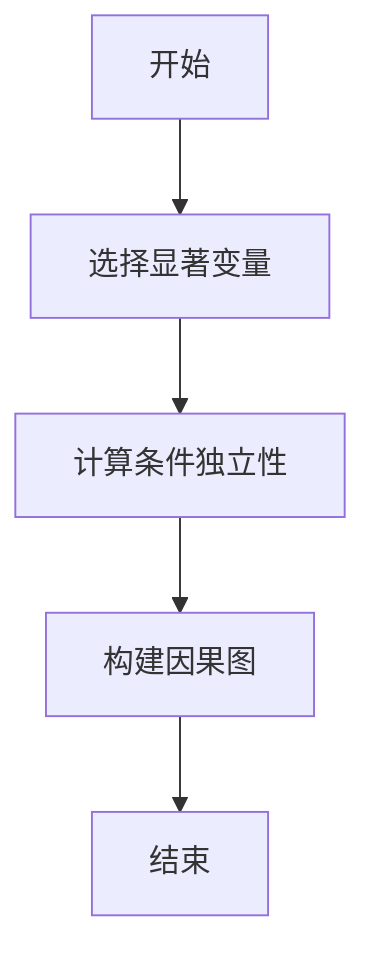
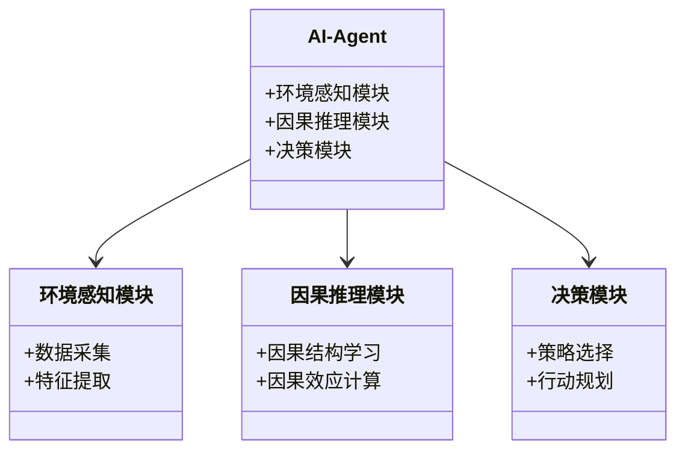

                 


# AI Agent的因果推理能力开发

## 关键词：AI Agent，因果推理，因果结构，因果算法，系统架构

## 摘要：  
AI Agent的因果推理能力是实现智能决策和自主行为的关键。本文从因果推理的基本概念出发，详细探讨了因果推理的核心原理、算法实现、系统架构以及实际应用。通过理论与实践结合，帮助读者全面理解AI Agent的因果推理能力开发，并提供实际案例和代码示例，助力技术落地。

---

# 第1章: AI Agent与因果推理概述

## 1.1 因果推理的基本概念

### 1.1.1 因果关系的定义与特点  
因果关系是事件之间的决定性联系，具有方向性、传递性和可干预性的特点。

### 1.1.2 相关性与因果关系的区别  
相关性表示变量之间的统计关联，而因果关系强调变量间的直接作用关系。

### 1.1.3 AI Agent中的因果推理问题  
AI Agent需要在复杂环境中理解因果关系，以做出合理决策。

## 1.2 AI Agent的定义与特点

### 1.2.1 AI Agent的基本概念  
AI Agent是一种具有感知环境、自主决策和执行任务的智能体。

### 1.2.2 AI Agent的核心能力  
包括感知能力、推理能力、学习能力和决策能力。

### 1.2.3 因果推理在AI Agent中的重要性  
因果推理帮助AI Agent理解行动与结果的关系，提升决策的准确性和可靠性。

## 1.3 本章小结  
本章介绍了因果推理的基本概念及其在AI Agent中的重要性，为后续内容打下基础。

---

# 第2章: 因果推理的核心概念

## 2.1 因果结构的定义与属性

### 2.1.1 因果关系的数学表示  
因果关系可以通过有向图表示，节点代表变量，边代表因果关系。

### 2.1.2 因果结构的特征对比  
| 特征 | 相关性 | 因果关系 |
|------|--------|----------|
| 定义 | 统计关联 | 直接作用关系 |
| 时间顺序 | 无明确顺序 | 需要时间顺序 |

### 2.1.3 马尔可夫假设与时间序列分析  
马尔可夫假设认为当前状态仅依赖于前一状态，时间序列分析则关注变量随时间的变化。

## 2.2 因果推理的原理

### 2.2.1 因果链的构建  
通过识别变量之间的因果路径，构建因果链。

### 2.2.2 调节变量与中介变量的作用  
调节变量影响因果关系的强度，中介变量传递因果效应。

### 2.2.3 鲁宾因果模型  
鲁宾模型将因果效应定义为处理变量对结果变量的影响。

## 2.3 因果推理与相关概念的对比

### 2.3.1 因果推理与相关性分析的区别  
因果推理关注因果关系，而相关性分析关注统计关联。

### 2.3.2 因果推理与条件概率的关系  
条件概率描述变量间的概率关系，因果推理在此基础上分析因果关系。

### 2.3.3 因果推理与机器学习的结合  
机器学习提供数据驱动的方法，因果推理提供理论指导。

## 2.4 本章小结  
本章详细讲解了因果推理的核心概念及其与相关概念的区别，为后续算法分析奠定基础。

---

# 第3章: 常见的因果推理算法

## 3.1 潜在结果框架

### 3.1.1 潜在结果的概念  
潜在结果是指在不同处理下的结果变量值。

### 3.1.2 因果效应的计算  
通过对比处理组和对照组的结果，计算平均处理效应（ATE）。

### 3.1.3 鲁宾因果模型的公式  
$$ P(Y|do(X)) = \sum_{\substack{C}} P(Y|X, C)P(C) $$  

## 3.2 结构方程模型

### 3.2.1 结构方程模型的定义  
SEMs通过方程描述变量之间的因果关系。

### 3.2.2 参数估计与模型推断  
使用最大似然估计法估计模型参数。

### 3.2.3 结构方程模型的应用  
在经济、社会学等领域广泛应用。

## 3.3 马尔可夫边界与因果发现

### 3.3.1 马尔可夫边界的概念  
马尔可夫边界是变量间满足马尔可夫性质的条件。

### 3.3.2 因果发现算法（如PC算法）  
PC算法通过条件独立性测试发现因果结构。

### 3.3.3 算法流程图  


## 3.4 本章小结  
本章介绍了潜在结果框架、结构方程模型和因果发现算法，展示了因果推理的多种实现方法。

---

# 第4章: 因果推理的数学模型与公式

## 4.1 因果关系的数学表示

### 4.1.1 因果图的表示  
使用有向无环图（DAG）表示变量间的因果关系。

### 4.1.2 马尔可夫链与马尔可夫过程  
马尔可夫链描述状态转移，马尔可夫过程包括时间序列分析。

### 4.1.3 贝叶斯网络与因果推理  
贝叶斯网络结合概率推理和因果关系，用于复杂系统分析。

## 4.2 潜在结果框架的公式推导

### 4.2.1 平均处理效应（ATE）  
$$ ATE = E[Y_1 - Y_0] $$  

### 4.2.2 个体处理效应（ITE）  
$$ ITE = E[Y | do(X=1)] - E[Y | do(X=0)] $$  

## 4.3 本章小结  
本章通过数学公式和模型展示了因果推理的理论基础和实际应用。

---

# 第5章: 因果推理的系统架构设计

## 5.1 问题场景介绍

### 5.1.1 系统功能需求  
识别因果结构、计算因果效应、提供决策支持。

### 5.1.2 系统性能需求  
高准确性、实时性、可扩展性。

## 5.2 系统功能设计

### 5.2.1 领域模型设计  


### 5.2.2 系统架构设计  


## 5.3 本章小结  
本章通过系统架构设计展示了如何将因果推理能力集成到AI Agent中。

---

# 第6章: 项目实战与案例分析

## 6.1 环境配置

### 6.1.1 安装依赖  
```bash
pip install pytorch pandas numpy
```

## 6.2 核心代码实现

### 6.2.1 因果结构学习  
```python
def causal_discovery(data):
    # 实现因果发现算法
    pass
```

### 6.2.2 因果效应计算  
```python
def compute_ate(data, treatment):
    # 计算平均处理效应
    pass
```

## 6.3 案例分析与解读

### 6.3.1 案例背景  
分析药物对患者康复的影响。

### 6.3.2 数据分析与结果解读  
使用因果推理算法计算药物的平均处理效应。

## 6.4 本章小结  
本章通过实际项目展示了因果推理在AI Agent中的应用。

---

# 第7章: 总结与展望

## 7.1 核心知识点回顾  
涵盖因果推理的基本概念、算法实现和系统设计。

## 7.2 未来发展方向  
包括因果推理的可解释性、动态因果关系建模和多智能体协作。

## 7.3 最佳实践 tips  
建议读者结合实际场景，灵活运用因果推理技术。

## 7.4 本章小结  
总结全文，展望未来发展方向。

---

# 作者：AI天才研究院 & 禅与计算机程序设计艺术

