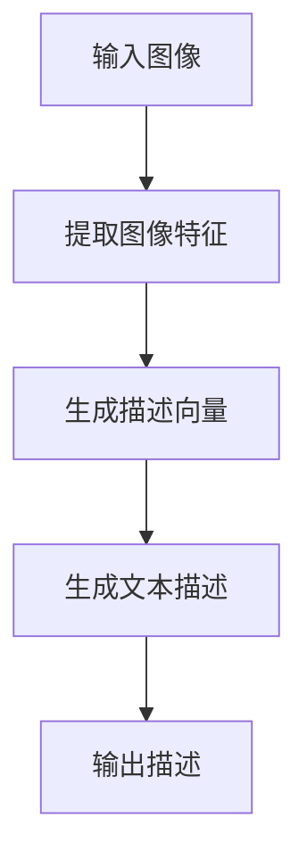
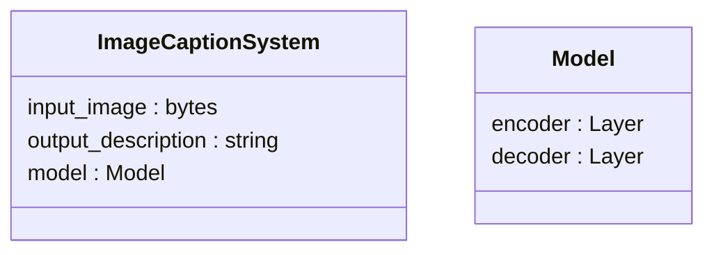
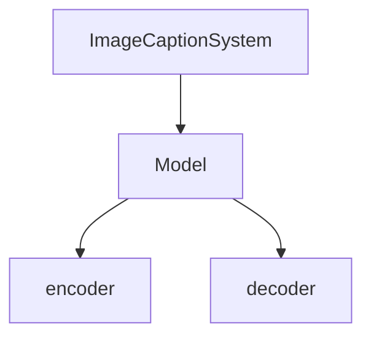
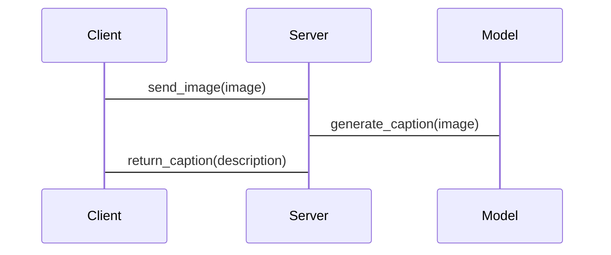
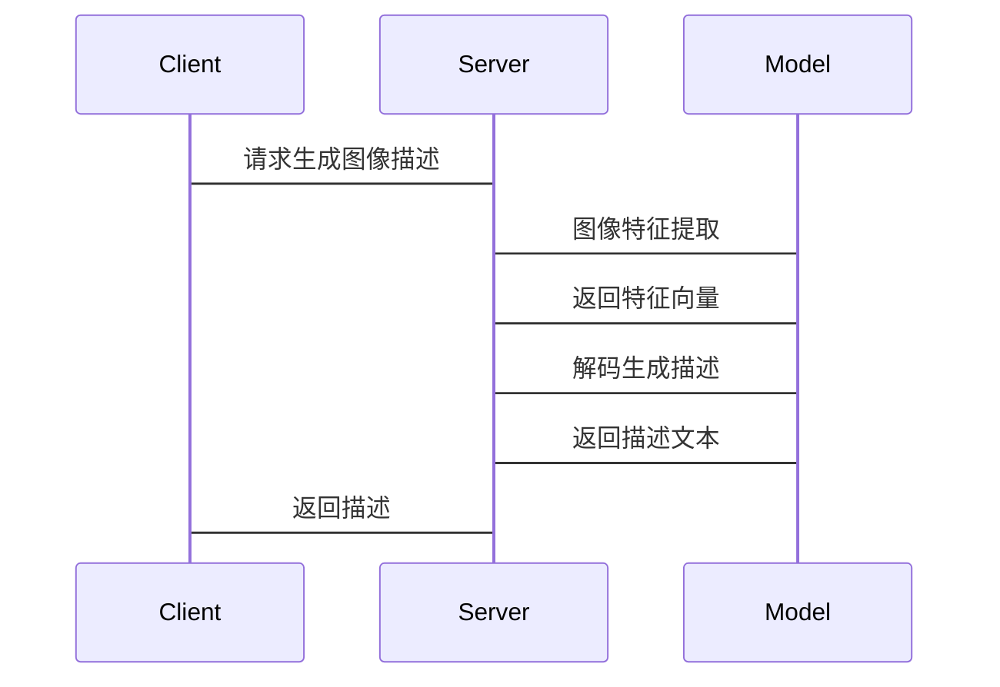

                 


# AI Agent的图像描述生成技术实现

> 关键词：AI Agent, 图像描述生成, 人工智能, 自然语言处理, 计算机视觉, 深度学习

> 摘要：本文详细探讨了AI Agent在图像描述生成中的技术实现，从背景介绍到核心算法，再到系统设计和项目实战，全面解析了这一技术的原理与应用。文章内容涵盖AI Agent的基本原理、图像描述生成的核心算法、系统架构设计以及实际项目的实现，旨在为技术从业者提供深入的技术洞察和实践指导。

---

## 第一部分: AI Agent的图像描述生成技术概述

## 第1章: AI Agent与图像描述生成的背景与概述

### 1.1 问题背景

#### 1.1.1 图像描述生成的定义与重要性
图像描述生成是指将图像内容转换为自然语言描述的过程，旨在让计算机能够理解和表达图像中的信息。这一技术在图像搜索、图像编辑、辅助视觉残障人士等领域具有重要意义。

#### 1.1.2 AI Agent在图像描述生成中的作用
AI Agent（智能体）能够通过感知图像内容并生成相应的文字描述，帮助用户更高效地与计算机交互。AI Agent不仅能够处理单张图像，还能结合上下文信息生成更准确的描述。

### 1.2 问题描述

#### 1.2.1 图像描述生成的核心问题
图像描述生成的核心问题包括如何提取图像中的语义信息，如何将图像内容映射到自然语言描述，以及如何处理图像中的噪声和歧义。

#### 1.2.2 AI Agent面临的挑战与限制
AI Agent在图像描述生成中面临的主要挑战包括图像语义的理解、描述的准确性和多样性，以及计算资源的限制。

### 1.3 解决方案与技术路线

#### 1.3.1 基于AI Agent的图像描述生成方法
提出了一种结合计算机视觉和自然语言处理的AI Agent方法，利用深度学习模型提取图像特征，并通过语言模型生成描述。

#### 1.3.2 技术路线的选择与优化
选择了基于Transformer的图像描述生成模型，并优化了特征提取和语言生成的流程，确保模型的高效性和准确性。

### 1.4 边界与外延

#### 1.4.1 图像描述生成的边界条件
图像描述生成的边界条件包括图像分辨率、光照条件、物体复杂度等因素。

#### 1.4.2 AI Agent技术的扩展应用
AI Agent技术可以扩展应用于图像编辑、图像修复、图像检索等领域。

### 1.5 概念结构与核心要素

#### 1.5.1 核心概念的组成与关系
图像描述生成的核心概念包括图像特征提取、语义理解、语言生成等，这些概念相互关联，共同实现图像到文本的转换。

#### 1.5.2 关键技术的对比分析
对比分析了基于CNN和Transformer的图像描述生成模型，讨论了它们的优缺点和适用场景。

---

## 第2章: AI Agent与图像描述生成的核心概念与联系

### 2.1 核心概念原理

#### 2.1.1 AI Agent的基本原理
AI Agent通过感知环境、分析任务、执行动作来实现目标，其核心是智能决策和交互能力。

#### 2.1.2 图像描述生成的原理
图像描述生成的原理包括图像特征提取、语义理解、语言生成等步骤，通过深度学习模型实现图像到文本的转换。

### 2.2 概念属性特征对比

#### 2.2.1 AI Agent与传统图像描述生成方法的对比
从功能、性能、灵活性等方面对比了AI Agent与传统方法的优劣。

#### 2.2.2 图像描述生成与自然语言处理的联系
图像描述生成依赖于自然语言处理技术，特别是语言模型的生成能力。

### 2.3 ER实体关系图架构

```mermaid
erDiagram
    customer[AI Agent] {
        <属性>
        id : int
        name : string
        description : string
    }
    image[图像]
    {
        <属性>
        image_id : int
        image_path : string
        features : list
    }
    description[描述]
    {
        <属性>
        description_id : int
        text : string
        confidence : float
    }
    customer --> image : "处理"
    image --> description : "生成"
    description --> customer : "返回"
```

---

## 第3章: AI Agent图像描述生成的算法原理

### 3.1 算法原理概述

#### 3.1.1 基于Transformer的图像描述生成模型
介绍了一种基于Transformer的图像描述生成模型，包括编码器和解码器的设计。

### 3.2 算法流程



### 3.3 算法实现

#### 3.3.1 提取图像特征
使用预训练的卷积神经网络（CNN）提取图像的高层次特征。

#### 3.3.2 生成描述向量
通过自注意力机制生成描述向量，捕捉图像内容的全局信息。

#### 3.3.3 生成文本描述
利用解码器将描述向量转换为自然语言文本。

### 3.4 数学模型与公式

#### 3.4.1 图像特征提取
$$ F = \text{CNN}(I) $$

其中，$I$ 是输入图像，$F$ 是提取的特征向量。

#### 3.4.2 自注意力机制
$$ \text{Attention}(Q, K, V) = \text{softmax}\left(\frac{QK^T}{\sqrt{d_k}}\right)V $$

其中，$Q$ 是查询向量，$K$ 是键向量，$V$ 是值向量。

#### 3.4.3 解码器输出
$$ P(y|x) = \text{Dec}(x) $$

其中，$x$ 是输入特征，$y$ 是生成的描述。

### 3.5 代码实现

```python
import tensorflow as tf
from tensorflow.keras import layers

def image_caption_model():
    # 图像特征提取部分
    image_input = layers.Input(shape=(224, 224, 3))
    feature_extractor = tf.keras.applications.VGG16(weights='imagenet', include_top=False)
    features = feature_extractor(image_input)
    features = layers.Flatten()(features)
    features = layers.Dense(256, activation='relu')(features)
    features = layers.Dropout(0.5)(features)

    # 语言模型部分
    decoder_input = layers.Input(shape=(None,))
    embedding = layers.Embedding(10000, 256)(decoder_input)
    merged = layers.Concatenate()([features, embedding])
    attention = layers.MultiHeadAttention(heads=8, key_dim=64)(merged, merged)
    decoder_layer = layers.Dense(256, activation='relu')(attention)
    output = layers.Dense(10000, activation='softmax')(decoder_layer)
    return tf.keras.Model(inputs=[image_input, decoder_input], outputs=output)

model = image_caption_model()
model.summary()
```

---

## 第4章: 系统分析与架构设计方案

### 4.1 问题场景介绍

#### 4.1.1 系统需求分析
系统需求包括图像上传、描述生成、结果展示等功能。

### 4.2 系统功能设计

#### 4.2.1 领域模型设计


#### 4.2.2 系统架构设计


#### 4.2.3 接口设计


### 4.3 交互流程设计

#### 4.3.1 交互流程图


---

## 第5章: 项目实战与实现

### 5.1 项目环境安装

#### 5.1.1 安装Python与TensorFlow
```bash
pip install python==3.8
pip install tensorflow==2.5
pip install keras==2.5
```

### 5.2 系统核心实现

#### 5.2.1 数据预处理
```python
import cv2
import numpy as np

def preprocess_image(image_path):
    image = cv2.imread(image_path)
    image = cv2.resize(image, (224, 224))
    image = image / 255.0
    return image
```

#### 5.2.2 模型训练
```python
model.compile(optimizer='adam', loss='sparse_categorical_crossentropy', metrics=['accuracy'])
model.fit([image_input, decoder_input], target_output, epochs=10, batch_size=32)
```

#### 5.2.3 接口开发
```python
from flask import Flask, request, jsonify

app = Flask(__name__)

@app.route('/generate_caption', methods=['POST'])
def generate_caption():
    image = request.files['image'].read()
    # 处理图像并生成描述
    description = model.predict(image)
    return jsonify({'description': description})
```

### 5.3 实际案例分析

#### 5.3.1 数据集准备
使用COCO数据集进行训练和测试。

#### 5.3.2 模型评估
通过BLEU分数评估生成描述的质量。

### 5.4 项目小结

#### 5.4.1 实现总结
总结了项目的实现过程和关键点。

#### 5.4.2 问题与优化
讨论了项目中遇到的问题及优化方向。

---

## 第6章: 总结与展望

### 6.1 最佳实践 tips

#### 6.1.1 技术建议
建议读者在实际应用中注意数据质量、模型调优和计算资源的合理配置。

#### 6.1.2 实践建议
推荐读者结合实际场景优化模型，探索多模态技术的应用。

### 6.2 小结

#### 6.2.1 核心内容回顾
回顾了文章的核心内容和主要观点。

#### 6.2.2 未来展望
展望了AI Agent在图像描述生成领域的未来发展方向。

### 6.3 注意事项

#### 6.3.1 技术实现中的注意事项
强调了模型训练中的过拟合问题和数据增强的重要性。

#### 6.3.2 应用中的注意事项
提醒读者在实际应用中注意隐私和伦理问题。

### 6.4 拓展阅读

#### 6.4.1 推荐书籍与论文
推荐了相关领域的优秀书籍和论文，供读者进一步学习。

#### 6.4.2 相关技术领域
介绍了与图像描述生成相关的其他技术领域，如多模态学习、生成对抗网络等。

---

## 作者：AI天才研究院/AI Genius Institute & 禅与计算机程序设计艺术 /Zen And The Art of Computer Programming

---

这篇文章系统地介绍了AI Agent在图像描述生成中的技术实现，从理论到实践，全面解析了这一技术的核心概念、算法原理、系统设计和项目实现。通过丰富的图表和代码示例，帮助读者深入理解AI Agent的图像描述生成技术，并为实际应用提供了宝贵的参考。

