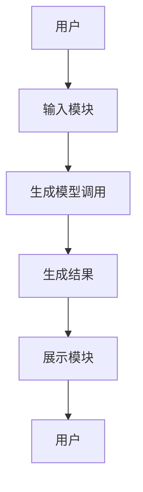
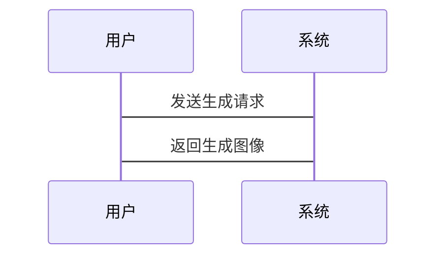

                 


```markdown
# AI Agent的图像生成与编辑能力实现

> 关键词：AI Agent，图像生成，图像编辑，生成对抗网络（GAN），扩散模型（Diffusion Model）

> 摘要：本文详细探讨了AI Agent在图像生成与编辑中的实现方法，从基础概念到核心算法，再到系统架构和项目实战，全面解析AI Agent如何赋能图像生成与编辑能力。

---

# 第一部分: AI Agent的图像生成与编辑概述

## 第1章: AI Agent与图像生成编辑概述

### 1.1 AI Agent的基本概念

#### 1.1.1 AI Agent的定义与特点
AI Agent（人工智能代理）是一种智能体，能够感知环境并自主决策以完成特定任务。其特点包括自主性、反应性、目标导向和社交能力。

#### 1.1.2 图像生成与编辑的基本概念
图像生成指通过算法创建新图像，而图像编辑则是对现有图像进行修改或增强。这些技术广泛应用于艺术创作、医学影像处理等领域。

#### 1.1.3 AI Agent在图像生成编辑中的作用
AI Agent通过理解和执行指令，自动完成图像生成和编辑任务，提升效率和创作自由度。

### 1.2 图像生成与编辑的核心技术

#### 1.2.1 生成对抗网络（GAN）简介
GAN由生成器和判别器组成，通过对抗训练生成逼真图像。其优缺点包括生成质量高但训练不稳定。

#### 1.2.2 扩散模型（Diffusion Model）概述
扩散模型通过逐步添加噪声并学习反向过程生成图像，具有稳定性和高质量输出的特点。

#### 1.2.3 图像编辑技术的分类
包括风格迁移、图像修复和图像增强等，每种技术都有其独特算法和应用场景。

### 1.3 AI Agent与图像生成编辑的结合

#### 1.3.1 AI Agent在图像生成中的应用场景
如根据文本描述生成图像，为用户提供创作工具。

#### 1.3.2 AI Agent在图像编辑中的应用场景
如根据用户指令自动修复或修改图像，提升编辑效率。

#### 1.3.3 图像生成编辑的未来发展趋势
向生成多样化、个性化和实时化方向发展，AI Agent将扮演关键角色。

### 1.4 本章小结
介绍了AI Agent的基本概念、图像生成和编辑的核心技术，以及它们结合的应用潜力。

---

# 第二部分: 图像生成与编辑的核心算法原理

## 第2章: 生成对抗网络（GAN）原理与实现

### 2.1 GAN的基本原理

#### 2.1.1 GAN的组成部分
生成器和判别器，分别负责生成图像和判别真伪。

#### 2.1.2 GAN的训练过程
通过最小化判别器的损失函数，最大化生成器的生成能力。

#### 2.1.3 GAN的优缺点
生成图像质量高但训练过程不稳定，需要优化技术和大量计算资源。

### 2.2 GAN的变体与优化

#### 2.2.1 CycleGAN的原理与应用
通过CycleGAN实现无监督图像到图像的转换，无需配对数据。

#### 2.2.2 StyleGAN的原理与应用
基于风格迁移的生成模型，生成高质量图像，应用于艺术创作等领域。

#### 2.2.3 GAN的训练稳定性优化
使用数据增强、调整网络结构和优化器等方法提升训练稳定性。

### 2.3 GAN的数学模型与公式

#### 2.3.1 GAN的损失函数
判别器损失：$$ \mathcal{L}_D = -\mathbb{E}[\log(D(x)) + \log(1 - D(G(z)))] $$
生成器损失：$$ \mathcal{L}_G = -\mathbb{E}[\log(D(G(z)))] $$

#### 2.3.2 GAN的梯度计算
通过反向传播计算生成器和判别器的梯度，优化网络参数。

### 2.4 GAN的代码实现与案例分析

#### 2.4.1 GAN的Python代码实现
```python
import torch
import torch.nn as nn
import torch.optim as optim

class Generator(nn.Module):
    def __init__(self):
        super(Generator, self).__init__()
        self.main = nn.Sequential(
            nn.ConvTranspose2d(100, 512, 4, 1, 0),
            nn.ReLU(),
            # 更多层...
        )

class Discriminator(nn.Module):
    def __init__(self):
        super(Discriminator, self).__init__()
        self.main = nn.Sequential(
            nn.Conv2d(3, 64, 4, 2, 1),
            nn.LeakyReLU(0.2),
            # 更多层...
        )

# 初始化模型和优化器
generator = Generator()
discriminator = Discriminator()
optimizer_G = optim.Adam(generator.parameters(), lr=0.0002)
optimizer_D = optim.Adam(discriminator.parameters(), lr=0.0002)
```

#### 2.4.2 GAN在图像生成中的实际案例
如使用CycleGAN将马转化为斑马，展示模型的图像转换能力。

#### 2.4.3 GAN的性能优化与调参技巧
调整学习率、批量大小和网络层数，使用标签平滑等方法优化模型性能。

### 2.5 本章小结
详细讲解了GAN的基本原理、变体、数学模型和实现案例，帮助读者掌握GAN的核心技术。

---

## 第3章: 扩散模型（Diffusion Model）原理与实现

### 3.1 扩散模型的基本原理

#### 3.1.1 扩散模型的数学基础
通过正向过程添加噪声，反向过程中学习去噪过程。

#### 3.1.2 扩散模型的正向过程
逐步将输入样本添加噪声，直到样本变为纯噪声。

#### 3.1.3 扩散模型的反向过程
学习如何从噪声中逐步恢复原始数据。

### 3.2 扩散模型的变体与优化

#### 3.2.1 DDPM（Denoising Diffusion Probabilistic Model）
通过概率密度函数建模反向过程，生成高质量图像。

#### 3.2.2 Stable Diffusion
结合文本提示生成高质量图像，提升生成的可控性和准确性。

#### 3.2.3 扩散模型的训练优化
使用适当的学习率和训练策略，优化模型的收敛速度和生成质量。

### 3.3 扩散模型的数学模型与公式

#### 3.3.1 扩散模型的正向过程
$$ q(x_t | x_{t-1}) = \mathcal{N}(x_t; \sqrt{1-\beta_t}x_{t-1}, \beta_t I) $$

#### 3.3.2 扩散模型的反向过程
$$ p_\theta(x_{t-1} | x_t) = \text{模型参数} $$

### 3.4 扩散模型的代码实现与案例分析

#### 3.4.1 扩散模型的Python代码实现
```python
import torch
import torch.nn as nn
import torch.optim as optim

class Diffusion(nn.Module):
    def __init__(self):
        super(Diffusion, self).__init__()
        # 模型结构定义...

    def forward(self, x, t):
        # 前向传播，生成样本...
        pass
```

#### 3.4.2 扩散模型在图像生成中的实际案例
如生成高质量的艺术图像，展示扩散模型在生成任务中的优势。

#### 3.4.3 扩散模型的性能优化与调参技巧
调整训练参数和网络结构，优化生成速度和质量。

### 3.5 本章小结
详细讲解了扩散模型的原理、变体和实现方法，展示了其在图像生成中的应用潜力。

---

# 第三部分: 系统架构与交互设计

## 第4章: AI Agent图像生成与编辑系统架构设计

### 4.1 系统功能设计

#### 4.1.1 系统模块划分
包括用户输入模块、生成模型调用模块和结果展示模块。

#### 4.1.2 系统功能流程
用户输入请求，系统调用生成模型生成图像，返回结果给用户。

### 4.2 系统架构设计

#### 4.2.1 系统架构图（Mermaid）


#### 4.2.2 系统接口设计
定义RESTful API接口，如`POST /generate`接收输入参数，返回生成图像。

#### 4.2.3 系统交互流程（Mermaid）


### 4.3 本章小结
通过系统架构设计和交互流程展示，详细说明了AI Agent图像生成与编辑系统的实现方式。

---

## 第5章: 项目实战

### 5.1 环境搭建与安装

#### 5.1.1 安装Python和相关库
安装PyTorch、Diffusion libraries等。

#### 5.1.2 安装AI Agent框架
如使用Runway ML或定制开发AI Agent。

### 5.2 系统核心实现

#### 5.2.1 AI Agent核心代码
```python
class AIAssistant:
    def __init__(self):
        self.diffusion_model = Diffusion()

    def generate_image(self, prompt):
        # 调用扩散模型生成图像
        return self.diffusion_model.generate(prompt)
```

#### 5.2.2 图像生成与编辑代码
```python
def generate_image(diffusion_model, prompt):
    # 调用扩散模型生成图像
    return diffusion_model.generate(prompt)
```

### 5.3 代码应用解读与分析

#### 5.3.1 代码实现细节
展示代码如何调用生成模型，处理用户输入并生成输出。

#### 5.3.2 代码优化与调试
优化代码性能，调试常见问题。

### 5.4 实际案例分析

#### 5.4.1 案例一：文本到图像生成
根据用户提供的文本描述生成对应图像。

#### 5.4.2 案例二：图像修复
修复损坏的图像，恢复其清晰度和细节。

### 5.5 项目小结
总结项目实现的关键步骤和经验教训，为后续优化提供参考。

---

# 第四部分: 拓展与未来展望

## 第6章: AI Agent图像生成与编辑的扩展应用

### 6.1 当前研究热点
如生成多样化、个性化图像，提升生成速度和质量。

### 6.2 实际案例分析
如AI Agent在艺术创作、医疗影像处理等领域的应用。

### 6.3 未来发展趋势
AI Agent将更加智能化，生成能力将更加多样化和个性化。

## 第7章: 总结与展望

### 7.1 本章总结
总结全文内容，强调AI Agent在图像生成与编辑中的重要性。

### 7.2 对未来研究的展望
展望AI Agent在图像生成与编辑领域的潜在突破和应用前景。

---

# 作者：AI天才研究院 & 禅与计算机程序设计艺术

---

**全文完。感谢您的阅读！**
```

