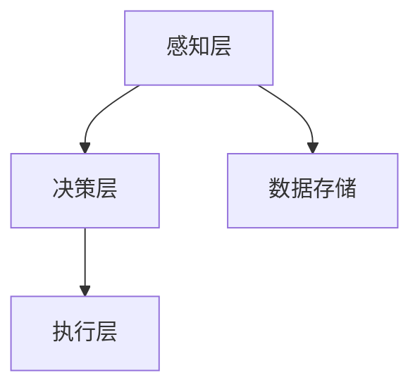

                 


# AI Agent的图像识别与处理技术

---

## 关键词：
AI Agent, 图像识别, 图像处理, 计算机视觉, 深度学习, 目标检测, 图像分割

---

## 摘要：
本文深入探讨了AI Agent在图像识别与处理技术中的应用，从基础知识到高级算法，结合实际案例，详细讲解了AI Agent如何利用图像识别技术来实现智能感知和决策。文章涵盖图像分类、目标检测、图像分割、图像语义理解等关键技术，分析了系统设计与架构，并通过项目实战展示了如何将这些技术应用于实际场景中。最后，本文还探讨了图像识别的高级主题和未来发展方向。

---

## 目录：

1. [AI Agent与图像识别基础](#ai-agent与图像识别基础)
   1.1 AI Agent的基本概念
   1.2 图像识别的基础知识
   1.3 AI Agent与图像识别的结合

2. [图像分类技术](#图像分类技术)
   2.1 图像分类算法原理
   2.2 基于深度学习的图像分类
   2.3 图像分类的实现案例

3. [目标检测与图像分割](#目标检测与图像分割)
   3.1 目标检测技术
   3.2 图像分割技术
   3.3 实际应用案例分析

4. [图像语义理解](#图像语义理解)
   4.1 图像语义理解的核心技术
   4.2 图像问答系统的设计与实现
   4.3 多模态数据融合的应用

5. [AI Agent的图像处理系统设计](#ai-agent的图像处理系统设计)
   5.1 系统架构设计
   5.2 数据处理与模型优化
   5.3 系统性能调优

6. [AI Agent的图像识别应用实战](#ai-agent的图像识别应用实战)
   6.1 智能安防监控系统设计
   6.2 电商商品识别与推荐系统
   6.3 无人驾驶中的图像识别技术

7. [图像识别的高级主题与未来展望](#图像识别的高级主题与未来展望)
   7.1 模型压缩与轻量化技术
   7.2 图像识别的伦理与安全问题
   7.3 未来发展方向与研究热点

---

## 正文：

### 第1章：AI Agent与图像识别基础

#### 1.1 AI Agent的基本概念

AI Agent（人工智能代理）是指能够感知环境、自主决策并执行任务的智能体。AI Agent可以是软件程序、机器人或其他智能系统，其核心能力包括感知、推理、规划和执行。

**AI Agent的类型**：
- **反应式AI Agent**：基于当前感知做出反应，适用于实时任务。
- **认知式AI Agent**：具备复杂推理和规划能力，适用于复杂场景。
- **学习型AI Agent**：能够通过数据学习提升性能，如强化学习和深度学习模型。

**AI Agent的核心能力**：
- **感知能力**：通过传感器或摄像头获取环境信息。
- **决策能力**：基于感知信息做出最优决策。
- **执行能力**：通过执行机构完成任务。

---

#### 1.2 图像识别的基础知识

图像识别是计算机视觉的核心技术，旨在让计算机理解图像内容。图像识别的基本流程包括图像采集、预处理、特征提取和分类。

**图像预处理技术**：
- **灰度化**：将彩色图像转换为灰度图像，降低计算复杂度。
- **二值化**：将图像转换为黑白两色，突出目标区域。
- **平滑与锐化**：消除噪声，增强图像边缘。

**图像识别的关键步骤**：
1. **特征提取**：提取图像中的关键特征，如边缘、纹理和颜色。
2. **分类器训练**：使用训练数据训练分类器，使其能够识别不同类别。
3. **目标检测**：定位图像中的目标并进行分类。

---

#### 1.3 AI Agent与图像识别的结合

AI Agent通过图像识别技术能够感知和理解周围环境，从而做出更智能的决策。例如，在智能安防系统中，AI Agent可以通过图像识别技术检测异常行为，及时发出警报。

**AI Agent中的图像识别应用**：
- **智能监控**：实时监控视频流，识别可疑行为。
- **自动驾驶**：通过摄像头识别道路标志和行人。
- **医疗诊断**：辅助医生分析医学图像，提高诊断准确率。

---

### 第2章：图像分类技术

#### 2.1 图像分类算法原理

图像分类是图像识别的基础任务，旨在将图像归类到预定义的类别中。传统图像分类算法包括KNN、SVM和决策树等，但深度学习方法在分类精度上更具优势。

**传统图像分类算法**：
- **K-近邻算法（KNN）**：基于距离的分类方法，适用于小规模数据集。
- **支持向量机（SVM）**：通过构建超平面实现分类，适用于高维数据。
- **决策树**：通过特征分割构建树状分类器，易于解释。

**深度学习图像分类模型**：
- **卷积神经网络（CNN）**：通过卷积层提取图像特征，适用于大规模数据。
- **AlexNet**：首个在ImageNet竞赛中取得突破的深度学习模型。
- **ResNet**：通过残差连接解决深度网络训练难题。

---

#### 2.2 基于深度学习的图像分类

深度学习模型在图像分类中表现优异，尤其是卷积神经网络（CNN）。CNN通过卷积操作提取空间特征，通过池化操作降低计算复杂度。

**CNN的结构**：
1. **卷积层**：提取图像的边缘和纹理特征。
2. **池化层**：降低特征图尺寸，减少过拟合风险。
3. **全连接层**：将特征图转换为分类结果。

**数学模型**：
- 卷积操作：$f(x) = \sum_{i=1}^{k} w_i \cdot x_i + b$
- 激活函数：ReLU激活函数$f(x) = \max(0, x)$
- 损失函数：交叉熵损失函数$L = -\sum_{i} y_i \log(p_i) + (1 - y_i) \log(1 - p_i)$

---

#### 2.3 图像分类的实现案例

**案例：使用Python实现图像分类器**

1. **环境安装**：
   ```bash
   pip install numpy matplotlib tensorflow
   ```

2. **数据预处理**：
   ```python
   import numpy as np
   from tensorflow.keras.datasets import mnist

   (x_train, y_train), (x_test, y_test) = mnist.load_data()
   x_train = x_train.reshape(-1, 784) / 255.0
   x_test = x_test.reshape(-1, 784) / 255.0
   ```

3. **模型构建**：
   ```python
   from tensorflow.keras.models import Sequential
   from tensorflow.keras.layers import Dense

   model = Sequential()
   model.add(Dense(64, activation='relu', input_shape=(784,)))
   model.add(Dense(10, activation='softmax'))
   model.compile(optimizer='adam', loss='sparse_categorical_crossentropy', metrics=['accuracy'])
   ```

4. **模型训练**：
   ```python
   model.fit(x_train, y_train, epochs=10, batch_size=128, validation_data=(x_test, y_test))
   ```

5. **模型测试**：
   ```python
   loss, accuracy = model.evaluate(x_test, y_test)
   print(f"损失: {loss}, 准确率: {accuracy}")
   ```

---

### 第3章：目标检测与图像分割

#### 3.1 目标检测技术

目标检测不仅需要识别图像中的目标，还需要定位目标的位置。常用的目标检测算法包括YOLO、Faster R-CNN和SSD。

**YOLO的优势**：
- **实时性**：YOLO采用单-shot检测，速度快。
- **简单性**：易于部署和优化。

**Faster R-CNN的劣势**：
- **复杂性**：需要多阶段处理，速度较慢。

---

#### 3.2 图像分割技术

图像分割将图像划分为多个区域，每个区域对应不同的语义信息。常用分割算法包括U-Net和FCN。

**U-Net的结构**：
- **编码器**：提取图像特征。
- **解码器**：恢复图像分割结果。

**FCN的优势**：
- **全卷积网络**：适用于任意大小的图像。

---

#### 3.3 实际应用案例分析

**案例：智能交通系统中的目标检测**

在智能交通系统中，AI Agent通过目标检测技术识别道路上的车辆、行人和交通标志，从而实现自动驾驶和交通管理。

**实现步骤**：
1. **数据采集**：收集交通场景的图像数据。
2. **模型训练**：使用YOLO或Faster R-CNN进行目标检测。
3. **系统部署**：将检测模型部署到自动驾驶系统中，实时检测并做出决策。

---

### 第4章：图像语义理解

#### 4.1 图像语义理解的核心技术

图像语义理解旨在理解图像中的语义信息，包括图像描述生成和图像问答系统。

**图像描述生成**：
- 使用生成模型（如GPT）生成图像的自然语言描述。
- 示例：输入一张猫的图片，生成描述“一只橘色的猫正在睡觉”。

**图像问答系统**：
- 用户输入问题，系统通过图像识别和理解生成回答。
- 示例：用户问“这张图片中的狗是什么品种？”，系统识别并回答“这是一只拉布拉多犬”。

---

#### 4.2 图像问答系统的设计与实现

**系统设计**：
1. **图像识别模块**：识别图像中的目标和场景。
2. **语义理解模块**：解析用户的问题并生成回答。
3. **问答生成模块**：结合图像识别结果生成回答。

**实现案例**：
```python
import tensorflow as tf
from tensorflow.keras.applications import ResNet50
from tensorflow.keras.preprocessing import image

model = ResNet50(weights='imagenet', include_top=False)
img_path = "image.jpg"
img = image.load_img(img_path, target_size=(224, 224))
img_array = image.img_to_array(img)
img_array = np.expand_dims(img_array, axis=0)
features = model.predict(img_array)

# 语义理解与问答生成逻辑
```

---

### 第5章：AI Agent的图像处理系统设计

#### 5.1 系统架构设计

AI Agent的图像处理系统通常包括感知层、决策层和执行层。

**系统架构图**：


**功能模块**：
- **感知层**：负责图像采集和预处理。
- **决策层**：利用图像识别技术做出决策。
- **执行层**：根据决策执行相关操作。

---

#### 5.2 数据处理与模型优化

**数据增强**：
- 使用数据增强技术（如旋转、翻转）增加训练数据多样性。

**模型优化**：
- 使用模型压缩技术减少模型大小，提升推理速度。

---

#### 5.3 系统性能调优

**性能指标**：
- **准确率**：识别的正确率。
- **处理速度**：每秒处理的图像数量。

**优化方法**：
- **并行计算**：利用GPU加速模型训练和推理。
- **模型剪枝**：去除不必要的网络层，降低计算复杂度。

---

### 第6章：AI Agent的图像识别应用实战

#### 6.1 智能安防监控系统设计

**系统设计**：
1. **图像采集**：使用摄像头实时采集视频流。
2. **目标检测**：检测视频中的异常行为。
3. **警报系统**：当检测到异常时，触发警报。

**实现案例**：
```python
import cv2
import numpy as np

cap = cv2.VideoCapture(0)
while cap.isOpened():
    ret, frame = cap.read()
    # 目标检测逻辑
    # 警报触发逻辑
    cv2.imshow('Security Camera', frame)
    if cv2.waitKey(1) & 0xFF == ord('q'):
        break
cap.release()
cv2.destroyAllWindows()
```

---

#### 6.2 电商商品识别与推荐系统

**系统设计**：
1. **商品识别**：识别用户上传的商品图像。
2. **推荐系统**：基于识别结果推荐相关商品。

**实现案例**：
```python
from tensorflow.keras.applications import ResNet50
from tensorflow.keras.preprocessing import image

model = ResNet50(weights='imagenet', include_top=False)
img_path = "product.jpg"
img = image.load_img(img_path, target_size=(224, 224))
img_array = image.img_to_array(img)
img_array = np.expand_dims(img_array, axis=0)
features = model.predict(img_array)
# 推荐系统逻辑
```

---

### 第7章：图像识别的高级主题与未来展望

#### 7.1 模型压缩与轻量化技术

**模型压缩技术**：
- **剪枝**：去除模型中的冗余参数。
- **量化**：降低模型中参数的精度。

**轻量化技术**：
- **知识蒸馏**：将大型模型的知识迁移到小型模型。

---

#### 7.2 图像识别的伦理与安全问题

**伦理问题**：
- **隐私保护**：图像识别可能侵犯用户隐私。
- **误识别风险**：错误识别可能导致严重后果。

**安全问题**：
- **对抗攻击**：恶意攻击可能导致模型失效。

---

#### 7.3 未来发展方向与研究热点

**研究热点**：
- **自监督学习**：减少对标注数据的依赖。
- **多模态融合**：结合文本、图像和语音等多种数据源。
- **实时性优化**：提升模型的推理速度，适用于实时应用。

---

## 结语：

AI Agent的图像识别与处理技术正在快速发展，推动了多个领域的智能化。未来，随着深度学习和计算机视觉技术的进步，AI Agent在图像识别中的应用将更加广泛和智能。

---

## 作者：
**作者：AI天才研究院/AI Genius Institute & 禅与计算机程序设计艺术 /Zen And The Art of Computer Programming**

