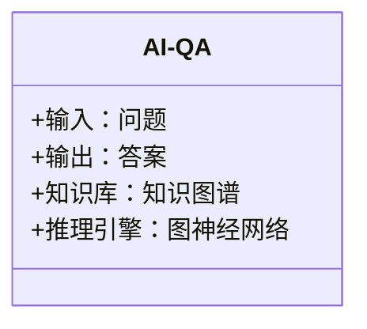
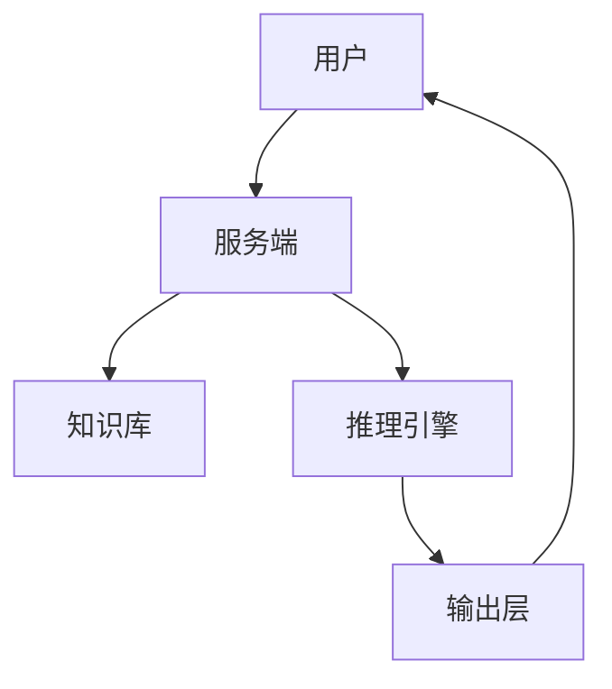

                 


# AI Agent的图神经网络技术应用

> 关键词：AI Agent，图神经网络，知识图谱，多智能体协作，实时决策，动态图结构，知识推理

> 摘要：  
> 本文探讨了AI Agent在复杂场景中的应用，特别是如何通过图神经网络技术处理结构化数据，提升智能体的决策和协作能力。通过分析图神经网络的核心原理、系统架构设计及实际案例，本文揭示了AI Agent与图神经网络结合的独特优势，并为未来的应用提供了有价值的参考。

---

## 目录

1. [AI Agent与图神经网络技术概述](#ai-agent与图神经网络技术概述)
2. [图神经网络的核心原理与算法](#图神经网络的核心原理与算法)
3. [AI Agent中的图神经网络技术](#ai-agent中的图神经网络技术)
4. [系统架构设计与项目实战](#系统架构设计与项目实战)
5. [总结与展望](#总结与展望)

---

## 第一部分: AI Agent与图神经网络技术概述

### 1.1 AI Agent的基本概念

AI Agent（人工智能代理）是一种能够感知环境、自主决策并执行任务的智能实体。它具备以下核心特征：
- **自主性**：无需外部干预，自主完成任务。
- **反应性**：能实时感知环境变化并做出响应。
- **目标导向性**：基于目标驱动行为。
- **学习能力**：通过经验优化决策策略。

AI Agent广泛应用于自动驾驶、智能助手、机器人协作等领域。

### 1.2 图神经网络的基本概念

图神经网络（Graph Neural Network, GNN）是一种处理图结构数据的深度学习模型。图数据由节点（Nodes）和边（Edges）构成，能够有效捕捉数据之间的关系。GNN的核心优势在于：
- **全局视角**：能同时考虑节点及其邻居的信息。
- **动态性**：支持动态图结构的实时更新。
- **多模态融合**：能处理多种数据类型（文本、图像等）。

### 1.3 AI Agent与图神经网络的结合

AI Agent与图神经网络的结合主要体现在以下几个方面：
- **知识表示**：利用图结构表示AI Agent的知识图谱。
- **实时决策**：基于图神经网络进行实时推理和决策。
- **多智能体协作**：通过图神经网络实现多智能体之间的高效协作。

### 1.4 图神经网络技术在AI Agent中的应用背景

随着AI Agent在复杂场景中的广泛应用，传统的基于规则的决策方法逐渐暴露出局限性。图神经网络的出现为AI Agent提供了更强大的知识表示和推理能力，特别是在处理动态关系和非结构化数据方面展现出独特优势。

---

## 第二部分: 图神经网络的核心原理与算法

### 2.1 图结构与图表示

图数据由节点和边构成，节点表示实体，边表示实体之间的关系。例如，在社交网络中，节点代表用户，边代表用户之间的关系。

### 2.2 图神经网络的基本模型

- **GCN（Graph Convolutional Network）**  
  GCN通过聚合节点及其邻居的信息来生成节点表示。其数学表达式为：
  $$ h^{(l+1)}_i = \sum_{j \in N(i)} \frac{1}{d_j} h_j^{(l)} $$  
  其中，$d_j$是节点$j$的度数，$N(i)$是节点$i$的邻居节点集合。

- **GAT（Graph Attention Network）**  
  GAT引入注意力机制，根据邻居节点的重要性动态调整权重。其注意力权重计算公式为：
  $$ \alpha_{ij} = \frac{e^{score(i,j)}}{\sum_{k} e^{score(i,k)}} $$

### 2.3 图神经网络的核心算法

- **节点表示算法**  
  基于GCN或GAT生成节点嵌入表示，捕捉节点及其邻居的关系特征。

- **图嵌入算法**  
  将整个图结构嵌入到低维空间，便于后续任务（如分类、聚类）使用。

- **图分类与回归算法**  
  对整个图进行分类或回归预测，例如预测社交网络中的用户标签。

### 2.4 图神经网络的训练与优化

- **图数据预处理**  
  对图数据进行归一化、特征提取等处理。
- **训练策略**  
  使用批归一化（Batch Normalization）和学习率衰减优化训练过程。
- **模型调优**  
  通过交叉验证选择最优超参数。

---

## 第三部分: AI Agent中的图神经网络技术

### 3.1 AI Agent的知识表示

AI Agent的知识图谱通过图结构表示，节点代表实体，边代表关系。例如，在智能问答系统中，节点可以是问题、答案或相关知识。

### 3.2 图神经网络在AI Agent中的应用

- **知识推理**  
  通过图神经网络推理知识图谱中的隐含关系。
- **实时决策**  
  在动态图结构中实时更新信息，支持快速决策。
- **多智能体协作**  
  利用图神经网络协调多个智能体之间的协作行为。

---

## 第四部分: 系统架构设计与项目实战

### 4.1 项目介绍

假设我们开发一个基于图神经网络的智能问答系统AI-QA。该系统通过知识图谱表示问答关系，利用图神经网络进行推理。

### 4.2 系统功能设计

- **领域模型**  
  使用Mermaid类图描述系统功能模块。



- **系统架构**  
  使用Mermaid架构图展示系统架构。



### 4.3 项目实战

#### 4.3.1 环境安装

安装所需的Python库：

```bash
pip install numpy matplotlib networkx
```

#### 4.3.2 核心代码实现

实现一个简单的GCN模型：

```python
import numpy as np
from sklearn.metrics.pairwise import cosine_similarity

class GCN:
    def __init__(self, adjacency_matrix, feature_matrix):
        self.A = adjacency_matrix
        self.X = feature_matrix
        self.A_hat = self.A + np.identity(len(self.A))
        self.X_embedded = np.zeros_like(self.X)
    
    def forward(self):
        for i in range(len(self.X_embedded)):
            sum_val = 0
            for j in range(len(self.X)):
                sum_val += self.A_hat[i][j] * self.X[j]
            self.X_embedded[i] = sum_val / self.A_hat[i].sum()
        return self.X_embedded
    
    def get_embeddings(self):
        return self.X_embedded
```

---

## 第五部分: 总结与展望

### 5.1 本章小结

本文详细探讨了AI Agent与图神经网络的结合，分析了图神经网络在知识表示、实时决策和多智能体协作中的应用。通过实际案例展示了图神经网络的强大能力。

### 5.2 展望

未来，随着图神经网络的不断发展，AI Agent在复杂场景中的应用潜力将得到进一步释放。如何优化图神经网络的实时性和可扩展性，是研究者们需要继续探索的方向。

---

## 作者：AI天才研究院 & 禅与计算机程序设计艺术

---

以上内容是对《AI Agent的图神经网络技术应用》的详细解析，涵盖了从基本概念到实际应用的各个方面。通过图神经网络，AI Agent的能力得到了显著提升，为未来的智能化应用提供了坚实的技术基础。

