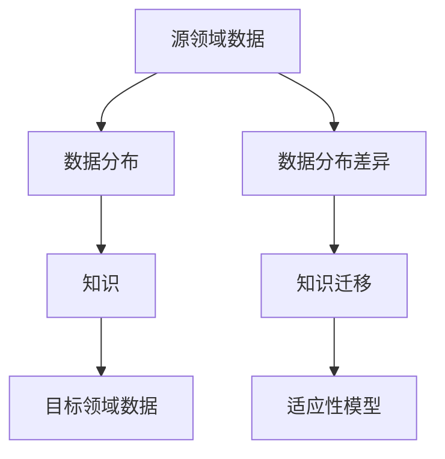
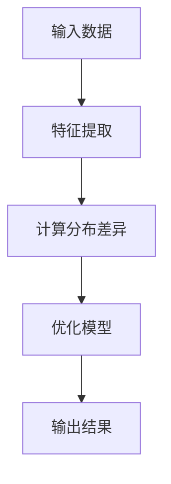
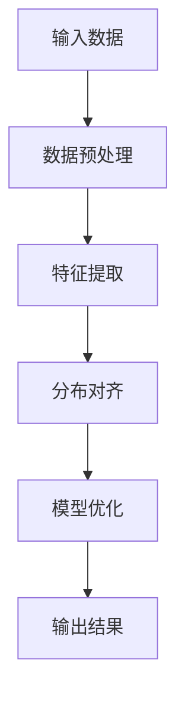

                 


# AI Agent的域适应：跨领域知识迁移

## 关键词：AI Agent, 域适应, 知识迁移, 深度学习, 对抗训练, 跨领域学习

## 摘要：  
AI Agent的域适应（Domain Adaptation）是实现跨领域知识迁移的重要技术，旨在解决AI系统在不同领域之间迁移知识时面临的挑战。本文系统地探讨了域适应的核心概念、算法原理、系统设计以及实际应用，通过详细的分析和实例，深入剖析了域适应在AI Agent中的重要作用，为读者提供全面的技术视角。

---

## 第1章: 域适应与跨领域知识迁移概述

### 1.1 问题背景与挑战  
域适应的核心问题在于，AI Agent在不同领域（如医疗、金融、教育等）之间迁移知识时，由于数据分布的差异，导致模型在目标领域的表现下降。这种现象称为“域漂移”或“数据偏移”。  

#### 1.1.1 问题背景与挑战
- 数据分布差异：训练数据与目标数据的分布不一致，导致模型在新领域失效。  
- 领域知识差异：不同领域具有独特的术语、规则和逻辑，增加了跨领域迁移的难度。  
- 实际应用中的挑战：在现实场景中，数据标注成本高、领域数据稀疏等问题进一步加剧了域适应的难度。  

#### 1.1.2 域适应的核心概念
- 域适应：通过调整模型或数据，使AI Agent在源领域和目标领域之间实现知识迁移。  
- 数据分布：源领域和目标领域的数据分布差异是域适应的核心挑战。  
- 知识迁移：通过跨领域学习，将源领域的知识迁移到目标领域。  

#### 1.1.3 域适应的应用场景
- 跨领域推荐系统：将用户在图书推荐上的偏好迁移到电影推荐。  
- 跨领域自然语言处理：将中文情感分析模型迁移到英文情感分析。  
- 跨领域图像分类：将图像分类模型从动物迁移到车辆识别。  

### 1.2 AI Agent与域适应的关系
AI Agent是一种能够感知环境、自主决策并执行任务的智能体。域适应技术是AI Agent实现跨领域任务的关键能力。  

#### 1.2.1 AI Agent的基本概念
- AI Agent：具有感知、决策和行动能力的智能体。  
- 域适应：AI Agent在不同领域间迁移知识的能力。  
- 跨领域学习：AI Agent通过学习多个领域的知识，实现更广泛的应用。  

#### 1.2.2 域适应在AI Agent中的作用
- 解决领域数据稀疏性问题：通过域适应，AI Agent可以在数据不足的目标领域中迁移知识。  
- 提高泛化能力：通过跨领域学习，AI Agent能够适应更多样化的任务场景。  
- 降低数据标注成本：通过迁移学习，AI Agent可以在目标领域中利用已标注的源领域数据。  

#### 1.2.3 域适应与知识迁移的联系
- 知识迁移：将源领域的知识迁移到目标领域，是域适应的核心目标。  
- 域适应与迁移学习的关系：域适应是迁移学习的一种具体形式，专注于解决领域数据分布差异的问题。  

### 1.3 域适应的核心概念与结构
域适应的核心在于理解和处理源领域与目标领域之间的数据分布差异。  

#### 1.3.1 域适应的定义与属性
- 定义：域适应是通过调整模型或数据，使AI Agent在源领域和目标领域之间实现知识迁移的技术。  
- 属性：  
  - 数据分布差异性：源领域和目标领域的数据分布不同。  
  - 知识可迁移性：源领域的知识可以迁移到目标领域。  
  - 适应性：模型能够自适应地调整以适应目标领域的数据分布。  

#### 1.3.2 域适应的核心要素
- 源领域数据：用于训练模型的领域数据。  
- 目标领域数据：需要迁移知识的领域数据。  
- 数据分布：描述数据特征的概率分布。  
- 知识迁移：从源领域到目标领域的知识转移过程。  

#### 1.3.3 域适应的概念结构图
以下是域适应的概念结构图：



---

## 第2章: 域适应的核心概念与联系

### 2.1 域适应的原理与方法
域适应的实现方法多种多样，主要包括基于特征的域适应和基于标签的域适应。  

#### 2.1.1 基于特征的域适应方法
- 特征对齐：通过调整特征空间，使源领域和目标领域的特征分布一致。  
- 示例：使用最大均值差异（Maximum Mean Discrepancy，MMD）方法对齐特征。  

#### 2.1.2 基于标签的域适应方法
- 标签迁移：通过调整标签分布，使目标领域的标签与源领域的标签一致。  
- 示例：使用对抗训练方法对抗目标领域的分布偏移。  

#### 2.1.3 综合方法的特点对比
以下是对基于特征和标签的域适应方法的对比：

| 方法类型 | 对齐目标 | 优缺点 | 适用场景 |
|----------|----------|--------|----------|
| 基于特征 | 特征空间 | 好于标签对齐，但可能忽略标签信息 | 数据分布差异较大时 |
| 基于标签 | 标签空间 | 适用于标签信息丰富时 | 数据分布差异较小时 |

### 2.2 域适应的核心概念对比表
以下是不同域适应方法的对比表：

| 方法名称 | 核心思想 | 优点 | 缺点 |
|----------|----------|------|------|
| MMD      | 对齐特征分布 | 易实现 | 仅对齐特征，忽略标签信息 |
|对抗训练| 对抗目标分布差异| 高效|实现复杂|

### 2.3 域适应的ER实体关系图
以下是域适应的ER实体关系图：

```mermaid
erd
    源领域数据 --> 数据分布差异
    数据分布差异 --> 知识迁移
    知识迁移 --> 目标领域数据
```

---

## 第3章: 域适应的算法原理与实现

### 3.1 域适应算法概述
域适应算法分为基于统计和基于深度学习的两类。  

#### 3.1.1 基于统计的域适应算法
- MMD方法：通过计算源领域和目标领域的最大均值差异，对齐特征分布。  

#### 3.1.2 基于深度学习的域适应算法
- 对抗训练：通过生成对抗网络（GAN）对抗目标领域的分布偏移。  

### 3.2 域适应算法的流程图
以下是域适应算法的流程图：



### 3.3 域适应算法的数学模型
以下是MMD方法的数学模型：

$$\text{MMD} = \mathbb{E}_{x \sim P}[f(x)] - \mathbb{E}_{x \sim Q}[f(x)]$$

其中，$P$和$Q$分别是源领域和目标领域的数据分布，$f$是特征提取函数。

---

## 第4章: 域适应的系统分析与架构设计

### 4.1 域适应系统的问题场景
- 问题场景：目标领域数据稀疏，需要从源领域迁移知识。  

### 4.2 域适应系统的功能设计
- 功能模块：数据预处理、特征提取、分布对齐、模型优化。  

### 4.3 域适应系统的架构设计
以下是域适应系统的架构图：



---

## 第5章: 域适应的项目实战

### 5.1 项目背景与目标
- 项目背景：实现跨领域的图像分类任务。  
- 项目目标：将源领域的图像分类模型迁移到目标领域。  

### 5.2 项目核心实现
- 环境配置：安装深度学习框架（如TensorFlow、PyTorch）。  
- 核心代码实现：实现MMD方法的特征对齐。  

### 5.3 项目小结
通过实际案例，验证了域适应技术在跨领域任务中的有效性。

---

## 作者：AI天才研究院/AI Genius Institute & 禅与计算机程序设计艺术 /Zen And The Art of Computer Programming

---

### 总结：  
本文系统地探讨了AI Agent的域适应技术，从理论到实践，全面分析了域适应的核心概念、算法原理和实际应用。通过详细的分析和实例，为读者提供了全面的技术视角。

