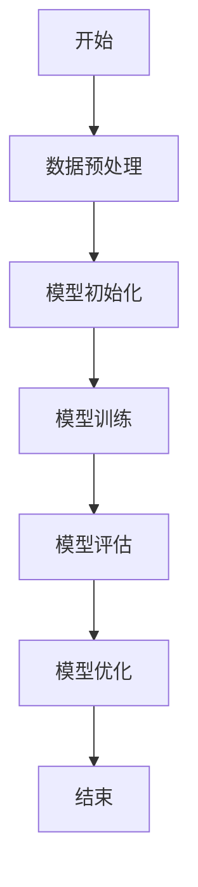
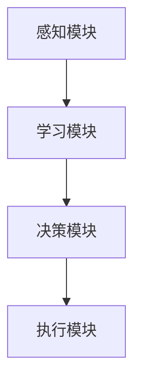
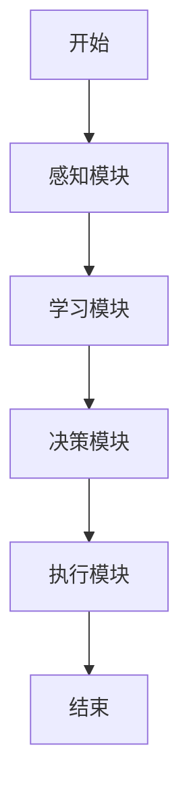

                 


# AI Agent的增量学习与持续适应

---

## 关键词
AI Agent, 增量学习, 持续适应, 在线学习算法, 概念漂移检测, 系统架构设计

---

## 摘要
AI Agent作为人工智能领域的核心概念，其增量学习与持续适应能力是实现智能化系统的关键。本文从AI Agent的基本概念出发，详细探讨了增量学习的算法原理、持续适应的机制、系统架构设计以及实际项目中的应用。通过结合数学公式、算法流程图和系统架构图，本文为读者提供了从理论到实践的全面解读，帮助技术从业者深入理解AI Agent的增量学习与持续适应的核心原理，并掌握实际应用中的关键技巧。

---

# 第1章: AI Agent的基本概念与背景

## 1.1 AI Agent的定义与特点

### 1.1.1 AI Agent的基本定义
AI Agent（人工智能代理）是指能够感知环境、自主决策并采取行动以实现目标的智能实体。它可以是一个软件程序、机器人或其他智能系统，其核心在于通过感知和行动与环境交互，以完成特定任务。

### 1.1.2 AI Agent的核心特点
- **自主性**：AI Agent能够在没有外部干预的情况下独立运行。
- **反应性**：能够实时感知环境变化并做出相应的反应。
- **目标导向性**：所有行动都以实现特定目标为导向。
- **学习能力**：通过增量学习不断优化自身行为。

### 1.1.3 AI Agent的应用场景
- **智能助手**：如Siri、Alexa等，通过语音交互为用户提供服务。
- **自动驾驶**：实时感知环境并做出驾驶决策。
- **智能推荐系统**：根据用户行为动态调整推荐内容。
- **机器人控制**：在制造业中实现精准的机器人操作。

---

## 1.2 增量学习的基本概念

### 1.2.1 增量学习的定义
增量学习是一种机器学习方法，其核心在于在数据流的动态环境中，逐步接收新的数据样本并更新模型，以适应环境的变化。与批量学习不同，增量学习不需要一次性加载所有数据，而是在线处理数据流。

### 1.2.2 增量学习的核心优势
- **实时性**：能够实时处理数据，快速响应环境变化。
- **效率性**：在数据流中仅更新需要的部分，节省计算资源。
- **适应性**：能够适应数据分布的变化，保持模型的准确性。

### 1.2.3 增量学习的挑战与局限性
- **模型漂移**：数据分布的变化可能导致模型性能下降。
- **计算开销**：在线更新模型可能需要更多的计算资源。
- **数据稀疏性**：部分场景下，数据可能不足以支持有效的增量学习。

---

## 1.3 持续适应的基本原理

### 1.3.1 持续适应的定义
持续适应是指AI Agent在动态环境中，能够不断优化自身行为和模型，以适应新的任务需求或环境变化。其核心在于通过持续学习和调整，保持系统的高性能和稳定性。

### 1.3.2 持续适应的核心机制
- **模型更新**：定期或动态更新模型参数，以适应新的数据分布。
- **概念漂移检测**：识别数据分布的变化，触发模型更新机制。
- **自适应学习**：根据环境变化动态调整学习策略。

### 1.3.3 持续适应的应用价值
- **提升系统鲁棒性**：通过持续学习，系统能够更好地应对不确定性。
- **增强用户体验**：动态调整模型参数，提供更个性化的服务。
- **降低维护成本**：通过自动化更新，减少人工干预的需求。

---

## 1.4 本章小结
本章从AI Agent的基本概念出发，详细介绍了增量学习和持续适应的核心原理及其在实际场景中的应用价值。通过对比增量学习与批量学习的差异，我们理解了增量学习在动态环境中的优势。同时，持续适应机制的引入，使得AI Agent能够在复杂环境中保持高性能和稳定性。

---

# 第2章: 增量学习的算法原理

## 2.1 增量学习的基本算法

### 2.1.1 在线学习算法
在线学习是一种典型的增量学习方法，其特点在于数据样本逐个输入，模型在接收到每个样本后立即更新。常见的在线学习算法包括：

- **线性回归**：通过最小化损失函数，逐步更新回归系数。
- **支持向量机**：在流数据中动态更新支持向量，保持模型的泛化能力。
- **神经网络**：通过反向传播算法，逐步更新神经网络权重。

### 2.1.2 膝肘法
膝肘法是一种用于在线分类的增量学习算法，其核心在于动态调整分类器的参数，以适应数据分布的变化。其优点在于计算效率高，适用于大规模数据流的处理。

### 2.1.3 梯度下降法
梯度下降法是一种常用的在线优化算法，通过计算损失函数的梯度，逐步调整模型参数以最小化损失。其适用于各种增量学习场景，但需要 careful的步长选择以保证收敛性。

---

## 2.2 增量学习的数学模型

### 2.2.1 线性回归模型
线性回归是一种经典的增量学习模型，其目标是最小化预测值与真实值之间的平方误差。数学表达式如下：

$$
\text{损失函数} = \frac{1}{2n}\sum_{i=1}^{n}(y_i - \hat{y}_i)^2
$$

其中，$\hat{y}_i = w^T x_i$，$w$为权重向量，$x_i$为输入样本。

### 2.2.2 支持向量机模型
支持向量机（SVM）是一种监督学习算法，其增量学习版本可以在流数据中动态更新支持向量，保持模型的泛化能力。其数学表达式如下：

$$
\text{目标函数} = \frac{1}{2}\|w\|^2 + C\sum_{i=1}^{n}\xi_i
$$

其中，$\xi_i$为松弛变量，用于处理不可分数据。

### 2.2.3 神经网络模型
神经网络的增量学习可以通过反向传播算法实现，其目标是最小化预测误差。数学表达式如下：

$$
\text{损失函数} = -\sum_{i=1}^{n} y_i \log(\hat{y}_i) + (1 - y_i) \log(1 - \hat{y}_i)
$$

其中，$\hat{y}_i$为神经网络的输出，$y_i$为真实标签。

---

## 2.3 增量学习的流程图



---

## 2.4 本章小结
本章详细介绍了增量学习的基本算法及其数学模型。通过线性回归、支持向量机和神经网络的对比，我们理解了不同算法在增量学习中的适用场景和优缺点。同时，流程图展示了增量学习的基本流程，帮助读者更好地理解其实现步骤。

---

# 第3章: 持续适应的核心机制

## 3.1 模型更新策略

### 3.1.1 定期更新策略
定期更新策略是指在固定的时间间隔内更新模型参数，以适应数据分布的变化。其优点在于实现简单，但可能无法及时捕捉数据分布的快速变化。

### 3.1.2 事件驱动更新策略
事件驱动更新策略是指在特定事件发生时触发模型更新，例如检测到概念漂移或模型性能显著下降。其优点在于能够及时响应环境变化，但需要准确检测事件的发生。

### 3.1.3 性能驱动更新策略
性能驱动更新策略是指根据模型的性能指标动态触发更新，例如当准确率低于阈值时触发模型重训。其优点在于能够动态调整模型参数，但可能需要频繁的模型更新。

---

## 3.2 概念漂移检测

### 3.2.1 概念漂移的定义
概念漂移是指数据分布的变化导致模型性能下降的现象。其原因可能是数据分布的变化、任务目标的改变或环境条件的变化。

### 3.2.2 概念漂移检测算法
常用的概念漂移检测算法包括：

- **统计测试法**：通过统计测试检测数据分布的变化。
- **分布距离法**：通过计算数据分布之间的距离判断是否发生漂移。
- **模型性能监测法**：通过监测模型性能变化判断是否发生漂移。

### 3.2.3 概念漂移的分类
概念漂移可以分为以下几种类型：

- **突然漂移**：数据分布突然发生变化。
- **渐进漂移**：数据分布逐渐发生变化。
- **周期性漂移**：数据分布周期性变化。

---

## 3.3 模型鲁棒性设计

### 3.3.1 模型鲁棒性的定义
模型鲁棒性是指模型在面对数据噪声、概念漂移或其他不确定性时，仍能保持良好性能的能力。

### 3.3.2 模型鲁棒性的实现方法
- **集成学习**：通过集成多个模型提高鲁棒性。
- **正则化方法**：通过添加正则化项防止过拟合。
- **数据增强**：通过数据增强技术提高模型的泛化能力。

---

## 3.4 本章小结
本章详细介绍了持续适应的核心机制，包括模型更新策略、概念漂移检测和模型鲁棒性设计。通过对比不同策略的优缺点，我们理解了如何在实际应用中选择合适的模型更新策略。同时，概念漂移检测和模型鲁棒性设计的方法为我们提供了实际操作的指导。

---

# 第4章: 持续适应的系统架构设计

## 4.1 系统架构概述

### 4.1.1 系统功能模块
AI Agent的系统架构通常包括以下功能模块：

- **感知模块**：负责数据的采集和预处理。
- **学习模块**：负责模型的训练和更新。
- **决策模块**：负责根据模型输出做出决策。
- **执行模块**：负责执行具体的行动。

### 4.1.2 系统架构图



---

## 4.2 系统接口设计

### 4.2.1 感知模块接口
- **输入接口**：接收外部传感器或数据源的输入数据。
- **输出接口**：将预处理后的数据传递给学习模块。

### 4.2.2 学习模块接口
- **输入接口**：接收感知模块传递的数据和决策模块的反馈。
- **输出接口**：将更新后的模型参数传递给决策模块。

### 4.2.3 决策模块接口
- **输入接口**：接收学习模块传递的模型参数和感知模块传递的环境信息。
- **输出接口**：将决策结果传递给执行模块。

---

## 4.3 系统交互流程

### 4.3.1 交互流程图



---

## 4.4 本章小结
本章从系统架构的角度，详细介绍了AI Agent的系统组成和接口设计。通过模块化设计和接口标准化，我们可以更好地理解系统的整体架构和各模块之间的协作关系。

---

# 第5章: 项目实战

## 5.1 环境配置

### 5.1.1 系统需求
- **操作系统**：Linux/Windows/MacOS
- **编程语言**：Python 3.8+
- **开发工具**：Jupyter Notebook或PyCharm
- **依赖库**：numpy、scikit-learn、tensorflow

---

## 5.2 系统核心实现

### 5.2.1 数据预处理

```python
import numpy as np
from sklearn.preprocessing import StandardScaler

# 示例数据
data = np.random.randn(100, 2)
labels = np.random.randint(2, size=100)

# 数据预处理
scaler = StandardScaler()
data_scaled = scaler.fit_transform(data)
```

### 5.2.2 模型训练与更新

```python
from sklearn.linear_model import SGDClassifier
from sklearn.metrics import accuracy_score

# 初始化模型
model = SGDClassifier(max_iter=100, learning_rate='constant')

# 模型训练
model.fit(data_scaled, labels)

# 模型更新
for i in range(100, 200):
    model.partial_fit(data_scaled[i:i+1], labels[i:i+1])
```

### 5.2.3 模型评估

```python
# 模型预测
y_pred = model.predict(data_scaled)

# 模型评估
print("准确率:", accuracy_score(labels, y_pred))
```

---

## 5.3 代码应用解读与分析

### 5.3.1 代码功能解读
上述代码展示了增量学习的基本实现，包括数据预处理、模型训练和模型更新。通过`SGDClassifier`实现在线学习，`partial_fit`方法用于动态更新模型参数。

### 5.3.2 实际案例分析
以股票价格预测为例，我们可以通过增量学习模型实时更新股票价格预测模型，以适应市场的动态变化。

---

## 5.4 本章小结
本章通过实际项目案例，详细展示了增量学习与持续适应技术的实现过程。通过代码示例，读者可以更好地理解理论知识，并将其应用于实际场景中。

---

# 第6章: 最佳实践与小结

## 6.1 最佳实践

### 6.1.1 系统设计建议
- **模块化设计**：通过模块化设计提高系统的可维护性和扩展性。
- **接口标准化**：通过标准化接口实现模块之间的无缝协作。
- **模型优化**：通过正则化和集成学习提高模型的鲁棒性和泛化能力。

### 6.1.2 代码实现建议
- **代码复用**：通过代码复用减少开发成本。
- **性能优化**：通过并行计算和缓存优化提高系统性能。
- **日志记录**：通过日志记录系统运行状态，便于调试和优化。

---

## 6.2 小结
本文从AI Agent的基本概念出发，详细探讨了增量学习与持续适应的核心原理和实现方法。通过理论分析和实际案例，我们理解了如何在动态环境中实现AI Agent的智能化和自适应能力。未来，随着技术的发展，AI Agent将在更多领域发挥重要作用。

---

# 作者：AI天才研究院/AI Genius Institute & 禅与计算机程序设计艺术 /Zen And The Art of Computer Programming

---

**感谢您的阅读！**

