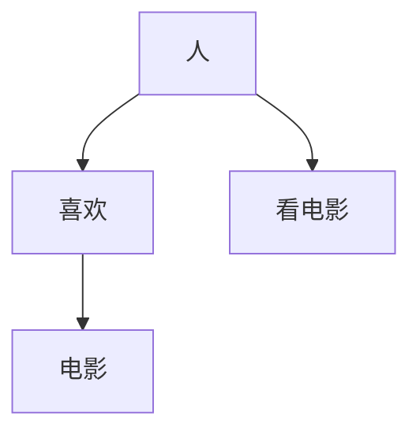
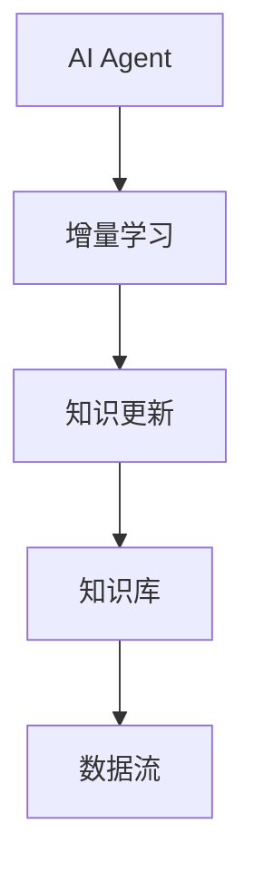

                 


# AI Agent的增量学习与知识更新

> 关键词：AI Agent、增量学习、知识更新、机器学习、知识图谱

> 摘要：本文详细探讨了AI Agent的增量学习与知识更新的原理、算法、系统架构及实际应用。通过对增量学习和知识更新的核心概念、算法实现、系统设计以及项目实战的全面分析，揭示了AI Agent在动态环境中的学习与适应机制，为相关领域的研究和实践提供了深入的理论支持和方法指导。

---

# 第一部分: AI Agent的增量学习与知识更新概述

## 第1章: AI Agent的基本概念与背景介绍

### 1.1 AI Agent的定义与核心概念

#### 1.1.1 AI Agent的基本定义
AI Agent（人工智能代理）是指能够感知环境、自主决策并执行任务的智能实体。它通过传感器获取信息，利用推理能力进行分析，并通过执行器与环境交互。AI Agent的核心目标是通过学习和优化，提高任务执行的效率和准确性。

#### 1.1.2 增量学习的背景与问题背景
增量学习是一种机器学习方法，允许模型在新数据流不断引入的情况下进行实时更新和优化。与传统批量学习不同，增量学习适用于动态环境，能够处理数据分布变化和新知识的引入。知识更新则是AI Agent保持最新知识、适应环境变化的关键能力。

#### 1.1.3 知识更新的必要性与应用场景
在动态环境中，知识的快速变化要求AI Agent能够实时更新其知识库。例如，在智能推荐系统中，用户偏好和市场趋势的变化需要系统不断更新知识。知识更新不仅提高了系统的适应性，还增强了其在复杂环境中的问题解决能力。

#### 1.1.4 问题解决的边界与外延
增量学习和知识更新的边界在于数据流的动态性和知识的可更新性。外延则包括从简单数据流到复杂知识图谱的更新。AI Agent需要在有限的计算资源和时间约束下，高效完成知识更新，确保系统性能不受影响。

#### 1.1.5 核心要素组成与概念结构
AI Agent的增量学习和知识更新涉及多个核心要素，包括知识表示、学习算法、更新机制和评估指标。这些要素共同构建了AI Agent的知识更新系统，确保其能够在动态环境中保持高效和准确。

### 1.2 AI Agent在增量学习中的作用

#### 1.2.1 AI Agent的智能性与自主性
AI Agent通过智能性能够感知环境并自主决策。在增量学习中，Agent能够根据新数据实时调整模型参数，确保系统的适应性。

#### 1.2.2 增量学习的核心问题与挑战
增量学习的核心问题是在线更新模型参数，同时保持模型的稳定性和准确性。挑战包括数据稀疏性、模型遗忘和计算效率。

#### 1.2.3 知识更新的动态性与适应性
知识更新的动态性要求AI Agent能够快速响应环境变化，适应新的知识。适应性则是指系统在更新过程中保持稳定性和连续性。

#### 1.2.4 问题解决的效率与准确性
AI Agent通过增量学习和知识更新，能够在动态环境中高效解决问题，同时保证结果的准确性。这需要平衡更新频率和计算资源的使用。

### 1.3 AI Agent的典型应用场景

#### 1.3.1 智能推荐系统
增量学习和知识更新能够实时更新用户的偏好，提升推荐系统的准确性和用户体验。

#### 1.3.2 自动化决策系统
在金融和医疗领域，AI Agent通过增量学习和知识更新，能够快速响应市场变化和患者需求，提供实时决策支持。

#### 1.3.3 智能对话系统
知识更新使得对话系统能够不断优化对话内容，提升用户体验，实现更自然的交流。

#### 1.3.4 智慧城市与物联网
在智慧城市和物联网中，AI Agent能够实时更新城市交通、环境监测等数据，提供高效的解决方案。

#### 1.3.5 其他新兴领域
AI Agent在教育、农业、制造等领域也有广泛应用，增量学习和知识更新为其提供了强大的技术支持。

## 第2章: 增量学习与知识更新的核心概念与联系

### 2.1 增量学习的基本原理

#### 2.1.1 在线学习与离线学习的对比
在线学习是在数据流实时到达的情况下进行模型更新，适用于动态环境。离线学习则是在数据集中进行批量处理，适用于静态环境。增量学习介于两者之间，允许在数据流中逐步更新模型。

#### 2.1.2 增量学习的数学模型
增量学习的数学模型可以通过更新规则表示，例如：

$$ w_{t+1} = w_t + \eta (y_t - \hat{y}_t) $$

其中，$w_t$ 表示第t步的模型参数，$\eta$ 是学习率，$y_t$ 是真实标签，$\hat{y}_t$ 是预测值。

#### 2.1.3 核心概念的属性特征对比表格
| 概念       | 在线学习 | 离线学习 | 增量学习 |
|------------|----------|----------|----------|
| 数据处理方式 | 实时处理 | 批次处理 | 逐步更新 |
| 计算效率     | 高       | 低       | 中等     |
| 适应性       | 高       | 低       | 高       |

### 2.2 知识更新的机制与方法

#### 2.2.1 知识表示与知识图谱
知识表示是将知识以结构化形式存储的过程。知识图谱是一种图结构，由节点和边组成，用于表示实体及其关系。例如：



#### 2.2.2 知识更新的触发条件
知识更新的触发条件包括新数据到达、模型性能下降、用户反馈等。例如，当用户反馈错误时，系统会触发知识更新。

#### 2.2.3 知识更新的评估指标
知识更新的评估指标包括准确率、召回率、F1分数等。例如，准确率可以表示为：

$$ \text{准确率} = \frac{\text{正确预测数}}{\text{总预测数}} $$

### 2.3 增量学习与知识更新的ER实体关系图



---

## 第3章: 增量学习的算法原理与实现

### 3.1 增量学习的数学模型

#### 3.1.1 线性回归的增量学习公式
线性回归的增量学习公式可以通过以下步骤实现：

1. 初始化权重向量 $w_0$。
2. 对于每个新样本 $(x_i, y_i)$，更新权重：

$$ w_{t+1} = w_t + \eta (y_i - \hat{y}_i) x_i $$

3. 重复步骤2，直到收敛。

#### 3.1.2 支持向量机的增量学习算法
支持向量机的增量学习算法可以通过以下步骤实现：

1. 初始化支持向量集合和参数。
2. 对于每个新样本，判断其是否在当前支持向量集合中。
3. 如果不在，添加到支持向量集合，并更新模型。
4. 重复步骤2和3，直到收敛。

### 3.2 知识更新的算法实现

#### 3.2.1 基于图的增量聚类算法
基于图的增量聚类算法可以通过以下步骤实现：

1. 初始化图结构。
2. 对于每个新样本，计算其与现有样本的相似度。
3. 根据相似度将新样本添加到最相似的聚类中。
4. 重复步骤2和3，直到收敛。

#### 3.2.2 知识图谱的增量更新算法
知识图谱的增量更新算法可以通过以下步骤实现：

1. 初始化知识图谱。
2. 对于每个新实体或关系，计算其与现有知识图谱的匹配度。
3. 根据匹配度将新知识添加到知识图谱中。
4. 重复步骤2和3，直到收敛。

---

## 第4章: 系统分析与架构设计

### 4.1 系统功能设计

#### 4.1.1 领域模型
领域模型是系统功能设计的核心，可以通过以下步骤实现：

1. 确定领域中的实体和关系。
2. 通过Mermaid图展示领域模型。
3. 根据领域模型设计系统功能。

#### 4.1.2 系统架构设计
系统架构设计可以通过以下步骤实现：

1. 确定系统的模块划分。
2. 通过Mermaid图展示系统架构。
3. 设计模块之间的交互流程。

### 4.2 系统架构设计

#### 4.2.1 问题场景介绍
问题场景介绍可以通过以下步骤实现：

1. 确定系统的应用场景。
2. 通过Mermaid图展示问题场景。
3. 分析问题场景中的关键问题。

#### 4.2.2 系统功能设计
系统功能设计可以通过以下步骤实现：

1. 确定系统的功能模块。
2. 通过Mermaid图展示系统功能。
3. 分析功能模块之间的关系。

### 4.3 系统接口设计

#### 4.3.1 系统接口设计
系统接口设计可以通过以下步骤实现：

1. 确定系统的接口类型。
2. 通过Mermaid图展示系统接口。
3. 分析接口之间的交互流程。

#### 4.3.2 系统交互设计
系统交互设计可以通过以下步骤实现：

1. 确定系统的交互流程。
2. 通过Mermaid图展示系统交互。
3. 分析交互流程中的关键点。

---

## 第5章: 项目实战

### 5.1 环境安装与配置

#### 5.1.1 环境要求
环境要求包括操作系统、编程语言、开发工具等。例如，推荐使用Python 3.8及以上版本。

#### 5.1.2 依赖库安装
依赖库安装可以通过以下命令实现：

```bash
pip install numpy matplotlib scikit-learn
```

### 5.2 系统核心实现

#### 5.2.1 增量学习实现
增量学习实现可以通过以下代码实现：

```python
import numpy as np

def incremental_learning(X, y, model):
    for xi, yi in zip(X, y):
        model.partial_fit(xi.reshape(1, -1), yi)
    return model
```

#### 5.2.2 知识更新实现
知识更新实现可以通过以下代码实现：

```python
from sklearn.linear_model import SGDClassifier

model = SGDClassifier()
model.fit(X, y)
```

### 5.3 案例分析与解读

#### 5.3.1 案例分析
案例分析可以通过以下步骤实现：

1. 确定案例的数据集。
2. 通过代码实现案例的增量学习和知识更新。
3. 分析案例的结果并总结经验。

#### 5.3.2 代码实现解读
代码实现解读可以通过以下步骤实现：

1. 解释代码的功能和实现逻辑。
2. 分析代码的优缺点。
3. 提供改进建议。

### 5.4 项目总结

#### 5.4.1 项目总结
项目总结可以通过以下步骤实现：

1. 总结项目的实现过程。
2. 分析项目的优缺点。
3. 提供项目改进建议。

#### 5.4.2 项目小结
项目小结可以通过以下步骤实现：

1. 简要总结项目的成果。
2. 提出未来的研究方向。

---

## 第6章: 最佳实践与小结

### 6.1 最佳实践

#### 6.1.1 知识管理
知识管理是AI Agent增量学习和知识更新的关键。建议定期备份知识库，确保数据的安全性。

#### 6.1.2 系统优化
系统优化可以通过以下步骤实现：

1. 优化算法的效率。
2. 提高系统的可扩展性。
3. 增强系统的容错能力。

### 6.2 小结

AI Agent的增量学习和知识更新是动态环境中的关键能力。通过本文的分析，我们了解了增量学习和知识更新的核心概念、算法实现和系统设计。未来的研究方向包括更高效的增量学习算法和更智能的知识更新机制。

### 6.3 注意事项

#### 6.3.1 开发注意事项
开发注意事项包括：

1. 注意数据的实时性。
2. 确保系统的稳定性。
3. 优化算法的效率。

#### 6.3.2 使用注意事项
使用注意事项包括：

1. 确保数据的准确性。
2. 定期更新知识库。
3. 监控系统的性能。

---

## 第7章: 拓展阅读与深入探讨

### 7.1 拓展阅读

#### 7.1.1 相关技术
相关技术包括：

1. 在线学习与增量学习。
2. 知识图谱与语义网络。
3. 动态环境中的机器学习。

#### 7.1.2 推荐书籍与论文
推荐书籍与论文包括：

1. 《机器学习实战》。
2. 《增量学习与在线学习》。
3. 《知识图谱与语义网络》。

### 7.2 深入探讨

#### 7.2.1 深入探讨的领域
深入探讨的领域包括：

1. 增量学习的数学模型。
2. 知识更新的算法优化。
3. AI Agent的多模态学习。

---

## 作者

作者：AI天才研究院/AI Genius Institute & 禅与计算机程序设计艺术 /Zen And The Art of Computer Programming

