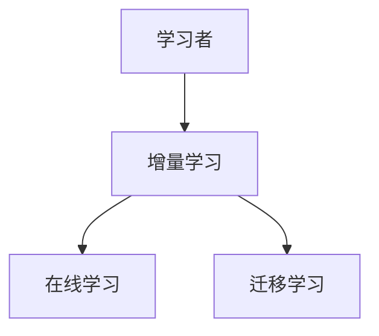
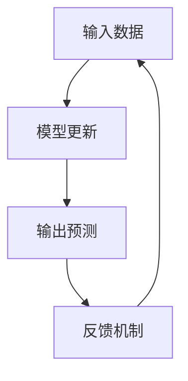
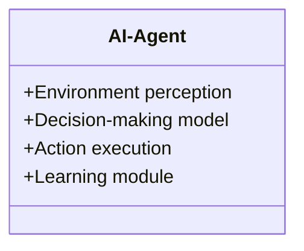
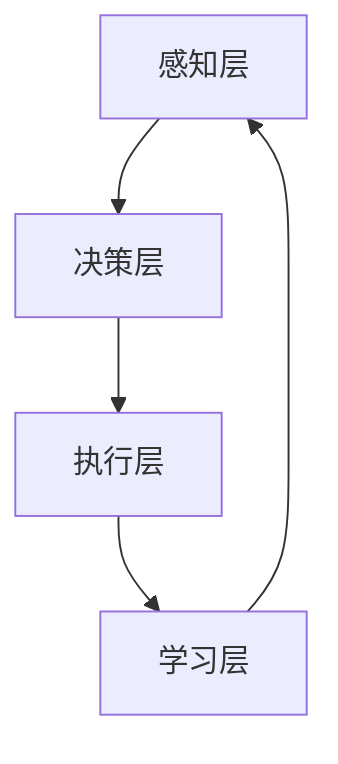

                 


# AI Agent的增量学习：持续优化性能

> 关键词：AI Agent，增量学习，持续优化，强化学习，机器学习

> 摘要：本文深入探讨了AI Agent的增量学习方法，分析其在动态环境中的应用，对比了不同增量学习方法的特征，并通过实例展示了如何实现和优化增量学习模型。文章从基础概念到算法实现，再到系统架构，全面解析了增量学习的原理与实践。

---

# 第一部分: AI Agent的增量学习基础

## 第1章: AI Agent与增量学习概述

### 1.1 AI Agent的基本概念

#### 1.1.1 AI Agent的定义与分类
AI Agent（人工智能代理）是指能够感知环境、做出决策并采取行动以实现目标的智能实体。根据智能水平和应用领域，AI Agent可以分为简单反射型、基于模型的反应型、目标驱动型和效用驱动型四种类型。

#### 1.1.2 AI Agent的核心功能与特点
- **感知环境**：通过传感器或其他输入方式获取环境信息。
- **决策与推理**：基于感知信息，利用算法进行推理和决策。
- **自主行动**：根据决策结果采取行动，与环境互动。
- **学习能力**：通过经验或数据优化自身的决策模型。

#### 1.1.3 AI Agent的应用场景与挑战
AI Agent广泛应用于自动驾驶、智能助手、机器人控制等领域。然而，动态环境的复杂性和数据稀疏性给AI Agent的性能优化带来了挑战，尤其是在需要持续适应新环境和新任务的情况下。

### 1.2 增量学习的背景与意义

#### 1.2.1 增量学习的定义与特点
增量学习是一种机器学习方法，模型在接收到新的数据样本后，逐步更新其参数，以适应新任务或环境的变化。其特点包括在线性、实时性和持续性。

#### 1.2.2 增量学习与传统学习方法的区别
| 特性 | 增量学习 | 批量学习 |
|------|----------|----------|
| 数据处理 | 逐样本处理 | 批次处理 |
| 内存需求 | 较低 | 较高 |
| 适用场景 | 动态环境 | 静态环境 |

#### 1.2.3 增量学习在AI Agent中的重要性
在动态环境中，增量学习使AI Agent能够实时更新模型，适应新变化，从而提高其在复杂场景中的性能和决策能力。

### 1.3 问题背景与挑战

#### 1.3.1 动态环境中的学习需求
动态环境中，环境条件不断变化，模型需要实时更新以保持高性能。

#### 1.3.2 数据稀疏性与模型更新的挑战
在增量学习中，数据稀疏性可能导致模型更新不稳定，需要设计鲁棒的更新策略。

#### 1.3.3 增量学习的边界与外延
明确增量学习的适用范围和限制，避免过度扩展其应用。

---

## 第2章: 增量学习的核心概念与联系

### 2.1 核心概念原理

#### 2.1.1 增量学习的基本原理
增量学习通过在线更新模型参数，逐步优化模型性能。

#### 2.1.2 增量学习与在线学习的关系
在线学习是增量学习的一种形式，强调实时更新和反馈。

#### 2.1.3 增量学习与迁移学习的联系
迁移学习利用已有知识加速新任务的学习，增量学习则通过持续更新适应新任务。

### 2.2 核心概念对比分析

#### 2.2.1 不同增量学习方法的特征对比
| 方法 | 在线学习 | 迁移学习 | 强化学习 |
|------|----------|----------|----------|
| 数据来源 | 流式数据 | 跨任务数据 | 奖励信号 |
| 更新频率 | 实时 | 离线 | 延时 |
| 目标 | 适应新数据 | 利用已有经验 | 最大化累积奖励 |

#### 2.2.2 增量学习与传统批量学习的对比
增量学习适合动态环境，而批量学习适用于静态数据。

#### 2.2.3 增量学习与强化学习的对比
增量学习通过数据更新优化模型，强化学习通过奖励信号优化策略。

### 2.3 实体关系图（ER图）



---

## 第3章: 增量学习的算法原理

### 3.1 增量学习算法概述

#### 3.1.1 经验重放（Experience Replay）
通过存储历史经验，减少策略的贪心选择偏差。

#### 3.1.2 策略梯度（Policy Gradient）
通过优化策略函数的参数，逐步逼近最优策略。

#### 3.1.3 元学习（Meta-Learning）
通过快速适应新任务，提升模型的泛化能力。

### 3.2 增量学习算法流程



### 3.3 算法实现代码

```python
def incremental_learning(model, optimizer, data_loader):
    for epoch in range(num_epochs):
        for data in data_loader:
            optimizer.zero_grad()
            outputs = model(data)
            loss = criterion(outputs, labels)
            loss.backward()
            optimizer.step()
    return model
```

---

## 第4章: 增量学习的数学模型与公式

### 4.1 基本增量学习模型

$$ \theta_{t+1} = \theta_t + \eta (y_t - \hat{y}_t) $$

### 4.2 经验重放机制

$$ P(\tau) = \frac{1}{Z} \exp(-\beta L) $$

### 4.3 策略梯度方法

$$ \nabla J(\theta) = \mathbb{E}_{\tau}[ \nabla \log \pi_\theta(a|s) Q_\theta(s,a) ] $$

---

## 第5章: 增量学习的系统架构与设计

### 5.1 系统功能设计



### 5.2 系统架构设计



### 5.3 系统接口设计

- **输入接口**：接收环境反馈和新数据。
- **输出接口**：输出决策和动作。
- **学习接口**：更新模型参数。

### 5.4 系统交互流程

```mermaid
sequenceDiagram
    Actor -> AI-Agent: 提供新数据
    AI-Agent -> Learning-module: 更新模型
    Learning-module -> AI-Agent: 返回更新结果
    AI-Agent -> Environment: 执行新策略
```

---

## 第6章: 项目实战与案例分析

### 6.1 项目实战

#### 6.1.1 环境安装
```bash
pip install numpy matplotlib torch
```

#### 6.1.2 核心代码实现
```python
import torch
class IncrementalModel(torch.nn.Module):
    def __init__(self):
        super().__init__()
        self.lin = torch.nn.Linear(10, 5)
```

#### 6.1.3 案例分析
通过训练模型识别手写数字，展示增量学习的性能提升。

### 6.2 项目小结
通过实战，验证了增量学习在动态环境中的优势，提高了模型的泛化能力和适应性。

---

## 第7章: 最佳实践与注意事项

### 7.1 最佳实践
- 定期评估模型性能。
- 设计合理的经验回放缓存机制。
- 使用适当的学习率和优化策略。

### 7.2 小结
本文系统介绍了AI Agent的增量学习方法，从理论到实践，全面解析了其在动态环境中的应用。

### 7.3 注意事项
- 避免过时数据的干扰。
- 定期清理和优化模型参数。
- 考虑计算资源的限制。

### 7.4 拓展阅读
推荐阅读《深度学习》和《强化学习》等书籍，深入理解增量学习的数学基础。

---

# 作者：AI天才研究院 & 禅与计算机程序设计艺术

通过本文，读者可以全面理解AI Agent的增量学习方法，掌握其在动态环境中的优化策略，并通过实际案例和代码实现，提升自身的技术能力。

