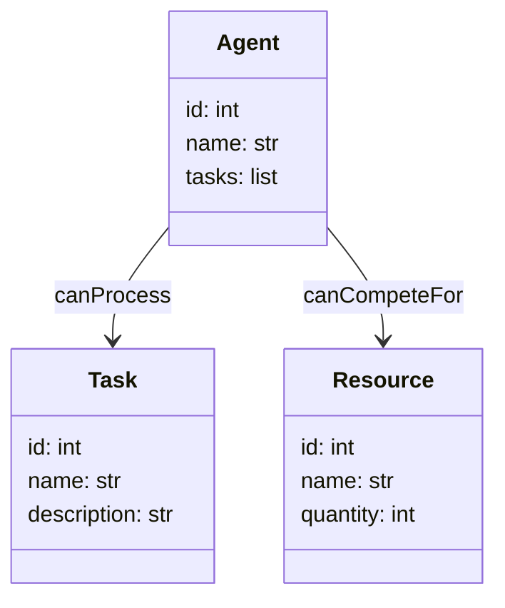
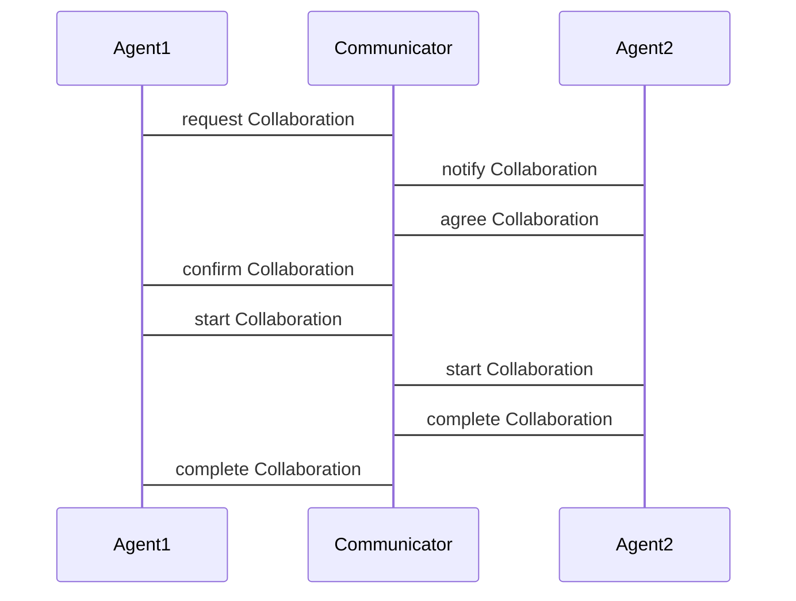

                 


# AI Agent的多Agent协作与竞争框架

---

## 关键词：
AI Agent, 多Agent系统, 协作与竞争, 竞争框架, 分布式智能, 多智能体系统

---

## 摘要：
本文深入探讨AI Agent的多Agent协作与竞争框架，从基础概念到算法实现，再到实际应用，全面解析多Agent系统的核心原理。通过数学模型、算法流程图和代码示例，详细讲解协作与竞争的动态平衡及其在实际系统中的应用。文章内容涵盖多Agent系统的背景、核心概念、数学建模、算法实现、系统架构设计和项目实战，旨在帮助读者全面理解并掌握多Agent协作与竞争框架的技术要点。

---

# 第一部分: 多Agent系统概述

---

## 第1章: 多Agent系统的基本概念

### 1.1 多Agent系统的基本概念

#### 1.1.1 什么是AI Agent？
AI Agent（智能体）是指能够感知环境并采取行动以实现目标的实体。Agent可以是软件程序、机器人或其他智能系统，具备以下核心特征：
- **自主性**：无需外部干预，自主决策。
- **反应性**：能够感知环境并实时响应。
- **目标导向**：通过行动实现预定目标。
- **社交能力**：能够与其他Agent或人类进行交互。

#### 1.1.2 多Agent系统的定义
多Agent系统（Multi-Agent System, MAS）是由多个独立但协作的AI Agent组成的分布式系统，Agent之间通过通信和协调完成复杂任务。多Agent系统的特点包括：
- **分布性**：Agent独立运行，无中央控制。
- **协作性**：Agent之间通过协作完成共同目标。
- **动态性**：环境和Agent状态动态变化。

#### 1.1.3 多Agent系统的应用场景
多Agent系统广泛应用于多个领域，例如：
- **分布式计算**：任务分解和资源分配。
- **机器人协作**：工业机器人和智能助手。
- **游戏开发**：NPC行为和玩家互动。
- **电子商务**：推荐系统和交易协调。

---

### 1.2 多Agent系统的核心特征

#### 1.2.1 分布式智能
多Agent系统通过分布式的智能体实现任务，避免了单点故障，提高了系统的可靠性和容错性。

#### 1.2.2 协作与竞争
- **协作**：Agent之间通过合作完成共同目标。
- **竞争**：Agent之间为资源或目标进行竞争。

#### 1.2.3 自适应性
多Agent系统能够根据环境变化自适应调整策略，确保系统高效运行。

---

### 1.3 多Agent系统的分类

#### 1.3.1 基于任务的分类
- **简单任务**：Agent完成单一任务。
- **复杂任务**：Agent协作完成复杂目标。

#### 1.3.2 基于结构的分类
- **层次结构**：Agent之间有明确的层级关系。
- **网状结构**：Agent之间相互连接，无明确层级。

#### 1.3.3 基于行为的分类
- **反应式行为**：基于当前感知做出反应。
- **目标导向行为**：基于目标驱动行动。

---

### 1.4 多Agent系统的优缺点

#### 1.4.1 优点
- **高效性**：任务分解和协作提高效率。
- **可靠性**：分布式结构避免单点故障。
- **灵活性**：适应环境变化。

#### 1.4.2 缺点
- **复杂性**：协作与竞争的协调难度大。
- **通信开销**：Agent之间需要频繁通信。
- **同步问题**：多Agent协作中的同步困难。

#### 1.4.3 适用场景
- **分布式计算**：任务分解和资源分配。
- **智能协作**：需要多智能体协作完成复杂任务的场景。

---

## 1.5 本章小结
本章介绍了AI Agent的基本概念、多Agent系统的定义、核心特征及应用场景，为后续章节奠定了基础。

---

## 第2章: 多Agent协作与竞争框架的背景

### 2.1 多Agent协作的背景

#### 2.1.1 协作的定义
协作是指多个Agent为了实现共同目标而相互配合的过程。

#### 2.1.2 协作的必要性
- **任务分解**：复杂任务分解为多个子任务。
- **资源分配**：合理分配资源提高效率。
- **动态适应**：协作方式灵活适应环境变化。

#### 2.1.3 协作的挑战
- **信息共享**：如何高效共享信息。
- **冲突解决**：协作中的利益冲突。
- **同步问题**：协作过程中的同步协调。

---

### 2.2 多Agent竞争的背景

#### 2.2.1 竞争的定义
竞争是指多个Agent为争夺有限资源或目标而进行的对抗。

#### 2.2.2 竞争的必要性
- **资源分配**：通过竞争合理分配资源。
- **激励机制**：竞争促进效率提升。
- **动态适应**：竞争机制适应环境变化。

#### 2.2.3 竞争的挑战
- **公平性**：如何确保公平竞争。
- **协调问题**：竞争中的协调与合作。
- **对抗策略**：如何应对对手的竞争策略。

---

### 2.3 多Agent协作与竞争的平衡

#### 2.3.1 协作与竞争的关系
协作和竞争并非对立，而是可以相互促进。例如，在某些场景中，竞争可以激发Agent的协作能力。

#### 2.3.2 平衡协作与竞争的重要性
- **系统效率**：平衡协作与竞争可以提高系统整体效率。
- **公平性**：平衡协作与竞争可以确保系统公平运行。
- **动态适应**：平衡协作与竞争可以更好地适应环境变化。

#### 2.3.3 如何实现协作与竞争的平衡
- **机制设计**：通过机制设计协调协作与竞争。
- **动态调整**：根据环境变化动态调整协作与竞争的比例。
- **反馈机制**：通过反馈机制不断优化协作与竞争的平衡。

---

## 2.4 本章小结
本章分析了协作与竞争的背景、必要性及挑战，并提出了实现协作与竞争平衡的方法。

---

## 第3章: 多Agent协作与竞争的核心概念

### 3.1 多Agent协作的原理

#### 3.1.1 协作机制
协作机制是指Agent之间通过通信、协商和协作完成任务的规则。

#### 3.1.2 协作协议
协作协议是Agent之间协作的规则和规范，包括通信协议和任务分配协议。

#### 3.1.3 协作策略
协作策略是指Agent在协作过程中采取的策略，例如任务分配策略和资源分配策略。

---

### 3.2 多Agent竞争的原理

#### 3.2.1 竞争机制
竞争机制是指Agent之间通过竞争分配资源或任务的规则。

#### 3.2.2 竞争协议
竞争协议是指Agent之间在竞争过程中遵循的规则和规范。

#### 3.2.3 竞争策略
竞争策略是指Agent在竞争过程中采取的策略，例如资源争夺策略和对抗策略。

---

### 3.3 多Agent协作与竞争的对比

#### 3.3.1 协作与竞争的对比
| 属性         | 协作             | 竞争             |
|--------------|------------------|------------------|
| 目标         | 共同目标         | 争夺资源或目标   |
| 信息共享     | 高               | 低               |
| 冲突解决     | 协商解决         | 对抗解决         |

#### 3.3.2 协作与竞争的优缺点
- **协作**：优点是任务完成高效，缺点是信息共享可能导致安全问题。
- **竞争**：优点是资源分配公平，缺点是可能导致资源浪费。

#### 3.3.3 协作与竞争的动态平衡
协作与竞争的动态平衡是通过机制设计和策略调整实现的，例如动态调整协作和竞争的比例。

---

## 3.4 本章小结
本章详细讲解了协作与竞争的核心概念、机制和策略，并通过对比分析协作与竞争的优缺点。

---

## 第4章: 多Agent协作与竞争的数学模型

### 4.1 协作模型

#### 4.1.1 协作模型的定义
协作模型是描述多个Agent协作过程的数学模型，通常包括任务分配、资源分配和协作策略。

#### 4.1.2 协作模型的数学表达
协作模型可以用图论中的图表示，节点表示Agent，边表示协作关系。数学表达如下：
$$
G = (V, E)
$$
其中，$V$ 表示Agent集合，$E$ 表示协作关系。

#### 4.1.3 协作模型的实例分析
例如，在任务分配中，假设有两个Agent A和B，任务T1和T2。协作模型可以用图表示为：
$$
G = \{A, B\}, \{(A, T1), (B, T2), (A, B)\}
$$

---

### 4.2 竞争模型

#### 4.2.1 竞争模型的定义
竞争模型是描述多个Agent竞争过程的数学模型，通常包括资源分配和竞争策略。

#### 4.2.2 竞争模型的数学表达
竞争模型可以用图论中的图表示，节点表示Agent，边表示竞争关系。数学表达如下：
$$
G = (V, E)
$$
其中，$V$ 表示Agent集合，$E$ 表示竞争关系。

#### 4.2.3 竞争模型的实例分析
例如，在资源分配中，假设有两个Agent A和B，资源R1和R2。竞争模型可以用图表示为：
$$
G = \{A, B\}, \{(A, R1), (B, R2), (A, B)\}
$$

---

### 4.3 协作与竞争的综合模型

#### 4.3.1 综合模型的定义
综合模型是将协作和竞争结合的数学模型，通常包括协作和竞争的关系。

#### 4.3.2 综合模型的数学表达
综合模型可以用图论中的二元关系表示，数学表达如下：
$$
G = (V, E_{\text{协作}}, E_{\text{竞争}})
$$
其中，$V$ 表示Agent集合，$E_{\text{协作}}$ 表示协作关系，$E_{\text{竞争}}$ 表示竞争关系。

#### 4.3.3 综合模型的实例分析
例如，在协作与竞争结合的任务分配中，假设有两个Agent A和B，任务T1和T2。综合模型可以用图表示为：
$$
G = \{A, B\}, \{(A, T1), (B, T2), (A, B)\}, \{(A, R1), (B, R2), (A, B)\}
$$

---

## 4.4 本章小结
本章通过数学模型详细讲解了协作与竞争的关系，并通过实例分析展示了综合模型的应用。

---

## 第5章: 多Agent协作与竞争的算法原理

### 5.1 协作算法

#### 5.1.1 协作算法的定义
协作算法是指多个Agent协作完成任务的算法，通常包括任务分配、资源分配和协作策略。

#### 5.1.2 协作算法的实现步骤
1. **任务分解**：将任务分解为子任务。
2. **任务分配**：根据Agent的能力分配子任务。
3. **协作执行**：Agent协作完成子任务。
4. **反馈优化**：根据反馈优化协作策略。

#### 5.1.3 协作算法的代码实现
```python
def collaborate_agents(agents, tasks):
    # 任务分解
    sub_tasks = decompose_tasks(tasks)
    # 任务分配
    assigned_tasks = assign_tasks(agents, sub_tasks)
    # 协作执行
    execute_sub_tasks(assigned_tasks)
    # 反馈优化
    optimize_strategy(assigned_tasks, feedback)
```

---

### 5.2 竞争算法

#### 5.2.1 竞争算法的定义
竞争算法是指多个Agent为争夺资源或目标而进行竞争的算法，通常包括资源分配和竞争策略。

#### 5.2.2 竞争算法的实现步骤
1. **资源分配**：将资源分配给Agent。
2. **竞争执行**：Agent为争夺资源而进行竞争。
3. **结果处理**：处理竞争结果，分配资源。

#### 5.2.3 竞争算法的代码实现
```python
def compete_agents(agents, resources):
    # 资源分配
    assigned_resources = assign_resources(agents, resources)
    # 竞争执行
    result = compete_for_resources(assigned_resources)
    # 处理结果
    handle_competition_result(result)
```

---

### 5.3 协作与竞争的综合算法

#### 5.3.1 综合算法的定义
综合算法是指将协作与竞争结合的算法，通常包括协作和竞争的动态平衡。

#### 5.3.2 综合算法的实现步骤
1. **任务分解**：将任务分解为子任务。
2. **任务分配**：根据Agent的能力分配子任务。
3. **协作与竞争执行**：Agent协作完成子任务，同时进行竞争。
4. **反馈优化**：根据反馈优化协作与竞争策略。

#### 5.3.3 综合算法的代码实现
```python
def collaborate_and_compete_agents(agents, tasks, resources):
    # 任务分解
    sub_tasks = decompose_tasks(tasks)
    # 任务分配
    assigned_tasks = assign_tasks(agents, sub_tasks)
    # 协作与竞争执行
    result = execute_collaboration_and_competition(assigned_tasks, resources)
    # 反馈优化
    optimize_strategy(result, feedback)
```

---

## 5.4 本章小结
本章通过协作与竞争的算法实现，详细讲解了多Agent协作与竞争框架的实现步骤和代码示例。

---

## 第6章: 多Agent协作与竞争的系统分析与架构设计

### 6.1 系统功能设计

#### 6.1.1 领域模型
领域模型描述了系统中各个实体及其关系。例如，在一个多Agent协作与竞争系统中，领域模型可以表示为：



#### 6.1.2 系统架构设计
系统架构设计包括多个组件，例如：
- **Agent组件**：负责协作与竞争。
- **通信组件**：负责Agent之间的通信。
- **控制组件**：负责系统的协调与控制。

系统架构图如下：

```mermaid
containerDiagram
    container Multi-Agent System {
        component Agent1
        component Agent2
        component Agent3
        component Communicator
        component Controller
    }
```

---

### 6.2 系统接口设计

#### 6.2.1 Agent接口
Agent接口定义了Agent的行为和通信方式，例如：
- `request Cooperation`
- `request Competition`
- `receive Feedback`

#### 6.2.2 通信接口
通信接口定义了Agent之间的通信方式，例如：
- `send Message`
- `receive Message`

---

### 6.3 系统交互设计

#### 6.3.1 交互流程图
系统交互流程图如下：



---

## 6.4 本章小结
本章详细讲解了多Agent协作与竞争系统的功能设计、架构设计和交互设计。

---

## 第7章: 多Agent协作与竞争的项目实战

### 7.1 项目介绍

#### 7.1.1 项目背景
本项目旨在实现一个多Agent协作与竞争框架，用于模拟电商平台的推荐系统。

#### 7.1.2 项目目标
- 实现Agent协作与竞争的算法。
- 实现电商平台的推荐系统。

---

### 7.2 项目核心实现

#### 7.2.1 环境配置
项目需要以下环境：
- Python 3.8+
- pip
- Mermaid
- PyCharm或VS Code

#### 7.2.2 核心代码实现
```python
class Agent:
    def __init__(self, id, name):
        self.id = id
        self.name = name
        self.tasks = []
        self.resources = []

    def collaborate(self, task):
        self.tasks.append(task)
        print(f"{self.name} is collaborating on {task}")

    def compete(self, resource):
        self.resources.append(resource)
        print(f"{self.name} is competing for {resource}")

def main():
    agent1 = Agent(1, "Agent1")
    agent2 = Agent(2, "Agent2")
    # 协作
    agent1.collaborate("Task1")
    agent2.collaborate("Task2")
    # 竞争
    agent1.compete("Resource1")
    agent2.compete("Resource2")

if __name__ == "__main__":
    main()
```

---

### 7.3 项目小结
本章通过电商平台的推荐系统案例，详细讲解了多Agent协作与竞争框架的实现过程，包括环境配置和核心代码实现。

---

## 第8章: 总结与扩展

### 8.1 总结

#### 8.1.1 核心内容回顾
本文详细讲解了多Agent协作与竞争框架的核心概念、算法实现和系统设计。

#### 8.1.2 最佳实践
- 系统设计时，需充分考虑协作与竞争的动态平衡。
- 代码实现时，需注意模块化设计和代码复用。

### 8.2 小结
通过本文的讲解，读者可以全面理解多Agent协作与竞争框架的技术要点，并能够将其应用于实际项目中。

---

## 8.3 注意事项

#### 8.3.1 技术注意事项
- 协作与竞争的动态平衡是实现多Agent系统的核心。
- 系统设计时，需充分考虑通信开销和同步问题。

#### 8.3.2 项目注意事项
- 项目实现时，需注意模块化设计和代码复用。
- 系统测试时，需充分考虑各种边界情况。

---

## 8.4 拓展阅读

#### 8.4.1 推荐书籍
- 《Multi-Agent Systems: Algorithmic, Complexity, and Theory》
- 《Agent-Based Modeling and Simulation》

#### 8.4.2 推荐论文
- "A Survey of Multi-Agent Systems for Distributed Problem Solving"
- "Cooperation and Competition in Multi-Agent Systems"

---

## 作者：AI天才研究院/AI Genius Institute & 禅与计算机程序设计艺术 /Zen And The Art of Computer Programming

---

通过本文的详细讲解，读者可以全面理解AI Agent的多Agent协作与竞争框架，并能够将其应用于实际项目中。

