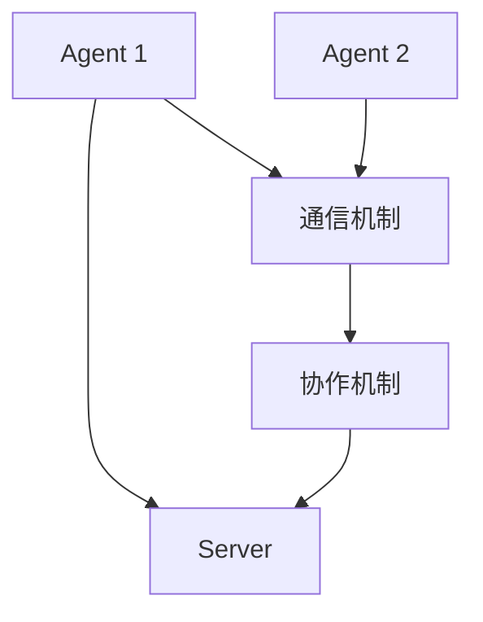

                 


# AI Agent的多Agent协作学习系统

> 关键词：AI Agent，多Agent协作，分布式学习，协作机制，系统架构，算法原理

> 摘要：本文深入探讨了AI Agent的多Agent协作学习系统，分析了其核心概念、算法原理、系统架构，并通过实际案例展示了其应用。文章从背景介绍到系统设计，再到项目实战，层层递进，全面解析了多Agent协作学习系统的实现与应用。

---

## 第一部分: 多Agent协作学习系统概述

### 第1章: 多Agent协作学习系统概述

#### 1.1 问题背景

多Agent协作学习系统是一种分布式智能系统，旨在通过多个智能体（Agent）的协作来完成复杂的任务。随着AI技术的发展，单个Agent的能力已无法满足复杂场景的需求，因此需要多个Agent协同工作，共同提升系统的整体性能。

#### 1.2 问题描述

多Agent协作学习系统的核心问题是：如何让多个Agent在分布式环境中高效协作，同时确保每个Agent都能从协作中获得收益，并且整个系统的性能达到最优。

#### 1.3 问题解决

为了解决上述问题，多Agent协作学习系统采用了分布式学习算法和协作机制，通过Agent之间的信息共享和任务分配，实现系统的高效协作。

#### 1.4 概念结构与核心要素

多Agent协作学习系统由多个Agent组成，每个Agent都有自己的知识库和任务，通过通信和协作完成共同目标。系统的组成包括：

- **Agent角色**：负责执行特定任务。
- **通信机制**：用于Agent之间的信息交换。
- **协作机制**：用于任务分配和协作策略。
- **学习机制**：用于Agent的知识更新和优化。

---

## 第2章: 多Agent协作学习系统的核心概念与联系

### 2.1 核心概念原理

多Agent协作学习系统的核心原理是通过分布式学习算法和协作机制，使多个Agent能够在不同的环境中共同学习和优化。每个Agent都有自己的学习目标，同时通过协作完成更大的任务。

### 2.2 概念属性特征对比

以下是多Agent协作学习系统与传统单Agent学习系统的对比分析：

| 特征               | 单Agent学习系统       | 多Agent协作学习系统   |
|--------------------|----------------------|----------------------|
| 学习主体           | 单个Agent           | 多个Agent           |
| 信息共享           | 无                   | 有                   |
| 任务分配           | 单一任务             | 多任务               |
| 系统性能           | 有限                 | 更高                 |

### 2.3 ER实体关系图架构

以下是一个简单的多Agent协作学习系统的ER实体关系图：

```mermaid
er
    actor: 用户
    agent1: Agent1
    agent2: Agent2
    task: 任务
    interaction: 交互
    collaboration: 协作
    actor --> agent1: 请求
    actor --> agent2: 请求
```

---

## 第3章: 多Agent协作学习系统的算法原理

### 3.1 分布式学习算法

分布式学习算法是多Agent协作学习系统的核心算法之一。以下是其基本步骤：

1. **初始化**：每个Agent初始化自己的参数。
2. **本地学习**：每个Agent在本地数据上进行训练。
3. **参数同步**：通过通信机制将参数同步到其他Agent。
4. **全局优化**：所有Agent的参数进行汇总，优化模型。

### 3.2 协作机制

协作机制是多Agent协作学习系统的关键，以下是常见的协作机制：

- **任务分配**：根据Agent的能力分配任务。
- **信息共享**：通过通信机制共享知识和数据。
- **共识机制**：通过协商达成一致。

### 3.3 代码实现

以下是分布式学习算法的Python代码示例：

```python
import numpy as np
import random

class Agent:
    def __init__(self, id):
        self.id = id
        self.params = np.random.randn(2,2)

    def local_learning(self, data):
        # 简单的梯度下降算法
        for x, y in data:
            gradient = self.compute_gradient(x, y)
            self.params -= 0.1 * gradient

    def compute_gradient(self, x, y):
        # 简单的梯度计算
        return np.dot(x.T, (y - np.sigmoid(np.dot(x, self.params))))

# 初始化多个Agent
agents = [Agent(i) for i in range(3)]

# 分布式学习过程
for agent in agents:
    agent.local_learning(data)

# 参数同步
for i in range(len(agents[0].params)):
    for agent in agents[1:]:
        agents[0].params[i] += agent.params[i]

# 全局优化
for agent in agents:
    agent.params = agents[0].params
```

---

## 第4章: 多Agent协作学习系统的数学模型与公式

### 4.1 分布式学习的数学模型

多Agent协作学习系统的数学模型可以用以下公式表示：

$$ \theta^{(i)}_{t+1} = \theta^{(i)}_t - \eta \nabla_{\theta^{(i)}} \mathcal{L}_i(\theta^{(i)}_t, x^{(i)}_t, y^{(i)}_t) $$

其中：
- $\theta^{(i)}$ 表示第i个Agent的参数。
- $\eta$ 是学习率。
- $\nabla_{\theta^{(i)}} \mathcal{L}_i$ 是第i个Agent的损失函数梯度。

### 4.2 共识机制的数学公式

共识机制的数学公式可以用以下形式表示：

$$ \theta^{(i)}_{t+1} = \sum_{j=1}^{N} \alpha_{ij} \theta^{(j)}_t $$

其中：
- $N$ 是Agent的数量。
- $\alpha_{ij}$ 是第i个Agent对第j个Agent的权重。

---

## 第5章: 多Agent协作学习系统的系统分析与架构设计

### 5.1 问题场景

多Agent协作学习系统常用于分布式计算、分布式任务处理等领域。例如，在分布式推荐系统中，多个Agent可以协作推荐用户感兴趣的内容。

### 5.2 系统功能设计

以下是系统的功能设计：

- **任务分配**：根据Agent的能力分配任务。
- **信息共享**：通过通信机制共享知识和数据。
- **协作学习**：通过分布式学习算法和共识机制进行协作学习。
- **性能优化**：通过参数同步和全局优化提升系统性能。

### 5.3 系统架构设计

以下是系统的架构设计图：



---

## 第6章: 多Agent协作学习系统的项目实战

### 6.1 环境安装

需要安装以下环境：

- Python 3.7+
- NumPy
- Matplotlib

### 6.2 核心代码实现

以下是核心代码实现：

```python
import numpy as np
import random

class Agent:
    def __init__(self, id):
        self.id = id
        self.params = np.random.randn(2,2)

    def local_learning(self, data):
        for x, y in data:
            gradient = self.compute_gradient(x, y)
            self.params -= 0.1 * gradient

    def compute_gradient(self, x, y):
        return np.dot(x.T, (y - np.sigmoid(np.dot(x, self.params))))

# 初始化多个Agent
agents = [Agent(i) for i in range(3)]

# 分布式学习过程
for agent in agents:
    agent.local_learning(data)

# 参数同步
for i in range(len(agents[0].params)):
    for agent in agents[1:]:
        agents[0].params[i] += agent.params[i]

# 全局优化
for agent in agents:
    agent.params = agents[0].params
```

### 6.3 代码解读与分析

以上代码实现了多个Agent的分布式学习过程。每个Agent在本地数据上进行训练，然后通过通信机制将参数同步到其他Agent，最后进行全局优化。

### 6.4 案例分析

通过上述代码，我们可以看到多个Agent协作学习的过程。每个Agent都进行了本地学习，然后通过参数同步实现了协作学习。

---

## 第7章: 总结与展望

### 7.1 最佳实践

- 在实际应用中，需要根据具体场景选择合适的协作机制和算法。
- 通过实验和调优，可以进一步提升系统的性能。

### 7.2 小结

多Agent协作学习系统是一种高效的分布式学习系统，通过多个Agent的协作，可以完成复杂的任务，提升系统的整体性能。

### 7.3 注意事项

- 在实际应用中，需要考虑通信延迟和网络开销。
- 系统的扩展性和容错性也需要考虑。

### 7.4 拓展阅读

- 《Distributed Machine Learning》
- 《Multi-Agent Systems》

---

# 作者：AI天才研究院/AI Genius Institute & 禅与计算机程序设计艺术 /Zen And The Art of Computer Programming

