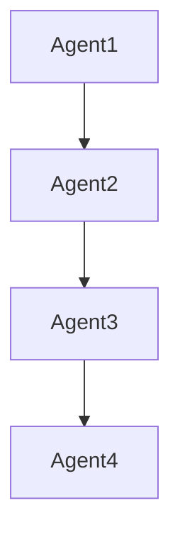
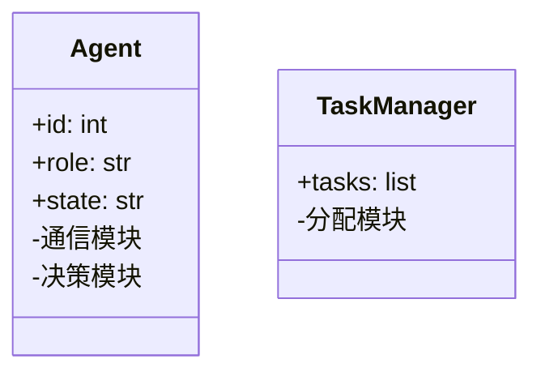
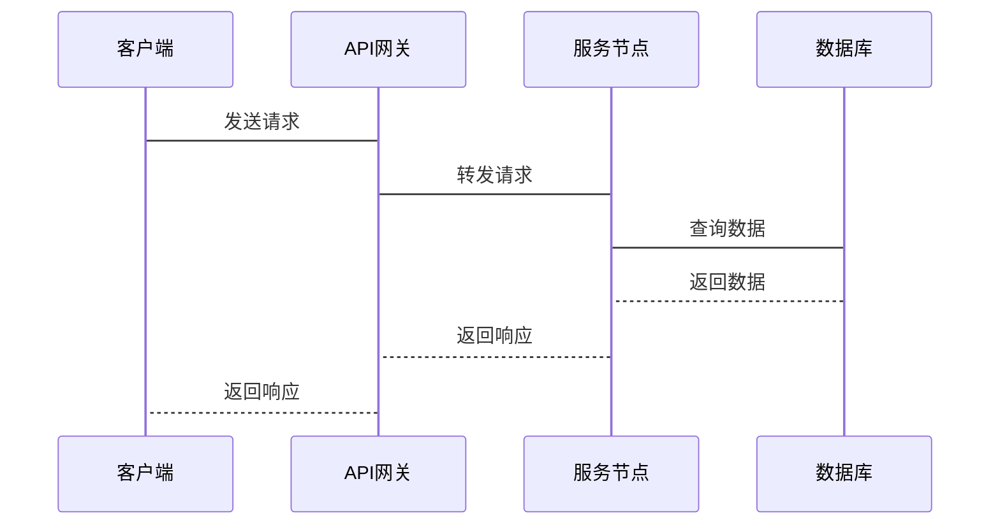

                 


# AI Agent的多Agent协作系统设计

> 关键词：AI Agent，多Agent协作，分布式计算，协商协议，共识机制，系统架构

> 摘要：本文将详细探讨AI Agent的多Agent协作系统设计，涵盖其背景、核心概念、算法原理、系统架构、项目实战及最佳实践。通过逐步分析，我们将理解多Agent协作系统的重要性，掌握其实现方法，并通过实际案例分析其应用。

---

## 第一部分: AI Agent的多Agent协作系统背景

### 第1章: 多Agent协作系统的概念与背景

#### 1.1 多Agent协作系统的背景
多Agent协作系统是人工智能领域的重要组成部分，它通过多个智能体（Agent）协同工作，完成复杂的任务。随着AI技术的发展，多Agent协作系统在分布式计算、机器人协作、智能交通等领域得到广泛应用。

#### 1.2 多Agent协作系统的定义
- **Agent**：智能体，能够感知环境并采取行动以实现目标。
- **多Agent系统**：由多个Agent组成的系统，通过协作完成单一Agent无法完成的任务。

#### 1.3 多Agent协作系统的必要性
- 提高系统的可靠性和容错性。
- 实现复杂的任务分解与协同。

#### 1.4 多Agent协作系统的应用领域
- 分布式计算
- 机器人协作
- 智能交通管理

---

## 第二部分: 多Agent协作系统的核心概念

### 第2章: 多Agent协作系统的核心概念

#### 2.1 多Agent协作系统的原理
- 分布式计算：任务分解与协同。
- 协商协议：Agent之间通信与决策。

#### 2.2 多Agent协作系统的实体关系
- **ER实体关系图**：展示Agent之间的关系和交互。
- **协作流程图**：展示协作过程中的步骤。

```mermaid
erDiagram
    customer {1,many} orders
    orders {1,many} order_items
    customer --> order_items
    order_items --> product
```

#### 2.3 多Agent协作系统的属性特征对比
| 属性 | 描述 |
|------|------|
| 独立性 | Agent独立决策 |
| 协作性 | Agent协作完成任务 |
| 分布式 | 任务分布在多个Agent上 |

---

## 第三部分: 多Agent协作系统的算法原理

### 第3章: 多Agent协作系统的算法实现

#### 3.1 分布式计算
- **定义**：任务分解到多个计算节点。
- **实现**：通过分布式任务分配算法实现。



#### 3.2 协商协议
- **协商协议**：Agent之间通过通信协商达成一致。
- **协商算法**：基于一致性达成共识。

```python
def协商协议(Agent1, Agent2):
    while True:
        消息 = Agent1 发送消息给 Agent2
        if 消息 == "达成一致":
            break
```

#### 3.3 共识机制
- **共识机制**：确保所有Agent达成一致。
- **数学模型**：通过概率论模型实现共识。

$$ P(Agent_i 达成一致) = \sum_{j=1}^{n} P(Agent_j 同意) $$

---

## 第四部分: 多Agent协作系统的架构设计

### 第4章: 多Agent协作系统的架构分析

#### 4.1 系统功能设计
- **功能模块**：任务分配、协作控制、结果汇总。
- **领域模型类图**：展示系统模块划分。



#### 4.2 系统架构设计
- **架构图**：展示系统整体架构。


#### 4.3 系统接口设计
- **RESTful API**：用于Agent间通信。
- **交互序列图**：展示系统交互流程。



---

## 第五部分: 多Agent协作系统的项目实战

### 第5章: 多Agent协作系统的实战应用

#### 5.1 环境安装
- **Python环境**：安装Python和相关库（如Django、Flask）。
- **依赖管理**：使用虚拟环境管理依赖。

```bash
pip install flask
pip install requests
```

#### 5.2 核心功能实现
- **任务分配模块**：实现任务分配逻辑。
- **协作控制模块**：实现Agent间协作控制。

```python
class Agent:
    def __init__(self, id):
        self.id = id
        self.role = "collaborator"
```

#### 5.3 案例分析
- **案例1**：分布式任务处理。
- **案例2**：多Agent协作完成复杂任务。

---

## 第六部分: 多Agent协作系统的总结与展望

### 第6章: 总结与展望

#### 6.1 最佳实践
- **模块化设计**：提高系统的可维护性。
- **测试与调试**：确保系统的稳定性和可靠性。

#### 6.2 小结
多Agent协作系统通过分布式计算和协作协议，实现了复杂任务的高效处理。

#### 6.3 注意事项
- 注意系统的一致性问题。
- 确保系统的安全性和隐私保护。

#### 6.4 拓展阅读
- 推荐书籍：《分布式系统：概念与设计》
- 推荐博客：深入理解分布式系统

---

## 作者：AI天才研究院/AI Genius Institute & 禅与计算机程序设计艺术 /Zen And The Art of Computer Programming

