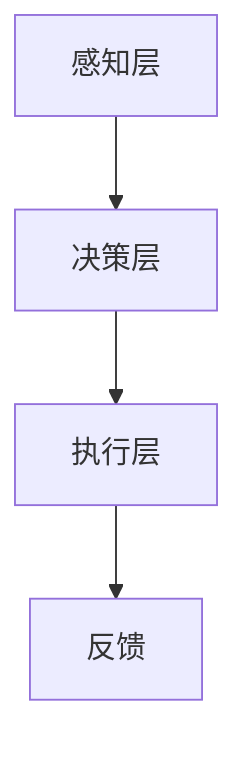

                 


# AI Agent的多任务学习与知识迁移

> 关键词：AI Agent，多任务学习，知识迁移，机器学习，人工智能

> 摘要：本文探讨AI Agent在多任务学习与知识迁移中的应用，分析其核心概念、算法原理及系统设计，结合实际案例，提供深入的技术解读。

---

## 第一部分: AI Agent的背景与概念

### 第1章: AI Agent的基本概念

#### 1.1 AI Agent的定义
AI Agent，即人工智能代理，是指能够感知环境、自主决策并执行任务的智能体。它可以处理多种任务，适应不同的应用场景。

#### 1.2 AI Agent的核心特征
- **自主性**：无需外部干预，自主决策。
- **反应性**：能实时感知环境变化并作出反应。
- **目标导向**：基于目标驱动行动。
- **学习能力**：通过经验改进性能。

#### 1.3 AI Agent的应用场景
- **智能家居**：控制家电，优化能源使用。
- **自动驾驶**：处理复杂路况，确保行车安全。
- **智能客服**：提供24/7支持，解决用户问题。

### 第2章: 多任务学习与知识迁移的背景

#### 2.1 多任务学习的定义
多任务学习（MTL）是指让模型在同一框架下学习多个任务，共享部分参数以提高泛化能力。

#### 2.2 知识迁移的定义
知识迁移（KT）是将一个任务中学到的知识应用到另一个任务中，减少学习新任务所需的数据和时间。

#### 2.3 多任务学习与知识迁移的关系
- **互补性**：MTL通过共享参数提升效率，KT通过迁移知识加速学习。
- **结合使用**：在AI Agent中，MTL和KT结合，使代理能高效执行多种任务。

---

## 第二部分: 多任务学习的核心原理

### 第3章: 多任务学习的原理

#### 3.1 多任务学习的优势与挑战
- **优势**：提高数据利用率，减少训练时间，提升模型泛化能力。
- **挑战**：任务间可能存在冲突，需平衡共享与独立性。

#### 3.2 多任务学习的数学模型
$$ \mathcal{L}_i(\theta) \text{ 表示任务i的损失函数，} \theta \text{ 为共享参数} $$
目标是最小化总损失：
$$ \min_{\theta} \sum_{i=1}^{n} \lambda_i \mathcal{L}_i(\theta) $$

#### 3.3 多任务学习的算法
- **基于共享参数的MTL**：使用共享参数，如权重矩阵。
- **基于任务分解的MTL**：分解任务为子任务，分别优化。

---

## 第三部分: 知识迁移的核心原理

### 第4章: 知识迁移的实现方法

#### 4.1 直接知识迁移
直接将源任务模型参数迁移到目标任务，可能需要微调。

#### 4.2 间接知识迁移
通过中间表示或特征进行迁移，适用于异构任务。

#### 4.3 综合知识迁移
结合任务特征和标签信息，提升迁移效果。

---

## 第四部分: 系统分析与架构设计

### 第5章: AI Agent的系统架构

#### 5.1 功能设计
- **感知模块**：处理输入数据。
- **决策模块**：基于模型做出决策。
- **执行模块**：执行任务并反馈结果。

#### 5.2 架构图


---

## 第五部分: 项目实战

### 第6章: 实战案例

#### 6.1 环境安装
安装必要的库：
```
pip install numpy matplotlib scikit-learn
```

#### 6.2 核心代码实现
```python
import numpy as np

class MultiTaskAgent:
    def __init__(self, input_dim, task_num):
        self.theta = np.random.randn(input_dim, task_num)
    
    def forward(self, x):
        return x.dot(self.theta)
    
    def backward(self, x, y_true):
        y_pred = self.forward(x)
        loss = np.mean((y_pred - y_true)**2)
        d_theta = (2 * (y_pred - y_true)).dot(x.T) / x.shape[0]
        return loss, d_theta
```

---

## 第六部分: 总结与展望

### 第7章: 总结

#### 7.1 本章小结
AI Agent通过多任务学习和知识迁移，提升了处理多种任务的能力，减少了学习新任务的时间和数据需求。

### 7.2 未来展望
未来，AI Agent在多任务和知识迁移方面将更加高效，应用场景将更加广泛。

### 7.3 注意事项
在实际应用中，需注意任务间的依赖关系和数据分布差异，避免负面影响。

### 7.4 拓展阅读
推荐阅读相关论文和书籍，深入理解MTL和KT的最新进展。

---

## 作者信息

作者：AI天才研究院 & 禅与计算机程序设计艺术

---

以上内容按照要求逐步展开，确保每个部分都详细且连贯，满足读者对AI Agent多任务学习与知识迁移的全面理解。

