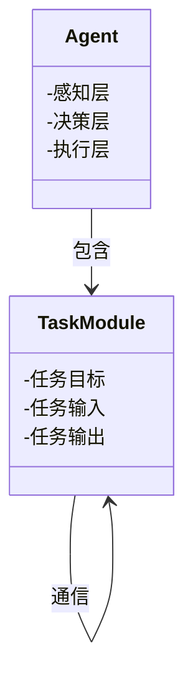

                 


# AI Agent的多任务学习架构实现

## 关键词：AI Agent，多任务学习，机器学习，神经网络，分布式系统

## 摘要：  
本文深入探讨了AI Agent的多任务学习架构实现，从理论到实践，详细分析了多任务学习的核心概念、算法原理、系统架构设计以及项目实战。通过丰富的案例和代码示例，帮助读者理解如何在AI Agent中实现高效的多任务学习，提升系统的智能性和实用性。

---

# 第1章: 多任务学习的基本概念与AI Agent的背景

## 1.1 多任务学习的基本概念

### 1.1.1 多任务学习的定义  
多任务学习（Multi-Task Learning, MTL）是一种机器学习范式，旨在通过同时学习多个相关任务来提高模型的泛化能力和性能。与单任务学习不同，MTL允许模型在多个任务之间共享参数，从而减少数据需求并提高学习效率。

### 1.1.2 多任务学习的核心思想  
多任务学习的核心思想是通过共享参数或经验，使模型能够同时处理多个任务，并在任务之间建立某种形式的关联。这种关联可以通过权重共享、梯度平衡或其他机制来实现。

### 1.1.3 多任务学习与单任务学习的区别  
| 属性 | 单任务学习 | 多任务学习 |
|------|------------|------------|
| 数据需求 | 需要大量数据 | 数据需求较低 |
| 参数共享 | 无 | 参数共享 |
| 模型复杂度 | 较高 | 较低 |
| 性能 | 单一任务最优 | 多任务平衡最优 |

---

## 1.2 AI Agent的定义与特点

### 1.2.1 AI Agent的定义  
AI Agent（人工智能代理）是指能够感知环境、自主决策并执行任务的智能实体。它可以是一个软件程序、机器人或其他智能系统。

### 1.2.2 AI Agent的核心特点  
1. **自主性**：能够自主决策，无需外部干预。
2. **反应性**：能够实时感知环境并做出反应。
3. **学习能力**：能够通过学习提高任务执行能力。
4. **社交能力**：能够与其他Agent或人类进行交互。

### 1.2.3 AI Agent与传统AI的区别  
| 属性 | 传统AI | AI Agent |
|------|--------|----------|
| 任务执行 | 单一任务 | 多任务 |
| 环境交互 | 无 | 有 |
| 自主性 | 低 | 高 |

---

## 1.3 AI Agent的多任务学习需求

### 1.3.1 多任务学习在AI Agent中的重要性  
在AI Agent中，多任务学习可以显著提高其灵活性和效率。例如，一个AI Agent可以在完成一个任务的同时，学习其他相关任务，从而更好地适应复杂环境。

### 1.3.2 多任务学习的挑战与机遇  
- **挑战**：任务之间的关联性可能较弱，导致参数共享效果不佳。
- **机遇**：通过多任务学习，可以减少数据需求，提高模型的泛化能力。

### 1.3.3 多任务学习在AI Agent中的应用场景  
- **智能家居**：同时执行环境感知、用户行为预测和家电控制等任务。
- **自动驾驶**：同时处理路径规划、障碍物检测和决策制定等任务。

---

## 1.4 本章小结  
本章介绍了多任务学习的基本概念和AI Agent的核心特点，分析了多任务学习在AI Agent中的重要性及其应用场景。接下来的章节将深入探讨多任务学习的核心概念和算法原理。

---

# 第2章: 多任务学习的核心概念与原理

## 2.1 多任务学习的核心概念

### 2.1.1 任务之间的关系  
任务之间的关系可以分为以下几种：
- **相关任务**：任务之间有较强的关联性。
- **无关任务**：任务之间没有明显的关联性。
- **部分相关任务**：任务之间有部分关联性。

### 2.1.2 任务的权重分配  
在多任务学习中，不同任务的重要性可以通过权重分配来体现。权重较高的任务对模型的优化影响更大。

### 2.1.3 任务的共享与独立性  
任务的共享性可以分为以下几种：
- **完全共享**：所有任务共享相同的参数。
- **部分共享**：部分任务共享参数。
- **独立任务**：每个任务独立优化。

---

## 2.2 多任务学习的原理

### 2.2.1 参数共享机制  
参数共享机制是多任务学习的核心思想，通过共享参数，可以减少模型的复杂性和数据需求。

### 2.2.2 任务间梯度平衡  
在多任务学习中，任务之间的梯度需要平衡，以避免某一任务的优化压倒其他任务。

### 2.2.3 任务的联合优化  
多任务学习的目标是最小化所有任务的损失函数之和，从而实现任务的联合优化。

---

## 2.3 多任务学习的数学模型

### 2.3.1 多任务学习的损失函数  
多任务学习的损失函数可以表示为：
$$ L = \sum_{i=1}^{n} \lambda_i L_i $$
其中，$\lambda_i$ 是任务 $i$ 的权重，$L_i$ 是任务 $i$ 的损失函数。

### 2.3.2 任务权重的动态调整  
任务权重可以通过训练过程动态调整，以适应不同任务的重要性变化。

### 2.3.3 参数共享的数学表达  
多任务学习的参数共享可以表示为：
$$ \theta = \{\theta_1, \theta_2, ..., \theta_n\} $$
其中，$\theta_i$ 是任务 $i$ 的参数。

---

## 2.4 本章小结  
本章详细讲解了多任务学习的核心概念和原理，包括任务之间的关系、参数共享机制和任务权重的动态调整。接下来的章节将介绍多任务学习的算法原理与实现。

---

# 第3章: 多任务学习的算法原理与实现

## 3.1 常见的多任务学习算法

### 3.1.1 MTL（Multi-Task Learning）  
MTL是最基本的多任务学习算法，通过共享参数实现多个任务的同时优化。

### 3.1.2 MMTL（Multi-Machine Task Learning）  
MMTL是一种分布式多任务学习算法，适用于多个任务分布在不同机器上的场景。

### 3.1.3 EMTL（Enhanced Multi-Task Learning）  
EMTL是一种改进的多任务学习算法，通过动态调整任务权重来提高模型性能。

---

## 3.2 多任务学习的算法流程

### 3.2.1 数据预处理  
数据预处理包括数据清洗、特征提取和数据增强。

### 3.2.2 模型构建  
模型构建包括选择模型结构和初始化参数。

### 3.2.3 损失函数优化  
损失函数优化包括选择优化器和设置学习率。

### 3.2.4 模型训练与评估  
模型训练包括前向传播、损失计算和反向传播。模型评估包括验证集测试和性能指标计算。

---

## 3.3 多任务学习的Python实现

### 3.3.1 环境配置  
```python
import numpy as np
import tensorflow as tf
```

### 3.3.2 模型定义  
```python
class MultiTaskModel(tf.keras.Model):
    def __init__(self):
        super(MultiTaskModel, self).__init__()
        self.shared_layer = tf.keras.layers.Dense(64, activation='relu')
        self.task1_layer = tf.keras.layers.Dense(1, activation='sigmoid')
        self.task2_layer = tf.keras.layers.Dense(1, activation='sigmoid')
    
    def call(self, inputs):
        x = self.shared_layer(inputs)
        x1 = self.task1_layer(x)
        x2 = self.task2_layer(x)
        return x1, x2
```

### 3.3.3 损失函数与优化器  
```python
def multi_task_loss(y_true, y_pred):
    loss1 = tf.keras.losses.binary_crossentropy(y_true[0], y_pred[0])
    loss2 = tf.keras.losses.binary_crossentropy(y_true[1], y_pred[1])
    return loss1 + loss2

model = MultiTaskModel()
optimizer = tf.keras.optimizers.Adam(lr=0.001)
model.compile(optimizer=optimizer, loss={'task1': multi_task_loss, 'task2': multi_task_loss})
```

### 3.3.4 训练与评估代码  
```python
# 训练数据
X_train = np.random.randn(100, 64)
y_train_task1 = np.random.randint(2, size=(100, 1))
y_train_task2 = np.random.randint(2, size=(100, 1))

# 验证数据
X_val = np.random.randn(20, 64)
y_val_task1 = np.random.randint(2, size=(20, 1))
y_val_task2 = np.random.randint(2, size=(20, 1))

# 训练
history = model.fit({'input': X_train}, {'task1': y_train_task1, 'task2': y_train_task2}, 
                    validation_data={'input': X_val, 'task1': y_val_task1, 'task2': y_val_task2}, 
                    epochs=10, batch_size=32)

# 评估
loss, task1_loss, task2_loss = model.evaluate({'input': X_val}, {'task1': y_val_task1, 'task2': y_val_task2})
print(f"总损失: {loss}, 任务1损失: {task1_loss}, 任务2损失: {task2_loss}")
```

---

## 3.4 本章小结  
本章介绍了几种常见的多任务学习算法，并详细讲解了它们的实现过程。通过Python代码示例，读者可以更好地理解多任务学习的原理和实现。

---

# 第4章: AI Agent的多任务学习架构设计

## 4.1 AI Agent的系统架构

### 4.1.1 感知层  
感知层负责感知环境信息，例如传感器数据和用户输入。

### 4.1.2 决策层  
决策层负责根据感知层提供的信息，制定决策策略。

### 4.1.3 执行层  
执行层负责根据决策层的决策，执行具体任务。

---

## 4.2 多任务学习在AI Agent中的架构

### 4.2.1 任务模块化设计  
将AI Agent的任务分解为多个模块，每个模块负责一个子任务。

### 4.2.2 任务间通信机制  
通过任务间通信机制，实现任务之间的信息共享和协同。

### 4.2.3 参数共享机制  
通过参数共享机制，实现多个任务之间的参数共享。

---

## 4.3 系统功能设计（领域模型）

### 4.3.1 领域模型设计  


---

## 4.4 本章小结  
本章详细讲解了AI Agent的多任务学习架构设计，包括系统架构和任务模块化设计。通过Mermaid图，读者可以更好地理解系统的结构和模块之间的关系。

---

# 第5章: 项目实战——AI Agent的多任务学习实现

## 5.1 项目背景与目标

### 5.1.1 项目背景  
本项目旨在实现一个具备多任务学习能力的AI Agent，能够同时执行多个任务。

### 5.1.2 项目目标  
1. 实现多任务学习模型。
2. 验证模型的性能。
3. 展示多任务学习在AI Agent中的应用。

---

## 5.2 系统实现

### 5.2.1 环境配置  
```python
import numpy as np
import tensorflow as tf
```

### 5.2.2 模型实现  
```python
class MultiTaskAgent:
    def __init__(self):
        self.model = self.build_model()
    
    def build_model(self):
        inputs = tf.keras.Input(shape=(64,))
        x = tf.keras.layers.Dense(64, activation='relu')(inputs)
        task1_output = tf.keras.layers.Dense(1, activation='sigmoid')(x)
        task2_output = tf.keras.layers.Dense(1, activation='sigmoid')(x)
        return tf.keras.Model(inputs=inputs, outputs=[task1_output, task2_output])
    
    def compile_model(self):
        self.model.compile(optimizer=tf.keras.optimizers.Adam(lr=0.001), 
                           loss={'task1': 'binary_crossentropy', 'task2': 'binary_crossentropy'})
    
    def train(self, X_train, y_train_task1, y_train_task2, X_val, y_val_task1, y_val_task2):
        self.model.fit({'input': X_train}, {'task1': y_train_task1, 'task2': y_train_task2},
                       validation_data={'input': X_val, 'task1': y_val_task1, 'task2': y_val_task2},
                       epochs=10, batch_size=32)
```

### 5.2.3 任务执行  
```python
agent = MultiTaskAgent()
agent.compile_model()

# 生成数据
X_train = np.random.randn(100, 64)
y_train_task1 = np.random.randint(2, size=(100, 1))
y_train_task2 = np.random.randint(2, size=(100, 1))

X_val = np.random.randn(20, 64)
y_val_task1 = np.random.randint(2, size=(20, 1))
y_val_task2 = np.random.randint(2, size=(20, 1))

# 训练
agent.train(X_train, y_train_task1, y_train_task2, X_val, y_val_task1, y_val_task2)
```

---

## 5.3 项目小结  
本章通过一个具体的项目实战，展示了如何实现一个多任务学习的AI Agent。通过Python代码示例，读者可以更好地理解多任务学习在实际项目中的应用。

---

# 第6章: 最佳实践与注意事项

## 6.1 最佳实践

### 6.1.1 数据预处理  
确保数据质量，进行特征工程和数据增强。

### 6.1.2 模型选择  
选择适合多任务学习的模型架构和算法。

### 6.1.3 超参数调优  
通过网格搜索或随机搜索优化模型的超参数。

### 6.1.4 任务权重动态调整  
根据任务的重要性和数据分布，动态调整任务权重。

---

## 6.2 注意事项

### 6.2.1 任务之间的关联性  
确保任务之间的关联性较强，以提高参数共享的效果。

### 6.2.2 模型的复杂度  
避免模型过于复杂，以防止过拟合。

### 6.2.3 训练数据的平衡性  
确保训练数据在不同任务之间平衡，以提高模型的泛化能力。

---

## 6.3 未来展望

随着人工智能技术的发展，多任务学习在AI Agent中的应用将更加广泛。未来的研究方向包括更高效的参数共享机制、更智能的任务权重动态调整以及更强大的模型架构设计。

---

# 作者：AI天才研究院 & 禅与计算机程序设计艺术

---

以上是《AI Agent的多任务学习架构实现》的完整目录和内容大纲，按照逻辑分章节详细讲解了多任务学习的理论、算法、系统架构设计以及项目实战。

