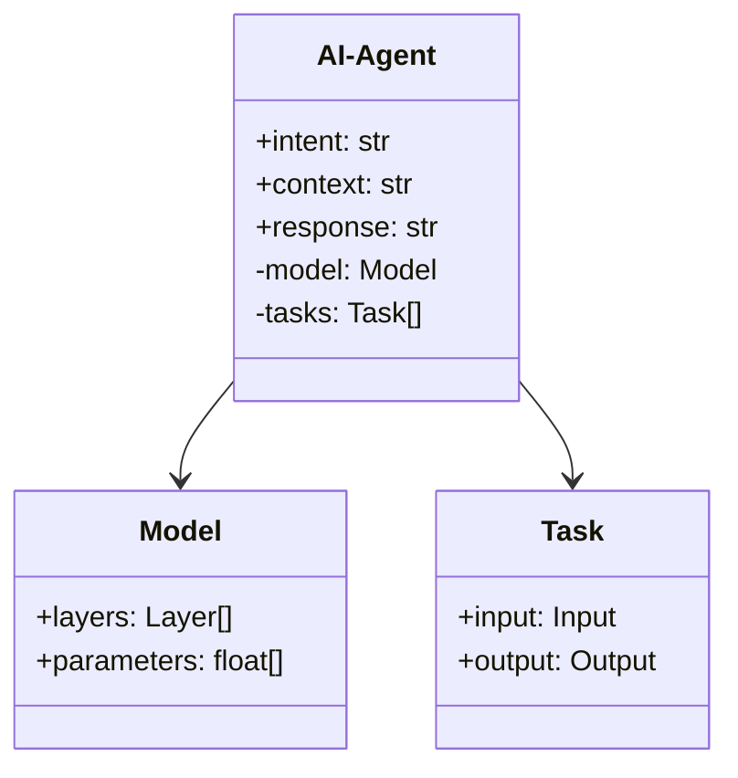

                 


# AI Agent的多任务学习：构建通用智能助手

---

## 关键词：
AI Agent，多任务学习，通用智能助手，机器学习，深度学习

---

## 摘要：
本文探讨AI Agent的多任务学习方法，介绍如何通过多任务学习构建通用智能助手。文章从AI Agent的基本概念和多任务学习的背景出发，深入分析其核心原理、算法实现、系统架构，并通过实际案例展示多任务学习的应用。最后，本文总结了多任务学习在构建通用智能助手中的挑战与未来发展方向。

---

## 目录大纲：

1. **AI Agent的定义与应用**
   - 1.1 AI Agent的基本概念
   - 1.2 多任务学习的背景与意义

2. **多任务学习的核心概念与原理**
   - 2.1 多任务学习的基本原理
   - 2.2 多任务学习的挑战与解决方案

3. **多任务学习的算法与实现**
   - 3.1 基于深度学习的多任务学习算法
   - 3.2 权重共享机制与任务间梯度平衡

4. **系统架构与设计**
   - 4.1 问题场景与系统功能设计
   - 4.2 系统架构设计与实现

5. **项目实战：构建通用智能助手**
   - 5.1 项目环境与工具安装
   - 5.2 系统核心代码实现
   - 5.3 实际案例分析与解读

6. **总结与展望**
   - 6.1 本文总结
   - 6.2 多任务学习的挑战与未来方向
   - 6.3 最佳实践与注意事项
   - 6.4 拓展阅读与推荐资源

---

## 正文内容：

### 第1章：AI Agent的定义与应用

#### 1.1 AI Agent的基本概念

AI Agent，即人工智能代理，是一种能够感知环境、执行任务并做出决策的智能实体。它能够通过传感器获取信息，利用计算模型进行分析，并通过执行器与环境交互。AI Agent的核心特征包括自主性、反应性、目标导向和社会能力。

- **自主性**：AI Agent能够独立运作，无需外部干预。
- **反应性**：能够实时感知环境并做出响应。
- **目标导向**：通过设定目标来驱动行为。
- **社会能力**：能够与其他AI Agent或人类进行交互协作。

AI Agent的应用广泛，包括智能助手、推荐系统、自动驾驶、机器人控制等。例如，智能助手（如Siri、Alexa）通过多任务学习技术，能够执行语音识别、自然语言理解、信息检索等任务。

#### 1.2 多任务学习的背景与意义

多任务学习（Multi-Task Learning, MTL）是一种机器学习范式，旨在在一个统一的模型中学习多个相关任务。通过共享模型参数，MTL可以提高模型的泛化能力，减少数据需求，提高训练效率。

多任务学习在AI Agent中的应用尤为重要。AI Agent需要执行多种任务，如信息检索、任务规划、决策优化等。通过多任务学习，AI Agent可以共享知识和经验，提升整体性能。

---

### 第2章：多任务学习的核心概念与原理

#### 2.1 多任务学习的基本原理

多任务学习的核心思想是通过共享参数来学习多个任务。每个任务都有自己的输入和输出，但共享一个基础模型。通过这种方式，模型可以提取任务间的共同特征，减少过拟合，提高泛化能力。

**任务建模**：在多任务学习中，每个任务定义为一个函数$f_i: X_i \rightarrow Y_i$，其中$X_i$是输入空间，$Y_i$是输出空间。模型需要同时学习所有任务的函数。

**权重共享机制**：多任务模型通过共享部分权重来实现任务间的关联。例如，深度学习模型可以通过共享某些层的参数来学习多个任务。

#### 2.2 多任务学习的挑战与解决方案

**挑战**：
1. **任务不平衡**：某些任务的数据量较少，可能影响模型性能。
2. **任务干扰**：任务间可能存在相互干扰，导致模型难以同时优化所有任务。
3. **计算复杂度**：多任务学习可能增加计算开销。

**解决方案**：
1. **任务权重调整**：通过动态调整任务权重，优先优化重要任务。
2. **任务 gating机制**：引入 gating 模块，根据任务需求动态调整参数。
3. **参数分离**：在共享层下，为每个任务增加独立层，以减少任务间干扰。

---

### 第3章：多任务学习的算法与实现

#### 3.1 基于深度学习的多任务学习算法

多任务学习的实现通常基于深度学习框架，如TensorFlow和PyTorch。以下是多任务学习的常见算法：

**MTL（Multi-Task Learning）**：直接共享模型参数，通过联合损失函数优化多个任务。

**HAT（Hessian-Aided Training）**：通过优化任务间梯度，减少任务干扰。

**EAT（Error-Aware Training）**：通过检测任务错误，动态调整任务权重。

**MT-DNN（Multi-Task Deep Neural Network）**：多任务深度神经网络，通过共享和分离层实现任务间协作。

#### 3.2 权重共享机制与任务间梯度平衡

在多任务学习中，权重共享机制是关键。以下是MTL的数学模型：

$$L = \sum_{i=1}^{n} \lambda_i L_i$$

其中，$L_i$是任务$i$的损失函数，$\lambda_i$是任务$i$的权重系数。

任务间梯度平衡通过调整权重系数$\lambda_i$，使每个任务的梯度贡献均衡。

---

### 第4章：系统架构与设计

#### 4.1 问题场景与系统功能设计

在构建通用智能助手时，系统需要执行多个任务，如：

1. **自然语言理解**：通过NLU模块解析用户意图。
2. **信息检索**：从知识库中检索相关信息。
3. **对话生成**：生成自然语言回复。

**领域模型**：通过领域模型（见下图）定义系统功能。



#### 4.2 系统架构设计与实现

**分层架构**：系统分为感知层、决策层和执行层。


**接口设计**：通过RESTful API实现模块间的通信。

---

### 第5章：项目实战：构建通用智能助手

#### 5.1 项目环境与工具安装

- **环境要求**：Python 3.8及以上，TensorFlow 2.0及以上。
- **工具安装**：
  ```bash
  pip install numpy
  pip install tensorflow
  pip install matplotlib
  ```

#### 5.2 系统核心代码实现

以下是多任务学习模型的代码示例：

```python
import tensorflow as tf
import numpy as np

# 定义多任务模型
class MTLModel(tf.keras.Model):
    def __init__(self, num_tasks=3):
        super().__init__()
        self.num_tasks = num_tasks
        self.shared_layer = tf.keras.layers.Dense(64, activation='relu')
        self.task_layers = [tf.keras.layers.Dense(1, activation='sigmoid') for _ in range(num_tasks)]

    def call(self, inputs):
        x = self.shared_layer(inputs)
        outputs = []
        for i in range(self.num_tasks):
            outputs.append(self.task_layers[i](x))
        return outputs

# 初始化模型
model = MTLModel(num_tasks=3)

# 编译模型
model.compile(optimizer=tf.keras.optimizers.Adam(learning_rate=0.001),
              loss={'task_0': 'binary_crossentropy', 'task_1': 'binary_crossentropy', 'task_2': 'binary_crossentropy'},
              loss_weights=[0.3, 0.3, 0.4])
```

#### 5.3 实际案例分析与解读

通过训练数据，模型可以同时优化多个任务的损失函数。例如，在智能助手中，模型可以同时优化语音识别和自然语言理解任务。

---

### 第6章：总结与展望

#### 6.1 本文总结

本文系统介绍了AI Agent的多任务学习方法，详细讲解了多任务学习的核心概念、算法实现和系统架构。通过实际案例展示了多任务学习在构建通用智能助手中的应用。

#### 6.2 多任务学习的挑战与未来方向

尽管多任务学习在提高模型性能方面取得了显著进展，但仍面临任务不平衡、计算复杂度高等挑战。未来，可以通过动态任务 gating机制和任务优先级调整等方法进一步优化。

#### 6.3 最佳实践与注意事项

- **任务选择**：选择相关性高的任务，避免任务间干扰。
- **数据平衡**：通过数据增强和采样方法平衡任务数据。
- **模型选择**：根据任务需求选择合适的模型架构。

#### 6.4 拓展阅读与推荐资源

- [《Deep Learning》 - Ian Goodfellow](https://www.deeplearningbook.org/)
- [《Multi-Task Learning》 - 谢金星](https://zh.wikipedia.org/wiki/多任务学习)

---

## 作者：AI天才研究院 & 禅与计算机程序设计艺术

