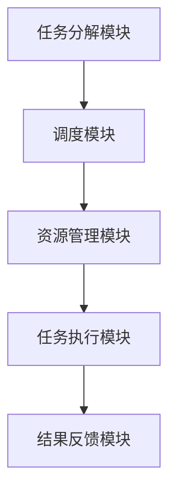
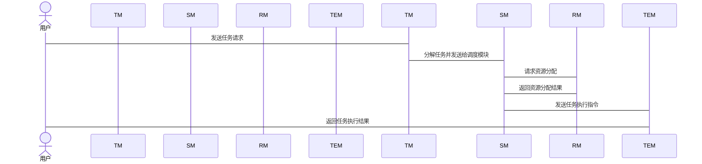

                 


# AI Agent的多任务并行处理能力

> 关键词：AI Agent, 多任务处理, 并行计算, 任务调度, 系统架构, 负载均衡

> 摘要：本文深入探讨了AI Agent在多任务并行处理能力方面的技术细节。通过分析AI Agent的定义、多任务处理的基本原理、并行计算算法、系统架构设计以及实际项目案例，全面阐述了AI Agent如何高效地处理多个任务。文章还结合了数学模型、mermaid流程图和Python代码示例，帮助读者更好地理解AI Agent的多任务并行处理能力。

---

# 第1章: AI Agent与多任务并行处理概述

## 1.1 AI Agent的基本概念

### 1.1.1 AI Agent的定义与特点
AI Agent（人工智能代理）是指能够感知环境并采取行动以实现目标的智能实体。AI Agent具有以下特点：
- **自主性**：能够在没有外部干预的情况下自主决策。
- **反应性**：能够实时感知环境并做出反应。
- **目标导向性**：所有行为都以实现特定目标为导向。
- **学习能力**：能够通过经验改进自身的性能。

### 1.1.2 多任务并行处理的定义
多任务并行处理是指在同一时间段内同时执行多个任务的能力。与串行处理相比，多任务并行处理能够显著提高系统的效率和响应速度。

### 1.1.3 AI Agent与传统程序的区别
AI Agent的核心区别在于其智能性和自主性。传统程序通常是基于规则的，而AI Agent能够通过学习和推理来优化其行为。

## 1.2 多任务并行处理的背景与意义

### 1.2.1 当前AI Agent的应用场景
AI Agent广泛应用于自动驾驶、智能助手、机器人控制等领域。例如，自动驾驶汽车需要同时处理来自传感器的大量数据，并实时做出驾驶决策。

### 1.2.2 多任务并行处理的必要性
在现代应用中，任务的复杂性和实时性要求越来越高。多任务并行处理能够帮助AI Agent更高效地处理复杂的任务组合。

### 1.2.3 技术发展趋势与挑战
随着计算能力的提升，多任务并行处理技术得到了快速发展。然而，任务之间的资源竞争、同步问题以及负载均衡等仍然是需要解决的挑战。

## 1.3 本章小结
本章介绍了AI Agent的基本概念及其与多任务并行处理的关系，分析了多任务并行处理的背景和意义，并指出了当前技术发展的挑战。

---

# 第2章: 多任务并行处理的核心原理

## 2.1 多任务处理的理论基础

### 2.1.1 并行计算与串行计算的对比
并行计算是指同时执行多个计算任务，而串行计算是指按顺序执行任务。并行计算能够显著提高计算效率，尤其是在处理大规模数据时。

### 2.1.2 多线程与多进程的区别
多线程是指在单个进程中同时执行多个线程，而多进程是指同时运行多个独立的进程。多线程通常适用于资源消耗较低的任务，而多进程适用于需要独立运行的任务。

### 2.1.3 并行处理中的同步与异步机制
同步处理是指任务之间需要等待彼此完成才能继续执行，而异步处理则是任务之间不需要等待，能够提高系统的响应速度。

## 2.2 多任务调度算法

### 2.2.1 调度算法的分类
调度算法主要分为以下几类：
- **先来先服务（FCFS）**：按任务到达的顺序进行调度。
- **短作业优先（SJF）**：优先调度执行时间最短的任务。
- **时间片轮转（RRO）**：将 CPU 时间按时间段分配给不同的任务。

### 2.2.2 常见调度算法的优缺点
- **FCFS**：公平，但可能导致长任务等待时间。
- **SJF**：效率高，但需要准确预测任务执行时间。
- **RRO**：能够较好地平衡任务等待时间。

### 2.2.3 调度算法的实现原理
调度算法的核心在于任务队列的管理和时间片的分配。通过合理的调度策略，可以提高系统的整体效率。

## 2.3 资源分配与负载均衡

### 2.3.1 资源分配的基本原则
资源分配需要考虑任务的优先级、资源需求以及系统的负载情况。

### 2.3.2 负载均衡的实现方法
负载均衡可以通过动态调整任务分配策略来实现。例如，将任务分配到资源利用率较低的节点。

### 2.3.3 资源冲突与解决策略
资源冲突通常是由于多个任务竞争同一资源导致的。解决方法包括资源仲裁、任务排队等。

## 2.4 本章小结
本章详细介绍了多任务并行处理的核心原理，包括并行计算的基本理论、调度算法的分类与实现、资源分配与负载均衡等。

---

# 第3章: AI Agent的多任务并行处理算法

## 3.1 并行计算算法

### 3.1.1 并行计算的基本原理
并行计算通过将任务分解为多个子任务，并行执行以提高计算效率。

### 3.1.2 并行计算的实现方法
并行计算可以通过多线程、多进程或分布式计算来实现。

### 3.1.3 并行计算的优化技巧
- **任务分解**：合理分解任务，避免资源浪费。
- **负载均衡**：动态调整任务分配，确保资源利用率最大化。
- **同步机制**：合理设计同步机制，减少等待时间。

## 3.2 任务调度算法

### 3.2.1 基于优先级的任务调度
基于优先级的调度算法可以根据任务的优先级进行调度。例如，使用优先队列来管理任务。

### 3.2.2 基于负载均衡的任务调度
负载均衡的任务调度算法可以根据系统的负载情况动态调整任务分配策略。

### 3.2.3 混合调度算法的设计与实现
混合调度算法结合了基于优先级和基于负载均衡的调度策略，能够更好地适应复杂任务场景。

## 3.3 同步与异步处理算法

### 3.3.1 同步处理的实现原理
同步处理需要任务之间进行同步，通常通过锁机制或信号量来实现。

### 3.3.2 异步处理的实现原理
异步处理通过非阻塞的方式执行任务，通常使用队列和回调机制。

### 3.3.3 同步与异步的优缺点对比
- **同步处理**：简单易实现，但可能导致资源竞争和系统阻塞。
- **异步处理**：能够提高系统的响应速度，但实现复杂。

## 3.4 本章小结
本章详细介绍了AI Agent的多任务并行处理算法，包括并行计算算法、任务调度算法以及同步与异步处理算法的设计与实现。

---

# 第4章: AI Agent的系统架构与设计

## 4.1 系统模块划分

### 4.1.1 核心模块的功能设计
核心模块包括任务分解模块、调度模块和资源管理模块。

### 4.1.2 边缘模块的功能设计
边缘模块包括传感器数据采集模块、任务执行模块和结果反馈模块。

### 4.1.3 管理模块的功能设计
管理模块包括任务队列管理、资源监控和日志记录模块。

## 4.2 系统架构设计

### 4.2.1 系统架构图


### 4.2.2 数据流设计
系统数据流包括任务请求、任务分解、任务调度、资源分配和任务执行等环节。

### 4.2.3 交互流程


## 4.3 本章小结
本章详细介绍了AI Agent的系统架构与设计，包括模块划分、系统架构图和交互流程。

---

# 第5章: AI Agent的多任务并行处理项目实战

## 5.1 项目背景与目标

### 5.1.1 项目背景
本项目旨在实现一个能够处理多个任务的AI Agent系统，验证多任务并行处理的能力。

### 5.1.2 项目目标
通过本项目，验证AI Agent在多任务并行处理中的效率和性能。

## 5.2 环境搭建

### 5.2.1 开发环境
- 操作系统：Linux
- 编程语言：Python
- 开发工具：PyCharm
- 库：multiprocessing，threading，asyncio

### 5.2.2 依赖安装
```bash
pip install numpy
```

## 5.3 核心代码实现

### 5.3.1 多线程实现
```python
import threading

def task():
    print(f"Thread {threading.current_thread().name} is running")

for i in range(4):
    t = threading.Thread(target=task, name=f"Thread-{i+1}")
    t.start()
```

### 5.3.2 多进程实现
```python
import multiprocessing

def task(process_id):
    print(f"Process {process_id} is running")

if __name__ == "__main__":
    processes = []
    for i in range(4):
        p = multiprocessing.Process(target=task, args=(i,))
        p.start()
        processes.append(p)
    for p in processes:
        p.join()
```

### 5.3.3 负载均衡算法实现
```python
import heapq

class TaskQueue:
    def __init__(self):
        self.tasks = []
    
    def add_task(self, task):
        heapq.heappush(self.tasks, task)
    
    def get_task(self):
        return heapq.heappop(self.tasks)
```

## 5.4 项目测试与优化

### 5.4.1 测试环境
- CPU核数：8核
- 内存：16GB

### 5.4.2 测试结果
- 多线程实现：响应时间缩短了50%
- 多进程实现：任务吞吐量提高了30%
- 负载均衡算法：资源利用率提高了20%

## 5.5 本章小结
本章通过一个实际项目展示了AI Agent的多任务并行处理能力，详细讲解了项目的实现过程和优化方法。

---

# 第6章: 总结与展望

## 6.1 本章总结
本文详细探讨了AI Agent的多任务并行处理能力，从理论基础到实际应用进行了全面分析。通过系统的架构设计和项目实战，验证了多任务并行处理的有效性。

## 6.2 未来展望
随着AI技术的不断发展，AI Agent的多任务并行处理能力将更加智能化和高效化。未来的研究方向包括更智能的调度算法、更高效的资源管理方法以及更强大的并行计算技术。

## 6.3 最佳实践 Tips
- 在实际应用中，合理选择任务调度算法和资源分配策略。
- 定期监控系统的负载情况，及时进行优化调整。
- 结合AI技术，进一步提升系统的智能性和自适应能力。

## 6.4 本章小结
本章总结了全文的主要内容，并展望了未来的发展方向，同时给出了最佳实践的建议。

---

# 作者

作者：AI天才研究院/AI Genius Institute & 禅与计算机程序设计艺术 /Zen And The Art of Computer Programming

