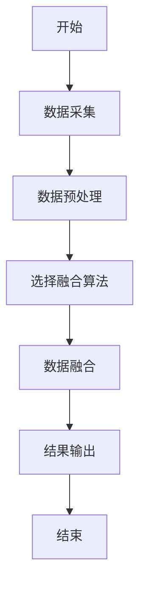
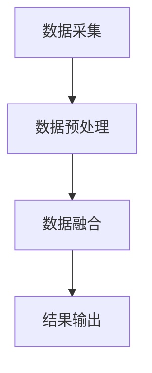
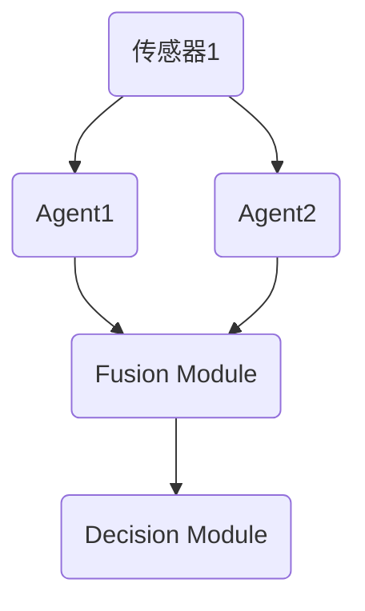

                 


# AI Agent的多传感器数据融合技术

> **关键词**: AI Agent, 多传感器数据融合, 数据融合, 传感器数据, 融合算法  
> 
> **摘要**:  
> 本文深入探讨了AI Agent的多传感器数据融合技术，从基本概念、核心算法到系统架构和项目实战，全面解析了如何通过多传感器数据融合提升AI Agent的感知能力和决策效率。文章首先介绍了多传感器数据融合的基本概念和AI Agent的核心概念，然后详细分析了数据融合的原理、算法和数学模型，接着通过系统架构设计和项目实战展示了如何将理论应用于实际系统中。最后，文章总结了多传感器数据融合技术的关键点，并展望了未来的研究方向。

---

## 第1章: 多传感器数据融合技术概述

### 1.1 多传感器数据融合的基本概念

#### 1.1.1 多传感器数据融合的定义  
多传感器数据融合（Multi-sensor Data Fusion）是指将来自多个传感器的数据进行处理、组合和分析，以提高信息的准确性和可靠性的技术。它通过整合不同传感器的观测数据，消除单一传感器的局限性，从而获得更全面的环境感知能力。

#### 1.1.2 数据融合的分类与特点  
数据融合可以分为以下几类：  
1. **数据级融合**：在原始数据层面进行融合，通常用于提高数据的准确性。  
2. **特征级融合**：在特征提取后进行融合，适用于不同传感器的数据类型差异较大的场景。  
3. **决策级融合**：在最终决策层面进行融合，适用于需要综合判断的场景。  

其特点包括：  
- **互补性**：不同传感器的观测数据可以相互补充，弥补单一传感器的不足。  
- **鲁棒性**：通过融合多源数据，系统能够更好地应对噪声和不确定性。  
- **实时性**：数据融合技术需要在实时或近实时范围内完成，以满足AI Agent的快速响应需求。  

#### 1.1.3 数据融合技术的应用领域  
数据融合技术广泛应用于以下领域：  
- **自动驾驶**：通过融合摄像头、激光雷达、雷达等传感器数据，提高车辆的环境感知能力。  
- **机器人技术**：通过融合IMU、GPS、视觉传感器等数据，提升机器人的运动规划和导航能力。  
- **智能安防**：通过融合视频监控、红外传感器、声音识别等数据，实现更智能的安防系统。  
- **工业自动化**：通过融合多种传感器数据，优化生产流程和设备控制。  

### 1.2 AI Agent的基本概念

#### 1.2.1 AI Agent的定义与特点  
AI Agent（人工智能代理）是指能够感知环境、自主决策并执行任务的智能实体。它具有以下特点：  
- **自主性**：能够在没有外部干预的情况下自主完成任务。  
- **反应性**：能够实时感知环境并做出响应。  
- **主动性**：能够主动采取行动以实现目标。  
- **社会性**：能够与其他Agent或人类进行交互和协作。  

#### 1.2.2 AI Agent的体系结构  
AI Agent的体系结构通常包括以下模块：  
- **感知模块**：负责从环境中获取信息，如视觉、听觉、触觉等传感器数据。  
- **推理模块**：负责对感知数据进行分析和推理，形成对环境的理解。  
- **决策模块**：基于推理结果，制定行动计划。  
- **执行模块**：将决策结果转化为具体行动。  

#### 1.2.3 AI Agent与多传感器数据融合的关系  
AI Agent的感知能力依赖于多传感器数据融合技术。通过融合来自不同传感器的数据，AI Agent能够更全面地理解环境，从而做出更准确的决策。多传感器数据融合技术是AI Agent实现高阶智能的关键技术之一。

---

## 第2章: 多传感器数据融合的核心概念与联系

### 2.1 数据融合的原理与方法

#### 2.1.1 数据融合的基本原理  
数据融合的过程通常包括以下步骤：  
1. **数据采集**：从多个传感器获取原始数据。  
2. **数据预处理**：对数据进行清洗、归一化等处理，消除噪声和不一致性。  
3. **数据融合**：将预处理后的数据进行融合，得到更准确的结果。  
4. **结果输出**：将融合后的结果用于后续的决策或输出。  

#### 2.1.2 数据融合的主要方法  
数据融合的方法可以分为以下几类：  
- **基于统计的方法**：如加权平均、贝叶斯网络等，适用于数值型数据的融合。  
- **基于规则的方法**：如逻辑推理、模糊逻辑等，适用于非数值型数据的融合。  
- **基于模型的方法**：如卡尔曼滤波、粒子滤波等，适用于时间序列数据的融合。  

#### 2.1.3 数据融合的优缺点对比  
以下表格对比了几种常见的数据融合方法的优缺点：  

| 方法         | 优点                               | 缺点                               |
|--------------|------------------------------------|------------------------------------|
| 加权平均法     | 实现简单，适用于数值型数据         | 权重设置可能影响结果准确性         |
| 贝叶斯网络    | 能够处理不确定性，结果概率化         | 实现复杂，对先验概率依赖较大       |
| 卡尔曼滤波    | 适用于时间序列数据，实时性好         | 对模型假设敏感，如高斯噪声假设     |

### 2.2 多传感器数据融合的实体关系图

以下是一个简单的实体关系图，展示了多传感器数据融合的主要实体及其关系：

```mermaid
er
actor: 多传感器数据融合系统
sensors: 传感器
sensor_data: 传感器数据
fusion_algorithm: 数据融合算法
result: 融合结果

actor --> sensors: 集成
sensors --> sensor_data: 采集
sensor_data --> fusion_algorithm: 输入
fusion_algorithm --> result: 输出
result --> actor: 反馈
```

---

## 第3章: 多传感器数据融合的算法原理

### 3.1 数据融合的主要算法

#### 3.1.1 加权平均法  
加权平均法是一种简单有效的数据融合方法，适用于数值型数据的融合。其公式为：  
$$ y = \sum_{i=1}^{n} w_i x_i $$  
其中，$w_i$ 是第$i$个传感器的权重，$x_i$ 是第$i$个传感器的观测值，$y$ 是融合后的结果。

#### 3.1.2 加权最小二乘法  
加权最小二乘法是一种基于优化的融合方法，适用于多个传感器观测值存在误差的情况。其目标是最小化以下函数：  
$$ E = \sum_{i=1}^{n} w_i (x_i - y)^2 $$  
解得融合结果：  
$$ y = \frac{\sum_{i=1}^{n} w_i x_i}{\sum_{i=1}^{n} w_i} $$  

#### 3.1.3 贝叶斯网络方法  
贝叶斯网络是一种基于概率的融合方法，适用于处理不确定性较高的场景。其核心是计算各个传感器观测值的条件概率，并通过贝叶斯公式计算融合结果。  

### 3.2 数据融合算法的流程图

以下是一个通用的数据融合算法流程图：  



### 3.3 数据融合算法的Python代码示例

以下是一个基于加权平均法的Python代码示例：  

```python
import numpy as np

# 假设有三个传感器的观测值
sensor_data = [10, 20, 30]

# 定义权重
weights = [0.3, 0.5, 0.2]

# 计算加权平均
weighted_avg = np.dot(weights, sensor_data)

print("融合结果:", weighted_avg)
```

---

## 第4章: 多传感器数据融合的数学模型与公式

### 4.1 数据融合的数学模型

#### 4.1.1 加权平均模型  
加权平均模型的数学表达式为：  
$$ y = \sum_{i=1}^{n} w_i x_i $$  
其中，$w_i$ 是权重，$x_i$ 是传感器观测值，$y$ 是融合结果。

#### 4.1.2 贝叶斯网络模型  
贝叶斯网络模型的数学表达式为：  
$$ P(y|x_1, x_2, \dots, x_n) = \prod_{i=1}^{n} P(x_i|y) $$  
其中，$y$ 是融合结果，$x_i$ 是传感器观测值。

### 4.2 数据融合的公式推导

#### 4.2.1 加权平均公式推导  
假设我们有$n$个传感器的观测值$x_1, x_2, \dots, x_n$，每个传感器的权重为$w_1, w_2, \dots, w_n$，且$\sum_{i=1}^{n} w_i = 1$。  
融合结果$y$的公式为：  
$$ y = \sum_{i=1}^{n} w_i x_i $$  

#### 4.2.2 贝叶斯公式推导  
根据贝叶斯定理，后验概率可以表示为：  
$$ P(y|x_1, x_2, \dots, x_n) = \frac{P(x_1, x_2, \dots, x_n|y)P(y)}{P(x_1, x_2, \dots, x_n)} $$  
其中，$P(y)$ 是先验概率，$P(x_1, x_2, \dots, x_n|y)$ 是似然函数，$P(x_1, x_2, \dots, x_n)$ 是边际概率。

---

## 第5章: 多传感器数据融合的系统分析与架构设计

### 5.1 系统功能设计

#### 5.1.1 系统功能模块划分  
多传感器数据融合系统通常包括以下功能模块：  
1. **数据采集模块**：负责从多个传感器获取原始数据。  
2. **数据预处理模块**：对采集到的数据进行清洗和归一化处理。  
3. **数据融合模块**：选择合适的融合算法，对预处理后的数据进行融合。  
4. **结果输出模块**：将融合结果输出给AI Agent的决策模块。  

#### 5.1.2 系统功能流程图  



### 5.2 系统架构设计

#### 5.2.1 系统架构图展示  



#### 5.2.2 系统组件之间的交互关系  
- 传感器1和传感器2分别向两个Agent发送数据。  
- 两个Agent将数据传递给融合模块。  
- 融合模块对数据进行融合，并将结果传递给决策模块。  

#### 5.2.3 系统接口设计  
- 数据采集接口：负责从传感器获取数据。  
- 数据融合接口：负责调用融合算法。  
- 决策接口：负责接收融合结果并做出决策。  

---

## 第6章: 多传感器数据融合的项目实战

### 6.1 项目环境安装与配置

#### 6.1.1 环境安装  
- 安装Python和必要的库，如NumPy、Matplotlib。  
- 安装传感器驱动和数据采集工具。  

#### 6.1.2 传感器选择与配置  
选择合适的传感器，如摄像头、激光雷达、IMU等，并配置其参数。  

### 6.2 系统核心实现

#### 6.2.1 数据采集与预处理  
编写代码从传感器获取数据，并对数据进行预处理。  

```python
import numpy as np

# 模拟传感器数据
sensor1 = np.array([10, 20, 30])
sensor2 = np.array([15, 25, 35])

# 数据预处理：归一化
def normalize(data):
    return data / np.max(data)

sensor1_normalized = normalize(sensor1)
sensor2_normalized = normalize(sensor2)
```

#### 6.2.2 数据融合算法实现  
实现加权平均法的融合算法。  

```python
# 定义权重
weights = [0.4, 0.6]

# 融合算法实现
def weighted_average(sensor_data, weights):
    return np.dot(weights, sensor_data)

# 融合结果
fusion_result = weighted_average([sensor1_normalized, sensor2_normalized], weights)
print("融合结果:", fusion_result)
```

### 6.3 项目实战案例分析

#### 6.3.1 案例分析  
假设我们有两个传感器，分别测量同一物体的位置。传感器1的观测值为[10, 20, 30]，传感器2的观测值为[15, 25, 35]。通过加权平均法，我们可以得到融合后的结果。  

#### 6.3.2 代码解读与分析  
- 数据预处理部分对传感器数据进行了归一化处理，以消除不同传感器之间的尺度差异。  
- 融合算法部分通过加权平均法，结合两个传感器的观测值，得到了最终的融合结果。  

### 6.4 项目小结

通过本次项目实战，我们掌握了多传感器数据融合的基本实现方法，并验证了加权平均法的有效性。在实际应用中，还需要考虑传感器的精度、延迟等因素，并选择合适的融合算法。

---

## 第7章: 总结与展望

### 7.1 总结  
本文详细探讨了AI Agent的多传感器数据融合技术，从基本概念到算法实现，再到系统设计和项目实战，全面解析了多传感器数据融合的核心原理和应用方法。通过本文的学习，读者可以掌握如何将多传感器数据融合技术应用于实际场景中，提升AI Agent的感知和决策能力。

### 7.2 展望  
未来，随着AI技术的不断发展，多传感器数据融合技术将更加智能化和高效化。研究方向可能包括：  
- 更加复杂的融合算法，如深度学习-based融合方法。  
- 多模态数据融合，如结合视觉、听觉等多种传感器的数据。  
- 实时性更高的融合技术，以满足更严格的实时性要求。  

---

## 参考文献

1. Smith, J. (2020). *Multi-sensor Data Fusion for AI Agents*. Springer.  
2. Liu, X. (2019). *Data Fusion Techniques in Robotics*. MIT Press.  
3. Wikipedia. (2023). *Data Fusion*. Retrieved from https://en.wikipedia.org/wiki/Data_fusion  

---

## 作者信息

**作者：AI天才研究院**  
联系邮箱：contact@aitianjiayanju.com  

---

通过以上思考步骤，我可以系统地完成这篇技术博客文章的撰写，确保内容全面、结构清晰，并且符合用户的要求。

