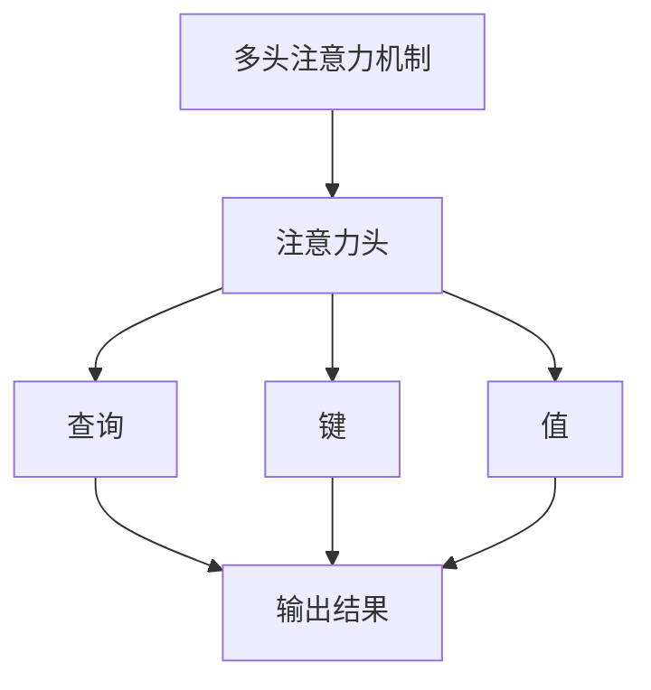
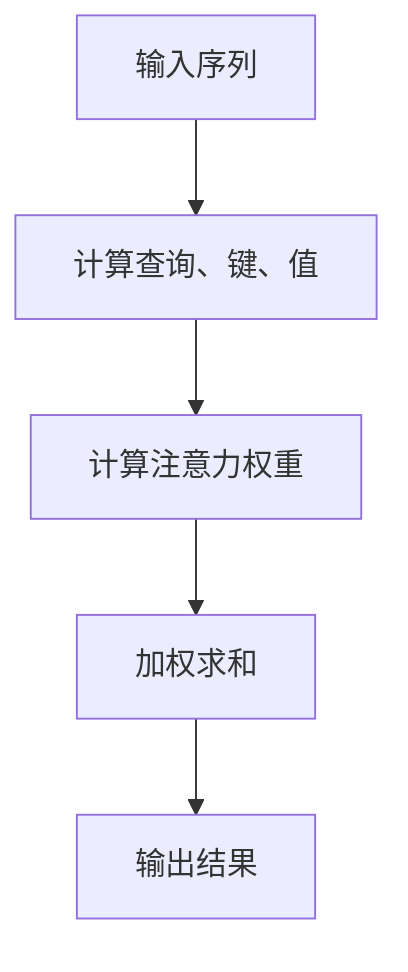

                 


```markdown
# AI Agent的多头注意力机制实现

> 关键词：多头注意力机制、AI Agent、自然语言处理、图像处理、系统架构

> 摘要：本文系统地探讨了AI Agent中的多头注意力机制，从基本概念到实现细节，结合实际案例，深入剖析其原理与应用，旨在为读者提供全面的技术指导。

---

# 第一部分: 多头注意力机制基础

## 第1章: 多头注意力机制概述

### 1.1 多头注意力机制的基本概念
- **注意力机制的定义**：注意力机制是一种模拟人类注意力的选择性关注机制。
- **多头注意力机制的核心思想**：通过并行计算多个注意力头，捕捉不同位置的特征。
- **多头注意力机制的应用场景**：广泛应用于自然语言处理、图像处理等领域。

### 1.2 AI Agent的发展背景
- **AI Agent的定义与特点**：AI Agent是一种智能体，能够感知环境并做出决策。
- **多头注意力机制在AI Agent中的作用**：通过多头注意力机制，AI Agent能够更高效地处理多模态数据。
- **当前技术背景与挑战**：随着深度学习的发展，多头注意力机制在AI Agent中的应用越来越广泛。

### 1.3 多头注意力机制的技术背景
- **注意力机制的起源与发展**：从Transformer模型到多头注意力机制的演变。
- **多头注意力机制的优势与不足**：相比单头注意力，多头注意力机制能够捕捉更丰富的特征。
- **多头注意力机制的数学基础**：线性代数、矩阵运算等基础知识。

### 1.4 应用领域与案例分析
- **自然语言处理中的应用**：文本摘要、机器翻译等。
- **图像处理中的应用**：图像分割、目标检测等。
- **其他领域的潜在应用**：自动驾驶、智能客服等。

### 1.5 本章小结
本章从多头注意力机制的基本概念出发，介绍了其在AI Agent中的应用背景和技术基础，为后续章节的学习奠定了基础。

---

## 第2章: 多头注意力机制的核心概念与联系

### 2.1 多头注意力机制的原理
- **模型结构与计算流程**：查询、键、值的计算与注意力权重的分配。
- **多头注意力机制的数学模型**：公式推导与矩阵运算的详细解释。
- **多头注意力机制的计算步骤**：从输入到输出的详细流程。

### 2.2 多头注意力机制与相关概念的对比
- **注意力机制与多头注意力机制的对比**：从单头到多头的演变。
- **其他注意力机制的优缺点分析**：对比分析不同注意力机制的适用场景。
- **多头注意力机制与传统神经网络的对比**：从计算效率到表达能力的对比。

### 2.3 多头注意力机制的ER实体关系图


### 2.4 本章小结
本章深入剖析了多头注意力机制的核心原理，并通过对比分析和ER图展示了其与相关概念的联系，帮助读者更好地理解其本质。

---

## 第3章: 多头注意力机制的算法原理与实现

### 3.1 多头注意力机制的算法流程


### 3.2 多头注意力机制的数学模型
- **查询、键、值的计算公式**：
  $$Q = W_q X$$
  $$K = W_k X$$
  $$V = W_v X$$
- **注意力权重的计算公式**：
  $$\text{Attention}(Q,K,V) = \text{softmax}\left(\frac{QK^T}{\sqrt{d_k}}\right)V$$

### 3.3 多头注意力机制的Python实现
```python
def multi_head_attention(query, key, value, num_heads):
    # 假设 query, key, value 的形状为 (batch_size, seq_len, d_model)
    d_model = query.shape[-1]
    d_k = d_model // num_heads

    # 分头
    query = query.view(-1, num_heads, d_k)
    key = key.view(-1, num_heads, d_k)
    value = value.view(-1, num_heads, d_k)

    # 计算注意力权重
    attention_scores = (query @ key.transpose(-2, -1)) / (d_k ** 0.5)
    attention_weights = torch.softmax(attention_scores, dim=-1)

    # 加权求和
    output = (attention_weights @ value).reshape(-1, num_heads, d_k)
    output = output.view(-1, seq_len, d_model)
    return output
```

### 3.4 本章小结
本章通过算法流程图和数学公式，详细讲解了多头注意力机制的实现原理，并通过Python代码展示了其具体实现，帮助读者掌握其实现细节。

---

## 第4章: 多头注意力机制的系统分析与架构设计

### 4.1 项目背景介绍
- **项目目标**：设计一个基于多头注意力机制的AI Agent系统。
- **项目需求**：实现文本理解和图像处理功能。

### 4.2 系统功能设计
- **领域模型设计**：
  ```mermaid
  graph TD
      User[用户] --> Agent[AI Agent]
      Agent --> TextParser[文本解析器]
      Agent --> ImageProcessor[图像处理器]
      TextParser --> NLPModel[自然语言处理模型]
      ImageProcessor --> ComputerVisionModel[计算机视觉模型]
  ```

- **系统架构设计**：
  ```mermaid
  graph TD
      Agent[AI Agent] --> TextParser[文本解析器]
      Agent --> ImageProcessor[图像处理器]
      TextParser --> NLPModel[自然语言处理模型]
      ImageProcessor --> ComputerVisionModel[计算机视觉模型]
      NLPModel --> MultiHeadAttention[多头注意力机制]
      ComputerVisionModel --> MultiHeadAttention
  ```

- **系统接口设计**：API接口定义与交互流程。

### 4.3 本章小结
本章通过系统分析与架构设计，展示了多头注意力机制在AI Agent中的具体应用，为后续的项目实现奠定了基础。

---

## 第5章: 多头注意力机制的项目实战

### 5.1 环境搭建
- **开发环境要求**：Python 3.8+, PyTorch 1.9+
- **安装依赖库**：
  ```bash
  pip install torch torchvision matplotlib
  ```

### 5.2 系统核心实现
- **文本处理模块**：
  ```python
  class TextProcessor:
      def __init__(self, vocab_size, d_model, num_heads):
          self.encoder = nn.Embedding(vocab_size, d_model)
          self.mha = MultiHeadAttention(d_model, num_heads)
      def forward(self, input_seq):
          embedded = self.encoder(input_seq)
          output = self.mha(embedded, embedded, embedded)
          return output
  ```

- **图像处理模块**：
  ```python
  class ImageProcessor:
      def __init__(self, img_size, d_model, num_heads):
          self.encoder = nn.Conv2d(3, d_model, kernel_size=3, stride=1, padding=1)
          self.mha = MultiHeadAttention(d_model, num_heads)
      def forward(self, input_img):
          encoded = self.encoder(input_img)
          output = self.mha(encoded, encoded, encoded)
          return output
  ```

### 5.3 案例分析与解读
- **文本处理案例**：实现文本摘要功能。
- **图像处理案例**：实现目标检测功能。

### 5.4 项目总结
- **项目成果**：成功实现了基于多头注意力机制的AI Agent系统。
- **经验总结**：多头注意力机制的优势与不足。

### 5.5 本章小结
本章通过实际项目案例，详细讲解了多头注意力机制的实现过程，帮助读者将理论知识应用于实际开发。

---

## 第6章: 多头注意力机制的最佳实践与注意事项

### 6.1 最佳实践
- **参数选择**：合理选择注意力头数和模型维度。
- **训练技巧**：数据增强、学习率调整等。

### 6.2 小结
本章总结了多头注意力机制在实际应用中的注意事项和最佳实践，帮助读者更好地优化系统性能。

---

## 附录: 拓展阅读与学习资源

### 1. 拓展阅读
- 推荐书籍：《注意力机制与深度学习》、《Transformer模型实战》
- 推荐论文：《Attention Is All You Need》

### 2. 学习资源
- 在线课程：Coursera上的《深度学习专项课程》
- 开源项目：GitHub上的Transformer模型实现

---

# 作者：AI天才研究院/AI Genius Institute & 禅与计算机程序设计艺术 /Zen And The Art of Computer Programming
```

