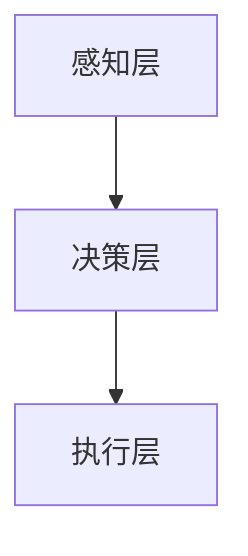
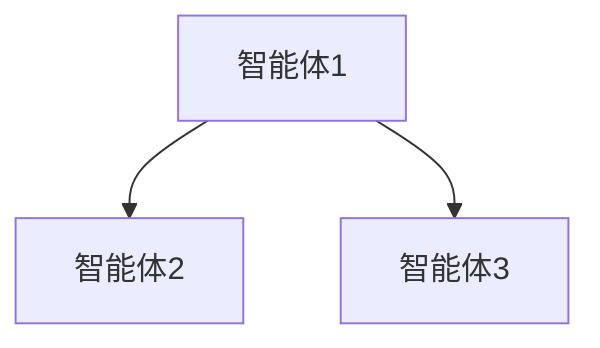
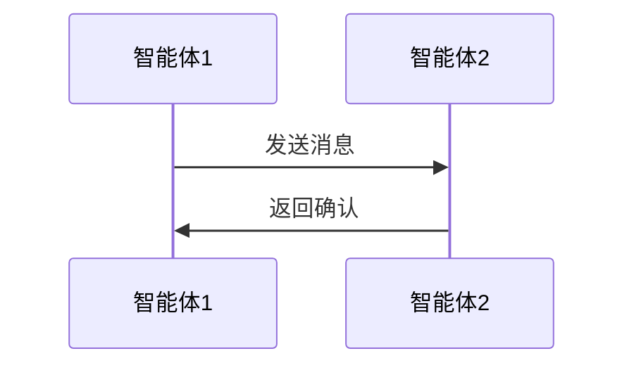
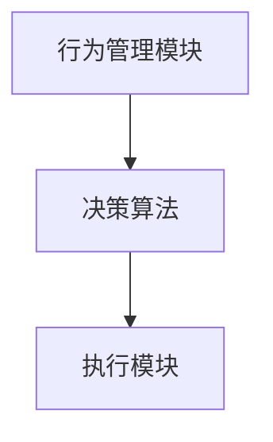
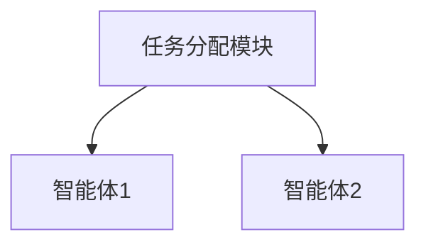

                 


# AI Agent的多智能体协作系统设计

> **关键词**：AI Agent、多智能体协作、智能体架构、协作算法、数学模型

> **摘要**：本文将详细介绍AI Agent的多智能体协作系统设计，涵盖从基础概念到高级算法的各个方面。通过分析智能体的定义、分类、协作机制，以及多智能体协作系统的数学模型、算法实现、系统架构设计和项目实战，为读者提供一个全面而深入的技术指南。

---

# 第1章: AI Agent与多智能体协作系统概述

## 1.1 AI Agent的基本概念

### 1.1.1 智能体的定义与分类

AI Agent（智能体）是指能够感知环境并采取行动以实现目标的实体。智能体可以分为以下几类：

| 类型 | 定义 | 特点 |
|------|------|------|
| 单智能体 | 独立运行，不与其他智能体协作 | 高度自治，但难以处理复杂任务 |
| 多智能体 | 多个智能体协同工作，共同完成任务 | 通过通信和协作提高任务完成效率 |
| 分布式智能体 | 智能体分布在网络中，通过分布式计算协同工作 | 强调去中心化和并行计算 |

### 1.1.2 多智能体协作的背景与意义

随着AI技术的发展，多智能体协作系统在许多领域展现出巨大的潜力，例如自动驾驶、智能城市、机器人协作等。通过多个智能体的协作，可以实现更高效、更智能的任务完成方式。

### 1.1.3 多智能体协作的应用场景

- **自动驾驶**：多辆自动驾驶汽车通过协作优化交通流量。
- **智能城市**：多个智能设备协同工作，实现城市管理和服务。
- **机器人协作**：工业机器人通过协作完成复杂的生产任务。

## 1.2 多智能体协作系统的特点

### 1.2.1 多智能体协作的核心要素

- **智能体间通信**：通过通信机制实现智能体之间的信息共享。
- **协作任务分配**：智能体根据自身能力和环境信息分配任务。
- **决策与规划**：智能体需要根据协作结果动态调整决策。

### 1.2.2 多智能体协作的挑战与优势

- **挑战**：通信延迟、任务冲突、计算复杂度高。
- **优势**：提高任务完成效率，增强系统的鲁棒性和适应性。

### 1.2.3 多智能体协作的应用场景

- **游戏AI**：多个游戏AI协同完成游戏任务。
- **无人机编队**：多架无人机协同执行任务。
- **智能家居**：多个智能家居设备协同工作。

## 1.3 本章小结

本章介绍了AI Agent的基本概念和多智能体协作系统的特点，为后续章节的深入分析奠定了基础。

---

# 第2章: 多智能体协作的数学模型

## 2.1 多智能体协作的数学基础

### 2.1.1 博弈论基础

博弈论是研究多个智能体之间策略选择的数学理论。在博弈论中，纳什均衡是一个重要的概念，表示在其他智能体策略不变的情况下，一个智能体无法通过单方面改变策略来提高自身收益的状态。

$$ 纳什均衡的定义式为： \forall i, u_i(a_i, a_{-i}) \geq u_i(a_i', a_{-i}) $$

其中，$u_i$ 表示智能体i的收益函数，$a_i$ 表示智能体i选择的策略，$a_{-i}$ 表示其他智能体选择的策略。

### 2.1.2 群智能算法基础

群智能算法（如蚂蚁算法、粒子群算法）模拟了自然群体的行为模式。例如，粒子群算法通过模拟鸟群的飞行行为来寻找最优解。

$$ 粒子群算法的更新公式为： v_i = v_i \cdot w + c_1 \cdot r_1 \cdot (p_i - x_i) + c_2 \cdot r_2 \cdot (p_g - x_i) $$

其中，$v_i$ 表示粒子的速度，$w$ 表示惯性权重，$c_1$ 和 $c_2$ 表示学习因子，$r_1$ 和 $r_2$ 表示随机数，$p_i$ 表示粒子的最优位置，$p_g$ 表示全局最优位置，$x_i$ 表示当前粒子的位置。

## 2.2 多智能体协作的数学模型

### 2.2.1 单智能体决策模型

单智能体的决策模型可以表示为：

$$ a_i = \arg\max_{a} u(a | s) $$

其中，$a_i$ 表示智能体i选择的行动，$s$ 表示当前状态，$u(a | s)$ 表示在状态$s$下选择行动$a$的期望收益。

### 2.2.2 多智能体协作模型

多智能体协作模型可以表示为：

$$ \max_{\{a_i\}} \sum_{i=1}^{N} u_i(a_i, \{a_{-i}\}) $$

其中，$N$ 表示智能体的数量，$\{a_i\}$ 表示所有智能体选择的行动，$u_i(a_i, \{a_{-i}\})$ 表示智能体i的收益。

### 2.2.3 群智能算法的数学表达

以蚂蚁算法为例，蚂蚁通过释放信息素来指导其他蚂蚁寻找路径。信息素的更新公式为：

$$ \tau_{ij}(t+1) = \tau_{ij}(t) + \Delta \tau_{ij} $$

其中，$\tau_{ij}(t)$ 表示在时间$t$时边$(i,j)$上的信息素量，$\Delta \tau_{ij}$ 表示根据路径选择情况增加的信息素量。

## 2.3 本章小结

本章通过博弈论和群智能算法的数学模型，分析了多智能体协作的核心原理。

---

# 第3章: 多智能体协作的算法原理

## 3.1 单智能体决策算法

### 3.1.1 基于模型的决策算法

基于模型的决策算法（如马尔可夫决策过程）通过建立环境模型来优化决策。

$$ 马尔可夫决策过程的优化目标为： \max_{\pi} \sum_{t=0}^{\infty} \gamma^t r(s_t, a_t) $$

其中，$\gamma$ 表示折扣因子，$r(s_t, a_t)$ 表示在状态$s_t$和动作$a_t$下的奖励。

### 3.1.2 基于无模型的决策算法

基于无模型的决策算法（如Q-learning）通过试错学习来优化决策。

$$ Q-learning 的更新公式为： Q(s, a) = Q(s, a) + \alpha [r + \gamma \max Q(s', a') - Q(s, a)] $$

其中，$\alpha$ 表示学习率，$\gamma$ 表示折扣因子，$r$ 表示奖励，$s'$ 表示下一状态。

## 3.2 多智能体协作算法

### 3.2.1 基于博弈论的协作算法

基于博弈论的协作算法通过纳什均衡来实现智能体间的协作。

$$ 纳什均衡的条件为： \forall i, u_i(a_i, \{a_{-i}\}) \geq u_i(a_i', \{a_{-i}\}) $$

### 3.2.2 基于通信的协作算法

基于通信的协作算法通过智能体间的通信来实现任务分配和协作。

$$ 通信模型的表示为： C = \{c_1, c_2, \dots, c_n\} $$

其中，$c_i$ 表示智能体i的通信内容。

## 3.3 算法实现的数学推导

以多智能体协作的通信模型为例，假设有两个智能体A和B，它们需要通过通信来完成任务。智能体A发送消息$m$给智能体B，消息的内容取决于当前状态$s$。

$$ m = f(s) $$

智能体B接收到消息后，根据消息内容调整自己的决策。

$$ a_b = g(m) $$

其中，$f(s)$ 表示消息生成函数，$g(m)$ 表示动作选择函数。

## 3.4 本章小结

本章详细介绍了单智能体和多智能体协作算法的原理，并通过数学推导分析了通信机制的作用。

---

# 第4章: 多智能体协作系统的架构设计

## 4.1 系统需求分析

### 4.1.1 功能需求

- 智能体间通信
- 任务分配与协作
- 决策与规划

### 4.1.2 性能需求

- 响应时间
- 通信延迟
- 系统稳定性

## 4.2 系统架构设计

### 4.2.1 分层架构

分层架构将系统划分为感知层、决策层和执行层。



### 4.2.2 分布式架构

分布式架构强调智能体之间的分布式计算和协作。



## 4.3 系统通信机制设计

### 4.3.1 智能体间通信协议

智能体间的通信协议需要定义消息格式和通信方式。



### 4.3.2 通信模型设计

通信模型设计需要考虑消息的生成、传输和处理。

## 4.4 本章小结

本章通过分层架构和分布式架构的设计，分析了多智能体协作系统的实现方式。

---

# 第5章: 多智能体协作系统的实现

## 5.1 系统功能设计

### 5.1.1 智能体行为管理

智能体行为管理模块负责智能体的行为决策和执行。



### 5.1.2 协作任务分配

协作任务分配模块负责任务的分配和协调。



## 5.2 系统实现的关键技术

### 5.2.1 智能体的感知与决策

智能体的感知与决策需要结合环境信息和历史数据。

### 5.2.2 多智能体协作的通信与同步

多智能体协作需要实现智能体间的通信与同步。

## 5.3 本章小结

本章通过系统功能设计和实现技术的分析，为多智能体协作系统的实现提供了指导。

---

# 第6章: 项目实战

## 6.1 项目环境配置

项目需要安装以下工具和库：

- Python
- NumPy
- Matplotlib
- TensorFlow

## 6.2 核心代码实现

### 6.2.1 单智能体决策代码

```python
import numpy as np

class Agent:
    def __init__(self, state_space, action_space):
        self.state_space = state_space
        self.action_space = action_space
        self.Q = np.zeros((state_space, action_space))
    
    def act(self, state):
        return np.argmax(self.Q[state, :])
    
    def update(self, state, action, reward):
        self.Q[state, action] += reward
```

### 6.2.2 多智能体协作代码

```python
import numpy as np

class MultiAgentSystem:
    def __init__(self, num_agents, state_space, action_space):
        self.agents = [Agent(state_space, action_space) for _ in range(num_agents)]
    
    def step(self, states):
        actions = [agent.act(state) for agent, state in zip(self.agents, states)]
        rewards = [compute_reward(state, action) for state, action in zip(states, actions)]
        [agent.update(state, action, reward) for agent, state, action, reward in zip(self.agents, states, actions, rewards)]
```

## 6.3 案例分析

以多智能体协作的无人机编队为例，通过代码实现无人机的协同飞行。

## 6.4 本章小结

本章通过项目实战，详细讲解了多智能体协作系统的实现过程。

---

# 第7章: 总结与展望

## 7.1 总结

本文从AI Agent的基本概念出发，详细分析了多智能体协作系统的数学模型、算法原理、系统架构设计和项目实现。

## 7.2 展望

未来，随着AI技术的发展，多智能体协作系统将在更多领域展现出其潜力，例如智能交通、智慧城市等。

---

# 作者

作者：AI天才研究院/AI Genius Institute & 禅与计算机程序设计艺术 /Zen And The Art of Computer Programming

