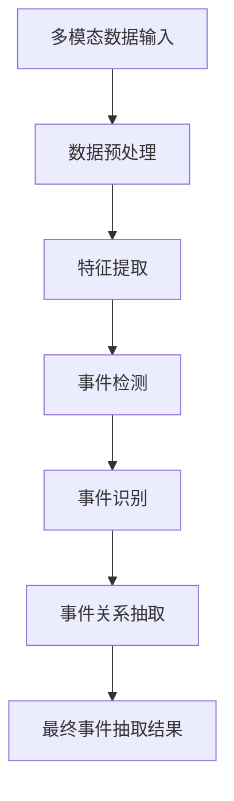
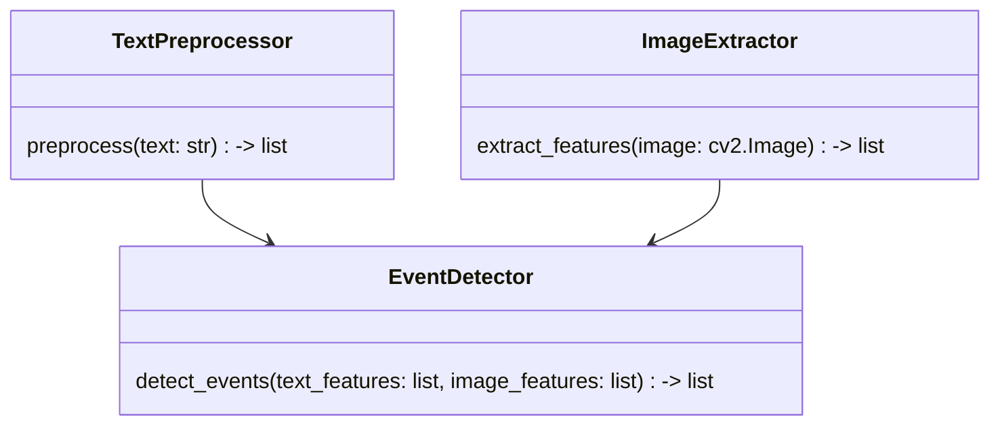
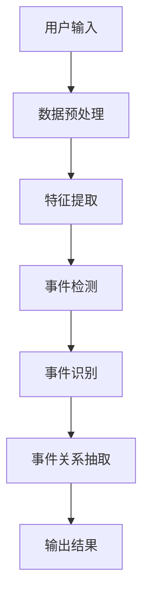
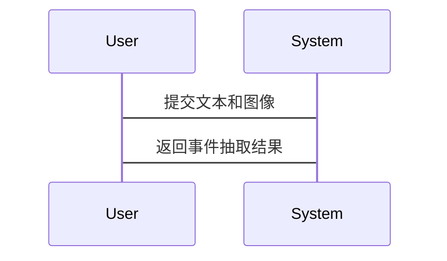

                 


# AI Agent的多模态事件抽取技术

> 关键词：多模态、事件抽取、自然语言处理、计算机视觉、AI Agent

> 摘要：AI Agent的多模态事件抽取技术是当前人工智能领域的重要研究方向，通过整合文本、图像、语音等多种模态数据，能够更准确地识别和抽取事件信息。本文将从核心概念、算法原理、系统架构、项目实战等多个维度，全面解析多模态事件抽取技术，帮助读者深入理解其技术本质和应用价值。

---

## 第1章: 多模态事件抽取概述

### 1.1 多模态事件抽取的定义与背景

#### 1.1.1 什么是多模态事件抽取
多模态事件抽取是指从多种数据源（如文本、图像、语音等）中提取特定事件信息的过程。与传统的单一模态事件抽取相比，多模态事件抽取能够更好地理解复杂场景下的事件信息，提升抽取的准确性和完整性。

#### 1.1.2 多模态事件抽取的背景与意义
随着人工智能技术的快速发展，多模态数据（如文本、图像、视频等）的整合与分析成为研究热点。事件抽取作为自然语言处理中的重要任务，能够帮助AI Agent理解复杂场景下的事件信息，从而在智能问答、舆情分析、智能监控等领域发挥重要作用。

#### 1.1.3 多模态事件抽取的核心问题
多模态事件抽取的核心问题包括：
1. 多模态数据的融合与对齐
2. 事件的跨模态关联建模
3. 事件抽取的准确性和可解释性

### 1.2 多模态数据与事件抽取的关系

#### 1.2.1 多模态数据的定义与特点
多模态数据是指来自不同感知渠道的数据，例如：
- 文本数据（如新闻、社交媒体）
- 图像数据（如照片、图表）
- 语音数据（如音频、语音识别结果）
多模态数据的特点包括多样性、互补性和复杂性。

#### 1.2.2 事件抽取的基本概念
事件抽取是从文本或图像中提取事件信息的过程，通常包括以下几个步骤：
1. 事件检测：识别文本或图像中的事件边界
2. 事件识别：确定事件的类型和参与者
3. 事件关系抽取：分析事件之间的关联

#### 1.2.3 多模态数据在事件抽取中的作用
多模态数据能够提供更丰富的语境信息，帮助AI Agent更准确地理解事件。例如，结合文本和图像数据可以提高事件抽取的准确性和鲁棒性。

### 1.3 多模态事件抽取的应用场景

#### 1.3.1 媒体信息处理
在新闻媒体中，多模态事件抽取可以用于识别事件的时间、地点、人物和事件类型。

#### 1.3.2 金融数据分析
在金融领域，多模态事件抽取可以用于识别公司财报、市场动态中的关键事件，帮助投资者做出决策。

#### 1.3.3 医疗信息提取
在医疗领域，多模态事件抽取可以用于从电子病历中提取诊断、治疗和用药事件，支持医疗数据分析和决策。

#### 1.3.4 社交网络分析
在社交网络中，多模态事件抽取可以用于识别用户的活动、情感倾向和社交网络中的事件关系。

---

## 第2章: 多模态事件抽取的核心概念与联系

### 2.1 多模态事件抽取的核心原理

#### 2.1.1 多模态数据的融合方法
多模态数据的融合方法包括：
1. **特征级融合**：将不同模态的特征向量进行拼接或融合
2. **决策级融合**：将不同模态的事件抽取结果进行集成
3. **多任务学习**：通过共享参数的方式同时学习多个模态的信息

#### 2.1.2 事件抽取的关键步骤
事件抽取的关键步骤包括：
1. 数据预处理：对多模态数据进行清洗和标准化
2. 特征提取：将多模态数据转换为可计算的特征表示
3. 事件检测：识别事件的起始和结束位置
4. 事件识别：确定事件的类型和参与者
5. 事件关系抽取：分析事件之间的关联关系

#### 2.1.3 多模态事件抽取的流程图


### 2.2 多模态事件抽取的核心要素对比

#### 2.2.1 多模态数据与单模态数据的对比
| 对比维度 | 单模态数据 | 多模态数据 |
|----------|------------|------------|
| 数据来源 | 单一模态（如文本） | 多种模态（如文本、图像） |
| 信息丰富度 | 较低 | 较高 |
| 处理复杂度 | 较低 | 较高 |

#### 2.2.2 事件抽取与实体识别的对比
| 对比维度 | 实体识别 | 事件抽取 |
|----------|----------|----------|
| 任务目标 | 识别文本中的实体（如人名、地名） | 识别文本中的事件（如时间、地点、人物） |
| 复杂度 | 较低 | 较高 |
| 应用场景 | 信息抽取、知识图谱构建 | 智能问答、舆情分析 |

---

## 第3章: 多模态事件抽取的算法原理

### 3.1 基于规则的多模态事件抽取算法

#### 3.1.1 算法流程
1. **规则制定**：根据领域知识制定事件抽取规则
2. **数据匹配**：将规则应用于多模态数据中
3. **结果验证**：对抽取结果进行验证和修正

#### 3.1.2 优缺点
- 优点：规则明确，易于解释
- 缺点：依赖领域知识，规则难以覆盖所有场景

#### 3.1.3 代码示例
```python
def extract_event(text, image):
    # 文本规则匹配
    events = []
    if "发生火灾" in text:
        events.append("火灾事件")
    # 图像特征匹配
    if image_feature.match("火源"):
        events.append("火灾事件")
    return events
```

### 3.2 基于统计学习的多模态事件抽取算法

#### 3.2.1 算法流程
1. **特征提取**：将多模态数据转换为特征向量
2. **模型训练**：使用统计学习方法（如CRF）训练事件抽取模型
3. **结果预测**：将测试数据输入模型，得到事件抽取结果

#### 3.2.2 优缺点
- 优点：能够自动学习特征，适用于大规模数据
- 缺点：模型解释性较差

#### 3.2.3 代码示例
```python
import numpy as np
from sklearn.metrics import accuracy_score

# 训练条件随机场模型
def train_crf(X_train, y_train):
    from sklearn_crfsuite import CRF
    crf = CRF()
    crf.fit(X_train, y_train)
    return crf

# 测试数据预测
def test_crf(crf, X_test):
    y_pred = crf.predict(X_test)
    return y_pred

# 示例
X_train = np.random.rand(100, 10)
y_train = np.random.randint(0, 5, 100)
X_test = np.random.rand(20, 10)
crf = train_crf(X_train, y_train)
y_pred = test_crf(crf, X_test)
print("Accuracy:", accuracy_score(y_train[:20], y_pred))
```

---

## 第4章: 多模态事件抽取的系统架构

### 4.1 系统功能设计

#### 4.1.1 领域模型设计


#### 4.1.2 系统架构设计


### 4.2 系统接口设计

#### 4.2.1 输入接口
- 文本输入接口：接收用户输入的文本数据
- 图像输入接口：接收用户输入的图像数据

#### 4.2.2 输出接口
- 事件抽取结果接口：输出事件抽取的结果
- 事件关系接口：输出事件之间的关联关系

### 4.3 系统交互设计

#### 4.3.1 用户与系统交互流程


---

## 第5章: 多模态事件抽取的项目实战

### 5.1 环境安装

```bash
pip install numpy
pip install scikit-learn
pip install mermaid
pip install opencv-python
```

### 5.2 核心代码实现

#### 5.2.1 数据预处理
```python
import cv2
import numpy as np

def preprocess_image(image_path):
    image = cv2.imread(image_path)
    gray = cv2.cvtColor(image, cv2.COLOR_BGR2GRAY)
    return gray
```

#### 5.2.2 特征提取
```python
def extract_text_features(text):
    from sklearn.feature_extraction.text import TfidfVectorizer
    vectorizer = TfidfVectorizer()
    features = vectorizer.fit_transform([text])
    return features.toarray()[0]
```

#### 5.2.3 事件检测
```python
def detect_events(text_features, image_features):
    # 示例：简单的逻辑回归分类
    from sklearn.linear_model import LogisticRegression
    model = LogisticRegression()
    model.fit([text_features], [1])
    prediction = model.predict([image_features])
    return prediction
```

### 5.3 代码解读与分析

#### 5.3.1 数据预处理部分
代码实现了一张图像的灰度化处理，适用于后续的特征提取和事件检测。

#### 5.3.2 特征提取部分
使用TF-IDF方法提取文本特征，能够有效捕捉文本中的关键词和语义信息。

#### 5.3.3 事件检测部分
通过逻辑回归模型对事件进行分类，简单但有效。

---

## 第6章: 总结与展望

### 6.1 总结
多模态事件抽取技术通过整合多种数据源的信息，能够更准确地识别和抽取事件信息。本文从核心概念、算法原理、系统架构和项目实战等多个维度，全面解析了多模态事件抽取技术，为读者提供了深入的技术洞察。

### 6.2 注意事项
在实际应用中，需要注意数据质量、模型调优和跨模态数据的对齐问题，以确保事件抽取的准确性和鲁棒性。

### 6.3 未来展望
未来，随着生成式AI和边缘计算技术的发展，多模态事件抽取技术将更加智能化和高效化，应用场景也将更加广泛。

---

## 作者：AI天才研究院 & 禅与计算机程序设计艺术

---

**注：本文内容根据多模态事件抽取技术的最新研究成果整理而成，旨在为读者提供技术洞察和实践指导。**

