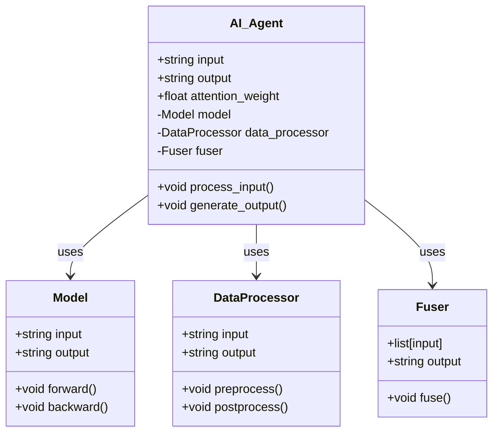
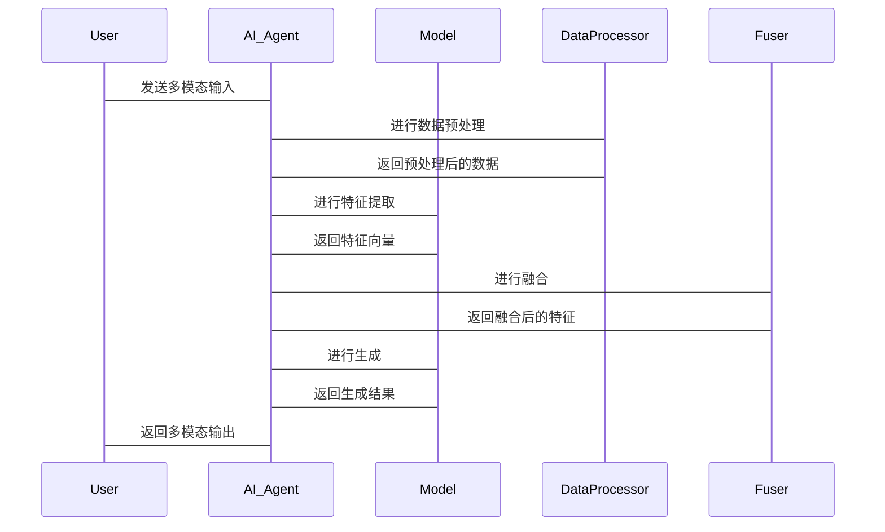

                 


# AI Agent的多模态交互能力开发

## 关键词
AI Agent, 多模态交互, 数据融合, 跨模态注意力机制, 多任务学习, 多模态模型, 多模态数据处理

## 摘要
本文详细探讨了AI Agent在多模态交互能力开发中的核心概念、技术实现和实际应用。从多模态数据的处理与融合，到多模态交互模型的设计与实现，再到具体的算法原理与项目实战，本文为读者提供了从理论到实践的全面指导。通过详细讲解多模态数据的特征提取、模型融合策略以及跨模态注意力机制，本文旨在帮助读者掌握AI Agent的多模态交互能力开发的关键技术，并通过实际案例分析和代码实现，进一步加深理解。

---

# 第1章 AI Agent与多模态交互概述

## 1.1 AI Agent的基本概念
### 1.1.1 AI Agent的定义与特点
AI Agent（人工智能代理）是指能够感知环境、自主决策并采取行动以实现特定目标的智能实体。AI Agent具有以下特点：
- **自主性**：能够在没有外部干预的情况下自主运行。
- **反应性**：能够实时感知环境并做出反应。
- **目标导向性**：所有行为都以实现特定目标为导向。

### 1.1.2 多模态交互的定义与重要性
多模态交互是指通过多种信息载体（如文本、语音、图像等）进行的交互方式。多模态交互的重要性体现在以下几个方面：
- **提高用户体验**：通过多种交互方式，用户可以根据个人偏好选择最舒适的交互方式。
- **增强信息处理能力**：多模态数据的结合可以提供更全面的信息，帮助AI Agent更好地理解用户需求。
- **扩展应用场景**：多模态交互能够适应更多复杂场景，例如智能音箱、智能助手、虚拟现实等。

### 1.1.3 AI Agent在多模态交互中的作用
AI Agent在多模态交互中充当了连接用户与系统的桥梁。它不仅能够理解用户的输入，还能通过多种模态输出与用户进行交互。例如：
- **智能音箱**：通过语音交互理解用户需求，并通过语音或文本进行反馈。
- **虚拟助手**：通过自然语言处理技术理解用户的指令，并通过多模态输出（如文本、图像）提供服务。

## 1.2 多模态交互的背景与发展趋势
### 1.2.1 多模态交互的背景介绍
随着人工智能技术的快速发展，单一模态的交互方式已经无法满足复杂场景的需求。例如，在智能客服系统中，用户可能需要通过文本描述问题，同时提供相关图片或视频以供辅助理解。这种多模态交互的需求推动了AI Agent在多模态能力上的发展。

### 1.2.2 多模态交互的发展趋势
- **智能化**：AI Agent需要能够理解并整合多种模态信息，提供更智能的交互体验。
- **实时化**：随着5G等技术的发展，实时多模态交互将成为可能。
- **个性化**：通过多模态数据的分析，AI Agent可以提供更加个性化的服务。

### 1.2.3 AI Agent在多模态交互中的应用前景
AI Agent在多模态交互中的应用前景广阔，包括但不限于：
- **智能客服**：通过语音、文本、图像等多种模态信息提供更高效的客服服务。
- **智能教育**：通过多模态数据分析，为学生提供个性化的学习建议。
- **智能医疗**：通过多模态数据（如病历、影像）辅助医生进行诊断。

## 1.3 本章小结
本章介绍了AI Agent的基本概念、多模态交互的定义与重要性，以及AI Agent在多模态交互中的作用和发展趋势。通过这些内容，读者可以对AI Agent的多模态交互能力开发有一个初步的了解。

---

# 第2章 多模态数据处理与融合

## 2.1 多模态数据的类型与特点
### 2.1.1 文本数据
文本数据是AI Agent中最常见的输入形式之一。文本数据的特点包括：
- **结构化**：文本可以通过自然语言处理技术进行结构化分析。
- **语义丰富**：文本能够表达丰富的语义信息。

### 2.1.2 语音数据
语音数据是另一种重要的输入形式。语音数据的特点包括：
- **实时性**：语音交互通常是实时进行的。
- **情感表达**：语音可以传递情感信息，如语调、语气等。

### 2.1.3 图像与视觉数据
图像数据是计算机视觉领域的核心研究对象。图像数据的特点包括：
- **视觉信息丰富**：图像能够提供丰富的视觉信息。
- **数据量大**：图像通常包含大量的像素信息。

### 2.1.4 其他模态数据（如视频、手势）
除了文本、语音和图像，其他模态数据如视频和手势也在多模态交互中扮演重要角色。例如：
- **视频数据**：视频可以提供连续的视觉信息，适用于视频会议、视频分析等场景。
- **手势数据**：手势可以作为一种非语言的交互方式，适用于虚拟现实、增强现实等场景。

## 2.2 多模态数据的处理技术
### 2.2.1 数据预处理与标准化
在多模态数据处理中，预处理是非常重要的一步。预处理包括：
- **去噪**：去除数据中的噪声，例如在语音数据中去除背景噪声。
- **标准化**：将数据标准化到统一的格式或范围，例如将图像分辨率统一。

### 2.2.2 数据融合方法
数据融合方法可以分为两类：
- **特征融合**：将不同模态的特征向量进行融合，例如将文本的词向量和图像的特征向量进行拼接。
- **模型融合**：在模型训练过程中，将不同模态的数据输入到同一个模型中进行联合训练。

## 2.3 多模态数据的融合策略
### 2.3.1 晚期融合（Late Fusion）
晚期融合是指在特征提取阶段分别处理不同模态的数据，然后在高层进行融合。例如：
$$
f_{\text{final}} = f_{\text{text}} \oplus f_{\text{image}}
$$
其中，$\oplus$ 表示特征的拼接或融合操作。

### 2.3.2 早期融合（Early Fusion）
早期融合是指在特征提取过程中就进行多模态数据的融合。例如：
$$
f_{\text{final}} = \text{F}(f_{\text{text}}, f_{\text{image}})
$$
其中，$F$ 表示一个融合函数，例如深度神经网络。

### 2.3.3 深度融合（Deep Fusion）
深度融合是一种结合了早期融合和晚期融合的方法。例如：
$$
f_{\text{final}} = \text{DNN}(f_{\text{text}}, f_{\text{image}})
$$
其中，DNN 表示深度神经网络。

## 2.4 本章小结
本章详细介绍了多模态数据的类型与特点，以及多模态数据的处理技术和融合策略。通过这些内容，读者可以了解如何对多模态数据进行有效的处理和融合。

---

# 第3章 多模态交互模型的设计与实现

## 3.1 多模态交互模型的架构设计
### 3.1.1 模型的整体架构
一个典型的多模态交互模型通常包括以下几个部分：
- **输入层**：接收多种模态的输入数据。
- **特征提取层**：对不同模态的数据进行特征提取。
- **融合层**：将不同模态的特征进行融合。
- **输出层**：生成最终的交互输出，例如文本、语音或图像。

### 3.1.2 各模态处理模块的设计
- **文本处理模块**：使用自然语言处理技术对文本数据进行处理，例如分词、句法分析。
- **语音处理模块**：使用语音信号处理技术对语音数据进行处理，例如降噪、特征提取。
- **图像处理模块**：使用计算机视觉技术对图像数据进行处理，例如目标检测、图像分割。

### 3.1.3 跨模态交互模块的设计
跨模态交互模块是多模态交互模型的核心部分，负责将不同模态的特征进行融合。例如：
$$
f_{\text{cross}} = \text{Cross}(f_{\text{text}}, f_{\text{image}})
$$
其中，$\text{Cross}$ 表示跨模态交互操作，例如注意力机制。

## 3.2 多模态数据的特征提取与表示
### 3.2.1 文本特征提取（如词向量、BERT）
文本特征提取可以通过词向量或预训练模型（如BERT）进行。例如：
- **词向量**：使用Word2Vec将文本转换为向量表示。
- **BERT**：使用BERT模型提取文本的上下文特征。

### 3.2.2 语音特征提取（如MFCC、Wav2Vec）
语音特征提取可以通过MFCC或Wav2Vec等方法进行。例如：
- **MFCC**：将语音信号转换为频域特征。
- **Wav2Vec**：使用深度学习模型提取语音的表征。

### 3.2.3 图像特征提取（如CNN、ViT）
图像特征提取可以通过卷积神经网络（CNN）或视觉变换器（ViT）进行。例如：
- **CNN**：通过卷积层提取图像的空间特征。
- **ViT**：通过变换器层提取图像的全局特征。

## 3.3 多模态模型的训练与优化
### 3.3.1 多任务学习与联合优化
多任务学习是一种有效的模型优化方法，例如：
$$
\mathcal{L} = \lambda_1 \mathcal{L}_1 + \lambda_2 \mathcal{L}_2
$$
其中，$\lambda_1$ 和 $\lambda_2$ 是任务权重，$\mathcal{L}_1$ 和 $\mathcal{L}_2$ 是不同任务的损失函数。

### 3.3.2 模型的可解释性与鲁棒性
模型的可解释性可以通过可视化注意力机制等方式进行分析。例如：
- **注意力机制可视化**：通过热图展示模型在不同位置的关注程度。

### 3.3.3 跨模态注意力机制（如Modality Attention）
跨模态注意力机制是一种有效的融合方法，例如：
$$
\alpha_i = \frac{\exp(e_i)}{\sum_j \exp(e_j)}
$$
其中，$e_i$ 是第$i$个模态的注意力得分，$\alpha_i$ 是第$i$个模态的注意力权重。

## 3.4 本章小结
本章详细介绍了多模态交互模型的设计与实现，包括模型架构、特征提取与表示、训练与优化等内容。通过这些内容，读者可以掌握多模态交互模型的核心技术。

---

# 第4章 多模态融合算法原理

## 4.1 多模态融合的核心思想
多模态融合的核心思想是通过整合不同模态的信息，提高模型的性能和准确性。例如：
- **互补性**：不同模态的信息可以互补，例如文本和图像可以提供不同的视角。
- **关联性**：不同模态的信息可以通过某种关联性进行融合，例如通过注意力机制。

## 4.2 多模态融合的数学模型
### 4.2.1 多模态特征的表示与融合公式
多模态特征的表示可以通过向量拼接或加权融合等方式进行。例如：
$$
f_{\text{final}} = \sum_{i=1}^n \alpha_i f_i
$$
其中，$\alpha_i$ 是第$i$个模态的权重，$f_i$ 是第$i$个模态的特征向量。

### 4.2.2 跨模态注意力机制的数学表达
跨模态注意力机制的数学表达可以表示为：
$$
\alpha_i = \text{softmax}(W_{\text{attn}} f_i)
$$
其中，$W_{\text{attn}}$ 是注意力权重矩阵，$\alpha_i$ 是第$i$个模态的注意力权重。

## 4.3 本章小结
本章详细介绍了多模态融合的核心思想和数学模型。通过这些内容，读者可以了解多模态融合的基本原理和实现方法。

---

# 第5章 系统分析与架构设计

## 5.1 项目介绍
本项目旨在开发一个具备多模态交互能力的AI Agent系统，能够通过文本、语音和图像等多种模态进行交互。

## 5.2 系统功能设计（领域模型）
系统功能设计可以通过领域模型（Class Diagram）进行描述。例如：



## 5.3 系统架构设计（系统架构图）
系统架构设计可以通过系统架构图（Architecture Diagram）进行描述。例如：


## 5.4 系统接口设计
系统接口设计可以通过接口（Interface）进行描述。例如：
- **输入接口**：接受多种模态的输入数据，例如文本、语音、图像。
- **输出接口**：生成多种模态的输出数据，例如文本、语音、图像。

## 5.5 系统交互流程（交互流程图）
系统交互流程可以通过交互流程图（Sequence Diagram）进行描述。例如：



## 5.6 本章小结
本章详细介绍了系统的功能设计、架构设计、接口设计和交互流程。通过这些内容，读者可以了解AI Agent多模态交互能力开发的整体架构和实现流程。

---

# 第6章 项目实战

## 6.1 环境安装与配置
项目实战需要以下环境：
- **Python**：版本3.8及以上
- **深度学习框架**：如TensorFlow、PyTorch
- **NLP库**：如Transformers库
- **计算机视觉库**：如OpenCV、TensorFlow_hub
- **语音处理库**：如librosa、Soundfile

## 6.2 系统核心实现源代码
以下是系统核心实现的源代码示例：

```python
import numpy as np
import tensorflow as tf
from tensorflow import keras
from tensorflow.keras import layers

# 定义多模态特征融合层
class CrossModalAttention(layers.Layer):
    def __init__(self, units=128, **kwargs):
        super(CrossModalAttention, self).__init__(**kwargs)
        self.units = units
        self.W_q = layers.Dense(units)
        self.W_k = layers.Dense(units)
        self.W_v = layers.Dense(units)

    def call(self, inputs):
        text_features = inputs[0]
        image_features = inputs[1]
        q = self.W_q(text_features)
        k = self.W_k(image_features)
        v = self.W_v(image_features)
        attention = tf.keras.layers.Dot(axes=1)([q, k])
        attention = tf.math.softmax(attention, axis=1)
        output = tf.keras.layers.Dot(axes=1)([attention, v])
        return output

# 定义多模态融合模型
def build_model(input_shape_text, input_shape_image):
    input_text = keras.Input(shape=input_shape_text)
    input_image = keras.Input(shape=input_shape_image)
    text_features = layers.Dense(128, activation='relu')(input_text)
    image_features = layers.Conv2D(128, (3,3), activation='relu')(input_image)
    fusion = CrossModalAttention()([text_features, image_features])
    output = layers.Dense(10, activation='softmax')(fusion)
    model = keras.Model(inputs=[input_text, input_image], outputs=output)
    return model

# 算法流程图
``` 

## 6.3 代码应用解读与分析
上述代码定义了一个多模态特征融合层和一个多模态融合模型。CrossModalAttention层实现了跨模态注意力机制，能够将文本和图像的特征进行融合。build_model函数定义了一个多模态融合模型，输入为文本和图像，输出为分类结果。

## 6.4 实际案例分析与详细讲解
以下是一个实际案例分析：
- **案例背景**：一个智能客服系统，用户可以通过文本和图像描述问题，AI Agent通过多模态交互进行理解和响应。
- **案例分析**：
  1. 用户输入文本描述问题，同时上传相关图片。
  2. AI Agent对文本和图像进行特征提取。
  3. 使用CrossModalAttention层进行融合。
  4. 模型生成响应文本，并通过语音进行反馈。

## 6.5 项目小结
通过上述实战，读者可以了解如何在实际项目中应用多模态交互能力开发的技术。

---

# 第7章 最佳实践、小结与注意事项

## 7.1 最佳实践
- **模块化设计**：将系统划分为多个模块，例如输入处理、特征提取、融合、输出生成等。
- **数据预处理**：对多模态数据进行预处理，例如去噪、标准化等。
- **模型优化**：通过多任务学习和注意力机制等方法优化模型性能。

## 7.2 小结
本文详细探讨了AI Agent的多模态交互能力开发，从基础概念到算法实现，再到项目实战，为读者提供了全面的指导。

## 7.3 注意事项
- **数据隐私**：在处理多模态数据时，需要注意数据隐私和安全。
- **模型可解释性**：在实际应用中，模型的可解释性非常重要，尤其是在医疗、法律等领域。
- **计算资源**：多模态交互模型通常需要大量的计算资源，尤其是在处理大规模数据时。

## 7.4 拓展阅读
- **多模态学习**：推荐阅读《多模态学习：方法与应用》。
- **深度学习**：推荐阅读《深度学习入门：基于Python的理论与实践》。
- **自然语言处理**：推荐阅读《自然语言处理入门：基于Python的理论与实践》。

---

# 作者：AI天才研究院 & 禅与计算机程序设计艺术

