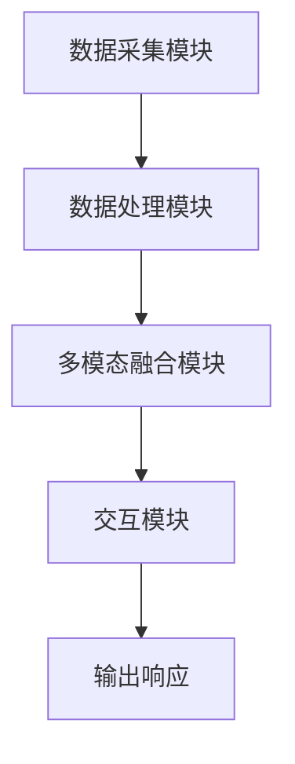
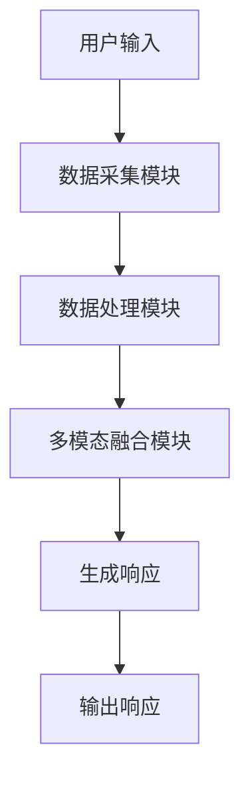

                 

# AI Agent的多模态交互：整合文本、语音和视觉

> 关键词：AI Agent，多模态交互，文本模态，语音模态，视觉模态，自然语言处理，计算机视觉，语音处理

> 摘要：随着人工智能技术的快速发展，AI Agent（智能体）在各个领域的应用越来越广泛。为了提高AI Agent的交互能力和用户体验，多模态交互技术应运而生。本文将深入探讨AI Agent中多模态交互的核心概念、技术原理、系统架构以及实际应用。通过整合文本、语音和视觉三种模态，本文将详细讲解如何构建一个高效、智能的多模态交互系统，并通过实际案例展示其在不同场景中的应用。

---

## 第一章: 多模态交互的基本概念

### 1.1 多模态交互的定义与特点

#### 1.1.1 多模态交互的定义
多模态交互是指通过多种感官渠道（如文本、语音、视觉等）进行信息交换和理解的过程。与单模态交互（仅依赖单一感官渠道）相比，多模态交互能够更全面地感知环境，提高交互的准确性和自然性。

#### 1.1.2 多模态交互的核心特点
- **信息互补性**：不同模态的数据能够互补，提供更丰富的信息。
- **鲁棒性**：通过结合多种模态数据，可以提高系统的抗干扰能力。
- **用户体验优化**：多模态交互能够更贴近人类的自然交互方式，提升用户体验。

#### 1.1.3 多模态交互与单模态交互的区别
| 特性             | 单模态交互                   | 多模态交互                   |
|------------------|------------------------------|------------------------------|
| 信息来源         | 单一感官渠道（如文本或语音）   | 多种感官渠道（文本、语音、视觉） |
| 信息处理能力     | 有限的上下文理解               | 更强的上下文理解和语境感知      |
| 用户体验         | 可能单一或受限                 | 更自然、更丰富                 |

### 1.2 AI Agent的基本概念

#### 1.2.1 AI Agent的定义
AI Agent（智能体）是一种能够感知环境、自主决策并执行任务的智能系统。它可以理解用户的需求，通过多种方式与用户进行交互，并根据反馈调整其行为。

#### 1.2.2 AI Agent的核心功能
- **感知**：通过多种模态数据感知环境和用户需求。
- **推理**：基于感知的数据进行分析和推理。
- **决策**：根据推理结果做出最优决策。
- **执行**：通过执行动作与环境或用户进行交互。

#### 1.2.3 AI Agent的应用场景
- 智能音箱：通过语音交互提供音乐播放、天气查询等功能。
- 智能客服：通过文本和语音交互解决用户问题。
- 智能助手：帮助用户完成日程管理、信息查询等任务。

### 1.3 多模态交互在AI Agent中的作用

#### 1.3.1 多模态交互的优势
- **提高准确性**：通过结合多种模态数据，可以更准确地理解用户意图。
- **增强用户体验**：多模态交互更贴近人类的自然交互方式，提升用户满意度。
- **扩展应用场景**：多模态交互能够处理复杂场景，扩展AI Agent的应用范围。

#### 1.3.2 多模态交互的挑战
- **数据融合难度**：如何有效地整合和处理多种模态数据是一个技术难题。
- **计算资源需求**：多模态交互需要大量的计算资源，对硬件要求较高。
- **隐私和安全问题**：多模态数据的收集和处理可能涉及用户隐私问题。

#### 1.3.3 多模态交互的未来发展趋势
- **跨模态学习**：通过跨模态学习技术，提高AI Agent对多种模态数据的理解能力。
- **实时交互**：优化多模态交互的实时性，提升用户体验。
- **个性化交互**：根据用户的个性化需求，提供定制化的多模态交互服务。

---

## 第二章: 文本模态的处理与交互

### 2.1 文本模态的基本概念

#### 2.1.1 文本模态的定义
文本模态是指通过文字形式进行信息交换和理解的模态。它是多模态交互中最常见和最重要的模态之一。

#### 2.1.2 文本模态的处理流程
1. **文本预处理**：包括分词、去停用词、词干提取等。
2. **文本表示**：通过词向量（如Word2Vec）将文本转化为数值表示。
3. **文本理解**：通过自然语言处理技术（如句法分析、语义理解）理解文本内容。
4. **文本生成**：通过生成模型（如GPT）生成自然语言文本。

#### 2.1.3 文本模态的关键技术
- **自然语言处理（NLP）**：包括分词、实体识别、句法分析、语义理解等技术。
- **文本生成**：包括基于规则的生成和基于深度学习的生成技术。

### 2.2 文本处理的算法原理

#### 2.2.1 自然语言处理（NLP）的基本原理
NLP的目标是让计算机能够理解、处理和生成人类语言。其核心流程包括文本预处理、特征提取、模型训练和结果输出。

#### 2.2.2 常见的文本处理算法
- **分词算法**：将文本分割成单词或短语。例如，基于字典的分词算法和基于统计的分词算法。
- **实体识别算法**：识别文本中的命名实体（如人名、地名、组织名）。例如，基于条件随机场（CRF）的实体识别算法。
- **文本生成算法**：基于生成对抗网络（GAN）和变换器（Transformer）的文本生成算法。

#### 2.2.3 文本生成的数学模型
文本生成的数学模型通常基于概率论。例如，生成对抗网络（GAN）通过最小化生成样本与真实样本的分布差异来生成文本；变换器（Transformer）通过自注意力机制捕捉文本的长距离依赖关系。

### 2.3 文本模态在AI Agent中的应用

#### 2.3.1 文本交互的流程
1. **用户输入**：用户通过文本形式输入需求，例如“我需要预订明天的机票”。
2. **文本预处理**：对输入的文本进行分词、去停用词等预处理。
3. **文本理解**：通过NLP技术理解用户的意图和需求。
4. **生成响应**：根据理解的用户需求生成相应的文本响应。
5. **输出响应**：将生成的文本响应返回给用户。

#### 2.3.2 文本模态与其他模态的结合
- **文本与语音结合**：例如，通过语音识别将用户的语音指令转化为文本，再通过文本生成生成语音响应。
- **文本与视觉结合**：例如，用户通过文本描述图像内容，AI Agent通过视觉模态进行图像识别并生成相应的文本或语音响应。

---

## 第三章: 语音模态的处理与交互

### 3.1 语音模态的基本概念

#### 3.1.1 语音模态的定义
语音模态是指通过语音形式进行信息交换和理解的模态。它是多模态交互中另一种重要的模态。

#### 3.1.2 语音模态的处理流程
1. **语音采集**：通过麦克风等设备采集用户的语音信号。
2. **语音预处理**：包括降噪、端点检测等。
3. **语音特征提取**：提取语音的特征，例如梅尔频率倒谱系数（MFCC）。
4. **语音识别**：将语音信号转换为文本或命令。
5. **语音合成**：将文本生成对应的语音信号。

#### 3.1.3 语音模态的关键技术
- **语音识别**：基于隐马尔可夫模型（HMM）和深度学习（如卷积神经网络CNN、长短期记忆网络LSTM）的语音识别技术。
- **语音合成**：基于声学模型和声码器的语音合成技术。

### 3.2 语音处理的算法原理

#### 3.2.1 语音识别的基本原理
语音识别的目标是将语音信号转换为对应的文本或命令。其核心流程包括语音特征提取、声学模型训练和语言模型构建。

#### 3.2.2 语音合成的基本原理
语音合成的目标是将文本生成对应的语音信号。其核心流程包括文本分析、声学参数生成和语音波形生成。

#### 3.2.3 常见的语音处理算法
- **语音识别算法**：基于HMM的语音识别算法和基于深度学习的语音识别算法。
- **语音合成算法**：基于规则的语音合成算法和基于深度学习的语音合成算法。

### 3.3 语音模态在AI Agent中的应用

#### 3.3.1 语音交互的流程
1. **用户输入**：用户通过语音形式输入需求，例如“我要听今天的天气预报”。
2. **语音采集**：通过麦克风采集用户的语音信号。
3. **语音预处理**：对语音信号进行降噪和端点检测。
4. **语音识别**：将语音信号转换为文本或命令。
5. **生成响应**：根据识别的用户需求生成相应的文本或语音响应。
6. **输出响应**：将生成的语音信号播放给用户。

#### 3.3.2 语音模态与其他模态的结合
- **语音与文本结合**：例如，通过语音识别将用户的语音指令转化为文本，再通过文本生成生成语音响应。
- **语音与视觉结合**：例如，用户通过语音指令控制AI Agent进行图像识别或生成图像内容。

---

## 第四章: 视觉模态的处理与交互

### 4.1 视觉模态的基本概念

#### 4.1.1 视觉模态的定义
视觉模态是指通过图像或视频形式进行信息交换和理解的模态。它是多模态交互中最复杂但也是最有潜力的模态之一。

#### 4.1.2 视觉模态的处理流程
1. **图像采集**：通过摄像头等设备采集图像或视频。
2. **图像预处理**：包括调整亮度、对比度、颜色均衡等。
3. **图像特征提取**：提取图像的特征，例如使用卷积神经网络（CNN）提取图像的高层特征。
4. **图像理解**：通过计算机视觉技术理解图像内容，例如目标检测、图像分割、场景理解。
5. **图像生成**：通过生成模型生成新的图像内容。

#### 4.1.3 视觉模态的关键技术
- **目标检测**：基于区域建议网络（RPN）和深度学习的物体检测技术。
- **图像分割**：基于U-Net等分割模型的图像分割技术。
- **图像生成**：基于生成对抗网络（GAN）的图像生成技术。

### 4.2 视觉处理的算法原理

#### 4.2.1 计算机视觉的基本原理
计算机视觉的目标是让计算机能够像人类一样理解和处理图像。其核心流程包括图像采集、图像处理、图像理解和图像生成。

#### 4.2.2 常见的视觉处理算法
- **目标检测算法**：基于RPN和Faster R-CNN的目标检测算法。
- **图像分割算法**：基于U-Net和Mask R-CNN的图像分割算法。
- **图像生成算法**：基于GAN和深度卷积生成对抗网络（DCGAN）的图像生成算法。

### 4.3 视觉模态在AI Agent中的应用

#### 4.3.1 视觉交互的流程
1. **用户输入**：用户通过图像或视频形式输入需求，例如“识别这张图片中的物体”。
2. **图像采集**：通过摄像头采集图像或视频。
3. **图像预处理**：对图像进行调整和增强。
4. **图像理解**：通过计算机视觉技术理解图像内容。
5. **生成响应**：根据理解的图像内容生成相应的文本或语音响应。
6. **输出响应**：将生成的文本或语音响应返回给用户。

#### 4.3.2 视觉模态与其他模态的结合
- **视觉与文本结合**：例如，用户通过图像描述文本内容，AI Agent通过文本生成图像内容。
- **视觉与语音结合**：例如，用户通过语音指令控制AI Agent进行图像识别或生成图像内容。

---

## 第五章: 多模态数据的整合与交互

### 5.1 多模态数据的整合方法

#### 5.1.1 多模态数据的融合方法
- **早期融合**：在感知层对多种模态数据进行融合。
- **晚期融合**：在高层进行特征融合。
- **多任务学习**：通过多任务学习框架同时处理多种模态数据。

#### 5.1.2 多模态数据的同步与对齐
- **时间对齐**：对具有时间依赖的模态数据（如语音和视频）进行同步处理。
- **空间对齐**：对具有空间依赖的模态数据（如图像和视频）进行对齐处理。

### 5.2 多模态数据的交互流程

#### 5.2.1 多模态数据的采集与预处理
- **数据采集**：通过多种传感器采集文本、语音和视觉数据。
- **数据预处理**：对采集的数据进行清洗和格式转换。

#### 5.2.2 多模态数据的特征提取与表示
- **文本特征提取**：通过词向量（如Word2Vec、GloVe）提取文本特征。
- **语音特征提取**：通过MFCC提取语音特征。
- **视觉特征提取**：通过卷积神经网络提取图像特征。

### 5.3 多模态数据的系统架构设计

#### 5.3.1 多模态交互系统的组成
- **数据采集模块**：负责采集文本、语音和视觉数据。
- **数据处理模块**：负责对采集的数据进行预处理和特征提取。
- **多模态融合模块**：负责对多种模态数据进行融合和对齐。
- **交互模块**：负责生成和输出交互响应。

#### 5.3.2 多模态交互系统的架构图

---

## 第六章: AI Agent的实现与应用

### 6.1 AI Agent的实现框架

#### 6.1.1 AI Agent的架构设计
- **模块化设计**：将AI Agent的功能模块化，例如感知模块、推理模块、决策模块和执行模块。
- **接口设计**：定义模块之间的接口，确保模块之间的通信和协作。

#### 6.1.2 AI Agent的核心算法实现
- **感知算法**：文本、语音和视觉数据的采集与处理。
- **推理算法**：基于感知数据进行分析和推理。
- **决策算法**：根据推理结果做出决策。
- **执行算法**：通过执行动作与环境或用户进行交互。

### 6.2 多模态交互系统的实现

#### 6.2.1 系统功能设计
- **用户输入**：支持文本、语音和视觉等多种输入方式。
- **数据处理**：对输入数据进行预处理和特征提取。
- **多模态融合**：对多种模态数据进行融合和对齐。
- **生成响应**：根据融合后的数据生成交互响应。
- **输出响应**：将生成的响应返回给用户。

#### 6.2.2 系统架构设计

### 6.3 多模态交互系统的实际案例

#### 6.3.1 案例分析：智能客服系统
- **系统功能**：支持文本和语音交互，能够理解用户的意图并生成相应的文本或语音响应。
- **实现细节**：文本交互基于NLP技术，语音交互基于语音识别和合成技术。
- **实际应用**：用户可以通过文本或语音与智能客服系统交互，解决常见问题。

#### 6.3.2 案例分析：智能助手系统
- **系统功能**：支持多模态交互，能够理解用户的复杂需求并生成相应的文本、语音或视觉响应。
- **实现细节**：文本交互基于NLP技术，语音交互基于语音识别和合成技术，视觉交互基于计算机视觉技术。
- **实际应用**：用户可以通过文本、语音或图像与智能助手系统交互，完成日程管理、信息查询等任务。

---

## 第七章: 多模态交互的未来展望

### 7.1 多模态交互技术的发展趋势
- **跨模态学习**：通过跨模态学习技术，进一步提高AI Agent对多种模态数据的理解能力。
- **实时交互**：优化多模态交互的实时性，提升用户体验。
- **个性化交互**：根据用户的个性化需求，提供定制化的多模态交互服务。

### 7.2 多模态交互技术的应用前景
- **医疗健康**：通过多模态交互技术，提高医疗诊断的准确性和效率。
- **教育领域**：通过多模态交互技术，提供更加个性化的学习体验。
- **工业应用**：通过多模态交互技术，优化工业生产流程，提高生产效率。

---

## 作者：AI天才研究院/AI Genius Institute & 禅与计算机程序设计艺术 /Zen And The Art of Computer Programming

