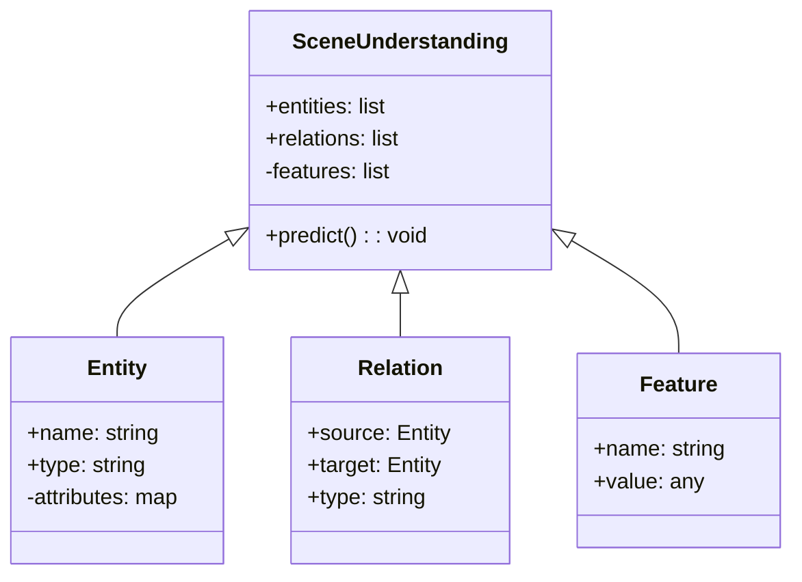
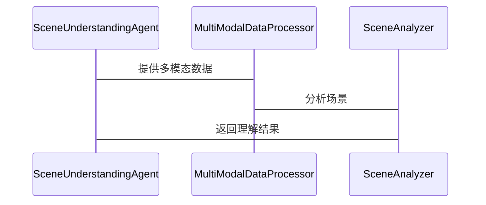

                 


# AI Agent的多模态场景理解技术

> 关键词：AI Agent，多模态场景理解，数据融合，场景分析，系统架构，项目实战

> 摘要：  
AI Agent的多模态场景理解技术是当前人工智能领域的重要研究方向，旨在通过整合多种数据模态（如文本、图像、语音等）来提升AI Agent对复杂场景的理解能力。本文系统地介绍了多模态场景理解的核心概念、算法原理、系统架构及实际应用案例。首先从背景与问题出发，分析了多模态场景理解的必要性与挑战；接着深入探讨了多模态数据的特征分析与融合方法；随后详细讲解了基于注意力机制和变换器的多模态融合算法；最后通过项目实战展示了如何将理论应用于实际场景。本文还提供了丰富的图表、代码示例和数学模型，帮助读者全面理解AI Agent的多模态场景理解技术。

---

## 第1章: 多模态场景理解的背景与问题

### 1.1 多模态场景理解的背景

#### 1.1.1 AI Agent的基本概念
AI Agent（人工智能代理）是一种能够感知环境、自主决策并执行任务的智能实体。它通过与环境交互，利用传感器获取信息，并基于这些信息做出决策，以完成特定目标。AI Agent广泛应用于自动驾驶、智能助手、机器人控制等领域。

#### 1.1.2 多模态数据的定义与特点
多模态数据是指来自不同感官渠道（如视觉、听觉、触觉等）的多种类型的数据。例如：
- 文本数据（Text）：结构化的语言信息，如自然语言文本。
- 图像数据（Image）：二维视觉信息，如照片、图表。
- 语音数据（Speech）：声音信号，如人类的语音。
- 视频数据（Video）：结合了图像和时间信息的动态视觉数据。
- 传感器数据（Sensor Data）：来自物理环境的实时感知数据，如温度、加速度等。

多模态数据的特点包括：
1. **多样性**：数据来自不同的模态，具有不同的特征。
2. **互补性**：不同模态的数据可以相互补充，提供更全面的信息。
3. **复杂性**：整合多种模态数据需要复杂的处理方法。

#### 1.1.3 多模态场景理解的必要性
在复杂的现实场景中，单一模态的数据往往不足以提供足够的信息来完成任务。例如：
- 在自动驾驶中，仅依赖视觉数据（图像）可能会因光照变化或遮挡导致识别困难，结合雷达、激光雷达等多模态数据可以提高感知的准确性。
- 在智能客服中，结合语音和文本数据可以更准确地理解用户需求。

---

### 1.2 多模态场景理解的核心问题

#### 1.2.1 场景理解的基本概念
场景理解是指AI Agent通过分析多模态数据，识别场景中的关键元素及其关系，从而理解场景的语义信息。例如：
- 在室内环境中，识别房间中的物体（如沙发、桌子）及其位置关系。
- 在交通场景中，识别车辆、行人及其运动关系。

#### 1.2.2 多模态数据融合的挑战
多模态数据融合的核心挑战在于如何有效整合来自不同模态的数据，同时保留或增强信息的有用性。主要挑战包括：
1. **模态异构性**：不同模态的数据具有不同的表示形式和特征，难以直接融合。
2. **信息冗余**：某些信息可能在多个模态中重复出现，需要去冗余处理。
3. **计算复杂性**：多模态数据的处理通常需要复杂的计算，对实时性要求较高的场景尤其困难。

#### 1.2.3 场景理解的边界与外延
场景理解的边界在于AI Agent能够识别和理解的场景范围。外延则指通过扩展数据模态或算法能力，使AI Agent能够理解更复杂或更多样化的场景。

---

## 第2章: 多模态数据与场景理解的关系

### 2.1 多模态数据的特征分析

#### 2.1.1 文本数据的特征
文本数据具有以下特征：
- **序列性**：文本数据通常是序列化的，具有语法和语义结构。
- **歧义性**：同一文本可能有多种解释，需要上下文信息来消除歧义。
- **情感性**：文本中可能蕴含情感信息，如积极、消极或中性情绪。

#### 2.1.2 图像数据的特征
图像数据具有以下特征：
- **二维性**：图像数据是二维的，通常由像素矩阵表示。
- **视觉冗余**：图像中可能包含大量冗余信息，需要通过特征提取来降维。
- **光照敏感性**：图像的外观可能因光照条件的变化而显著改变。

#### 2.1.3 语音数据的特征
语音数据具有以下特征：
- **时变性**：语音信号是时变的，需要通过时间序列分析来处理。
- **情感性**：语音中可能蕴含情感信息，如语调、语气的变化。
- **噪声敏感性**：语音信号容易受到环境噪声的干扰，需要降噪处理。

#### 2.1.4 其他模态数据的特征
- **视频数据**：结合了图像和时间信息，具有动态性。
- **传感器数据**：通常以数值形式表示，具有实时性和连续性。

---

### 2.2 多模态数据融合的原理

#### 2.2.1 数据融合的基本概念
数据融合是指将来自不同模态的数据进行整合，以获得更全面、更准确的信息。数据融合可以通过以下步骤实现：
1. **数据预处理**：对不同模态的数据进行标准化、归一化等预处理。
2. **特征提取**：从原始数据中提取有用的特征，如文本中的词向量、图像中的边缘特征等。
3. **特征融合**：将不同模态的特征进行融合，可以采用线性组合、加权融合等方式。
4. **场景理解**：基于融合后的特征，进行场景分析和语义理解。

#### 2.2.2 多模态数据融合的方法
多模态数据融合的方法可以分为以下几类：
1. **基于特征融合的方法**：将不同模态的特征直接进行线性或非线性组合。
2. **基于注意力机制的方法**：通过注意力机制动态调整不同模态特征的权重。
3. **基于变换器的方法**：利用变换器模型对多模态数据进行编码和解码。

#### 2.2.3 数据融合的效果评估
数据融合的效果可以通过以下指标进行评估：
1. **准确率**：分类任务中的正确分类比例。
2. **F1分数**：综合考虑精确率和召回率的指标。
3. **混淆矩阵**：用于分析模型对不同类别的混淆情况。

---

### 2.3 多模态场景理解的实体关系图

#### 2.3.1 实体关系图的构建
通过构建实体关系图，可以清晰地展示多模态场景理解中的实体及其关系。例如，在室内场景中，实体可以包括“沙发”、“桌子”、“椅子”等，关系可以包括“位于”、“靠近”等。

#### 2.3.2 实体关系图的分析
实体关系图的分析可以帮助AI Agent更好地理解场景中的空间关系和语义信息。例如，通过分析实体关系图，AI Agent可以确定一个物体的位置关系，从而做出更合理的决策。

#### 2.3.3 实体关系图的应用
实体关系图可以应用于场景重建、路径规划、目标识别等领域。例如，在自动驾驶中，实体关系图可以用于识别道路、车辆、行人的空间关系，从而做出更准确的驾驶决策。

---

## 第3章: 多模态场景理解的算法原理

### 3.1 多模态数据融合算法

#### 3.1.1 基于特征融合的算法
基于特征融合的算法将不同模态的特征进行线性组合，例如：
$$ y = w_1 x_1 + w_2 x_2 + \cdots + w_n x_n $$
其中，$x_i$ 是第$i$个模态的特征，$w_i$ 是对应的权重。

#### 3.1.2 基于注意力机制的算法
基于注意力机制的算法通过计算不同模态特征的重要性，动态调整其权重。例如：
$$ \alpha_i = \text{softmax}(W_a x_i) $$
其中，$\alpha_i$ 是第$i$个模态的注意力权重，$W_a$ 是注意力权重矩阵。

#### 3.1.3 基于变换器的算法
基于变换器的算法通过自注意力机制对多模态数据进行编码和解码。例如：
$$ \text{Attention}(Q, K, V) = \text{softmax}\left( \frac{QK^T}{\sqrt{d_k}} \right)V $$
其中，$Q$ 是查询向量，$K$ 是键向量，$V$ 是值向量，$d_k$ 是键向量的维度。

---

### 3.2 多模态数据融合的流程图

#### 3.2.1 数据输入与预处理
数据输入与预处理是多模态数据融合的第一步，包括数据的标准化、归一化等。

#### 3.2.2 模态特征提取
模态特征提取是从原始数据中提取有用的特征，例如从图像中提取边缘特征，从文本中提取词向量。

#### 3.2.3 特征融合与场景理解
特征融合是将不同模态的特征进行融合，例如通过线性组合、注意力机制等方式。场景理解是基于融合后的特征，进行场景分析和语义理解。

#### 3.2.4 结果输出与评估
结果输出与评估是多模态数据融合的最后一步，包括输出融合结果并评估其准确性。

---

### 3.3 多模态数据融合的数学模型

#### 3.3.1 基于线性组合的融合模型
$$ y = \sum_{i=1}^n w_i x_i $$
其中，$w_i$ 是第$i$个模态的权重，$x_i$ 是第$i$个模态的特征。

#### 3.3.2 基于注意力机制的融合模型
$$ y = \sum_{i=1}^n \alpha_i x_i $$
其中，$\alpha_i = \text{softmax}(W_a x_i)$ 是第$i$个模态的注意力权重，$W_a$ 是注意力权重矩阵。

#### 3.3.3 基于图神经网络的融合模型
$$ y = \text{GNN}(X, A) $$
其中，$X$ 是多模态特征矩阵，$A$ 是实体关系图的邻接矩阵，$\text{GNN}$ 是图神经网络模型。

---

## 第4章: 多模态场景理解的系统架构设计

### 4.1 项目背景与目标
本项目旨在设计一个能够理解多模态场景的AI Agent系统，目标是通过整合文本、图像、语音等多种数据模态，提升AI Agent对复杂场景的理解能力。

---

### 4.2 系统功能设计

#### 4.2.1 领域模型类图
以下是系统功能设计的领域模型类图：



---

#### 4.2.2 系统架构设计


---

#### 4.2.3 系统接口设计



---

## 第5章: 多模态场景理解的项目实战

### 5.1 项目背景与目标
本项目旨在设计一个能够理解多模态场景的AI Agent系统，目标是通过整合文本、图像、语音等多种数据模态，提升AI Agent对复杂场景的理解能力。

---

### 5.2 核心代码实现

#### 5.2.1 环境安装
```bash
pip install numpy
pip install tensorflow
pip install pymermaid
```

---

#### 5.2.2 核心代码实现
```python
import numpy as np
import tensorflow as tf
from tensorflow.keras import layers

# 定义多模态数据融合模型
class MultiModalFusion(tf.keras.Model):
    def __init__(self, text_dim, image_dim, speech_dim):
        super(MultiModalFusion, self).__init__()
        self.text_proj = layers.Dense(128, activation='relu')
        self.image_proj = layers.Dense(128, activation='relu')
        self.speech_proj = layers.Dense(128, activation='relu')
        self.attention = layers.Dense(3, activation='softmax')

    def call(self, text_input, image_input, speech_input):
        text_feat = self.text_proj(text_input)
        image_feat = self.image_proj(image_input)
        speech_feat = self.speech_proj(speech_input)
        feat = tf.stack([text_feat, image_feat, speech_feat], axis=-1)
        attention_weights = self.attention(feat)
        fused_feat = tf.reduce_sum(feat * attention_weights, axis=-1)
        return fused_feat

# 定义场景理解模型
class SceneUnderstanding(tf.keras.Model):
    def __init__(self):
        super(SceneUnderstanding, self).__init__()
        self.modality_fusion = MultiModalFusion(128, 128, 128)
        self.classifier = layers.Dense(10, activation='softmax')

    def call(self, text_input, image_input, speech_input):
        fused_feat = self.modality_fusion(text_input, image_input, speech_input)
        output = self.classifier(fused_feat)
        return output
```

---

### 5.3 代码解读与分析
上述代码定义了一个多模态数据融合模型和场景理解模型。多模态数据融合模型通过投影层和注意力机制对不同模态的特征进行融合，场景理解模型基于融合后的特征进行分类。

---

### 5.4 实际案例分析
以下是一个实际案例的分析：
```python
# 示例数据
text_input = np.random.randn(1, 128)
image_input = np.random.randn(1, 128)
speech_input = np.random.randn(1, 128)

# 前向传播
model = SceneUnderstanding()
output = model(text_input, image_input, speech_input)
print(output)
```

---

## 第6章: 多模态场景理解的最佳实践

### 6.1 最佳实践Tips
1. 在数据预处理阶段，建议对不同模态的数据进行标准化或归一化处理，以减少模态异构性的影响。
2. 在特征提取阶段，建议根据具体任务选择合适的特征提取方法，例如使用预训练模型提取图像特征，使用词嵌入提取文本特征。
3. 在特征融合阶段，建议尝试不同的融合方法，如线性组合、注意力机制等，以找到最优的融合策略。
4. 在场景理解阶段，建议结合领域知识，构建合适的实体关系图，以提高理解的准确性和效率。

---

### 6.2 小结
本文系统地介绍了AI Agent的多模态场景理解技术，从背景与问题、核心概念、算法原理、系统架构到项目实战，全面阐述了多模态场景理解的各个方面。通过本文的学习，读者可以掌握多模态场景理解的核心技术，并将其应用于实际项目中。

---

### 6.3 注意事项
- 在实际应用中，需要根据具体场景和任务选择合适的多模态数据融合方法。
- 在处理多模态数据时，需要注意数据的异构性和冗余性，避免信息损失或冗余。
- 在设计系统架构时，需要充分考虑系统的可扩展性和可维护性，以应对未来可能的需求变化。

---

### 6.4 拓展阅读
1. [Multi-modal machine learning](https://en.wikipedia.org/wiki/Multi-modal_machine_learning)
2. [Attention mechanisms in deep learning](https://www.deepparadox.com/attention-is-all-you-need.html)
3. [Graph neural networks](https://towardsdatascience.com/graph-neural-networks-198d4b0769a8)

---

## 作者：AI天才研究院/AI Genius Institute & 禅与计算机程序设计艺术 /Zen And The Art of Computer Programming

