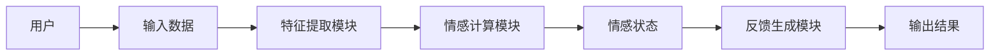
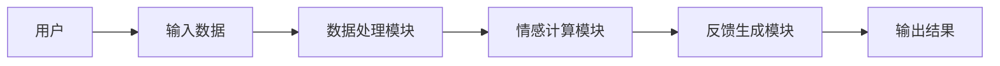
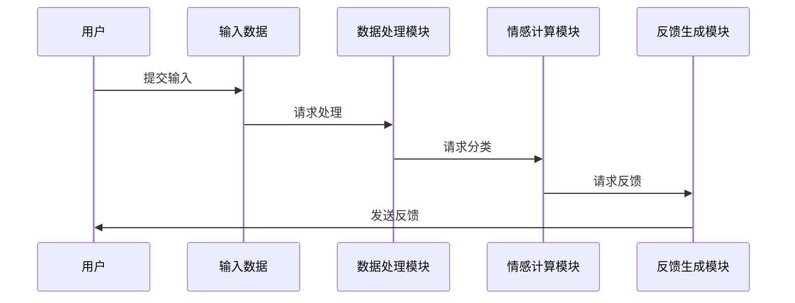

                 


# AI Agent的多模态情感交互系统设计

> **关键词**：AI Agent，多模态交互，情感计算，系统设计，算法原理

> **摘要**：本文深入探讨了AI Agent的多模态情感交互系统的设计与实现。通过分析多模态数据的融合与处理、情感计算的原理与算法、系统架构的设计与优化，结合实际项目案例，详细阐述了如何构建一个高效、智能且具备情感交互能力的AI Agent系统。文章从背景介绍、核心概念、算法实现、系统架构到项目实战，全面解析了多模态情感交互系统的关键技术与实践方法。

---

# 第1章: AI Agent与多模态情感交互系统概述

## 1.1 AI Agent的基本概念

### 1.1.1 AI Agent的定义与特点
AI Agent（人工智能代理）是指能够感知环境、自主决策并执行任务的智能体。其核心特点包括：
- **自主性**：无需外部干预，自主完成任务。
- **反应性**：能够实时感知环境并做出反应。
- **社会性**：能够与其他系统或用户进行交互。
- **学习能力**：通过数据和经验不断优化自身性能。

### 1.1.2 多模态交互的定义与优势
多模态交互是指通过多种感官（如视觉、听觉、触觉等）与用户进行互动的方式。其优势在于：
- 提供更自然的交互体验。
- 提高系统的容错性和鲁棒性。
- 支持更复杂的情感理解和表达。

### 1.1.3 情感交互的核心目标与意义
情感交互的目标是让AI Agent能够理解并回应用户的情感状态，从而提供更贴心的服务。其意义在于：
- 提升用户体验，增强用户满意度。
- 增强系统的智能化和人性化。
- 扩展AI Agent的应用场景，如情感支持、教育、医疗等领域。

---

## 1.2 多模态情感交互系统的背景与现状

### 1.2.1 当前AI Agent的发展趋势
随着AI技术的快速发展，AI Agent正从单一功能的工具向具备多模态交互能力的智能体演变。现代AI Agent需要能够处理文本、语音、图像等多种数据类型，并结合上下文信息进行推理和决策。

### 1.2.2 多模态情感交互的市场需求
在教育、医疗、客服等领域，用户对情感交互的需求日益增长。例如，智能客服系统需要能够理解用户的焦虑情绪，并提供相应的解决方案。情感交互能够显著提升用户体验，从而为企业创造更大的价值。

### 1.2.3 现有系统的主要挑战与不足
尽管多模态情感交互系统已取得一定进展，但仍然面临以下挑战：
- **数据融合难度**：不同模态的数据如何有效融合仍是一个难题。
- **情感计算精度**：现有算法在复杂情感场景下的准确率有待提高。
- **实时性与效率**：多模态数据处理的实时性和计算效率需要优化。

---

## 1.3 本章小结
本章从AI Agent的基本概念出发，介绍了多模态情感交互的定义、优势及应用场景，分析了当前系统的主要挑战。这些内容为后续章节的深入探讨奠定了基础。

---

# 第2章: 多模态情感交互系统的核心原理

## 2.1 多模态数据的融合与处理

### 2.1.1 文本、语音、图像等多模态数据的特征提取
- **文本特征**：包括词袋模型、TF-IDF、词嵌入（如Word2Vec）等。
- **语音特征**：包括音调、语速、语调等语音特征，以及声学特征（如MFCC）。
- **图像特征**：包括颜色、纹理、形状等视觉特征，以及基于深度学习的图像表示（如CNN）。

### 2.1.2 多模态数据融合的常用方法
- **早期融合**：在特征提取阶段进行融合。
- **晚期融合**：在高层语义空间进行融合。
- **自适应融合**：根据任务需求动态调整融合方式。

### 2.1.3 情感计算的基本原理
情感计算旨在通过分析多模态数据，推断出用户的情感状态（如快乐、悲伤、愤怒等）。其核心步骤包括：
1. 数据采集：获取文本、语音、图像等多模态数据。
2. 特征提取：从数据中提取情感相关的特征。
3. 情感分类：基于特征进行情感状态的分类。

---

## 2.2 情感计算与多模态数据的关系

### 2.2.1 情感计算的核心模型与算法
- **基于规则的模型**：通过预定义的规则匹配情感特征。
- **基于统计的模型**：如朴素贝叶斯、支持向量机（SVM）。
- **基于深度学习的模型**：如卷积神经网络（CNN）、循环神经网络（RNN）、Transformer模型。

### 2.2.2 多模态数据在情感计算中的作用
多模态数据能够提供更丰富的上下文信息，从而提高情感计算的准确性和鲁棒性。例如，结合文本和语音数据可以更好地捕捉用户的真正情感。

### 2.2.3 情感计算与实际应用场景的结合
在智能客服系统中，情感计算可以用于识别用户的焦虑情绪，并提供相应的解决方案。在教育领域，情感计算可以帮助教师更好地理解学生的学习状态。

---

## 2.3 多模态情感交互系统的实体关系图

### 2.3.1 实体关系图的定义与作用
实体关系图（ER图）用于描述系统中各实体之间的关系。在多模态情感交互系统中，主要实体包括用户、数据源、特征提取模块、情感计算模块和反馈生成模块。

### 2.3.2 使用 Mermaid 绘制的实体关系图



---

## 2.4 本章小结
本章详细介绍了多模态数据的融合与处理方法，分析了情感计算的核心原理，并通过实体关系图展示了系统的整体架构。

---

# 第3章: 多模态情感交互系统的算法原理

## 3.1 基于文本的情感分析算法

### 3.1.1 文本预处理与特征提取
文本预处理包括分词、去除停用词、词干提取等步骤。特征提取可以采用词袋模型或词嵌入（如Word2Vec）。

### 3.1.2 基于深度学习的情感分析模型
- **卷积神经网络（CNN）**：通过卷积操作提取文本的局部特征。
- **循环神经网络（RNN）**：适合处理序列数据，捕捉文本的上下文信息。
- **Transformer模型**：基于自注意力机制，能够捕捉长距离依赖关系。

### 3.1.3 情感计算的数学模型
情感分类的数学模型可以表示为：
$$ P(y|x) = \frac{P(x|y)P(y)}{P(x)} $$
其中，$y$表示情感类别，$x$表示输入特征。

---

## 3.2 基于语音的情感识别算法

### 3.2.1 语音特征提取
常用的语音特征包括MFCC（Mel-Frequency Cepstral Coefficients）和谱图特征。

### 3.2.2 语音情感分类模型
- **基于GMM的模型**：通过高斯混合模型对语音特征进行建模。
- **基于深度学习的模型**：如CNN、RNN和Transformer模型。

---

## 3.3 多模态情感融合算法

### 3.3.1 多模态数据融合的数学模型
多模态情感融合可以通过加权融合的方式实现：
$$ f(x) = \sum_{i=1}^{n} w_i x_i $$
其中，$w_i$是第$i$个模态的权重，$x_i$是第$i$个模态的特征。

### 3.3.2 基于注意力机制的融合方法
注意力机制可以通过自注意力网络对多模态数据进行加权融合。

---

## 3.4 本章小结
本章详细介绍了基于文本和语音的情感分析算法，以及多模态情感融合的数学模型和算法实现。

---

# 第4章: 多模态情感交互系统的数学模型与公式

## 4.1 情感计算的核心数学模型

### 4.1.1 情感分类的数学公式
$$ P(y|x) = \frac{P(x|y)P(y)}{P(x)} $$

### 4.1.2 基于深度学习的情感计算模型
- **CNN模型**：通过卷积操作提取局部特征。
- **RNN模型**：通过循环结构捕捉序列信息。
- **Transformer模型**：通过自注意力机制捕捉长距离依赖。

---

## 4.2 多模态数据融合的数学公式

### 4.2.1 基于线性加权的融合公式
$$ f(x) = \sum_{i=1}^{n} w_i x_i $$

### 4.2.2 基于非线性变换的融合公式
$$ f(x) = \sigma(Wx + b) $$

其中，$\sigma$表示激活函数，$W$和$b$分别是权重和偏置。

---

## 4.3 本章小结
本章通过数学公式详细描述了情感计算和多模态数据融合的核心模型，为后续的系统实现提供了理论基础。

---

# 第5章: 多模态情感交互系统的系统架构设计

## 5.1 系统功能设计

### 5.1.1 用户输入模块
负责接收用户的多模态输入，包括文本、语音和图像数据。

### 5.1.2 数据处理模块
对输入数据进行预处理和特征提取，生成可供后续处理的特征向量。

### 5.1.3 情感计算模块
基于特征向量进行情感分类，输出用户的情感状态。

### 5.1.4 反馈生成模块
根据情感计算结果生成相应的反馈信息，并输出给用户。

---

## 5.2 系统架构设计

### 5.2.1 系统架构图


### 5.2.2 模块之间的数据流
- 用户输入数据（文本、语音、图像） → 数据处理模块 → 特征向量 → 情感计算模块 → 情感状态 → 反馈生成模块 → 反馈输出。

---

## 5.3 接口设计与交互序列图

### 5.3.1 接口设计
- **输入接口**：接收用户的多模态数据。
- **输出接口**：发送反馈信息给用户。

### 5.3.2 交互序列图


---

## 5.4 本章小结
本章通过系统功能设计和架构设计，详细描述了多模态情感交互系统的整体架构，并通过交互序列图展示了模块之间的协作流程。

---

# 第6章: 多模态情感交互系统的项目实战

## 6.1 项目环境安装

### 6.1.1 安装Python环境
```bash
python --version
pip install -i https://pypi.tuna.tsinghua.edu.cn/simple
```

### 6.1.2 安装依赖库
```bash
pip install numpy
pip install scikit-learn
pip install tensorflow
```

---

## 6.2 系统核心实现

### 6.2.1 数据处理模块实现
```python
import numpy as np
from sklearn.feature_extraction.text import TfidfVectorizer

def preprocess(text):
    # 文本预处理
    vectorizer = TfidfVectorizer()
    features = vectorizer.fit_transform([text]).toarray()
    return features
```

### 6.2.2 情感计算模块实现
```python
import tensorflow as tf
from tensorflow.keras import layers

model = tf.keras.Sequential([
    layers.Dense(64, activation='relu'),
    layers.Dense(1, activation='sigmoid')
])
model.compile(optimizer='adam', loss='binary_crossentropy', metrics=['accuracy'])
```

---

## 6.3 项目案例分析

### 6.3.1 案例背景
假设我们正在开发一个智能客服系统，用户输入文本和语音数据，系统需要识别用户的情感状态并提供相应的解决方案。

### 6.3.2 案例实现
```python
def main():
    text = "我感到非常生气！"
    features = preprocess(text)
    prediction = model.predict(features)
    print("情感状态：", prediction)

if __name__ == "__main__":
    main()
```

---

## 6.4 本章小结
本章通过项目实战，详细讲解了多模态情感交互系统的环境搭建、核心功能实现以及案例分析，为读者提供了从理论到实践的完整指导。

---

# 第7章: 总结与展望

## 7.1 本章总结
本文从背景介绍、核心概念、算法原理、系统架构到项目实战，全面解析了AI Agent的多模态情感交互系统的实现过程。通过数学公式、算法实现和系统设计，为读者提供了丰富的理论知识和实践指导。

## 7.2 未来展望
随着AI技术的不断发展，多模态情感交互系统将具备更强大的功能和更广泛的应用场景。未来的研究方向包括：
- 提高情感计算的准确性和鲁棒性。
- 优化多模态数据融合的方法。
- 探索更高效的情感交互算法。

---

## 7.3 注意事项
- 在实际应用中，需注意数据隐私和用户隐私保护。
- 多模态数据的处理需要考虑计算资源和实时性问题。
- 情感计算的模型需要不断优化以适应复杂的情感场景。

---

## 7.4 拓展阅读
- 《Deep Learning for Natural Language Processing》
- 《Multi-modal Data Fusion: A Survey》
- 《Emotion Recognition in Text and Voice》

---

# 作者：AI天才研究院 & 禅与计算机程序设计艺术

