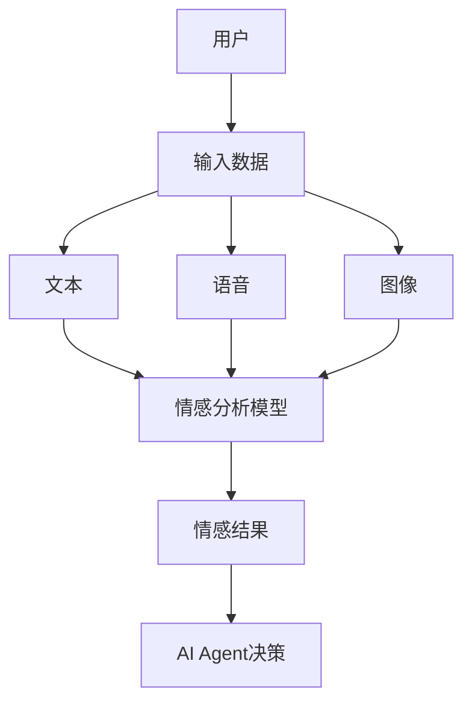
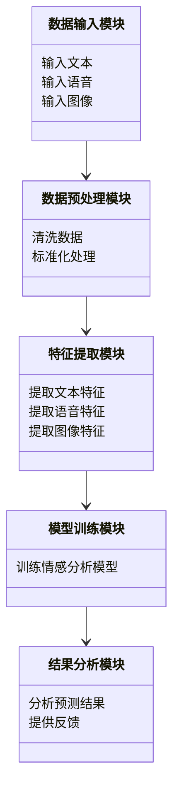
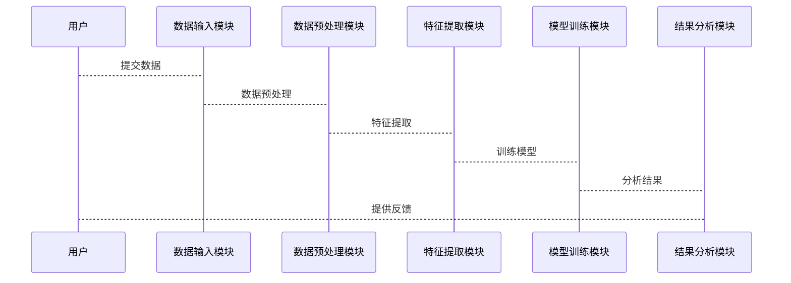

                 


# AI Agent的多模态情感分析系统

> 关键词：AI Agent, 多模态情感分析, 情感计算, 自然语言处理, 多模态数据

> 摘要：本文探讨AI Agent在多模态情感分析系统中的应用，从理论基础到算法实现，再到系统架构设计，全面解析多模态情感分析的核心原理和实际应用。通过分析多模态数据的整合与处理方法，结合AI Agent的自适应能力，提出了一种创新的情感分析框架，旨在提升情感分析的准确性和实用性。

---

# 第一部分: 多模态情感分析系统背景与问题背景

## # 第1章: 多模态情感分析系统背景与问题背景

### ## 1.1 多模态情感分析的定义与特点
#### ### 1.1.1 情感分析的基本概念
情感分析是自然语言处理（NLP）中的一个核心任务，旨在通过分析文本数据来判断文本中的情感倾向（如正面、负面或中性）。传统的情感分析主要基于文本数据，但随着技术的发展，多模态情感分析逐渐成为研究热点。

#### ### 1.1.2 多模态数据的定义
多模态数据是指结合了多种数据形式（如文本、语音、图像、视频等）的数据。与单模态数据相比，多模态数据能够提供更丰富的信息，从而更全面地反映用户的情感状态。

#### ### 1.1.3 多模态情感分析的核心特点
1. **信息丰富性**：结合多种数据模态，能够从多个角度捕捉用户情感。
2. **鲁棒性**：通过多模态数据的互补性，提升情感分析的准确性和稳定性。
3. **应用场景广泛**：适用于智能客服、虚拟助手、社交媒体分析等领域。

### ## 1.2 AI Agent与情感分析的结合
#### ### 1.2.1 AI Agent的基本概念
AI Agent（智能体）是指能够感知环境并采取行动以实现目标的智能实体。AI Agent可以通过传感器或接口与外部环境交互，并根据接收到的信息做出决策。

#### ### 1.2.2 情感分析在AI Agent中的作用
情感分析是AI Agent理解用户意图和情感状态的关键技术。通过情感分析，AI Agent能够更好地理解用户的反馈，从而提供更智能化的服务。

#### ### 1.2.3 多模态情感分析的必要性
在实际应用中，用户的情感状态可能通过多种方式表达，如语气、表情、肢体语言等。因此，仅依赖单一模态的数据可能无法准确捕捉用户的情感。多模态情感分析能够更全面地理解用户的情感，从而提升AI Agent的交互能力。

### ## 1.3 问题背景与问题描述
#### ### 1.3.1 当前情感分析的局限性
传统的情感分析方法主要依赖于文本数据，存在以下局限性：
- **信息片面性**：无法捕捉用户的语气、表情等非文本信息。
- **情感复杂性**：难以处理混合情感或模糊情感的表达。

#### ### 1.3.2 多模态数据的优势
多模态数据能够提供更丰富的信息，从而弥补传统情感分析的局限性：
- **信息互补性**：通过结合多种数据模态，提升情感分析的准确性。
- **情感表达多样性**：能够捕捉更多的情感线索，如语音中的语调变化、图像中的表情等。

#### ### 1.3.3 问题解决的思路与目标
目标是通过结合AI Agent和多模态情感分析技术，构建一个能够理解并处理多模态情感数据的系统，从而提升AI Agent的交互能力和情感理解能力。

### ## 1.4 边界与外延
#### ### 1.4.1 多模态情感分析的边界
多模态情感分析的边界主要体现在以下几个方面：
- **数据输入范围**：仅限于特定的多模态数据（如文本、语音、图像）。
- **情感分析范围**：主要关注用户的情感状态，不涉及其他高级认知任务（如意图识别）。
- **应用场景限制**：适用于需要情感分析的特定领域（如智能客服、虚拟助手等）。

#### ### 1.4.2 与其他技术的区分
多模态情感分析与传统情感分析的主要区别在于数据输入的模态数量和处理方式。传统情感分析主要依赖文本数据，而多模态情感分析结合了多种数据模态，能够更全面地捕捉用户情感。

#### ### 1.4.3 系统的外延与应用场景
多模态情感分析系统的外延包括以下内容：
- **数据输入扩展**：支持更多类型的多模态数据（如视频、手势等）。
- **情感分析扩展**：支持更复杂的情感分析任务（如情感强度分析、情感原因分析等）。
- **应用场景扩展**：适用于更多领域，如教育、医疗、娱乐等。

---

## # 第2章: 多模态情感分析系统的核心概念与联系

### ## 2.1 核心概念原理
多模态情感分析系统的核心原理是通过结合多种数据模态，利用AI Agent的自适应能力，对用户的情感状态进行分析和理解。具体来说，系统需要完成以下几个步骤：
1. **数据输入**：接收多种数据模态（如文本、语音、图像等）。
2. **数据预处理**：对输入数据进行清洗和标准化处理。
3. **特征提取**：从数据中提取有助于情感分析的特征（如文本中的情感词、语音中的语调特征、图像中的面部表情特征等）。
4. **模型训练**：利用机器学习或深度学习算法，训练情感分析模型。
5. **结果分析**：根据模型输出的结果，判断用户的情感状态。

### ## 2.2 核心概念属性对比表
以下是对多模态情感分析与传统情感分析的属性对比：

| 属性               | 单模态情感分析       | 多模态情感分析       |
|--------------------|---------------------|---------------------|
| 数据输入           | 文本、语音等单一模态 | 文本、语音、图像等多种模态 |
| 处理复杂度         | 较低                | 较高                |
| 应用场景           | 有限                | 广泛                |
| 情感捕捉能力       | 有限                | 更强                |

### ## 2.3 ER实体关系图
以下是一个简单的实体关系图，展示了多模态情感分析系统的主要实体及其关系：



---

## # 第3章: 多模态情感分析系统的算法原理

### ## 3.1 算法流程
以下是多模态情感分析系统的算法流程：

1. **数据输入**：接收多种模态的数据（如文本、语音、图像）。
2. **数据预处理**：对输入数据进行清洗和标准化处理。
3. **特征提取**：从数据中提取有助于情感分析的特征（如文本中的情感词、语音中的语调特征、图像中的面部表情特征等）。
4. **模型训练**：利用机器学习或深度学习算法，训练情感分析模型。
5. **结果分析**：根据模型输出的结果，判断用户的情感状态。

### ## 3.2 算法实现代码
以下是一个简单的多模态情感分析系统的实现代码示例：

```python
import numpy as np
from sklearn.model_selection import train_test_split
from sklearn.linear_model import LogisticRegression
from sklearn.metrics import accuracy_score

# 示例数据集
texts = ["I love this movie", "I hate this movie", "This is great!", "This is terrible!"]
labels = [1, 0, 1, 0]

# 数据预处理
from sklearn.feature_extraction.text import TfidfVectorizer
vectorizer = TfidfVectorizer()
text_features = vectorizer.fit_transform(texts).toarray()

# 模型训练
model = LogisticRegression()
model.fit(text_features, labels)

# 预测
test_texts = ["I really like this", "I don't like this at all"]
test_features = vectorizer.transform(test_texts).toarray()
predictions = model.predict(test_features)

# 结果分析
print("预测结果：", predictions)
print("准确率：", accuracy_score([1, 0], predictions))
```

### ## 3.3 算法原理的数学模型和公式
以下是情感分析模型的数学模型示例：

$$
P(y|X) = \frac{P(X|y)P(y)}{P(X)}
$$

其中，$X$ 是输入数据，$y$ 是情感类别。通过计算每个情感类别在输入数据下的概率，可以选择概率最大的类别作为预测结果。

---

## # 第4章: 多模态情感分析系统的系统分析与架构设计

### ## 4.1 问题场景介绍
多模态情感分析系统的应用场景包括智能客服、虚拟助手、社交媒体分析等。在这些场景中，系统需要能够同时处理多种数据模态，并准确判断用户的情感状态。

### ## 4.2 系统功能设计
以下是系统的主要功能设计：

1. **数据输入与预处理**：接收多种模态的数据，并进行清洗和标准化处理。
2. **特征提取**：从数据中提取有助于情感分析的特征。
3. **模型训练与预测**：利用机器学习或深度学习算法，训练情感分析模型，并进行预测。
4. **结果分析与反馈**：根据模型输出的结果，判断用户的情感状态，并提供相应的反馈。

### ## 4.3 系统架构设计
以下是系统架构设计的类图：



### ## 4.4 系统接口设计
以下是系统接口设计的序列图：



---

## # 第5章: 多模态情感分析系统的项目实战

### ## 5.1 环境安装
以下是项目实战所需的环境安装步骤：

1. **安装Python**：确保安装了最新版本的Python。
2. **安装必要的库**：安装以下Python库：
   - `numpy`
   - `scikit-learn`
   - `tensorflow`
   - `pytorch`

### ## 5.2 系统核心实现源代码
以下是多模态情感分析系统的实现代码示例：

```python
import numpy as np
from sklearn.model_selection import train_test_split
from sklearn.linear_model import LogisticRegression
from sklearn.metrics import accuracy_score

# 示例数据集
texts = ["I love this movie", "I hate this movie", "This is great!", "This is terrible!"]
labels = [1, 0, 1, 0]

# 数据预处理
from sklearn.feature_extraction.text import TfidfVectorizer
vectorizer = TfidfVectorizer()
text_features = vectorizer.fit_transform(texts).toarray()

# 模型训练
model = LogisticRegression()
model.fit(text_features, labels)

# 预测
test_texts = ["I really like this", "I don't like this at all"]
test_features = vectorizer.transform(test_texts).toarray()
predictions = model.predict(test_features)

# 结果分析
print("预测结果：", predictions)
print("准确率：", accuracy_score([1, 0], predictions))
```

### ## 5.3 代码应用解读与分析
以下是代码的解读与分析：

1. **数据输入与预处理**：使用`TfidfVectorizer`对文本数据进行特征提取。
2. **模型训练**：使用逻辑回归模型对特征数据进行训练。
3. **结果分析**：根据模型输出的结果，判断用户的情感状态，并计算准确率。

### ## 5.4 实际案例分析和详细讲解剖析
以下是实际案例分析：

假设我们有一个智能客服系统，用户提交了以下反馈：
- "This service is terrible"（情感：负面）
- "The support is excellent"（情感：正面）

通过多模态情感分析系统，我们可以结合用户的文本、语音和表情数据，更准确地判断用户的情感状态。

### ## 5.5 项目小结
通过本次项目实战，我们掌握了多模态情感分析系统的实现方法，包括数据预处理、特征提取、模型训练和结果分析等步骤。同时，我们也认识到多模态数据在情感分析中的重要性，以及AI Agent在实际应用中的潜力。

---

## # 第6章: 多模态情感分析系统的最佳实践、小结、注意事项和拓展阅读

### ## 6.1 最佳实践
1. **数据质量**：确保输入数据的质量，减少噪声对模型的影响。
2. **模型选择**：根据具体场景选择合适的模型，如深度学习模型在复杂任务中表现更好。
3. **实时性优化**：优化系统性能，确保实时应用场景的响应速度。

### ## 6.2 小结
本文详细介绍了多模态情感分析系统的核心概念、算法原理和系统架构设计，并通过项目实战展示了系统的实现过程。通过本文的学习，读者可以掌握多模态情感分析的基本方法，并能够将其应用于实际场景中。

### ## 6.3 注意事项
1. **数据隐私**：在处理用户数据时，需要注意数据隐私保护。
2. **模型泛化能力**：在实际应用中，需要关注模型的泛化能力，避免过拟合。
3. **系统可扩展性**：设计系统时，应考虑其可扩展性，以便未来添加更多数据模态或功能。

### ## 6.4 拓展阅读
1. **《Deep Learning for Multimodal Sentiment Analysis》
2. **《AI Agent: Theory and Practice》
3. **《Natural Language Processing with PyTorch》

---

# 作者：AI天才研究院/AI Genius Institute & 禅与计算机程序设计艺术 /Zen And The Art of Computer Programming

---

通过本文的详细阐述，我们全面解析了AI Agent的多模态情感分析系统的理论基础和实际应用。希望本文能够为读者提供有价值的参考和启发，帮助他们在多模态情感分析领域取得更大的突破。

