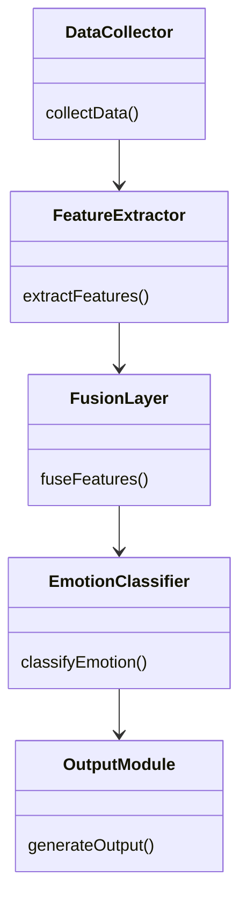
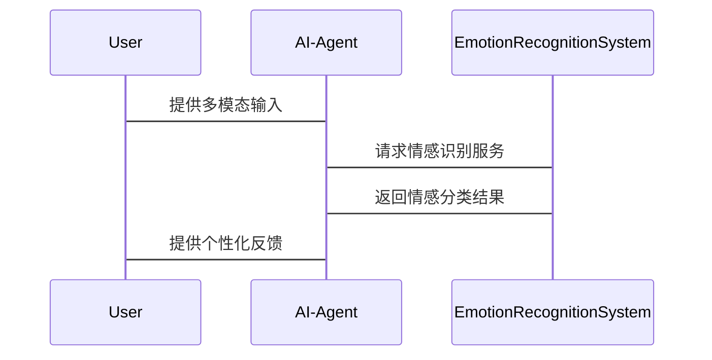

                 


# AI Agent的多模态情感识别技术

> 关键词：AI Agent，多模态情感识别，深度学习，注意力机制，文本语音图像融合

> 摘要：本文详细探讨了AI Agent在多模态情感识别技术中的应用，从背景概念、算法原理到系统架构设计，再到项目实战，系统性地分析了多模态情感识别的核心技术与实现方法。文章结合理论与实践，深入解读了基于深度学习的多模态数据融合算法，并通过具体案例展示了AI Agent在多模态情感识别中的实际应用。

---

## 第一部分: AI Agent与多模态情感识别技术概述

### 第1章: 多模态情感识别技术的背景与概念

#### 1.1 情感识别技术的发展背景
##### 1.1.1 情感计算的定义与研究现状
情感计算（Affective Computing）是人工智能领域的重要分支，旨在通过计算机技术识别人类情感、情绪和心理状态。情感计算的核心目标是让计算机具备理解和处理人类情感的能力，从而实现更自然的人机交互。

##### 1.1.2 多模态数据的引入及其优势
传统的情感识别技术主要依赖单一模态的数据（如文本或语音），但这种方法在实际应用中存在诸多限制。例如，仅依赖文本的情感分析难以捕捉语气、语调等情感特征，而仅依赖语音的情感识别则难以理解上下文语境。通过引入多模态数据（如文本、语音、图像等），可以显著提升情感识别的准确性和鲁棒性。

##### 1.1.3 AI Agent在情感识别中的应用价值
AI Agent（人工智能代理）是一种能够自主执行任务的智能实体，其核心能力包括感知、决策和行动。在情感识别领域，AI Agent可以通过多模态数据融合技术，实时识别人类情感，并根据情感状态调整交互策略。例如，在智能客服、智能家居、虚拟助手等场景中，AI Agent可以通过多模态情感识别技术提供更加智能化和个性化的服务。

---

#### 1.2 多模态情感识别的核心概念
##### 1.2.1 多模态数据的定义与分类
多模态数据是指来自不同感官渠道（如视觉、听觉、触觉等）的数据类型。在情感识别领域，主要涉及的模态包括：
1. 文本（Text）：包括自然语言文本、聊天记录等。
2. 语音（Audio）：包括语音信号、语调、语气等。
3. 图像（Image）：包括面部表情、肢体语言等视觉信息。
4. 姿势（Pose）：包括身体姿势、手势等。

##### 1.2.2 情感识别的维度与层次
情感识别可以从多个维度进行分类，例如：
- 时间维度：实时情感识别与长期情感分析。
- 情感强度维度：微情绪（micro-emotion）与宏观情绪（macro-emotion）。
- 情感类型维度：基本情绪（如快乐、悲伤）与复杂情绪（如嫉妒、傲慢）。

##### 1.2.3 多模态情感识别的系统架构
多模态情感识别系统通常包括以下几个核心模块：
1. 数据采集与预处理模块。
2. 多模态特征提取模块。
3. 数据融合与情感分类模块。
4. 系统输出与应用模块。

---

#### 1.3 AI Agent的定义与特点
##### 1.3.1 AI Agent的基本概念
AI Agent是一种能够感知环境、自主决策并执行任务的智能实体。与传统程序不同，AI Agent具备以下特点：
1. **自主性**：能够在没有外部干预的情况下自主运行。
2. **反应性**：能够实时感知环境并做出反应。
3. **目标导向性**：具备明确的目标，并通过行为选择来实现目标。
4. **学习能力**：能够通过数据和经验不断优化自身的性能。

##### 1.3.2 多模态交互能力的重要性
在实际应用中，AI Agent需要与人类进行自然交互，这要求其具备多模态的感知能力。例如：
- 在智能客服场景中，AI Agent需要通过语音和文本两种模态数据理解用户情感。
- 在虚拟助手场景中，AI Agent需要通过语音、文本和图像三种模态数据提供个性化的服务。

##### 1.3.3 情感识别在AI Agent中的作用
情感识别是实现AI Agent智能化交互的核心技术之一。通过情感识别，AI Agent能够更好地理解用户的情感状态，并根据情感状态调整交互策略。例如：
- 当用户表现出焦虑情绪时，AI Agent可以提供更加耐心和细致的解释。
- 当用户表现出愉悦情绪时，AI Agent可以推荐相关的内容或服务。

---

#### 1.4 多模态数据融合的原理与方法
##### 1.4.1 数据融合的基本概念
数据融合（Data Fusion）是指将来自不同模态的数据进行整合，以提高信息表达的完整性和准确性。在情感识别领域，数据融合的核心目标是通过多模态数据的协同作用，提升情感分类的准确性和鲁棒性。

##### 1.4.2 多模态数据融合的常见方法
1. **早期融合（Early Fusion）**：在特征提取阶段对多模态数据进行融合。
2. **晚期融合（Late Fusion）**：在特征分类阶段对多模态数据进行融合。
3. **自适应融合（Adaptive Fusion）**：根据任务需求动态调整融合策略。

##### 1.4.3 基于注意力机制的多模态融合
注意力机制（Attention Mechanism）是一种强大的深度学习技术，能够通过权重分配的方式聚焦于重要的特征信息。在多模态数据融合中，注意力机制可以有效解决不同模态数据之间的信息不平衡问题。

---

## 第二部分: 多模态情感识别技术的核心原理

### 第2章: 多模态情感识别技术的核心算法与数学模型

#### 2.1 多模态情感识别的算法流程
##### 2.1.1 数据输入与特征提取
1. **文本特征提取**：通过词袋模型、TF-IDF或词嵌入（如Word2Vec、BERT）提取文本特征。
2. **语音特征提取**：通过Mel频谱、MFCC（梅尔频率倒谱系数）提取语音特征。
3. **图像特征提取**：通过CNN（卷积神经网络）提取图像特征。

##### 2.1.2 多模态特征融合
1. **模态间特征对齐**：通过投影或非线性变换将不同模态的特征向量对齐到同一空间。
2. **特征加权与融合**：通过注意力机制或加权融合方法对不同模态的特征进行加权融合。

##### 2.1.3 情感分类与输出
1. **分类器设计**：采用支持向量机（SVM）、随机森林（Random Forest）或深度学习模型（如LSTM、Transformer）进行情感分类。
2. **情感结果输出**：将分类结果输出为具体的情感标签（如快乐、悲伤）或情感强度值。

---

#### 2.2 基于注意力机制的多模态融合算法
##### 2.2.1 注意力机制的基本原理
注意力机制是一种基于权重分配的特征选择方法，其核心思想是：在处理多模态数据时，不同模态的信息重要性可能不同，注意力机制可以通过计算权重来突出重要信息。

##### 2.2.2 多模态注意力网络的结构
1. **模态编码层**：对不同模态的特征进行编码，生成对应的注意力权重。
2. **注意力融合层**：根据注意力权重对不同模态的特征进行加权融合。
3. **情感分类层**：对融合后的特征进行情感分类。

##### 2.2.3 基于Transformer的多模态融合模型
Transformer是一种基于自注意力机制的深度学习模型，其核心组件包括编码器（Encoder）和解码器（Decoder）。在多模态情感识别中，可以通过将不同模态的特征输入到同一个Transformer模型中，实现跨模态的特征融合。

---

#### 2.3 多模态情感识别的数学模型
##### 2.3.1 情感分类的损失函数
在情感分类任务中，常用的损失函数包括：
1. **交叉熵损失函数**：适用于多类分类任务。
2. **焦点损失函数**：适用于类别不平衡的分类任务。

##### 2.3.2 多模态特征融合的权重计算公式
假设我们有三种模态的数据，分别为$X_1, X_2, X_3$，其对应的注意力权重分别为$\alpha_1, \alpha_2, \alpha_3$。融合后的特征表示为：
$$
X_{\text{fusion}} = \alpha_1 X_1 + \alpha_2 X_2 + \alpha_3 X_3
$$
其中，$\alpha_i$可以通过Softmax函数进行归一化：
$$
\alpha_i = \frac{e^{\beta_i}}{\sum_{j=1}^3 e^{\beta_j}}
$$
其中，$\beta_i$是根据模态特征计算得到的原始权重。

##### 2.3.3 基于Transformer的注意力机制公式
Transformer的自注意力机制公式如下：
$$
\text{Attention}(Q, K, V) = \text{softmax}\left(\frac{QK^T}{\sqrt{d_k}}\right)V
$$
其中，$Q$、$K$、$V$分别为查询（Query）、键（Key）和值（Value）向量，$d_k$是向量的维度。

---

## 第三部分: 多模态情感识别技术的系统架构设计

### 第3章: 多模态情感识别系统的功能与架构

#### 3.1 系统功能设计
##### 3.1.1 数据采集模块
- 功能：从多模态数据源（如麦克风、摄像头、文本输入框）采集数据。
- 输入：用户输入的文本、语音或图像。
- 输出：预处理后的特征数据。

##### 3.1.2 特征提取模块
- 功能：对多模态数据进行特征提取，生成特征向量。
- 输入：预处理后的数据。
- 输出：文本、语音、图像的特征向量。

##### 3.1.3 数据融合模块
- 功能：对多模态特征进行融合，生成融合特征向量。
- 输入：文本、语音、图像的特征向量。
- 输出：融合特征向量。

##### 3.1.4 情感分类模块
- 功能：对融合特征向量进行情感分类，生成情感标签或情感强度值。
- 输入：融合特征向量。
- 输出：情感分类结果。

##### 3.1.5 应用输出模块
- 功能：根据情感分类结果，输出相应的反馈或行动。
- 输入：情感分类结果。
- 输出：文本回复、语音反馈、图像显示等。

---

#### 3.2 系统架构设计
##### 3.2.1 系统功能模块的类图


##### 3.2.2 系统交互流程的序列图


---

## 第四部分: 多模态情感识别技术的项目实战

### 第4章: 项目实战与代码实现

#### 4.1 项目环境配置
##### 4.1.1 环境需求
- Python 3.8+
- PyTorch 1.9+
- transformers库（用于BERT模型）
- scikit-learn库（用于数据预处理和模型评估）

##### 4.1.2 安装依赖
```bash
pip install torch transformers scikit-learn
```

---

#### 4.2 核心代码实现
##### 4.2.1 数据预处理与特征提取
```python
import torch
from torch import nn
from transformers import BertTokenizer, BertModel
from sklearn.metrics import accuracy_score

# 文本特征提取（基于BERT模型）
class TextFeatureExtractor:
    def __init__(self, model_name='bert-base-uncased'):
        self.tokenizer = BertTokenizer.from_pretrained(model_name)
        self.bert_model = BertModel.from_pretrained(model_name)
    
    def extract_features(self, text):
        inputs = self.tokenizer.encode_plus(text, return_tensors='pt', padding=True, truncation=True)
        with torch.no_grad():
            outputs = self.bert_model(**inputs)
        return outputs.last_hidden_state.squeeze(0).mean(dim=-1).item()
```

##### 4.2.2 多模态特征融合
```python
class MultiModalFusion:
    def __init__(self, input_dim, hidden_dim):
        self.attention = nn.MultiheadAttention(hidden_dim, 4, batch_first=True)
    
    def forward(self, x1, x2, x3):
        # 对齐特征维度
        x = torch.stack([x1, x2, x3], dim=1)
        # 计算注意力权重
        attn_output, _ = self.attention(x, x, x)
        # 融合特征
        fused_features = torch.sum(attn_output, dim=1)
        return fused_features
```

##### 4.2.3 情感分类模型
```python
class EmotionClassifier(nn.Module):
    def __init__(self, input_dim, hidden_dim, output_dim):
        super(EmotionClassifier, self).__init__()
        self.fc1 = nn.Linear(input_dim, hidden_dim)
        self.relu = nn.ReLU()
        self.fc2 = nn.Linear(hidden_dim, output_dim)
    
    def forward(self, x):
        x = self.fc1(x)
        x = self.relu(x)
        x = self.fc2(x)
        return x
```

##### 4.2.4 训练与评估
```python
# 数据加载与预处理
texts = [...]  # 文本数据
audios = [...]  # 语音数据
images = [...]  # 图像数据
labels = [...]  # 情感标签

# 初始化特征提取器和融合模块
text_extractor = TextFeatureExtractor()
fusion = MultiModalFusion(768, 512)  # 假设特征维度为768
classifier = EmotionClassifier(512, 256, 4)  # 假设输出4种情感类别

# 定义损失函数和优化器
criterion = nn.CrossEntropyLoss()
optimizer = torch.optim.Adam(classifier.parameters(), lr=0.001)

# 训练循环
for epoch in range(10):
    for i in range(len(texts)):
        # 提取特征
        text_feature = text_extractor.extract_features(texts[i])
        audio_feature = audio_extractor.extract_features(audios[i])
        image_feature = image_extractor.extract_features(images[i])
        
        # 融合特征
        fused_feature = fusion(text_feature, audio_feature, image_feature)
        
        # 前向传播
        outputs = classifier(fused_feature)
        loss = criterion(outputs, labels[i])
        
        # 反向传播与优化
        optimizer.zero_grad()
        loss.backward()
        optimizer.step()
    
    # 验证与评估
    with torch.no_grad():
        correct = 0
        total = 0
        for i in range(len(test_texts)):
            text_feature = text_extractor.extract_features(test_texts[i])
            audio_feature = audio_extractor.extract_features(test_audios[i])
            image_feature = image_extractor.extract_features(test_images[i])
            
            fused_feature = fusion(text_feature, audio_feature, image_feature)
            outputs = classifier(fused_feature)
            _, predicted = torch.max(outputs.data, 1)
            total += 1
            if predicted == test_labels[i]:
                correct += 1
        accuracy = correct / total
        print(f"Epoch {epoch+1}, Accuracy: {accuracy}")
```

---

## 第五部分: 多模态情感识别技术的扩展与总结

### 第5章: 扩展阅读与总结

#### 5.1 当前技术的局限性
尽管多模态情感识别技术在理论和应用上都取得了显著进展，但仍存在一些局限性：
1. **数据获取成本高**：高质量的多模态数据集需要大量的人力和物力资源。
2. **跨模态对齐困难**：不同模态的数据在时间、空间和语义上可能存在对齐问题。
3. **情感表达的多样性**：人类情感表达具有多样性和模糊性，现有模型难以完全捕捉所有情感维度。

#### 5.2 未来的发展方向
1. **更强大的多模态融合方法**：探索更加灵活和高效的多模态数据融合方法，如基于图神经网络的融合策略。
2. **端到端的多模态学习框架**：研究端到端的多模态情感识别模型，减少对人工特征工程的依赖。
3. **跨语言与跨文化适应**：研究多模态情感识别在不同语言和文化背景下的适应性。

#### 5.3 最佳实践与注意事项
1. **数据质量的重要性**：在实际应用中，数据的质量直接影响情感识别的效果。
2. **模型的可解释性**：情感识别模型的可解释性对于实际应用非常重要。
3. **用户体验的优化**：在设计AI Agent时，需要注重用户体验，确保情感识别结果能够自然地融入交互流程。

#### 5.4 总结与展望
多模态情感识别技术是实现AI Agent智能化交互的核心技术之一。随着深度学习技术的不断发展，多模态情感识别技术将在更多领域得到广泛应用。未来的研究方向将围绕更高效、更准确的多模态数据融合方法展开，同时也会更加注重模型的可解释性和用户体验。

---

## 作者：AI天才研究院/AI Genius Institute & 禅与计算机程序设计艺术 /Zen And The Art of Computer Programming

