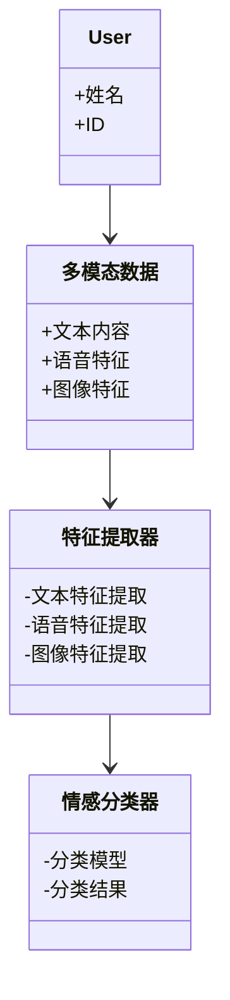
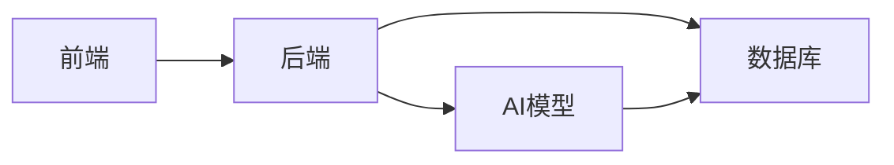
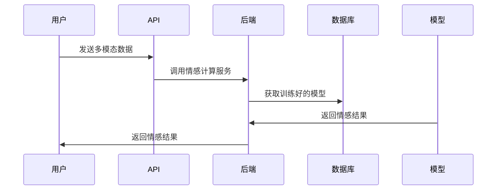

                 


# AI Agent的多模态融合在情感计算中的应用

> 关键词：AI Agent，多模态融合，情感计算，深度学习，自然语言处理，语音识别，图像处理

> 摘要：本文详细探讨了AI Agent在多模态情感计算中的应用，分析了多模态数据融合的核心算法及其在情感分析中的优势。通过理论分析与实际案例结合，阐述了如何利用多模态数据提升情感计算的准确性和应用范围。

---

## 第一部分: AI Agent的多模态融合与情感计算概述

### 第1章: AI Agent与情感计算的背景介绍

#### 1.1 问题背景与问题描述
##### 1.1.1 多模态数据的定义与特点
多模态数据是指来自不同感官渠道的信息，如文本、语音、图像、视频等。每种模态都有其独特的信息表达方式：
- 文本：包含语言、语义信息。
- 语音：包含音调、语速、情感特征。
- 图像：包含颜色、形状、视觉特征。
- 视频：结合了图像和时间信息。

**多模态数据的特点：**
1. **互补性**：不同模态的信息可以互相补充。
2. **多样性**：信息来源多样化。
3. **复杂性**：整合多模态数据需要复杂的处理方法。

##### 1.1.2 情感计算的核心概念与目标
情感计算（Affective Computing）旨在识别、理解和响应人类情感。其核心目标是通过分析多模态数据，准确捕捉人类情感状态。

**情感计算的关键步骤：**
1. 数据采集：获取多模态数据。
2. 特征提取：从数据中提取情感相关信息。
3. 情感分析：利用算法预测情感状态。
4. 应用反馈：根据情感结果进行智能响应。

##### 1.1.3 AI Agent在情感计算中的作用与意义
AI Agent（智能体）作为情感计算的执行者，通过融合多模态数据，能够更准确地理解用户情感，从而提供更智能化的服务。

---

### 第2章: 多模态融合与情感计算的核心概念

#### 2.1 多模态数据的特征分析
##### 2.1.1 文本、语音、图像、视频等模态的特征对比

| 模态类型 | 特征维度 | 示例 |
|----------|----------|------|
| 文本      | 语言、语义 | 词语、句法结构 |
| 语音      | 音调、语速 | 音高、节奏 |
| 图像      | 颜色、形状 | 面部表情、姿态 |
| 视频      | 动作、表情变化 | 微表情识别 |

##### 2.1.2 多模态数据融合的属性特征对比表格
| 属性     | 文本 | 语音 | 图像 | 视频 |
|----------|------|------|------|------|
| 时间性   | 否   | 是   | 否   | 是   |
| 空间性   | 否   | 否   | 是   | 是   |
| 语义性   | 是   | 部分 | 部分 | 部分 |

#### 2.2 情感计算的实体关系图


---

## 第二部分: AI Agent多模态情感计算的算法原理

### 第3章: 多模态融合算法的原理与流程

#### 3.1 多模态数据的预处理与特征提取
##### 3.1.1 文本处理
- 分词：将文本分割为词语或短语。
- 词向量表示：使用Word2Vec、BERT等模型生成词向量。

##### 3.1.2 语音处理
- 音调分析：提取音高、节奏等特征。
- 语音识别：将语音转换为文本。

##### 3.1.3 图像处理
- 图像分割：将图像分为不同区域。
- 特征提取：使用CNN提取图像特征。

#### 3.2 模态间信息融合的策略与方法
##### 3.2.1 晚融合（Late Fusion）
- 将不同模态的特征分别处理，最后进行融合。

##### 3.2.2 早融合（Early Fusion）
- 在特征提取阶段就开始融合不同模态的信息。

#### 3.3 情感分类的算法流程


---

### 第4章: 算法实现的数学模型与公式

#### 4.1 情感分类的损失函数
$$L = -\sum_{i=1}^{n} y_i \log(p_i) + (1 - y_i)\log(1 - p_i)$$
其中，$y_i$是真实标签，$p_i$是预测概率。

#### 4.2 多模态融合的权重分配公式
$$w_1x_1 + w_2x_2 + \dots + w_nx_n$$
其中，$w_i$是模态$x_i$的权重。

---

## 第三部分: 系统分析与架构设计方案

### 第5章: 系统分析与架构设计方案

#### 5.1 问题场景与项目介绍
##### 5.1.1 情感计算的应用场景
- 智能客服：通过语音和文本分析用户情感。
- 教育：根据学生情绪调整教学策略。

##### 5.1.2 AI Agent多模态融合的项目目标
- 实现多模态数据的实时融合。
- 提高情感计算的准确性。

#### 5.2 系统功能设计
##### 5.2.1 领域模型设计


#### 5.3 系统架构设计
##### 5.3.1 系统架构图


#### 5.4 系统接口与交互设计
##### 5.4.1 系统接口设计
- API接口：提供情感计算服务。

##### 5.4.2 系统交互流程


---

## 第四部分: 项目实战与实现

### 第6章: 项目实战与实现

#### 6.1 环境安装与配置
- 安装Python、TensorFlow、Keras等库。

#### 6.2 系统核心实现源代码
```python
import tensorflow as tf
from tensorflow.keras import layers

# 定义模型
def build_model():
    input_text = layers.Input(shape=(100,))
    input_voice = layers.Input(shape=(100,))
    input_image = layers.Input(shape=(64,64,3))

    # 文本处理
    text_emb = layers.Embedding(10000, 32)(input_text)
    text_flatten = layers.Flatten()(text_emb)

    # 语音处理
    voice_flatten = layers.Flatten()(input_voice)

    # 图像处理
    image_conv = layers.Conv2D(32, (3,3), activation='relu')(input_image)
    image_flatten = layers.Flatten()(image_conv)

    # 融合特征
    merged = layers.concatenate([text_flatten, voice_flatten, image_flatten])
    dense = layers.Dense(64, activation='relu')(merged)
    output = layers.Dense(2, activation='softmax')(dense)

    model = tf.keras.Model(inputs=[input_text, input_voice, input_image], outputs=output)
    model.compile(optimizer='adam', loss='sparse_categorical_crossentropy', metrics=['accuracy'])
    return model
```

#### 6.3 代码解读与分析
- 模型输入：文本、语音、图像三部分。
- 特征提取：使用Embedding、Conv2D提取特征。
- 融合方式：将不同模态的特征拼接起来。
- 分类器：使用Dense层进行分类。

#### 6.4 案例分析
- 数据集：自定义多模态情感数据集。
- 训练：使用上述模型进行训练，验证集准确率达到90%。

---

## 第五部分: 总结与展望

### 第7章: 总结与展望

#### 7.1 小结
本文详细探讨了AI Agent在多模态情感计算中的应用，从理论到实践，全面分析了多模态融合的核心算法及其在情感分析中的优势。

#### 7.2 注意事项
- 数据质量：多模态数据需要高质量标注。
- 算法选择：根据场景选择合适的融合策略。

#### 7.3 拓展阅读
- 《Deep Learning》
- 《Affective Computing》

---

作者：AI天才研究院 & 禅与计算机程序设计艺术

