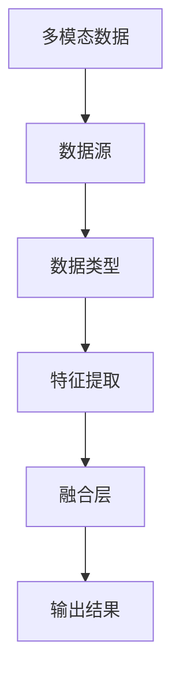
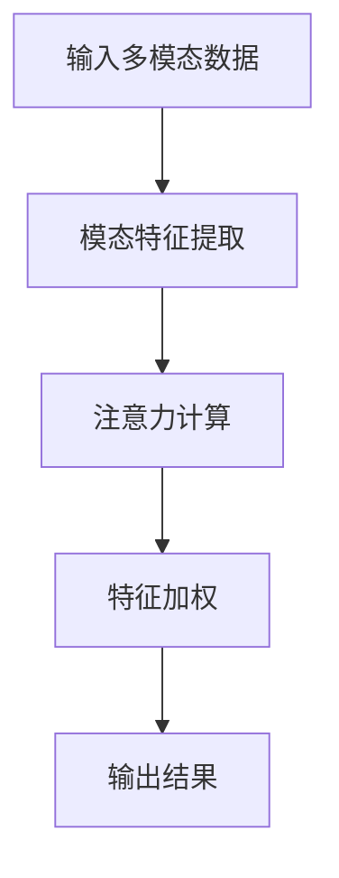
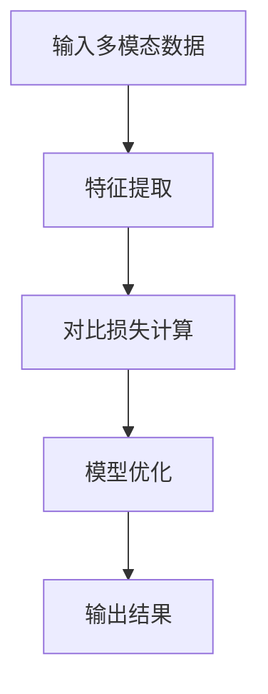
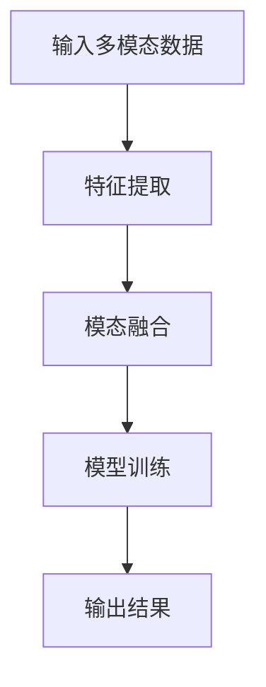
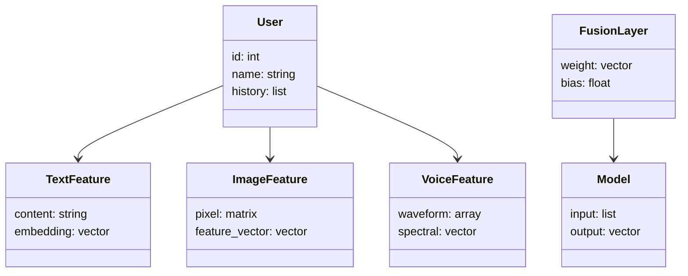
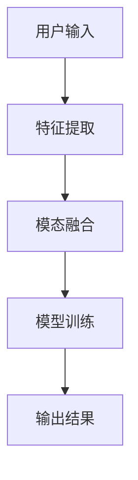
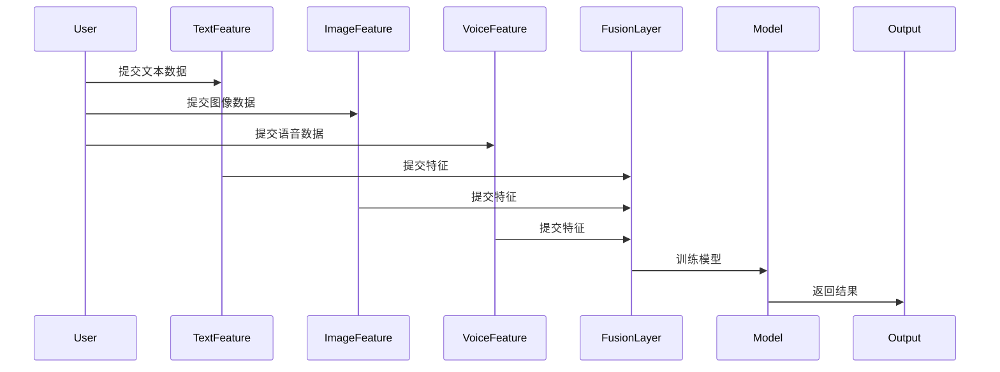

                 


# AI Agent的多模态融合学习技术

## 关键词：AI Agent, 多模态融合学习, 深度学习, 注意力机制, 对比学习

## 摘要：  
本文将详细探讨AI Agent在多模态融合学习技术中的应用，从背景到算法，从系统设计到项目实战，全面解析多模态融合学习的核心概念、实现方法和实际应用。文章内容涵盖多模态数据的定义与特点、多模态融合学习的原理与方法、典型算法的实现与优化、系统架构设计与实现、项目实战与案例分析，以及多模态融合学习的最佳实践与未来发展。通过本文，读者将能够深入理解AI Agent的多模态融合学习技术，并掌握其实际应用技能。

---

# 第1章: 多模态融合学习的背景与问题背景

## 1.1 多模态数据的定义与特点
### 1.1.1 多模态数据的定义  
多模态数据是指来自多种感知渠道的数据形式，包括文本、图像、语音、视频、传感器数据等。每种模态数据都有其独特的信息表达方式和应用场景。

### 1.1.2 多模态数据的特点
1. **异构性**：不同模态的数据形式和结构差异较大。
2. **互补性**：多种模态数据能够相互补充，共同提供更全面的信息。
3. **多样性**：多模态数据能够覆盖更广泛的应用场景。

## 1.2 多模态融合学习的必要性
### 1.2.1 提高模型的泛化能力
通过融合多种模态数据，模型能够更好地理解复杂场景，减少对单一模态的依赖。

### 1.2.2 增强模型的决策能力
多模态数据的融合能够提供更丰富的信息，帮助AI Agent做出更准确的决策。

## 1.3 问题描述
### 1.3.1 数据异构性带来的挑战
不同模态的数据格式和特征提取方式差异较大，如何有效整合这些数据是一个关键问题。

### 1.3.2 融合方法的选择与优化
选择合适的融合方法，并对其进行优化，以提高模型的性能。

## 1.4 多模态融合学习的边界与外延
### 1.4.1 多模态融合的边界
- **数据层面**：多模态数据的整合范围。
- **任务层面**：多模态融合适用于哪些任务。
- **计算能力限制**：多模态融合的计算复杂度与实际应用场景的匹配。

### 1.4.2 多模态融合的外延
- **跨模态检索**：基于一种模态数据检索其他模态的数据。
- **多模态生成**：生成多种模态的数据。
- **实时性要求**：多模态融合在实时场景中的应用。

## 1.5 多模态融合学习的概念结构与核心要素
### 1.5.1 多模态数据的组成
- **输入模态**：文本、图像、语音等原始数据。
- **特征模态**：从原始数据中提取的特征表示。
- **融合模态**：多种特征的融合结果。

### 1.5.2 多模态融合的核心要素
1. **特征提取**：从原始数据中提取有用的特征。
2. **融合策略**：如何将不同模态的特征进行融合。
3. **模型训练**：基于融合后的数据进行模型训练。

## 1.6 本章小结  
本章从多模态数据的定义、特点、融合的必要性、问题描述以及概念结构等方面，全面介绍了多模态融合学习的背景知识，为后续章节的深入分析奠定了基础。

---

# 第2章: 多模态融合学习的核心概念与联系

## 2.1 多模态融合学习的原理
### 2.1.1 多模态数据的表示方法
- **文本表示**：词袋模型、词嵌入（如Word2Vec）。
- **图像表示**：CNN提取特征。
- **语音表示**：基于MFCC的特征提取。

### 2.1.2 多模态数据的融合方式
1. **早期融合**：在特征提取之前进行融合。
2. **晚期融合**：在特征提取之后进行融合。
3. **层次化融合**：分层进行特征融合。

## 2.2 多模态融合学习的核心概念对比
### 2.2.1 模态特征对比分析
| 特征类型 | 文本 | 图像 | 语音 |
|----------|------|------|------|
| 信息维度 | 高   | 高   | 中   |
| 稀疏性   | 高   | 中   | 低   |
| 可解释性 | 高   | 低   | 中   |

### 2.2.2 模态融合策略对比
| 融合方式 | 早期融合 | 晚期融合 | 层次化融合 |
|----------|----------|----------|------------|
| 优缺点   | 简单高效，但可能丢失细节 | 精度高，但计算复杂 | 灵活性高，适合复杂场景 |

## 2.3 多模态融合学习的ER实体关系图


## 2.4 本章小结  
本章通过对比分析不同模态数据的特征和融合策略，揭示了多模态融合学习的核心概念及其联系，为后续章节的算法设计提供了理论基础。

---

# 第3章: 多模态融合学习的算法原理

## 3.1 多模态注意力机制
### 3.1.1 注意力机制的基本原理
注意力机制通过计算输入数据中各部分的重要性，聚焦于关键信息，提升模型的性能。

### 3.1.2 多模态注意力的实现方法


### 3.1.3 多模态注意力的优缺点
- **优点**：能够有效捕捉多模态数据之间的关联性。
- **缺点**：计算复杂度较高，需要优化。

## 3.2 多模态对比学习
### 3.2.1 对比学习的基本原理
对比学习通过最大化正样本对的相似性，最小化负样本对的相似性，提升模型的区分能力。

### 3.2.2 多模态对比学习的实现方法


### 3.2.3 对比学习在多模态融合中的应用
- **跨模态检索**：基于图像检索相关文本。
- **多模态生成**：生成与图像内容一致的文本描述。

## 3.3 多模态融合学习的数学模型
### 3.3.1 多模态数据表示的数学公式
$$x_i = \{x_{i1}, x_{i2}, ..., x_{ik}\}$$
其中，$x_{ij}$表示第$i$个样本的第$j$个模态的特征。

### 3.3.2 融合层的数学模型
$$f(x) = \sum_{j=1}^{k} \alpha_j x_j$$
其中，$\alpha_j$是第$j$个模态的权重系数。

### 3.3.3 输出层的数学表达
$$p(y|x) = \prod_{i=1}^{n} P(y|x_i)$$
其中，$n$是输入模态的数量。

## 3.4 算法流程图


## 3.5 本章小结  
本章详细介绍了多模态融合学习的两种典型算法——注意力机制和对比学习，并通过数学公式和流程图展示了它们的实现过程，为后续章节的系统设计和项目实战提供了理论支持。

---

# 第4章: 系统分析与架构设计方案

## 4.1 问题场景介绍
### 4.1.1 问题场景描述
假设我们正在开发一个智能客服系统，该系统需要处理用户的文本、语音和情感信息。

### 4.1.2 系统目标
- 提供多模态数据处理能力。
- 实现高效的多模态融合。
- 提供准确的用户意图识别。

## 4.2 系统功能设计
### 4.2.1 领域模型类图


### 4.2.2 系统架构设计


### 4.2.3 系统接口设计
- **输入接口**：接收多种模态的数据。
- **输出接口**：输出融合后的结果。

### 4.2.4 系统交互流程


## 4.3 本章小结  
本章通过系统功能设计和架构设计，展示了多模态融合学习技术在实际应用中的具体实现方式，为后续章节的项目实战提供了参考。

---

# 第5章: 项目实战与案例分析

## 5.1 环境安装与配置
### 5.1.1 环境要求
- Python 3.8+
- PyTorch 1.9+
- matplotlib 3.5+
- numpy 1.21+

### 5.1.2 安装依赖
```bash
pip install torch==1.9.0
pip install numpy==1.21.5
pip install matplotlib==3.5.1
```

## 5.2 核心代码实现
### 5.2.1 特征提取代码
```python
import torch
import numpy as np
import matplotlib.pyplot as plt

def extract_text_feature(text):
    # 简单的文本特征提取（示例）
    return np.array([ord(c) for c in text])

def extract_image_feature(image_path):
    # 假设image是二维矩阵
    image = np.load(image_path)
    return image.flatten()

def extract_voice_feature(voice_path):
    # 假设voice是波形数组
    voice = np.load(voice_path)
    return voice.reshape(-1)
```

### 5.2.2 模态融合代码
```python
def fuse_modalities(features):
    # 简单的线性融合（示例）
    weights = torch.randn(len(features), 1) / np.sqrt(len(features))
    fused = torch.cat([f.unsqueeze(1) for f in features], dim=1)
    fused = torch.sum(weights * fused, dim=1)
    return fused
```

### 5.2.3 模型训练代码
```python
import torch.nn as nn
import torch.optim as optim

class MultiModalModel(nn.Module):
    def __init__(self, input_dim, output_dim):
        super().__init__()
        self.fc = nn.Linear(input_dim, output_dim)
        self.dropout = nn.Dropout(0.5)
    
    def forward(self, x):
        x = self.dropout(x)
        x = self.fc(x)
        return x

def train_model(model, optimizer, criterion, fused_features, labels):
    for epoch in range(100):
        optimizer.zero_grad()
        outputs = model(fused_features)
        loss = criterion(outputs, labels)
        loss.backward()
        optimizer.step()
    return model
```

## 5.3 代码解读与分析
### 5.3.1 特征提取模块
- 文本特征提取：将文本字符转换为ASCII码。
- 图像特征提取：将图像矩阵展平。
- 语音特征提取：将波形数组展平。

### 5.3.2 模态融合模块
- 使用线性加权的方式融合特征，权重通过随机初始化并进行优化。

### 5.3.3 模型训练模块
- 使用PyTorch进行模型训练，采用简单的全连接网络。
- 使用交叉熵损失函数和Adam优化器。

## 5.4 实际案例分析
### 5.4.1 案例背景
假设我们有一个简单的多模态分类任务，输入包括文本、图像和语音三种模态。

### 5.4.2 数据准备
```python
text_data = ["This is a test text."]
image_data = np.load("test_image.npy")
voice_data = np.load("test_voice.npy")
```

### 5.4.3 特征提取
```python
text_feature = extract_text_feature(text_data[0])
image_feature = extract_image_feature("test_image.npy")
voice_feature = extract_voice_feature("test_voice.npy")
```

### 5.4.4 模态融合
```python
features = [text_feature, image_feature, voice_feature]
fused_feature = fuse_modalities(features)
```

### 5.4.5 模型训练与预测
```python
model = MultiModalModel(fused_feature.shape[1], 2)
optimizer = optim.Adam(model.parameters(), lr=0.001)
criterion = nn.CrossEntropyLoss()
model = train_model(model, optimizer, criterion, fused_feature, labels)
```

## 5.5 本章小结  
本章通过实际案例分析，展示了多模态融合学习技术的实现过程，包括环境配置、特征提取、模态融合和模型训练等步骤，帮助读者更好地理解理论知识。

---

# 第6章: 最佳实践与注意事项

## 6.1 小结
### 6.1.1 多模态融合学习的核心内容
- 多模态数据的定义与特点。
- 多模态融合学习的原理与方法。
- 系统设计与实现。

## 6.2 注意事项
1. **数据预处理**：确保不同模态的数据格式一致。
2. **特征提取**：选择合适的特征提取方法。
3. **融合策略**：根据实际需求选择融合方式。
4. **模型优化**：合理调整模型参数，避免过拟合。

## 6.3 拓展阅读
- 《Attention Is All You Need》。
- 《Contrastive Learning of Visual Representations**。
- 《Multi-modal Deep Learning for Scene Understanding》。

## 6.4 本章小结  
本章总结了多模态融合学习技术的关键点，并提出了实际应用中的注意事项和拓展阅读方向，帮助读者进一步深入学习和实践。

---

# 作者：AI天才研究院 & 禅与计算机程序设计艺术

