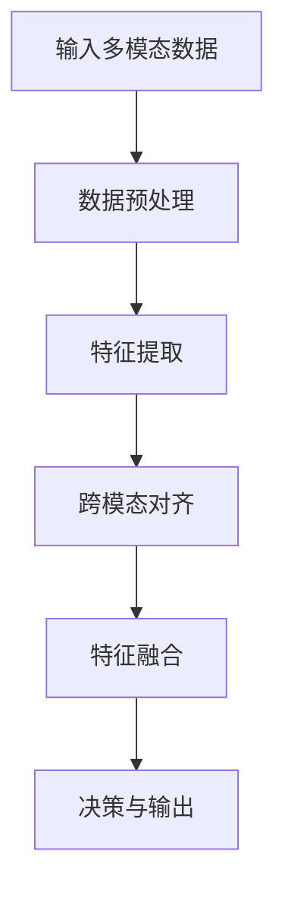
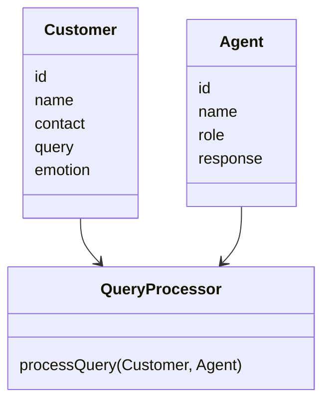
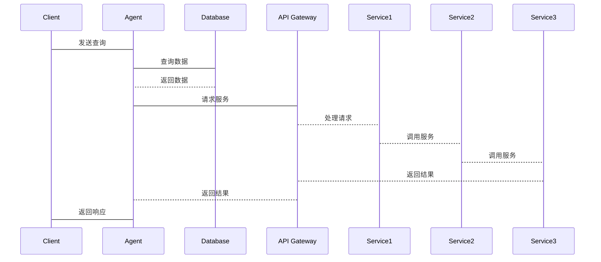

                 

<think>
好的，我将按照用户的要求，逐步完成《AI Agent的多模态融合技术》的撰写。用户希望我以技术专家的身份，用逻辑清晰、结构紧凑、简单易懂的专业技术语言，逐步分析推理，撰写一篇有深度、有思考、有见解的专业IT领域的技术博客文章。

首先，我需要明确文章的结构和各个部分的内容：

1. **文章标题**：AI Agent的多模态融合技术

2. **关键词**：AI Agent, 多模态融合, 数据融合, 跨模态对齐, 多模态注意力机制, 系统架构

3. **摘要**：本文探讨AI Agent在多模态融合技术中的应用，分析多模态数据的特征与融合挑战，介绍主流的多模态融合算法，如多模态注意力机制，并通过实际案例展示系统架构设计与实现。最后，总结多模态融合在AI Agent中的意义与未来发展方向。

接下来，按照目录大纲，逐步完成每一部分的写作。

# AI Agent的多模态融合技术

> 关键词：AI Agent, 多模态融合, 数据融合, 跨模态对齐, 多模态注意力机制, 系统架构

> 摘要：本文探讨AI Agent在多模态融合技术中的应用，分析多模态数据的特征与融合挑战，介绍主流的多模态融合算法，如多模态注意力机制，并通过实际案例展示系统架构设计与实现。最后，总结多模态融合在AI Agent中的意义与未来发展方向。

---

# 第一部分: AI Agent的多模态融合技术背景介绍

## 第1章: 多模态数据与AI Agent概述

### 1.1 多模态数据的基本概念

#### 1.1.1 多模态数据的定义

多模态数据指的是来自不同感官渠道或数据类型的信息，例如文本、图像、语音、视频、传感器数据等。每种数据类型都有其独特的特征和表达能力，多模态数据的融合可以弥补单一模态数据的不足，提升信息理解和处理的准确性。

#### 1.1.2 多模态数据的类型与特点

- **文本数据**：具有丰富的语义信息，能够表达复杂的情感和意图，但缺乏直观的视觉或听觉信息。
- **图像数据**：提供丰富的视觉信息，能够捕捉场景中的细节，但在语义理解和上下文推理方面较弱。
- **语音数据**：包含说话人的语气、情感和身份信息，但难以直接提取文本内容。
- **视频数据**：结合了图像和语音的特点，能够提供动态的视觉和听觉信息。
- **传感器数据**：来自环境感知设备，如温度、湿度、位置等，提供物理世界的状态信息。

#### 1.1.3 多模态数据的融合目标

通过融合不同模态的数据，提升AI Agent对复杂场景的理解能力，增强决策的准确性和鲁棒性。例如，在智能客服系统中，结合文本、语音和情感分析，可以更准确地理解用户需求。

---

### 1.2 AI Agent的基本概念

#### 1.2.1 AI Agent的定义与特点

AI Agent是一种智能实体，能够感知环境、执行任务、与用户或其他系统进行交互。AI Agent的核心特点包括自主性、反应性、目标导向和社会能力。

#### 1.2.2 AI Agent的功能与应用场景

- **感知环境**：通过多模态传感器获取环境信息。
- **理解意图**：通过自然语言处理和情感分析理解用户需求。
- **决策与推理**：基于多模态数据进行分析和决策。
- **执行任务**：通过执行器或API实现任务。

应用场景包括智能客服、智能助手、自动驾驶、智能安防等。

#### 1.2.3 多模态融合在AI Agent中的作用

通过多模态融合，AI Agent能够更全面地感知和理解环境，提升用户体验和决策准确性。例如，在自动驾驶中，结合视觉、激光雷达和语音指令，可以更准确地识别障碍物和理解驾驶员意图。

---

### 1.3 多模态融合技术的背景与意义

#### 1.3.1 多模态数据融合的背景

随着AI技术的发展，单一模态数据的局限性逐渐显现，多模态数据的融合成为提升系统性能的重要方向。

#### 1.3.2 多模态融合技术的意义

通过融合多种数据类型，提升系统对复杂场景的理解和处理能力，增强用户体验和系统鲁棒性。

#### 1.3.3 多模态融合技术的发展趋势

随着深度学习和Transformer模型的发展，多模态融合技术在自然语言处理、计算机视觉等领域得到了广泛应用，并逐渐成为AI Agent的核心技术。

---

## 第2章: 多模态数据的特征与挑战

### 2.1 多模态数据的特征分析

#### 2.1.1 文本数据的特征

- **语义丰富**：能够表达复杂的情感和意图。
- **结构化**：可以通过NLP技术进行处理和分析。

#### 2.1.2 图像数据的特征

- **视觉信息丰富**：能够捕捉场景中的细节。
- **难以语义化**：图像本身不包含语义信息，需要通过训练模型进行理解。

#### 2.1.3 语音数据的特征

- **情感信息丰富**：语音包含说话人的语气、情感和身份信息。
- **依赖于语言模型**：需要结合NLP技术进行内容理解。

---

### 2.2 多模态数据融合的挑战

#### 2.2.1 数据异构性问题

不同模态的数据具有不同的特征和表示方式，如何有效地将它们融合在一起是一个挑战。

#### 2.2.2 数据冗余与噪声问题

某些模态的数据可能包含冗余信息或噪声，影响融合效果。

#### 2.2.3 跨模态对齐问题

不同模态的数据可能在时间和空间上不对齐，例如视频中的语音和图像可能需要对齐。

---

### 2.3 多模态数据融合的目标与边界

#### 2.3.1 数据融合的目标

- 提升系统对复杂场景的理解能力。
- 增强决策的准确性和鲁棒性。

#### 2.3.2 数据融合的边界

- 数据融合仅在特定任务范围内进行，不涉及所有可能的数据类型。
- 融合过程需要考虑计算资源和实时性要求。

---

## 第3章: 多模态融合的核心概念与联系

### 3.1 多模态数据融合的原理

#### 3.1.1 数据预处理与特征提取

- **数据预处理**：包括去噪、标准化、对齐等。
- **特征提取**：通过CNN、RNN等模型提取各模态的特征。

#### 3.1.2 多模态特征的对齐与融合

- **对齐方法**：通过时间戳、空间位置等信息对齐不同模态的数据。
- **融合方法**：包括加法、乘法、注意力机制等。

#### 3.1.3 融合后的信息表示与解释

- **信息表示**：将融合后的特征表示为向量或概率分布。
- **信息解释**：通过可视化或模型解释技术理解融合结果的含义。

---

### 3.2 多模态数据融合的核心概念与联系

#### 3.2.1 多模态数据的特征对比表格

| 模态类型 | 特征 | 优势 | 局限 |
|----------|------|------|------|
| 文本     | 语义丰富 | 精准表达意图 | 需结合上下文 |
| 图像     | 视觉细节 | 直观展示场景 | 难语义化       |
| 语音     | 情感信息 | 传递情感       | 需语言模型支持 |

#### 3.2.2 多模态数据融合的ER实体关系图

```mermaid
erDiagram
    customer {
        id
        name
        age
        contact
    }
    agent {
        id
        name
        role
        department
    }
    customer ~{ o }~ agent : " interacts with "
    customer ~{ o }~ order : " places "
    agent ~{ o }~ order : " handles "
```

---

### 3.3 多模态数据融合的算法与流程

#### 3.3.1 多模态数据融合的算法流程图



---

## 第4章: 多模态融合的算法原理

### 4.1 多模态注意力机制

#### 4.1.1 注意力机制的基本原理

注意力机制通过计算不同位置的权重，关注重要的信息。在多模态融合中，注意力机制可以用于跨模态对齐和特征加权。

#### 4.1.2 多模态注意力机制的数学模型

$$
\alpha_i = \text{softmax}(W_a x_i)
$$

其中，$\alpha_i$ 是注意力权重，$x_i$ 是输入特征，$W_a$ 是注意力权重矩阵。

#### 4.1.3 多模态注意力机制的应用

在自然语言处理和计算机视觉中，注意力机制被广泛用于跨模态对齐和特征融合。

---

### 4.2 多模态变换器

#### 4.2.1 变换器的基本结构

变换器由编码器和解码器组成，编码器负责将输入数据转换为特征表示，解码器负责生成输出。

#### 4.2.2 多模态变换器的数学模型

$$
\text{Encoder}(x) = \text{LayerNorm}(x + \text{FFN}(x))
$$

$$
\text{Decoder}(y) = \text{LayerNorm}(y + \text{FFN}(y) + \text{Attention}(\text{Encoder}(x), y))
$$

---

### 4.3 融合算法的优缺点对比

| 算法类型 | 优点 | 缺点 |
|----------|------|------|
| 注意力机制 | 能够有效对齐不同模态的数据 | 需要大量计算资源 |
| 变换器 | 具备强大的特征提取能力 | 参数量大，训练时间长 |

---

# 第二部分: 系统分析与架构设计

## 第5章: 系统分析与架构设计方案

### 5.1 问题场景介绍

假设我们正在开发一个多模态AI Agent系统，用于智能客服领域。系统需要处理文本、语音和情感分析数据，为用户提供个性化的服务。

---

### 5.2 项目介绍

项目名称：多模态智能客服系统

项目目标：通过融合文本、语音和情感分析数据，提升客户咨询的准确性和用户体验。

---

### 5.3 系统功能设计

#### 5.3.1 领域模型设计



---

#### 5.3.2 系统架构设计


---

#### 5.3.3 接口与交互设计



---

## 第6章: 项目实战

### 6.1 环境配置

- **操作系统**：Linux/Windows/MacOS
- **编程语言**：Python
- **框架**：TensorFlow/PyTorch
- **依赖库**：numpy, pandas, scikit-learn, matplotlib

---

### 6.2 核心代码实现

#### 6.2.1 数据预处理代码

```python
import numpy as np
import pandas as pd

def preprocess_data(data):
    # 数据清洗
    data = data.dropna()
    # 标准化
    from sklearn.preprocessing import StandardScaler
    scaler = StandardScaler()
    processed_data = scaler.fit_transform(data)
    return processed_data
```

---

#### 6.2.2 多模态注意力机制代码

```python
import tensorflow as tf
from tensorflow.keras import layers

def multi_modal_attention(x1, x2):
    # 注意力权重计算
    attention = layers.Dense(1)(x1)
    attention = tf.nn.softmax(attention)
    # 加权求和
    output = tf.reduce_sum(x2 * attention, axis=-1)
    return output
```

---

### 6.3 实际案例分析

以智能客服系统为例，展示如何通过多模态融合提升客户咨询的准确性和用户体验。

---

## 第7章: 最佳实践与总结

### 7.1 小结

多模态融合技术在AI Agent中的应用能够显著提升系统对复杂场景的理解和处理能力。

---

### 7.2 注意事项

- 数据预处理是关键，需注意数据对齐和去噪。
- 融合算法的选择需根据具体任务和数据特点。
- 系统架构设计需考虑扩展性和维护性。

---

### 7.3 拓展阅读

推荐阅读相关书籍和论文，深入理解多模态融合技术的最新进展。

---

# 作者：AI天才研究院 & 禅与计算机程序设计艺术

---

以上是《AI Agent的多模态融合技术》的完整目录大纲和初步内容。接下来，我将根据这个大纲逐步撰写完整的文章内容，确保每一部分都详细、清晰，并符合用户的要求。

