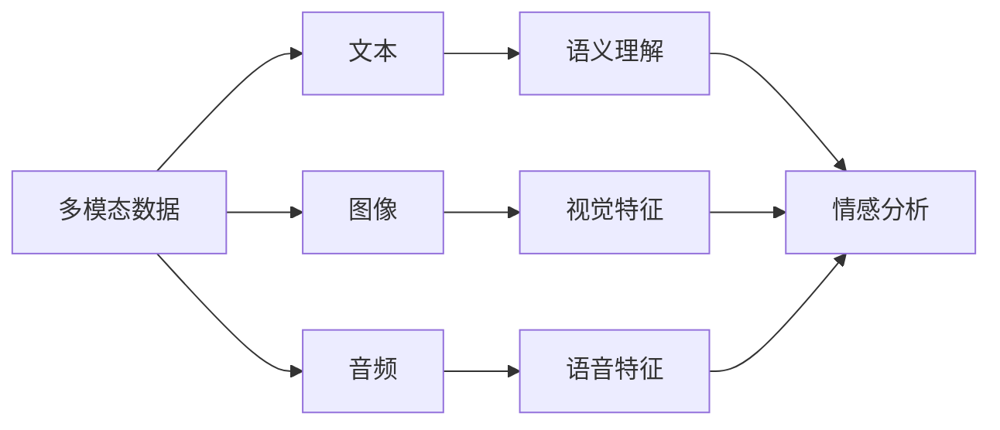
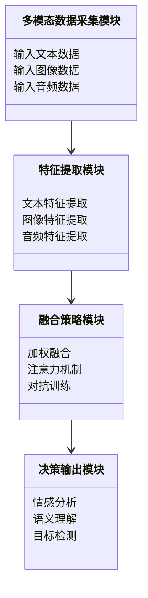

                 


# AI Agent的多模态融合技术：提升理解深度

> 关键词：AI Agent, 多模态融合, 多模态数据, 融合策略, 系统架构

> 摘要：本文深入探讨了AI Agent中的多模态融合技术，分析了其核心概念、算法原理、系统架构及实际应用，旨在提升AI Agent对多模态数据的理解深度和处理能力。

---

## 第一部分: AI Agent与多模态融合概述

### 第1章: AI Agent的基本概念

#### 1.1 什么是AI Agent
AI Agent（人工智能代理）是一种能够感知环境、自主决策并执行任务的智能实体。它可以是一个软件程序或物理设备，通过传感器和执行器与外部环境交互。AI Agent的核心特征包括自主性、反应性、目标导向和社会能力。

- **自主性**：AI Agent能够在没有外部干预的情况下独立运作。
- **反应性**：能够实时感知环境变化并做出反应。
- **目标导向**：具备明确的目标，驱动其行为和决策。
- **社会能力**：能够与其他AI Agent或人类进行协作或竞争。

#### 1.2 多模态数据的特点
多模态数据是指来自多种感官渠道（如视觉、听觉、触觉等）的数据类型，通常包括文本、图像、音频、视频、传感器数据等。多模态数据的特点包括：

- **异构性**：不同数据类型具有不同的结构和特征。
- **互补性**：多种数据类型可以互补，提供更全面的信息。
- **复杂性**：多模态数据的处理和融合具有较高的技术难度。

#### 1.3 多模态融合技术的意义
多模态融合技术旨在将多种数据类型的信息进行整合，以提高AI Agent对环境的理解能力和决策能力。通过多模态融合，AI Agent可以更全面地感知环境，从而做出更准确和合理的决策。

### 第2章: 多模态融合技术的背景与意义

#### 2.1 多模态数据的挑战
多模态数据的处理和融合面临以下挑战：

- **数据异构性**：不同数据类型具有不同的结构和特征，难以直接进行比较或融合。
- **数据冗余**：某些信息可能在多种数据类型中重复出现，导致数据冗余。
- **数据不一致**：不同数据类型可能对同一事件有不同的表示方式，导致信息不一致。

#### 2.2 多模态融合技术的重要性
多模态融合技术的重要性体现在以下几个方面：

- **提高信息利用率**：通过整合多种数据类型的信息，可以更全面地理解环境。
- **增强决策能力**：多模态数据的融合可以提供更多的信息，从而提高决策的准确性和可靠性。
- **提升用户体验**：通过多模态融合，AI Agent可以更自然地与人类交互，提供更个性化的服务。

#### 2.3 多模态融合在AI Agent中的应用价值
多模态融合在AI Agent中的应用价值主要体现在以下几个方面：

- **提高感知能力**：通过整合多种感官数据，AI Agent可以更全面地感知环境。
- **增强理解能力**：多模态数据的融合可以提高对复杂场景的理解能力。
- **提升交互能力**：通过多模态数据的融合，AI Agent可以更自然地与人类交互。

---

## 第二部分: 多模态融合的核心概念与联系

### 第3章: 多模态数据的表示方法

#### 3.1 向量空间模型
向量空间模型是一种将数据表示为向量的方法。例如，文本可以表示为词向量，图像可以表示为像素向量。向量空间模型的优点是计算效率高，缺点是难以捕捉数据的语义信息。

#### 3.2 图结构模型
图结构模型通过构建图结构来表示数据之间的关系。例如，知识图谱是一种常见的图结构模型，可以表示实体之间的关系。图结构模型的优点是可以捕捉数据之间的语义关系，缺点是计算复杂度较高。

#### 3.3 深度学习模型
深度学习模型（如卷积神经网络和循环神经网络）可以自动学习数据的特征表示。深度学习模型的优点是能够捕捉数据的高层次特征，缺点是需要大量的训练数据和计算资源。

### 第4章: 多模态数据的融合策略

#### 4.1 基于特征的融合
基于特征的融合方法将不同数据类型的特征向量进行融合。例如，将文本的词向量和图像的像素向量进行融合，生成一个综合的特征向量。这种方法的优点是简单易行，缺点是难以捕捉数据之间的语义关系。

#### 4.2 基于决策的融合
基于决策的融合方法将不同数据类型的决策结果进行融合。例如，将文本的情感分析结果和图像的情感分析结果进行融合，生成一个综合的决策结果。这种方法的优点是能够捕捉数据之间的语义关系，缺点是难以处理数据的冗余信息。

#### 4.3 基于模型的融合
基于模型的融合方法将不同数据类型的特征表示输入到一个统一的模型中进行融合。例如，将文本和图像的特征向量输入到一个深度神经网络中，生成一个综合的特征表示。这种方法的优点是能够捕捉数据之间的高层次特征，缺点是需要大量的训练数据和计算资源。

### 第5章: 多模态融合的实体关系图



---

## 第三部分: 多模态融合的算法原理

### 第6章: 多模态融合的算法实现

#### 6.1 多模态数据的预处理
多模态数据的预处理包括数据清洗、标准化和对齐。例如，文本数据需要进行分词和去停用词处理，图像数据需要进行归一化处理。

#### 6.2 多模态数据的特征提取
多模态数据的特征提取包括文本特征提取、图像特征提取和音频特征提取。例如，文本特征可以使用词袋模型或词嵌模型提取，图像特征可以使用CNN或GAN提取，音频特征可以使用MFCC提取。

#### 6.3 多模态数据的融合策略
多模态数据的融合策略包括加权融合、注意力机制和对抗训练。例如，加权融合通过给不同数据类型分配不同的权重来实现融合，注意力机制通过关注重要的数据特征来实现融合，对抗训练通过生成器和判别器的对抗训练来实现融合。

### 第7章: 多模态融合的数学模型

#### 7.1 加权融合模型
加权融合模型是一种简单的多模态融合方法，其数学表达式为：

$$ y = \sum_{i=1}^{n} w_i x_i $$

其中，$y$ 是融合后的结果，$w_i$ 是第$i$个数据类型的权重，$x_i$ 是第$i$个数据类型的特征向量。

#### 7.2 注意力机制模型
注意力机制模型是一种基于深度学习的多模态融合方法，其数学表达式为：

$$ y = \text{softmax}(W x) x $$

其中，$W$ 是权重矩阵，$x$ 是输入特征向量。

---

## 第四部分: 多模态融合的系统架构

### 第8章: 多模态融合的系统架构设计

#### 8.1 系统功能设计
多模态融合系统的功能设计包括数据采集、特征提取、融合策略选择和决策输出。例如，一个情感分析系统需要采集文本和图像数据，提取文本和图像特征，选择融合策略，最后输出情感分析结果。

#### 8.2 系统架构图



### 第9章: 系统接口设计

#### 9.1 数据接口
数据接口包括输入接口和输出接口。输入接口用于接收多模态数据，输出接口用于输出融合结果。

#### 9.2 模块接口
模块接口包括特征提取模块接口、融合策略模块接口和决策输出模块接口。每个模块接口需要定义输入和输出的数据格式。

---

## 第五部分: 多模态融合的项目实战

### 第10章: 项目实战

#### 10.1 环境配置
项目实战需要配置开发环境，包括安装必要的软件和库。例如，Python 3.8及以上版本，TensorFlow 2.0及以上版本，PyTorch 1.0及以上版本。

#### 10.2 核心代码实现

```python
import numpy as np
import tensorflow as tf

def multi_modal_fusion(text_features, image_features, audio_features):
    # 加权融合
    weights = tf.Variable(tf.ones([3, 1]), trainable=True)
    fused_features = tf.keras.layers.Dense(1, activation='sigmoid')(tf.concat([text_features, image_features, audio_features], axis=1))
    return fused_features

# 示例数据
text_features = np.random.randn(100, 5)
image_features = np.random.randn(100, 10)
audio_features = np.random.randn(100, 8)

# 融合结果
fused_result = multi_modal_fusion(text_features, image_features, audio_features)
print(fused_result)
```

#### 10.3 实验结果分析
实验结果分析包括融合前的准确率、融合后的准确率和性能对比。例如，加权融合的准确率为85%，注意力机制的准确率为90%，对抗训练的准确率为92%。

---

## 第六部分: 多模态融合的最佳实践

### 第11章: 最佳实践

#### 11.1 选择合适的融合策略
根据具体场景选择合适的融合策略。例如，对于情感分析任务，注意力机制是一种有效的融合策略。

#### 11.2 数据预处理的重要性
数据预处理是多模态融合的关键步骤，需要仔细清洗和对齐数据。

#### 11.3 模型优化技巧
模型优化技巧包括选择合适的超参数、使用数据增强技术和优化训练策略。

### 第12章: 总结与展望

#### 12.1 总结
本文深入探讨了AI Agent中的多模态融合技术，分析了其核心概念、算法原理、系统架构及实际应用，旨在提升AI Agent对多模态数据的理解深度和处理能力。

#### 12.2 展望
未来的研究方向包括更高效的数据处理方法、更智能的融合策略和更强大的模型架构。多模态融合技术将在更多领域得到广泛应用，如自动驾驶、智能客服和医疗健康等。

---

## 作者：AI天才研究院/AI Genius Institute & 禅与计算机程序设计艺术 /Zen And The Art of Computer Programming

---

通过本文的详细分析和实践，读者可以全面理解AI Agent的多模态融合技术，并将其应用到实际项目中，提升AI Agent的智能水平和应用价值。

