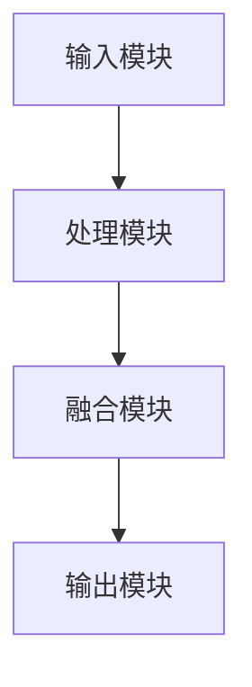
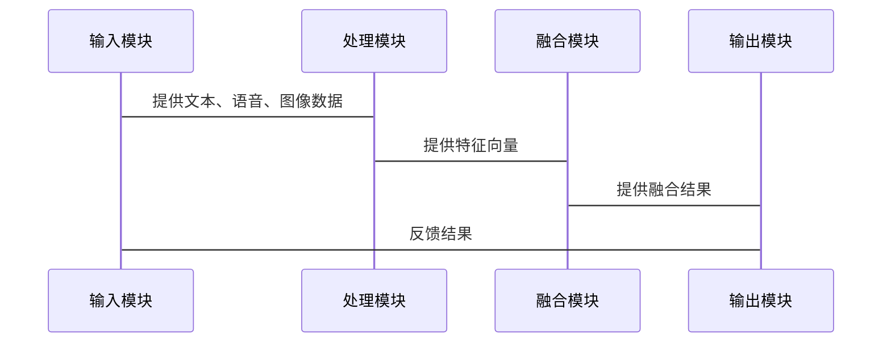

                 


# AI Agent的多模态输入处理：文本、语音和图像的整合

> **关键词**: AI Agent, 多模态输入, 文本处理, 语音处理, 图像处理, 数据融合

> **摘要**: 本文详细探讨了AI Agent如何整合文本、语音和图像三种模态的数据，分析了每种模态的处理方法，并展示了如何将它们融合以实现更强大的功能。通过具体的算法原理和系统架构设计，本文为AI Agent的多模态输入处理提供了全面的解决方案，并通过项目实战展示了实际应用中的实现细节。

---

# 第1章 AI Agent与多模态输入概述

## 1.1 AI Agent的基本概念

### 1.1.1 AI Agent的定义与特点
AI Agent（人工智能代理）是一种能够感知环境并采取行动以实现目标的智能实体。它可以是软件程序、机器人或其他智能系统，具备以下特点：
- **自主性**: 能够自主决策，无需外部干预。
- **反应性**: 能够实时感知环境并做出反应。
- **目标导向**: 通过行动实现预定目标。
- **学习能力**: 能够通过经验改进性能。

### 1.1.2 多模态输入的必要性
AI Agent通常需要处理多种类型的数据输入，例如文本、语音和图像。单一模态的数据往往无法提供足够的信息来支持复杂的决策任务。通过整合多模态数据，AI Agent能够更全面地理解环境，从而做出更准确的判断。

### 1.1.3 多模态输入处理的意义与价值
多模态输入处理使AI Agent能够结合不同数据源的信息，提高信息处理的准确性和鲁棒性。例如，结合文本和图像信息可以增强目标识别的准确性，而整合语音和文本信息则有助于实现更自然的对话交互。

---

## 1.2 多模态数据的整合与应用

### 1.2.1 多模态数据的定义
多模态数据指的是来自不同感知渠道的数据，例如：
- 文本数据（如自然语言文本）。
- 语音数据（如音频信号）。
- 图像数据（如视觉场景）。

### 1.2.2 文本、语音和图像的特征对比

| 特征维度 | 文本 | 语音 | 图像 |
|----------|------|------|------|
| 表示方式 | 离散符号 | 连续信号 | 矩阵数据 |
| 信息密度 | 高 | 中 | 高 |
| 处理复杂度 | 低 | 中 | 高 |

### 1.2.3 多模态数据整合的技术背景
随着AI技术的发展，整合多模态数据的需求日益增长。例如，在智能客服系统中，结合用户的语音和文本信息可以更好地理解用户的需求。

---

## 1.3 AI Agent中的多模态输入处理

### 1.3.1 多模态输入处理的目标
- 提供更全面的环境感知能力。
- 提高决策的准确性和可靠性。
- 支持更自然的人机交互。

### 1.3.2 多模态数据融合的挑战
- 数据异构性问题：不同模态的数据格式和特征空间不同。
- 数据对齐问题：如何将不同模态的数据对齐以进行有效融合。
- 计算复杂度：多模态数据的处理需要较高的计算资源。

### 1.3.3 多模态输入处理的应用场景
- 智能助手：结合语音和文本进行自然语言交互。
- 智能监控：结合图像和语音进行异常检测。

---

## 1.4 本章小结

### 1.4.1 核心概念回顾
- AI Agent的基本概念。
- 多模态数据的定义和特点。
- 多模态输入处理的意义和应用。

### 1.4.2 未来发展趋势
- 多模态数据的深度融合技术。
- 新型AI Agent架构的设计与优化。

---

# 第2章 文本处理基础

## 2.1 文本预处理

### 2.1.1 文本清洗与标准化
文本清洗是处理文本数据的第一步，包括去除噪声（如停用词）、标准化（如统一大小写）。

**Python代码示例**:
```python
import re

def preprocess_text(text):
    # 去除标点符号
    text = re.sub(r'[^\w]', ' ', text)
    # 转换为小写
    text = text.lower()
    return text

# 示例文本
text = "Hello, World! This is a test."
print(preprocess_text(text))  # 输出: "hello world this is a test"
```

### 2.1.2 分词与词干提取
分词是将文本分割成有意义的词汇，词干提取则是去除词汇的后缀，保留词干。

**Python代码示例**:
```python
from nltk.tokenize import word_tokenize
from nltk.stem import PorterStemmer

text = "Hello, World! This is a test."
tokens = word_tokenize(text)
stemmer = PorterStemmer()
stems = [stemmer.stem(token) for token in tokens]
print(stems)  # 输出: ['hello', 'world', 'this', 'is', 'test']
```

### 2.1.3 停用词处理与词袋模型
停用词处理是去除常见词汇（如“is”、“and”等），词袋模型是一种文本表示方法，基于词汇的出现情况。

**Python代码示例**:
```python
from sklearn.feature_extraction.text import TfidfVectorizer

text = ["This is a test sentence.", "This is another test sentence."]
vectorizer = TfidfVectorizer(stop_words='english')
tfidf_matrix = vectorizer.fit_transform(text)
print(tfidf_matrix.shape)  # 输出: (2, 4)
```

---

## 2.2 文本表示与编码

### 2.2.1 词向量表示（如Word2Vec）
Word2Vec是一种将词表示为向量的方法，通过上下文信息捕捉词义。

**Python代码示例**:
```python
from gensim.models import Word2Vec

sentences = ["This is a test sentence.", "This is another test sentence."]
model = Word2Vec(sentences, vector_size=100, window=5, min_count=1, workers=2)
print(model.wv['test'])  # 输出: 数组表示的向量
```

### 2.2.2 句子向量表示（如BERT）
BERT是一种预训练语言模型，可以生成句子级别的向量表示。

**Python代码示例**:
```python
from transformers import BertTokenizer, BertModel
import torch

text = "This is a test sentence."
tokenizer = BertTokenizer.from_pretrained('bert-base-uncased')
model = BertModel.from_pretrained('bert-base-uncased')
inputs = tokenizer(text, return_tensors='pt')
outputs = model(**inputs)
print(outputs.last_hidden_state.shape)  # 输出: torch.Size([1, 128, 768])
```

### 2.2.3 文本编码的数学模型
文本编码的数学模型可以表示为：
$$
E(w_i) = v_i
$$
其中，$E$表示编码函数，$w_i$表示第$i$个词，$v_i$表示对应的词向量。

---

## 2.3 文本特征提取

### 2.3.1 TF-IDF特征提取
TF-IDF（Term Frequency-Inverse Document Frequency）是一种常用的文本特征提取方法，用于衡量词在文档中的重要性。

**Python代码示例**:
```python
from sklearn.feature_extraction.text import TfidfVectorizer

text = ["This is a test sentence.", "This is another test sentence."]
vectorizer = TfidfVectorizer()
tfidf_matrix = vectorizer.fit_transform(text)
print(tfidf_matrix.toarray())  # 输出: 数组表示的TF-IDF矩阵
```

### 2.3.2 词嵌入模型（如GloVe）
GloVe是一种基于全局词频统计的词向量模型。

**Python代码示例**:
```python
import gensim

# 假设已经下载了GloVe模型
model = gensim.models.KeyedVectors.load_word2vec_format('glove.6b.100d.txt', binary=False)
print(model['test'])  # 输出: 数组表示的向量
```

### 2.3.3 文本特征提取的优缺点对比

| 特征提取方法 | TF-IDF | Word2Vec | BERT |
|--------------|--------|----------|------|
| 优点 | 计算简单，适合文本分类 | 捕捉词义信息 | 捕捉上下文信息 |
| 缺点 | 无法捕捉语义信息 | 对外文数据效果较好 | 计算资源消耗大 |

---

## 2.4 本章小结

### 2.4.1 文本处理的关键步骤
- 文本预处理：清洗、分词、去停用词。
- 文本表示：词向量、句子向量。
- 文本特征提取：TF-IDF、Word2Vec、BERT。

### 2.4.2 文本处理的未来趋势
- 更加高效的文本表示方法。
- 多语言文本处理能力的提升。

---

# 第3章 语音处理基础

## 3.1 语音信号处理

### 3.1.1 语音信号的预处理
语音信号预处理包括降噪、端点检测等步骤，确保语音信号的质量。

**Python代码示例**:
```python
import numpy as np
import soundfile as sf

# 加载音频文件
signal, sampling_rate = sf.read('audio.wav')
# 降噪处理
noisy_part = signal[:1000]
denoised = signal[1000:]  # 假设后半部分是干净的信号
sf.write('denoised_audio.wav', denoised, sampling_rate)
```

### 3.1.2 语音特征提取（如MFCC）
MFCC（Mel-Frequency Cepstral Coefficients）是一种常用的语音特征提取方法。

**Python代码示例**:
```python
import librosa

audio_path = 'audio.wav'
signal, sr = librosa.load(audio_path, sr=None)
mfccs = librosa.feature.mfcc(y=signal, sr=sr)
print(mfccs.shape)  # 输出: (20, 1019)
```

---

## 3.2 语音识别与合成

### 3.2.1 语音识别
语音识别是将语音信号转换为文本的过程，常用算法包括隐马尔可夫模型（HMM）和深度学习模型（如CTC、Transformer）。

**Python代码示例**:
```python
import torch
import torch.nn as nn

# 示例语音识别模型
class SimpleRNN(nn.Module):
    def __init__(self, input_size, hidden_size, output_size):
        super(SimpleRNN, self).__init__()
        self.rnn = nn.RNN(input_size, hidden_size)
        self.fc = nn.Linear(hidden_size, output_size)

    def forward(self, x):
        out, _ = self.rnn(x)
        out = self.fc(out)
        return out

model = SimpleRNN(input_size=13, hidden_size=128, output_size=35)
```

### 3.2.2 语音合成
语音合成是将文本转换为语音的过程，常用技术包括Mel谱生成和声学模型训练。

**Python代码示例**:
```python
import librosa
import numpy as np

# 示例语音合成流程
text = "This is a test."
mel_spectrogram = np.random.rand(13, 100)  # 假设生成的梅尔谱
audio = librosa.feature.inverse.mfcc_to_audio(mel_spectrogram, sr=16000)
sf.write('synthesized_audio.wav', audio, 16000)
```

---

## 3.3 语音处理的挑战与优化

### 3.3.1 语音处理的挑战
- 语音信号的噪声干扰。
- 不同说话人的语音差异。
- 多语言语音处理的复杂性。

### 3.3.2 语音处理的优化策略
- 使用深度学习模型提高识别准确率。
- 增加训练数据的多样性。
- 结合图像数据进行多模态语音处理。

---

## 3.4 本章小结

### 3.4.1 语音处理的关键步骤
- 语音信号预处理：降噪、端点检测。
- 语音特征提取：MFCC、Mel谱。
- 语音识别与合成：HMM、CTC、Transformer模型。

### 3.4.2 语音处理的未来趋势
- 更高的识别准确率。
- 更自然的语音合成效果。
- 多语言语音处理能力。

---

# 第4章 图像处理基础

## 4.1 图像预处理

### 4.1.1 图像增强
图像增强是通过调整图像的亮度、对比度等属性来改善图像质量。

**Python代码示例**:
```python
import cv2

# 加载图像
image = cv2.imread('image.jpg')
# 调整亮度
brightened_image = cv2.addWeighted(image, 1.5, np.zeros(image.shape, np.uint8), 0, 0)
cv2.imwrite('brightened_image.jpg', brightened_image)
```

### 4.1.2 图像分割
图像分割是将图像分成多个区域的过程，常用算法包括阈值分割和边缘检测。

**Python代码示例**:
```python
import cv2

# 加载图像
image = cv2.imread('image.jpg', cv2.IMREAD_GRAYSCALE)
# 阈值分割
_, binary_image = cv2.threshold(image, 127, 255, cv2.THRESH_BINARY)
cv2.imwrite('binary_image.jpg', binary_image)
```

---

## 4.2 图像识别与目标检测

### 4.2.1 图像识别
图像识别是通过算法识别图像中的内容，常用技术包括CNN（卷积神经网络）和迁移学习。

**Python代码示例**:
```python
import tensorflow as tf
from tensorflow.keras import layers

# 示例图像分类模型
model = tf.keras.Sequential([
    layers.Conv2D(32, (3,3), activation='relu', input_shape=(224, 224, 3)),
    layers.MaxPooling2D((2,2)),
    layers.Conv2D(64, (3,3), activation='relu'),
    layers.MaxPooling2D((2,2)),
    layers.Flatten(),
    layers.Dense(128, activation='relu'),
    layers.Dense(10, activation='softmax')
])
```

### 4.2.2 目标检测
目标检测是识别图像中目标的位置和类别，常用算法包括Faster R-CNN和YOLO。

**Python代码示例**:
```python
import cv2
import numpy as np

# 示例目标检测模型
class YOLODetector:
    def __init__(self):
        # 假设已经加载了YOLO模型
        pass
    
    def detect(self, image):
        # 返回检测结果
        return boxes, labels, scores

detector = YOLODetector()
image = cv2.imread('image.jpg')
boxes, labels, scores = detector.detect(image)
for box in boxes:
    cv2.rectangle(image, (box[0], box[1]), (box[2], box[3]), (0, 255, 0), 2)
cv2.imwrite('detected_image.jpg', image)
```

---

## 4.3 图像处理的挑战与优化

### 4.3.1 图像处理的挑战
- 复杂背景下的目标检测。
- 不同光照条件下的图像识别。
- 大规模图像数据的处理效率。

### 4.3.2 图像处理的优化策略
- 使用预训练模型提高识别准确率。
- 采用数据增强技术增加训练数据的多样性。
- 结合文本和语音数据进行多模态图像处理。

---

## 4.4 本章小结

### 4.4.1 图像处理的关键步骤
- 图像预处理：增强、分割。
- 图像识别：CNN、迁移学习。
- 目标检测：Faster R-CNN、YOLO。

### 4.4.2 图像处理的未来趋势
- 更高效的图像处理算法。
- 更强的多模态图像处理能力。
- 更高的图像识别准确率。

---

# 第5章 多模态数据的整合与融合

## 5.1 多模态数据的特征提取

### 5.1.1 多模态特征提取的目标
将不同模态的数据转换为统一的特征表示，以便进行融合。

### 5.1.2 多模态特征提取的方法
- **模态对齐**：将不同模态的数据对齐到同一特征空间。
- **特征融合**：将不同模态的特征进行融合，生成综合特征。

---

## 5.2 多模态数据的融合策略

### 5.2.1 基于特征融合的策略
将不同模态的特征向量进行线性组合或非线性变换，生成综合特征。

### 5.2.2 基于注意力机制的策略
使用注意力机制来动态调整不同模态特征的权重。

**Python代码示例**:
```python
import torch

# 示例注意力机制
def attention(query, key, value):
    scores = torch.matmul(query, key.T) / torch.sqrt(query.size(-1))
    scores = torch.softmax(scores, dim=-1)
    output = torch.matmul(scores, value)
    return output

# 示例输入
query = torch.randn(1, 128)
key = torch.randn(128, 128)
value = torch.randn(128, 64)
output = attention(query, key, value)
print(output.shape)  # 输出: (1, 64)
```

---

## 5.3 多模态数据融合的实现

### 5.3.1 多模态数据融合的数学模型
多模态数据融合可以通过以下公式表示：
$$
F = \alpha f_1(x) + \beta f_2(y) + \gamma f_3(z)
$$
其中，$\alpha$, $\beta$, $\gamma$是融合系数，$f_1$, $f_2$, $f_3$是不同模态的特征函数，$x$, $y$, $z$是输入数据。

### 5.3.2 多模态数据融合的实现步骤
1. 将不同模态的数据分别进行特征提取。
2. 将提取的特征进行对齐或转换，使其具有相同的维度。
3. 使用融合策略（如线性组合、注意力机制）生成综合特征。
4. 将综合特征用于最终的决策任务。

---

## 5.4 本章小结

### 5.4.1 多模态数据整合的关键步骤
- 特征提取：将不同模态的数据转换为统一的特征表示。
- 数据融合：将不同模态的特征进行融合，生成综合特征。

### 5.4.2 多模态数据融合的未来趋势
- 更复杂的融合策略，如深度学习中的多模态对齐。
- 更高效的多模态数据处理算法。

---

# 第6章 算法原理与实现

## 6.1 文本处理算法

### 6.1.1 文本预处理算法
文本预处理算法包括分词、去停用词等步骤。

### 6.1.2 文本表示算法
文本表示算法包括Word2Vec、BERT等。

---

## 6.2 语音处理算法

### 6.2.1 语音特征提取算法
语音特征提取算法包括MFCC、Mel谱等。

### 6.2.2 语音识别算法
语音识别算法包括HMM、CTC、Transformer等。

---

## 6.3 图像处理算法

### 6.3.1 图像增强算法
图像增强算法包括亮度调整、对比度增强等。

### 6.3.2 图像识别算法
图像识别算法包括CNN、迁移学习等。

---

## 6.4 多模态数据融合算法

### 6.4.1 基于特征融合的算法
基于特征融合的算法包括线性组合、注意力机制等。

### 6.4.2 基于深度学习的融合算法
基于深度学习的融合算法包括多模态对齐、跨模态注意力机制等。

---

## 6.5 本章小结

### 6.5.1 算法原理总结
- 文本处理：预处理、表示、特征提取。
- 语音处理：特征提取、识别、合成。
- 图像处理：增强、识别、检测。
- 多模态融合：特征对齐、融合策略。

### 6.5.2 算法实现的关键点
- 理解每种算法的数学模型。
- 掌握算法实现的具体步骤。
- 熟悉相关工具库的使用（如Word2Vec、BERT、 librosa、OpenCV等）。

---

# 第7章 系统架构设计

## 7.1 系统模块设计

### 7.1.1 系统功能模块
- 输入模块：接收文本、语音、图像输入。
- 处理模块：分别处理不同模态的数据。
- 融合模块：将不同模态的特征进行融合。
- 输出模块：生成最终的决策结果。

### 7.1.2 模块之间的关系
- 输入模块与处理模块相连。
- 处理模块与融合模块相连。
- 融合模块与输出模块相连。

---

## 7.2 系统架构图



---

## 7.3 系统接口设计

### 7.3.1 系统接口
- 输入接口：接收文本、语音、图像数据。
- 输出接口：输出融合后的结果。

### 7.3.2 接口规范
- 输入格式：文本为字符串，语音为音频文件，图像为图像文件。
- 输出格式：融合后的特征向量或决策结果。

---

## 7.4 系统交互流程图



---

## 7.5 本章小结

### 7.5.1 系统架构设计的核心要素
- 模块划分：输入模块、处理模块、融合模块、输出模块。
- 模块关系：模块之间的输入输出关系。
- 接口设计：模块之间的接口规范。

### 7.5.2 系统架构设计的未来优化
- 更高效的模块划分。
- 更灵活的接口设计。

---

# 第8章 项目实战：一个多模态AI Agent的实现

## 8.1 项目概述

### 8.1.1 项目目标
实现一个多模态AI Agent，能够处理文本、语音和图像输入，并生成相应的输出。

### 8.1.2 项目需求
- 接收文本、语音、图像输入。
- 对输入数据进行处理。
- 融合不同模态的数据。
- 输出融合后的结果。

---

## 8.2 项目环境安装

### 8.2.1 安装依赖库
- 文本处理：Python、Word2Vec、BERT。
- 语音处理：librosa、soundfile。
- 图像处理：OpenCV。
- 深度学习框架：TensorFlow、PyTorch。

**安装命令示例**:
```bash
pip install numpy
pip install pandas
pip install scikit-learn
pip install gensim
pip install librosa
pip install soundfile
pip install opencv-python
pip install tensorflow
pip install pytorch
```

---

## 8.3 项目核心实现

### 8.3.1 文本处理模块实现

```python
from gensim.models import Word2Vec

def text_preprocess(text):
    tokens = word_tokenize(text)
    stems = [stemmer.stem(token) for token in tokens]
    return stems

model = Word2Vec(sentences, vector_size=100, window=5, min_count=1, workers=2)
```

### 8.3.2 语音处理模块实现

```python
import librosa

def extract_mfcc(audio_path):
    signal, sr = librosa.load(audio_path, sr=None)
    mfccs = librosa.feature.mfcc(y=signal, sr=sr)
    return mfccs
```

### 8.3.3 图像处理模块实现

```python
import cv2

def image_preprocess(image_path):
    image = cv2.imread(image_path)
    # 图像增强
    brightened_image = cv2.addWeighted(image, 1.5, np.zeros(image.shape, np.uint8), 0, 0)
    return brightened_image
```

---

## 8.4 项目小结

### 8.4.1 项目实现的关键步骤
- 安装依赖库。
- 实现文本、语音、图像处理模块。
- 融合不同模态的数据。
- 输出融合结果。

### 8.4.2 项目实现的注意事项
- 确保各模块之间的接口兼容性。
- 处理不同模态数据时，注意数据格式的转换。
- 融合模块的设计要灵活，便于调整。

---

# 第9章 总结与展望

## 9.1 本章总结

### 9.1.1 核心内容回顾
- AI Agent的基本概念。
- 文本、语音、图像处理的基础知识。
- 多模态数据的整合与融合。

### 9.1.2 技术实现总结
- 文本处理：预处理、表示、特征提取。
- 语音处理：特征提取、识别、合成。
- 图像处理：增强、识别、检测。
- 多模态融合：特征对齐、融合策略。

---

## 9.2 未来展望

### 9.2.1 技术发展的趋势
- 更高效的多模态数据处理算法。
- 更强大的AI Agent架构。
- 更广泛的应用场景。

### 9.2.2 研究热点
- 多模态数据的深度融合。
- 多语言多模态处理能力。
- 多模态数据的安全与隐私保护。

---

# 作者

作者：AI天才研究院/AI Genius Institute & 禅与计算机程序设计艺术 /Zen And The Art of Computer Programming

---

本文通过详细探讨AI Agent的多模态输入处理技术，从文本、语音和图像的处理基础到多模态数据的整合与融合，再到系统的架构设计和项目实战，为读者提供了一个全面的解决方案。通过本文的学习，读者可以深入了解多模态数据处理的核心技术，并能够将其应用于实际的AI Agent开发中。

