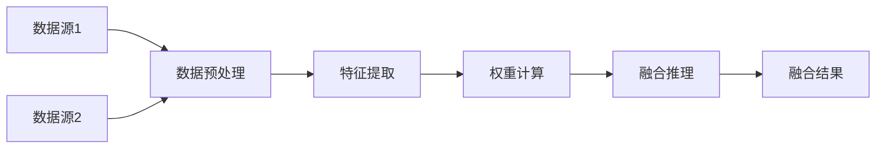
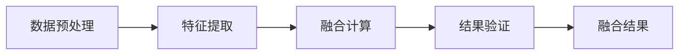

                 


# AI Agent的多源异构数据融合技术

> 关键词：AI Agent，多源数据，异构数据，数据融合，算法原理，系统架构

> 摘要：  
> 本文深入探讨AI Agent在多源异构数据融合技术中的应用与实现。通过分析数据融合的核心概念、算法原理、系统架构及项目实战，结合实际案例，系统性地阐述了多源异构数据融合的理论基础与实践方法。文章从背景介绍出发，逐步解析数据融合的关键技术，包括数据源的多样性、异构性、多源性，以及融合算法的选择与实现。最后，通过一个具体的项目案例，展示了数据融合技术在实际场景中的应用效果，总结了最佳实践与注意事项。

---

## 第一部分：背景介绍

### 第1章：多源异构数据融合的背景与挑战

#### 1.1 问题背景
- 数据异构性的定义与分类  
  数据异构性主要表现在数据格式、结构、语义等方面的差异。  
- 多源数据融合的必要性  
  AI Agent需要从多个数据源获取信息，以提高决策的准确性和全面性。  
- 当前数据融合技术的局限性  
  数据异构性导致传统融合方法难以直接应用。

#### 1.2 问题描述
- 数据异构性的主要表现形式  
  包括结构异构、格式异构、语义异构等。  
- 数据融合中的冲突与不一致性问题  
  不同数据源可能对同一事件提供不同的描述，导致冲突。  
- 数据融合的目标与期望结果  
  将多个数据源的信息整合为一致、完整的表示。

#### 1.3 问题解决
- 数据融合的基本原理与方法  
  数据预处理、特征提取、权重计算、融合推理。  
- 异构数据融合的关键技术  
  数据清洗、标准化、语义对齐、融合推理。  
- 数据融合的流程与步骤  
  数据采集、预处理、特征提取、融合计算、结果验证。

#### 1.4 边界与外延
- 数据融合的边界条件  
  数据源的数量、类型、质量。  
- 数据融合与其他数据处理技术的区别  
  与数据清洗、数据集成的区别。  
- 数据融合的外延与应用范围  
  在智能系统、大数据分析、物联网等领域的应用。

#### 1.5 核心概念与组成要素
- 数据源的多样性  
  包括结构多样性、格式多样性、语义多样性。  
- 数据格式的异构性  
  包括文本、图像、数值等多种数据类型。  
- 数据质量与可靠性  
  数据的准确性、完整性、一致性。

---

## 第二部分：核心概念与联系

### 第2章：多源异构数据融合的核心原理

#### 2.1 数据源的多样性与异构性
- 数据源的多样性：  
  包括结构多样性（关系型数据库、非结构化数据）、格式多样性（文本、图像、数值）、语义多样性（同一数据在不同上下文中的含义）。  
- 数据异构性的表现：  
  不同数据源之间的格式、结构、语义差异。

#### 2.2 数据融合的核心原理
- 数据融合的基本流程：  
  数据预处理、特征提取、权重计算、融合推理。  
- 数据融合的方法：  
  基于规则的融合、基于概率的融合、基于学习的融合。

#### 2.3 概念属性对比与Mermaid图
```mermaid
table
| 数据源类型 | 数据格式 | 数据结构 | 数据语义 |
|------------|----------|----------|----------|
| 关系型数据库 | 结构化数据 | 表、字段 | 明确的语义 |
| 非结构化数据 | 文本、图像 | 文档、图片 | 潜在的语义 |
| 时间序列数据 | 数值 | 时间戳 | 动态变化 |
```



---

## 第三部分：算法原理讲解

### 第3章：主流多源异构数据融合算法

#### 3.1 加权融合算法
- 算法原理：  
  根据数据源的可靠性和相关性，计算各数据源的权重，进行加权融合。  
- 实现步骤：  
  数据预处理、权重计算、加权融合。  
- 数学公式：  
  $$ y = \sum_{i=1}^{n} w_i x_i $$  
  其中，$w_i$ 是数据源 $i$ 的权重，$x_i$ 是数据源 $i$ 的值，$y$ 是融合结果。

#### 3.2 基于图模型的融合算法
- 算法原理：  
  将数据源及其关系建模为图结构，通过图传播模型进行融合。  
- 实现步骤：  
  数据建模、图传播、融合计算。  
- 数学公式：  
  $$ y_i^{(k+1)} = \sum_{j=1}^{n} a_{ij} y_j^{(k)} $$  
  其中，$a_{ij}$ 是图的边权重，$y_i^{(k)}$ 是第 $k$ 轮的融合结果。

#### 3.3 基于深度学习的融合算法
- 算法原理：  
  使用深度学习模型（如神经网络）对多源数据进行特征学习和融合。  
- 实现步骤：  
  数据预处理、特征提取、模型训练、融合推理。  
- 数学公式：  
  $$ h = \text{ReLU}(W x + b) $$  
  其中，$x$ 是输入特征，$W$ 是权重矩阵，$b$ 是偏置，$h$ 是隐藏层输出。

---

## 第四部分：系统分析与架构设计

### 第4章：AI Agent数据融合系统架构

#### 4.1 问题场景介绍
- 数据源：多源异构数据，包括文本、图像、数值等。  
- 问题目标：设计一个高效的多源异构数据融合系统。

#### 4.2 系统功能设计
- 数据预处理模块：清洗、标准化、语义对齐。  
- 特征提取模块：提取关键特征并转换为统一表示。  
- 融合计算模块：基于加权、图模型或深度学习的融合算法。  
- 结果验证模块：评估融合结果的准确性和一致性。

#### 4.3 系统架构设计


#### 4.4 接口设计与交互
- 接口设计：  
  数据输入接口、融合参数配置接口、结果输出接口。  
- 交互流程：  
  数据输入 -> 数据预处理 -> 特征提取 -> 融合计算 -> 结果输出。

---

## 第五部分：项目实战

### 第5章：多源异构数据融合的实战案例

#### 5.1 环境安装与数据准备
- 环境安装：Python、深度学习框架（如TensorFlow）。  
- 数据准备：多源异构数据集，如文本、图像、数值数据。

#### 5.2 核心代码实现
```python
import numpy as np
from sklearn.preprocessing import StandardScaler

# 数据预处理
def preprocess(data):
    # 标准化处理
    scaler = StandardScaler()
    processed_data = scaler.fit_transform(data)
    return processed_data

# 加权融合算法
def weighted_fusion(data_sources, weights):
    # 计算加权和
    fused_data = np.zeros_like(data_sources[0])
    for i in range(len(data_sources)):
        fused_data += weights[i] * data_sources[i]
    return fused_data

# 基于图模型的融合算法
def graph_propagation(data, adjacency_matrix):
    # 图传播计算
    n = data.shape[0]
    propagated_data = np.zeros_like(data)
    for i in range(n):
        propagated_data[i] = np.sum(adjacency_matrix[i] * data, axis=1)
    return propagated_data

# 深度学习融合算法
class SimpleNN:
    def __init__(self, input_dim, output_dim):
        self.W = np.random.randn(input_dim, output_dim)
        self.b = np.random.randn(output_dim)
    
    def forward(self, x):
        return np.maximum(0, np.dot(x, self.W) + self.b)
```

#### 5.3 案例分析与结果解读
- 案例分析：  
  从三个数据源获取异构数据，分别进行预处理、特征提取、加权融合、图传播融合和深度学习融合。  
- 结果解读：  
  比较不同融合方法的效果，分析权重分配、图结构对融合结果的影响。

#### 5.4 项目小结
- 项目总结：  
  多源异构数据融合的关键在于数据预处理和算法选择。  
- 成果展示：  
  融合结果的准确性和一致性显著提高。

---

## 第六部分：最佳实践与小结

### 第6章：多源异构数据融合的实践经验

#### 6.1 最佳实践
- 数据质量：  
  确保数据源的可靠性和一致性。  
- 算法选择：  
  根据数据特点选择合适的融合方法。  
- 系统设计：  
  确保系统架构的可扩展性和可维护性。

#### 6.2 小结
- 问题总结：  
  多源异构数据融合是AI Agent技术的核心挑战之一。  
- 核心思想：  
  数据预处理、特征提取和融合算法是实现数据融合的关键步骤。  
- 未来展望：  
  深度学习与图模型的结合将推动数据融合技术的发展。

---

## 结语

通过本文的系统性分析与实践，读者可以深入理解AI Agent的多源异构数据融合技术，并在实际项目中灵活应用这些方法。希望本文能为相关领域的研究者和开发者提供有价值的参考。

---

作者：AI天才研究院 & 禅与计算机程序设计艺术

