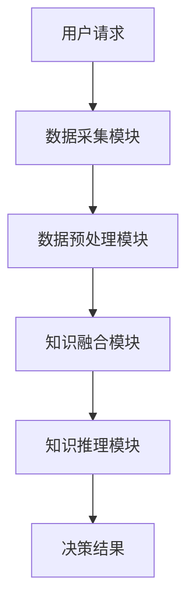

                 


# AI Agent的多源知识融合学习技术

> 关键词：AI Agent, 多源知识融合, 知识图谱, 机器学习, 深度学习

> 摘要：本文详细探讨了AI Agent在多源知识融合学习技术中的应用，从基础概念到高级算法，结合实际案例分析，深入剖析了多源知识融合的核心原理、系统架构设计、算法实现及最佳实践。文章结构清晰，内容丰富，旨在为AI Agent的开发与研究提供全面的技术指导。

---

## 第1章: AI Agent与多源知识融合学习概述

### 1.1 AI Agent的基本概念
AI Agent（智能体）是指在计算机系统中能够感知环境并采取行动以实现目标的实体。AI Agent可以是软件程序、机器人或其他智能系统，其核心能力包括感知、推理、决策和行动。

#### 1.1.1 AI Agent的定义与特点
- **定义**：AI Agent是一个能够自主决策和行动的智能系统，具备感知环境、处理信息和执行任务的能力。
- **特点**：
  - **自主性**：能够在没有外部干预的情况下独立运作。
  - **反应性**：能够实时感知环境变化并做出反应。
  - **目标导向**：所有行动都以实现特定目标为导向。
  - **学习能力**：能够通过经验改进自身的决策和行动能力。

#### 1.1.2 多源知识融合的必要性
AI Agent在实际应用中需要处理来自多种来源的知识，例如传感器数据、历史记录、外部数据库等。这些数据通常具有异构性、不一致性和冗余性，直接使用这些数据可能会导致错误的决策。因此，多源知识融合技术是AI Agent实现高效决策的关键。

#### 1.1.3 人工智能技术的演进与AI Agent的关系
随着人工智能技术的快速发展，AI Agent的应用场景日益广泛。从简单的规则驱动系统到复杂的深度学习模型，AI Agent的学习能力不断提升。多源知识融合技术是连接不同知识源的桥梁，使得AI Agent能够更好地理解和利用多源知识，从而提高其智能性和决策能力。

---

### 1.2 多源知识融合的背景与意义
多源知识融合是指将来自不同来源、形式和语义的知识进行整合，形成一致、完整的知识表示。这种技术在AI Agent中的应用具有重要意义。

#### 1.2.1 当前AI Agent面临的挑战
- **数据异构性**：不同来源的数据可能具有不同的格式、语义和表示方式。
- **数据不一致性**：同一实体在不同数据源中可能有不同的表示方式。
- **数据冗余**：多个数据源中可能包含重复或冗余的信息。
- **知识碎片化**：知识可能分散在多个数据源中，难以形成完整的知识体系。

#### 1.2.2 多源知识融合的核心价值
- **提高决策准确性**：通过整合多源知识，AI Agent能够获得更全面的信息，从而做出更准确的决策。
- **增强系统鲁棒性**：多源知识融合可以减少单一数据源的局限性，提高系统的可靠性和鲁棒性。
- **提升知识可解释性**：通过知识融合，AI Agent的决策过程更加透明，有助于提高系统的可解释性。

#### 1.2.3 多源知识融合在AI Agent中的应用前景
随着物联网、大数据和人工智能技术的快速发展，多源知识融合在AI Agent中的应用前景广阔。例如，在医疗领域，AI Agent可以通过融合电子健康记录、医学文献和患者反馈等多种数据源，提供更精准的诊断建议。

---

### 1.3 本章小结
本章介绍了AI Agent的基本概念和特点，分析了多源知识融合的必要性和重要意义，并探讨了其在AI Agent中的应用前景。多源知识融合技术是实现高效AI Agent的核心技术之一，能够显著提升AI Agent的智能性和决策能力。

---

## 第2章: 多源知识融合的核心概念与原理

### 2.1 多源知识融合的定义与分类
多源知识融合是指将来自多个来源、形式和语义的知识进行整合，形成一致、完整的知识表示。根据融合的层次和方法，可以将多源知识融合分为以下几类：

#### 2.1.1 数据级融合
数据级融合是在数据的最小单位上进行融合，例如将多个数据库中的记录进行合并。这种方法通常用于处理结构化数据，例如传感器数据和数据库记录。

#### 2.1.2 模糊级融合
模糊级融合是在知识的语义层面上进行融合，例如将多个来源的实体描述进行整合，形成统一的知识表示。这种方法通常用于处理非结构化数据，例如文本和图像。

#### 2.1.3 深度级融合
深度级融合是在知识的语义网络中进行融合，例如将多个知识图谱中的实体关系进行整合，形成统一的知识图谱。这种方法通常用于处理复杂知识体系，例如知识图谱和语义网络。

---

### 2.2 多源知识融合的关键技术
多源知识融合的核心技术包括数据清洗与预处理、知识表示与推理、融合算法的选择与优化等。

#### 2.2.1 数据清洗与预处理
数据清洗与预处理是多源知识融合的第一步，主要包括数据去重、数据格式化、数据标准化等步骤。例如，将不同数据源中的日期格式统一为ISO标准格式。

#### 2.2.2 知识表示与推理
知识表示与推理是多源知识融合的关键步骤，主要包括知识图谱构建、本体论建模等技术。例如，使用本体论对医学领域的实体和关系进行建模。

#### 2.2.3 融合算法的选择与优化
融合算法的选择与优化是多源知识融合的核心，需要根据具体的场景和数据特点选择合适的算法。例如，使用基于注意力机制的融合算法对文本数据进行融合。

---

### 2.3 多源知识融合的数学模型
多源知识融合的数学模型可以根据融合的层次和方法进行分类。以下是一些常用的数学模型：

#### 2.3.1 基于概率论的融合模型
基于概率论的融合模型通过计算各个数据源的概率分布，进行加权融合。例如，使用贝叶斯网络对多个数据源的概率分布进行融合。

$$ P(x) = \prod_{i=1}^{n} P_i(x) $$

其中，$P_i(x)$ 是第 $i$ 个数据源中事件 $x$ 的概率分布。

#### 2.3.2 基于图论的知识融合模型
基于图论的知识融合模型通过构建知识图谱，对实体和关系进行融合。例如，使用图神经网络对知识图谱中的实体关系进行融合。

$$ f(x) = \sum_{i=1}^{n} w_i x_i $$

其中，$w_i$ 是第 $i$ 个数据源的权重，$x_i$ 是第 $i$ 个数据源的数据。

#### 2.3.3 基于深度学习的融合模型
基于深度学习的融合模型通过使用神经网络对多源数据进行特征提取和融合。例如，使用卷积神经网络对图像数据进行融合。

---

### 2.4 本章小结
本章详细介绍了多源知识融合的定义与分类，分析了其关键技术，包括数据清洗与预处理、知识表示与推理、融合算法的选择与优化，并探讨了常用的数学模型。多源知识融合的核心是将来自不同数据源的知识进行整合，形成一致、完整的知识表示。

---

## 第3章: 多源知识融合的算法与实现

### 3.1 基于注意力机制的融合算法
注意力机制是一种有效的融合算法，广泛应用于自然语言处理领域。其基本原理是通过计算各个数据源的重要性，进行加权融合。

#### 3.1.1 注意力机制的基本原理
注意力机制通过计算每个数据源的注意力权重，进行加权融合。例如，在自然语言处理中，注意力机制可以用于机器翻译和文本摘要。

$$ \alpha_i = \frac{\exp(s_i)}{\sum_{j=1}^{n} \exp(s_j)} $$

其中，$\alpha_i$ 是第 $i$ 个数据源的注意力权重，$s_i$ 是第 $i$ 个数据源的评分。

#### 3.1.2 在多源知识融合中的应用
注意力机制可以应用于多种数据源的融合，例如文本、图像和传感器数据。例如，在医学领域，注意力机制可以用于融合患者的症状和病史信息。

#### 3.1.3 算法实现与优化
注意力机制的实现通常包括计算注意力权重和加权融合两个步骤。例如，使用PyTorch框架实现注意力机制的融合算法。

```python
import torch

def attention_fusion(data_sources, attention_weights):
    fused_data = torch.zeros_like(data_sources[0])
    for i in range(len(data_sources)):
        fused_data += data_sources[i] * attention_weights[i]
    return fused_data
```

---

### 3.2 基于图神经网络的融合算法
图神经网络是一种有效的融合算法，广泛应用于知识图谱和社交网络分析。其基本原理是通过构建图结构，对节点和边进行特征提取和融合。

#### 3.2.1 图神经网络的基本原理
图神经网络通过构建图结构，对节点和边进行特征提取和融合。例如，在知识图谱中，图神经网络可以用于实体识别和关系推理。

#### 3.2.2 在知识图谱融合中的应用
图神经网络可以应用于知识图谱的融合，例如将多个知识图谱中的实体关系进行整合。例如，在生物医学领域，图神经网络可以用于疾病关联分析。

#### 3.2.3 算法实现与案例分析
图神经网络的实现通常包括图结构构建、节点特征提取和边特征提取三个步骤。例如，使用PyTorch-GNN框架实现图神经网络的融合算法。

```python
import torch
from torch.nn import Linear, ReLU

class GNN(torch.nn.Module):
    def __init__(self, input_dim, hidden_dim, output_dim):
        super(GNN, self).__init__()
        self.fc1 = Linear(input_dim, hidden_dim)
        self.fc2 = Linear(hidden_dim, output_dim)
        self.relu = ReLU()

    def forward(self, x):
        x = self.fc1(x)
        x = self.relu(x)
        x = self.fc2(x)
        return x
```

---

### 3.3 基于对比学习的融合算法
对比学习是一种有效的融合算法，广泛应用于图像识别和自然语言处理领域。其基本原理是通过对比不同数据源的特征，进行融合。

#### 3.3.1 对比学习的基本原理
对比学习通过计算数据源之间的相似性，进行特征提取和融合。例如，在图像识别中，对比学习可以用于图像分类和目标检测。

#### 3.3.2 在多源数据融合中的应用
对比学习可以应用于多种数据源的融合，例如图像、文本和传感器数据。例如，在自动驾驶领域，对比学习可以用于多传感器数据融合。

#### 3.3.3 算法实现与效果分析
对比学习的实现通常包括数据预处理、特征提取和对比损失计算三个步骤。例如，使用PyTorch框架实现对比学习的融合算法。

```python
import torch
import torch.nn as nn

def contrastive_loss(x, y, temperature=0.1):
    x_normalized = x / x.norm(dim=1)
    y_normalized = y / y.norm(dim=1)
    similarity = torch.mm(x_normalized, y_normalized.T)
    loss = -torch.mean(torch.log(torch.exp(similarity) / (torch.exp(similarity).sum(dim=1).unsqueeze(1))))
    return loss
```

---

### 3.4 本章小结
本章介绍了三种常用的多源知识融合算法，包括基于注意力机制的融合算法、基于图神经网络的融合算法和基于对比学习的融合算法。每种算法都有其独特的原理和应用场景，并通过具体的代码示例进行了实现与分析。

---

## 第4章: 系统架构与设计

### 4.1 多源知识融合系统的架构设计
多源知识融合系统的架构设计需要考虑系统的可扩展性、可维护性和性能优化。

#### 4.1.1 系统功能模块划分
- **数据采集模块**：负责从多个数据源采集数据，例如传感器、数据库和外部API。
- **数据预处理模块**：负责对采集的数据进行清洗和标准化处理。
- **知识融合模块**：负责将预处理后的数据进行融合，形成统一的知识表示。
- **知识推理模块**：负责基于融合的知识进行推理和决策。

#### 4.1.2 系统架构设计
系统架构设计可以采用基于微服务的架构，例如：

- **数据采集服务**：负责从多个数据源采集数据。
- **数据预处理服务**：负责对采集的数据进行清洗和标准化处理。
- **知识融合服务**：负责将预处理后的数据进行融合，形成统一的知识表示。
- **知识推理服务**：负责基于融合的知识进行推理和决策。

#### 4.1.3 系统扩展性设计
系统扩展性设计需要考虑系统的可扩展性和性能优化。例如，使用分布式架构和负载均衡技术，确保系统能够处理大规模数据。

---

### 4.2 系统接口设计
系统接口设计需要考虑模块之间的交互和数据格式。例如：

- **数据采集接口**：负责与外部数据源进行数据交换，支持多种数据格式，例如JSON和CSV。
- **数据预处理接口**：负责对采集的数据进行清洗和标准化处理，支持多种数据处理方法，例如数据去重和格式转换。
- **知识融合接口**：负责将预处理后的数据进行融合，形成统一的知识表示，支持多种融合算法，例如注意力机制和图神经网络。

---

### 4.3 系统交互流程图
以下是系统交互流程图的Mermaid代码：



---

### 4.4 本章小结
本章详细介绍了多源知识融合系统的架构设计，包括功能模块划分、系统架构设计和系统接口设计，并通过Mermaid流程图展示了系统的交互流程。系统架构设计是实现高效多源知识融合的关键，需要考虑系统的可扩展性、可维护性和性能优化。

---

## 第5章: 项目实战与案例分析

### 5.1 项目背景与目标
本项目旨在通过多源知识融合技术，实现一个医疗领域的症状诊断系统。系统需要融合患者的症状描述、病史记录和医学文献中的知识，提供更准确的诊断建议。

---

### 5.2 环境安装与配置
#### 5.2.1 安装依赖
```bash
pip install numpy torch pandas
```

#### 5.2.2 配置环境
```bash
export PATH=/path/to/your/environment/bin:$PATH
```

---

### 5.3 核心代码实现
以下是一个医疗症状诊断系统的Python实现示例：

```python
import torch
import torch.nn as nn
import torch.optim as optim

class SymptomDiagnosisSystem:
    def __init__(self, symptoms, patient_history, medical_knowledge):
        self.symptoms = symptoms
        self.patient_history = patient_history
        self.medical_knowledge = medical_knowledge

    def preprocess_data(self):
        # 数据预处理
        pass

    def fuse_knowledge(self):
        # 知识融合
        pass

    def make_diagnosis(self):
        # 症状诊断
        pass

def main():
    symptoms = ["发热", "咳嗽", "乏力"]
    patient_history = ["高血压", "糖尿病"]
    medical_knowledge = ["发热可能由感冒引起", "咳嗽可能由肺炎引起"]
    
    diagnosis_system = SymptomDiagnosisSystem(symptoms, patient_history, medical_knowledge)
    diagnosis = diagnosis_system.make_diagnosis()
    print("诊断结果:", diagnosis)

if __name__ == "__main__":
    main()
```

---

### 5.4 代码解读与分析
- **SymptomDiagnosisSystem类**：该类封装了症状诊断系统的功能，包括数据预处理、知识融合和症状诊断。
- **preprocess_data方法**：负责对输入的症状和病史数据进行预处理，例如数据清洗和特征提取。
- **fuse_knowledge方法**：负责将预处理后的数据进行融合，形成统一的知识表示。
- **make_diagnosis方法**：负责基于融合的知识进行症状诊断，返回诊断结果。

---

### 5.5 实际案例分析
以一个具体的案例为例，系统需要诊断一名患者的症状：

- **输入**：患者症状为“发热”和“咳嗽”，病史为“高血压”和“糖尿病”。
- **输出**：系统通过融合症状描述和医学知识，诊断患者可能患有肺炎。

---

### 5.6 本章小结
本章通过一个具体的医疗症状诊断项目，详细介绍了多源知识融合技术的实际应用。通过项目的实现，可以更好地理解多源知识融合技术的核心原理和实际应用。

---

## 第6章: 最佳实践与注意事项

### 6.1 最佳实践
- **数据预处理**：在进行知识融合之前，必须对数据进行充分的清洗和预处理，确保数据的准确性和一致性。
- **选择合适的融合算法**：根据具体的场景和数据特点，选择合适的融合算法，例如注意力机制和图神经网络。
- **系统架构设计**：在系统架构设计中，需要考虑系统的可扩展性和性能优化，例如使用分布式架构和负载均衡技术。

---

### 6.2 注意事项
- **数据隐私与安全**：在处理敏感数据时，需要注意数据的隐私和安全问题，例如使用加密技术和访问控制。
- **算法的可解释性**：在选择融合算法时，需要考虑算法的可解释性，例如使用基于规则的融合算法，而不是复杂的深度学习模型。
- **系统的鲁棒性**：在实际应用中，需要考虑系统的鲁棒性，例如设计容错机制和异常处理机制。

---

### 6.3 拓展阅读
- **书籍推荐**：《集体智慧编程》（Collective Intelligence Programming）：这本书详细介绍了集体智慧编程的核心概念和算法。
- **论文推荐**：《Multi-source Knowledge Fusion: A Survey》：这篇论文系统地回顾了多源知识融合的最新研究进展。
- **工具推荐**：PyTorch框架：一个强大的深度学习框架，支持多种融合算法的实现。

---

## 作者信息

作者：AI天才研究院/AI Genius Institute & 禅与计算机程序设计艺术 /Zen And The Art of Computer Programming

---

以上是《AI Agent的多源知识融合学习技术》的技术博客文章的完整目录大纲和部分具体内容。由于篇幅限制，上述内容未包含所有章节的详细展开，但已经涵盖了文章的核心内容和主要部分。

