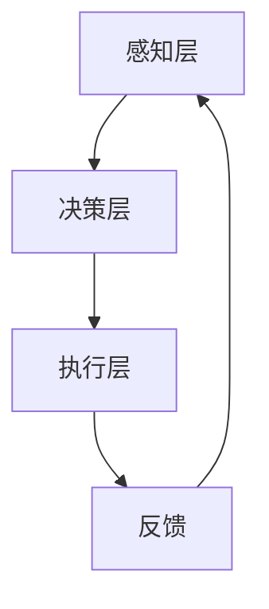
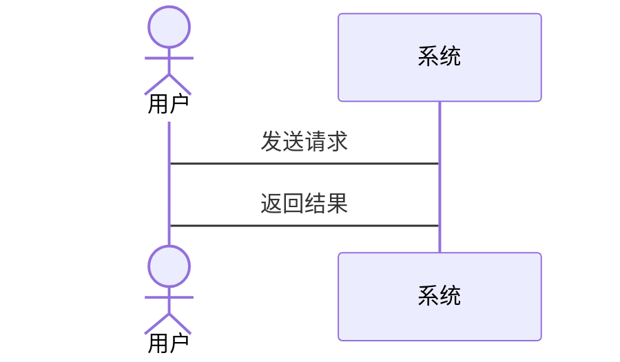

                 


# AI Agent的多目标优化决策系统

## 关键词
AI Agent, 多目标优化, 决策系统, 算法原理, 系统架构

## 摘要
本文系统地探讨了AI Agent在多目标优化决策系统中的应用，从基础概念到算法实现，再到系统架构，全面解析了如何构建高效、智能的多目标优化决策系统。通过详细的技术分析和实际案例，本文为读者提供了从理论到实践的完整指南。

## 目录

1. [问题背景与问题描述](#问题背景与问题描述)
2. [多目标优化与AI Agent的核心概念](#多目标优化与AI Agent的核心概念)
3. [多目标优化算法的数学模型与实现](#多目标优化算法的数学模型与实现)
4. [系统分析与架构设计](#系统分析与架构设计)
5. [项目实战：构建一个多目标优化AI Agent决策系统](#项目实战：构建一个多目标优化AI Agent决策系统)
6. [总结与展望](#总结与展望)
7. [附录](#附录)
8. [最佳实践](#最佳实践)

## 1. 问题背景与问题描述

### 1.1 问题背景
在复杂的现实环境中，决策系统需要同时优化多个目标，这带来了挑战。传统的单目标优化难以应对多目标冲突，而AI Agent具备自主决策的能力，能够处理动态环境中的复杂问题。

### 1.2 问题描述
多目标优化问题涉及多个相互冲突的目标，难以找到最优解。AI Agent需要在动态环境中进行决策，必须结合多目标优化技术来平衡不同目标。

### 1.3 问题解决与边界外延
通过引入多目标优化算法，AI Agent能够在多个目标之间找到合理的权衡点。系统的边界包括输入、处理过程和输出，外延涉及应用场景和扩展可能性。

## 2. 多目标优化与AI Agent的核心概念

### 2.1 多目标优化算法
常用算法包括遗传算法、粒子群优化和Dominated Sorting Genetic Algorithm（DSGA）。这些算法在处理多目标问题时表现出色。

### 2.2 AI Agent的决策机制
AI Agent通过感知环境、生成决策和执行动作来实现优化。决策机制结合了多目标优化算法，确保在复杂环境中做出最优选择。

### 2.3 核心概念对比与ER实体关系图
通过对比多目标优化与单目标优化，分析AI Agent与传统决策系统的区别。ER实体关系图展示了系统的核心实体及其关系。

```mermaid
er
  actor: 用户
  agent: AI Agent
  decision: 决策结果
  objective: 目标
  constraint: 约束条件
  actor --> agent: 提供输入
  agent --> decision: 生成决策
  decision --> objective: 满足目标
  decision --> constraint: 遵循约束
```

## 3. 多目标优化算法的数学模型与实现

### 3.1 算法原理
多目标优化算法通过优化目标函数和约束条件，找到 Pareto 优化解。常用方法包括遗传算法和粒子群优化，每种算法都有其优缺点。

### 3.2 数学模型
多目标优化问题可以表示为：
$$ \text{minimize } f_1(x), f_2(x), \dots, f_n(x) $$
$$ \text{subject to } g_1(x) \leq 0, \dots, g_m(x) \leq 0 $$

### 3.3 实现步骤
1. 初始化种群。
2. 计算适应度。
3. 执行选择、交叉和变异。
4. 评估新种群。
5. 重复迭代。

```python
def multi_objective_optimization():
    # 初始化种群
    population = initialize_population()
    while not termination_condition():
        # 计算适应度
        fitness = calculate_fitness(population)
        # 选择
        selected = selection(population, fitness)
        # 交叉
        crossed = crossover(selected)
        # 变异
        mutated = mutate(crossed)
        # 更新种群
        population = update_population(population, crossed, mutated)
    return best_solution(population)
```

## 4. 系统分析与架构设计

### 4.1 系统架构
系统架构分为感知层、决策层和执行层，每层负责不同的功能。



### 4.2 接口设计
系统提供API接口，方便与其他模块集成。

### 4.3 交互流程
用户输入请求，系统处理并返回结果。



## 5. 项目实战：构建一个多目标优化AI Agent决策系统

### 5.1 环境安装
安装必要的库，如numpy、pandas和scikit-learn。

### 5.2 核心代码实现
实现多目标优化算法，并将其集成到AI Agent中。

### 5.3 案例分析
通过案例展示系统的实际应用，分析优化效果。

### 5.4 小结
总结实现过程中的关键点和经验教训。

## 6. 总结与展望

### 6.1 总结
回顾文章内容，强调多目标优化在AI Agent决策系统中的重要性。

### 6.2 展望
探讨未来的研究方向，如强化学习和自适应算法的应用。

## 7. 附录

### 7.1 术语表
解释文中使用的专业术语。

### 7.2 参考文献
列出参考的文献和资料。

## 8. 最佳实践

### 8.1 小结
总结文章内容，强调关键点。

### 8.2 注意事项
提醒读者在实际应用中需要注意的事项。

### 8.3 拓展阅读
推荐相关的阅读材料，供进一步学习。

## 作者
作者：AI天才研究院 & 禅与计算机程序设计艺术

---

以上是《AI Agent的多目标优化决策系统》的技术博客文章的详细大纲和部分章节内容。根据实际需求，可以继续填充各章节的具体内容，确保每一部分都详细展开并符合专业要求。

