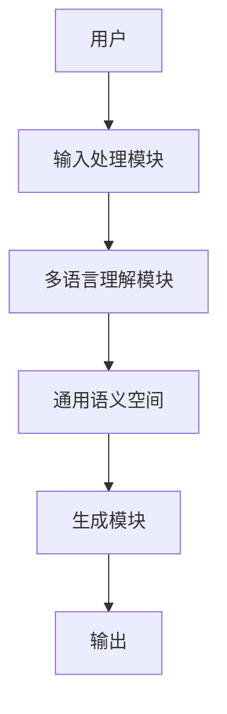

                 


# AI Agent的多语言支持：跨语言理解与生成

## 关键词：
AI Agent，多语言支持，跨语言理解，自然语言处理，生成模型

## 摘要：
本文详细探讨AI Agent在多语言环境下的支持能力，包括跨语言理解和生成的核心原理、算法设计以及系统实现。通过分析多语言模型的数学基础、算法流程和系统架构，结合实际项目案例，为读者提供从理论到实践的全面指导。

---

## 第一部分：AI Agent的多语言支持基础

### 第1章：AI Agent基础概述

#### 1.1 AI Agent的基本概念

- **1.1.1 什么是AI Agent**
  - AI Agent（人工智能代理）是能够感知环境并采取行动以实现目标的智能实体。
  - 核心功能包括感知、推理、规划和执行。

- **1.1.2 AI Agent的核心功能**
  - 感知：通过传感器或数据源获取信息。
  - 推理：基于知识库进行逻辑推理。
  - 规划：制定行动方案。
  - 执行：通过执行器或API实现目标。

- **1.1.3 AI Agent的应用场景**
  - 智能助手（如Siri、Alexa）。
  - 自动化系统（如工业机器人）。
  - 聊天机器人（如客服系统）。

#### 1.2 多语言支持的重要性

- **1.2.1 多语言支持的定义**
  - AI Agent能够理解和生成多种语言的能力。
  - 包括跨语言理解（从一种语言到另一种语言的理解）和跨语言生成（从一种语言生成另一种语言）。

- **1.2.2 多语言支持的必要性**
  - 面对全球化的用户需求，单一语言支持已无法满足。
  - 提高用户体验，拓展市场覆盖范围。

- **1.2.3 多语言支持的技术挑战**
  - 不同语言的语法、语义差异大。
  - 数据稀疏性问题，小语种数据不足。

---

## 第二部分：跨语言理解与生成的背景

### 第2章：自然语言处理基础

#### 2.1 自然语言处理的核心技术

- **2.1.1 词向量表示**
  - 使用如Word2Vec、GloVe等模型将词语映射到向量空间。
  - 示例：英语中的"king"和中文中的"国王"可能有不同的向量表示。

- **2.1.2 句法分析**
  - 通过语法树分析句子的结构。
  - 跨语言句法分析需要处理不同语言的句法差异。

- **2.1.3 语义理解**
  - 基于上下文理解词语或句子的含义。
  - 如使用BERT等模型进行跨语言表示。

#### 2.2 跨语言理解与生成的挑战

- **2.2.1 语言差异的复杂性**
  - 不同语言的词汇、语法结构差异大。
  - 如英语和中文的语序差异。

- **2.2.2 跨语言模型的训练难度**
  - 数据量不足，尤其是小语种。
  - 跨语言模型的训练需要多任务学习。

- **2.2.3 跨语言应用的实际需求**
  - 实现真正的多语言对话系统。
  - 支持用户使用多种语言与AI Agent交互。

#### 2.3 跨语言理解与生成的解决方案

- **2.3.1 多语言预训练模型的发展**
  - 使用如mBART、XLM等多语言模型。
  - 这些模型在多种语言上进行预训练，能够处理跨语言任务。

- **2.3.2 跨语言迁移学习的应用**
  - 利用一种语言的数据来提升其他语言的模型性能。
  - 如使用英语数据增强小语种模型。

---

## 第三部分：跨语言理解与生成的核心概念

### 第3章：跨语言理解的原理

#### 3.1 跨语言理解的原理

- **3.1.1 跨语言词向量表示**
  - 使用多语言词嵌入模型（如M-BERT）将不同语言的词语映射到同一向量空间。
  - 示例：英语的"dog"和中文的"狗"在向量空间中表示为相近的点。

- **3.1.2 跨语言句法分析**
  - 通过调整语法分析规则来适应不同语言的句法结构。
  - 如中文的主谓宾结构与英语的主谓宾结构有相似性。

- **3.1.3 跨语言语义理解**
  - 利用跨语言表示模型（如XLM-R）进行语义表示。
  - 示例：将中文句子映射到通用语义空间后，可以与英语句子进行对比。

### 第4章：跨语言生成的原理

#### 4.1 跨语言生成的原理

- **4.1.1 跨语言生成模型**
  - 使用多语言生成模型（如NMT）进行跨语言翻译或生成。
  - 示例：将中文文本生成为英文文本。

- **4.1.2 跨语言生成的质量评估**
  - 使用BLEU、ROUGE等指标评估生成文本的质量。
  - 注意：跨语言生成的质量通常低于单语言生成。

---

## 第四部分：跨语言理解与生成的算法原理

### 第5章：跨语言理解的算法

#### 5.1 跨语言理解的算法

- **5.1.1 基于Transformer的跨语言模型**
  - Transformer模型通过自注意力机制处理序列数据。
  - 示例：使用多语言Transformer模型进行跨语言文本分类。

- **5.1.2 多语言预训练模型**
  - 使用如mBART、XLM等模型进行跨语言任务。
  - 示例：在预训练阶段，模型同时学习多种语言的特征。

- **5.1.3 跨语言迁移学习**
  - 利用一种语言的数据来提升其他语言的模型性能。
  - 示例：使用英语数据增强小语种模型。

### 第6章：跨语言生成的算法

#### 6.1 跨语言生成的算法

- **6.1.1 基于GPT的跨语言生成**
  - 使用多语言GPT模型生成跨语言文本。
  - 示例：使用XLM生成多种语言的文本。

- **6.1.2 多语言生成模型的优化**
  - 通过调整生成策略（如温度参数）优化跨语言生成质量。
  - 示例：在生成过程中，动态调整语言模型的参数。

---

## 第五部分：跨语言理解与生成的系统架构与设计

### 第7章：跨语言系统的应用场景

#### 7.1 跨语言系统的应用场景

- **7.1.1 跨语言客服系统**
  - 支持用户使用多种语言与AI Agent交互。
  - 示例：用户可以用中文或英文与客服机器人对话。

- **7.1.2 跨语言信息检索**
  - 在多语言文档中检索信息。
  - 示例：用户可以用中文查询英文文档中的内容。

- **7.1.3 跨语言对话系统**
  - 支持多语言对话。
  - 示例：用户可以用西班牙语与AI Agent对话，生成中文回复。

### 第8章：跨语言系统的系统功能设计

#### 8.1 跨语言系统的功能模块

- **8.1.1 多语言输入处理**
  - 支持多种语言的输入解析。
  - 示例：识别输入文本的语言并进行相应的处理。

- **8.1.2 跨语言理解模块**
  - 将输入文本映射到通用语义空间。
  - 示例：将中文文本映射到通用语义空间后进行分类。

- **8.1.3 跨语言生成模块**
  - 根据需求生成目标语言的文本。
  - 示例：根据用户输入生成英文回复。

### 第9章：跨语言系统的系统架构设计

#### 9.1 跨语言系统的架构图



---

## 第六部分：跨语言理解与生成的项目实战

### 第10章：跨语言项目的实战

#### 10.1 跨语言项目的环境安装

- 安装Python和相关库：
  ```bash
  pip install numpy
  pip install transformers
  pip install torch
  ```

#### 10.2 跨语言项目的实现

- 使用Hugging Face的库进行跨语言处理：
  ```python
  from transformers import AutoTokenizer, AutoModelForMaskedLM
  tokenizer = AutoTokenizer.from_pretrained("facebook/xlm-roberta-base")
  model = AutoModelForMaskedLM.from_pretrained("facebook/xlm-roberta-base")
  inputs = tokenizer("Hello, my name is [MASK].", return_tensors="pt")
  outputs = model(**inputs)
  ```
  - 示例：使用XLM模型进行跨语言文本生成。

#### 10.3 跨语言项目的案例分析

- 案例：构建一个多语言客服系统。
  - 实现步骤：
    1. 收集多语言数据。
    2. 使用多语言模型进行训练。
    3. 部署系统并测试。

---

## 第七部分：跨语言理解与生成的总结与展望

### 第11章：跨语言理解与生成的总结

#### 11.1 跨语言理解与生成的核心总结

- 跨语言理解与生成的关键在于模型的多语言能力。
- 需要结合数学模型和算法进行优化。

#### 11.2 跨语言理解与生成的未来展望

- 更多语言的支持。
- 更高的生成质量。
- 更广泛的应用场景。

---

## 作者

作者：AI天才研究院/AI Genius Institute & 禅与计算机程序设计艺术 /Zen And The Art of Computer Programming

---

这篇文章详细介绍了AI Agent在多语言支持方面的核心概念、算法原理和系统设计，结合实际项目案例，为读者提供了从理论到实践的全面指导。

