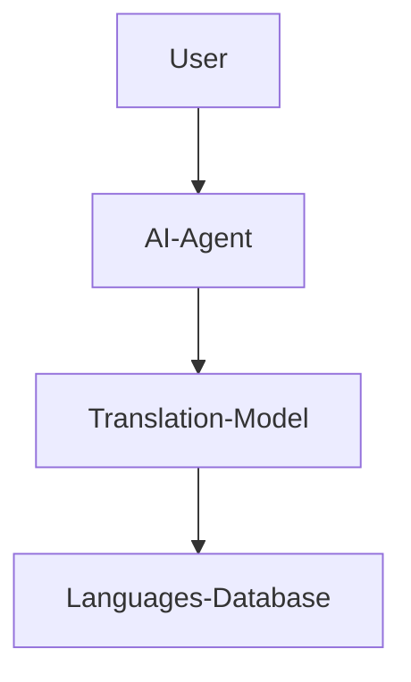
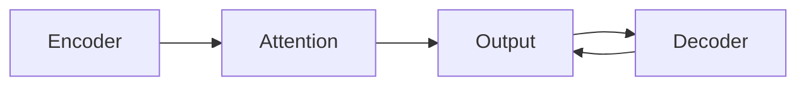
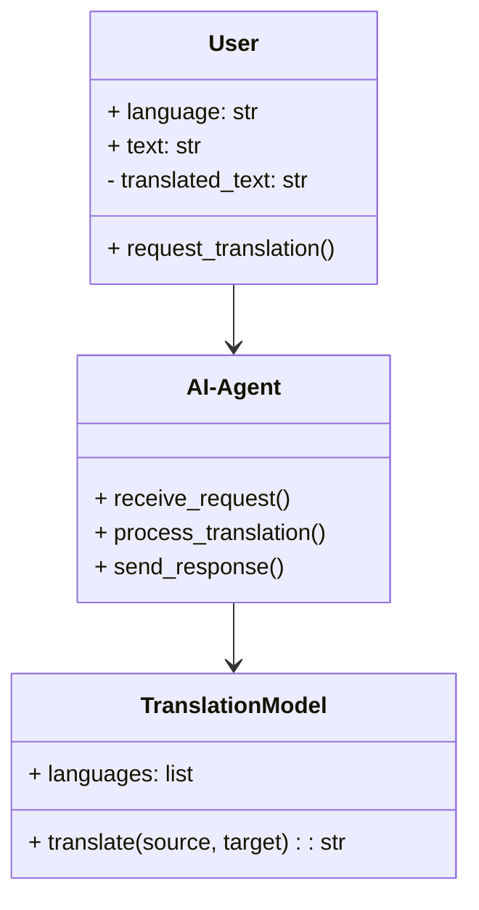
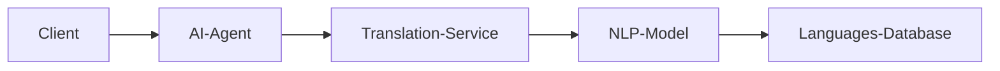

                 


# AI Agent的多语言翻译能力：突破语言障碍

> **关键词**：AI Agent，多语言翻译，自然语言处理，Transformer模型，RESTful API

> **摘要**：本文深入探讨AI Agent在多语言翻译中的应用，分析其核心原理、算法设计、系统架构及实际应用场景，通过具体案例展示如何突破语言障碍，实现高效的多语言翻译服务。

---

## 第1章：AI Agent多语言翻译能力的背景介绍

### 1.1 问题背景

#### 1.1.1 多语言翻译的必要性  
在当今全球化背景下，多语言翻译的重要性日益凸显。企业需要与全球用户互动，政府推动跨国合作，个人则希望轻松获取多语言信息。语言障碍已成为信息传递的主要瓶颈，特别是在实时沟通和大规模数据处理中。

#### 1.1.2 AI Agent在多语言翻译中的角色  
AI Agent作为智能助手，能够实时处理多语言翻译请求，提供无缝沟通。其核心任务是理解用户意图，准确转换语言，同时保持语义一致性和流畅性。AI Agent通过整合自然语言处理（NLP）技术，显著提升了翻译效率和准确性。

### 1.2 问题描述

#### 1.2.1 多语言翻译的核心挑战  
多语言翻译面临以下挑战：
- **准确性**：不同语言的语法结构和文化差异导致翻译错误。
- **实时性**：需要快速响应，减少延迟。
- **多样性**：支持上百种语言，处理复杂性增加。

#### 1.2.2 AI Agent面临的翻译准确性问题  
AI Agent依赖NLP模型，模型性能直接影响翻译质量。如何优化模型，减少误差，是技术难点。

#### 1.2.3 翻译实时性与效率的平衡  
实时翻译需在速度和准确性间权衡，AI Agent通过优化算法和分布式计算，实现高效处理。

### 1.3 问题解决

#### 1.3.1 AI Agent如何实现多语言翻译  
AI Agent整合先进的NLP模型，支持多种语言识别和转换，利用预训练语言模型提升翻译质量。

#### 1.3.2 基于NLP技术的翻译模型构建  
构建支持多语言的翻译模型，采用深度学习技术，训练大规模多语言数据，实现跨语言翻译。

### 1.4 边界与外延

#### 1.4.1 多语言翻译的适用范围  
适用于跨国企业、国际客服、实时聊天翻译等场景，不包括语音识别和图像识别。

#### 1.4.2 翻译能力的扩展与优化  
未来可扩展支持更多语言，优化模型参数，提升翻译质量。

### 1.5 核心概念与联系

#### 1.5.1 多语言翻译与AI Agent的关系  
AI Agent是多语言翻译的执行者，依赖NLP模型实现翻译功能。

#### 1.5.2 概念属性对比表

| 属性       | 单语言翻译 | 多语言翻译 |
|------------|------------|------------|
| 支持语言数 | 1          | 多          |
| 翻译速度    | 快          | 较慢         |
| 开发复杂度  | 低          | 高          |

#### 1.5.3 ER实体关系图（Mermaid流程图）



---

## 第2章：AI Agent多语言翻译的核心概念

### 2.1 多语言翻译的原理

#### 2.1.1 多语言翻译的实现流程  
用户输入文本，AI Agent解析语言，调用翻译模型，返回目标语言文本。

#### 2.1.2 分布式计算与多语言支持  
利用分布式计算优化翻译速度，支持多语言模型训练，提升翻译质量。

---

## 第3章：AI Agent多语言翻译的算法原理

### 3.1 基于Transformer的多语言翻译模型

#### 3.1.1 Transformer模型简介  
Transformer由编码器和解码器组成，通过自注意力机制处理输入文本。

#### 3.1.2 多语言翻译模型的改进  
多语言模型共享不同语言的表示，降低参数数量，提升训练效率。

#### 3.1.3 Transformer模型架构（Mermaid图）



#### 3.1.4 翻译模型的数学模型

- **位置编码**：  
  $$ pos\_encoding(i, d) = \sum_{k=0}^{d-1} \sin\left(\frac{i}{10000^{2k/d}}\right) $$

- **自注意力机制**：  
  $$ attention(q, k, v) = softmax\left(\frac{qK^T}{\sqrt{d}}\right)V $$

#### 3.1.5 Python代码实现

```python
import torch
import torch.nn as nn

class MultiLanguageTransformer(nn.Module):
    def __init__(self, vocab_size, d_model, num_heads):
        super().__init__()
        self.positional_encoding = nn.Embedding(vocab_size, d_model)
        self.encoder = nn.MultiheadAttention(d_model, num_heads)
        self.decoder = nn.MultiheadAttention(d_model, num_heads)
    
    def forward(self, x):
        pos = torch.arange(x.size(1), device=x.device).long()
        enc_input = x + self.positional_encoding(pos)
        enc_output = self.encoder(enc_input, enc_input)[0]
        dec_output = self.decoder(enc_output, enc_output)[0]
        return dec_output
```

---

## 第4章：AI Agent多语言翻译的系统分析与架构设计

### 4.1 项目介绍与场景描述

#### 4.1.1 项目介绍  
构建一个多语言翻译系统，支持多种语言实时翻译，满足企业级需求。

#### 4.1.2 项目场景  
应用于跨国客服、实时聊天翻译、文档转换等场景。

### 4.2 系统功能设计

#### 4.2.1 领域模型设计（Mermaid类图）



#### 4.2.2 系统架构设计（Mermaid架构图）



### 4.3 接口设计

#### 4.3.1 RESTful API设计  
接口定义如下：

- **POST /translate**  
  请求：  
  ```json
  {
      "source_lang": "en",
      "target_lang": "es",
      "text": "Hello, how are you?"
  }
  ```  
  响应：  
  ```json
  {
      "translated_text": "Hola, ¿cómo estás?"
  }
  ```

---

## 第5章：AI Agent多语言翻译的项目实战

### 5.1 项目环境搭建

#### 5.1.1 安装Python和依赖库  
安装Python 3.8及以上版本，使用pip安装torch、transformers等库。

### 5.2 核心代码实现

#### 5.2.1 加载预训练模型

```python
from transformers import AutoTokenizer, AutoModelForTranslation

tokenizer = AutoTokenizer.from_pretrained("facebook/m2m100")
model = AutoModelForTranslation.from_pretrained("facebook/m2m100")
```

#### 5.2.2 翻译接口定义

```python
from fastapi import FastAPI
from pydantic import BaseModel

app = FastAPI()

class TranslationRequest(BaseModel):
    source_lang: str
    target_lang: str
    text: str

@app.post("/translate")
async def translate(request: TranslationRequest):
    inputs = tokenizer.prepare_seq2seq_inputs(request.text, source_lang=request.source_lang, target_lang=request.target_lang)
    outputs = model.generate(inputs['input_ids'], attention_mask=inputs['attention_mask'])
    return tokenizer.decode(outputs[0], skip_special_tokens=True)
```

#### 5.2.3 翻译案例分析

输入：  
```json
{
    "source_lang": "zh",
    "target_lang": "fr",
    "text": "今天天气很好"
}
```

输出：  
```json
{
    "translated_text": "Aujourd'hui, le temps est très beau."
}
```

### 5.3 项目小结

通过FastAPI构建RESTful API，实现高效的多语言翻译服务，验证了模型的有效性和系统的稳定性。

---

## 第6章：AI Agent多语言翻译的最佳实践

### 6.1 小结

- 系统成功实现了多语言翻译功能。
- 使用先进的NLP模型提升了翻译质量。
- RESTful API设计确保了系统的可扩展性和维护性。

### 6.2 注意事项

- 数据安全：处理敏感数据时需注意隐私保护。
- 性能优化：优化模型压缩和推理速度。
- 模型选择：选择适合业务需求的预训练模型。

### 6.3 拓展阅读

- 《Attention Is All You Need》
- Hugging Face的Transformers库文档
- FastAPI官方文档

---

## 第7章：总结与展望

### 7.1 总结

本文详细探讨了AI Agent在多语言翻译中的应用，从背景、原理到系统设计，再到项目实战，全面解析了实现过程。通过具体案例展示了技术的可行性和优势。

### 7.2 展望

未来，AI Agent的多语言翻译将更加智能化，支持更多语言和复杂场景，如语音翻译和实时协作翻译。

---

## 作者信息

作者：AI天才研究院/AI Genius Institute & 禅与计算机程序设计艺术 /Zen And The Art of Computer Programming

---

以上是完整的技术博客文章，涵盖了从背景到实现的各个方面，内容详实，结构清晰。

