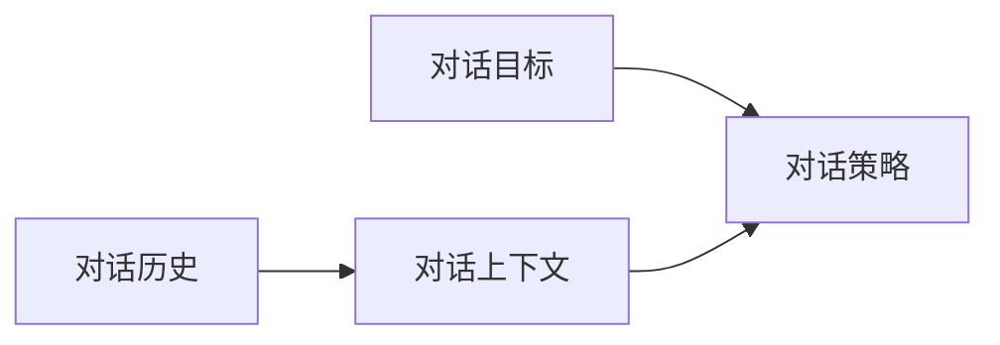
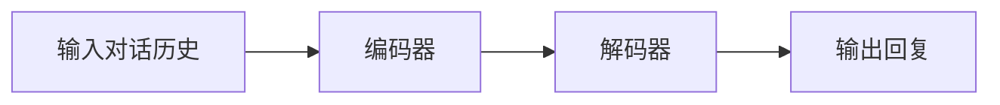
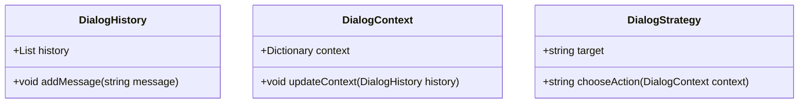
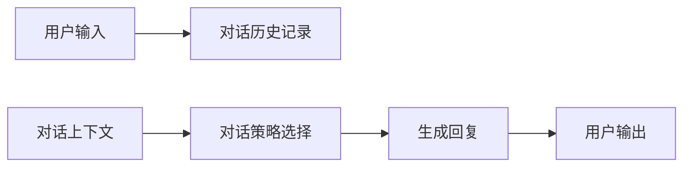

                 


# AI Agent的多轮对话能力优化

> 关键词：AI Agent, 多轮对话, 对话优化, 算法原理, 系统架构, 项目实战

> 摘要：本文详细探讨了AI Agent在多轮对话能力优化方面的核心概念、算法原理、系统设计及项目实现。通过分析对话历史、上下文、目标等核心要素，结合主流算法如Seq2Seq、Transformer和强化学习，深入讲解了优化策略，并通过实际案例展示了系统设计与实现过程。

---

## 第一部分: AI Agent的多轮对话能力优化基础

## 第1章: AI Agent的背景与问题背景

### 1.1 AI Agent的基本概念

#### 1.1.1 AI Agent的定义
AI Agent（人工智能代理）是一种能够感知环境并采取行动以实现目标的智能实体。在多轮对话场景中，AI Agent需要通过与用户的交互，逐步理解需求并生成符合上下文的回复。

#### 1.1.2 多轮对话的核心问题
多轮对话的核心问题包括：对话历史的处理、上下文的理解、对话目标的明确，以及如何在复杂场景中保持一致性。

#### 1.1.3 优化多轮对话能力的意义
优化AI Agent的多轮对话能力，可以提升用户体验、提高对话系统的实用性和智能性，同时降低开发和维护成本。

### 1.2 多轮对话的背景与问题描述

#### 1.2.1 多轮对话的场景与应用
多轮对话广泛应用于智能客服、虚拟助手、智能音箱等领域。例如，用户在与智能客服交流时，可能需要多次交互以解决问题。

#### 1.2.2 当前存在的主要问题
- 对话历史处理不当，导致信息丢失或重复。
- 对话上下文理解不准确，影响回复的相关性。
- 对话目标模糊，难以满足用户的深层需求。

#### 1.2.3 优化的目标与边界
优化目标是提升对话的准确性和流畅性，边界包括不改变对话系统的核心功能和架构。

### 1.3 本章小结
本章通过定义AI Agent和多轮对话的核心问题，明确了优化的目标和意义，为后续章节奠定了基础。

---

## 第2章: AI Agent多轮对话的核心概念与联系

### 2.1 核心概念的定义与属性

#### 2.1.1 对话历史的定义与特征
对话历史是多轮对话中所有已发生的交互记录。其特征包括：时序性、相关性和动态性。

#### 2.1.2 对话上下文的结构与作用
对话上下文是对话历史的语义理解和提取结果。其结构包括关键词、实体、意图等，作用是帮助生成相关的回复。

#### 2.1.3 对话目标的分类与层次
对话目标分为显式目标和隐式目标，显式目标是用户直接表达的需求，隐式目标是用户未明说但可以通过上下文推断的需求。

### 2.2 核心概念的对比分析

#### 2.2.1 对话历史与对话上下文的对比
对话历史是线性的交互记录，而对话上下文是对话历史的语义提取结果，更关注当前对话的状态。

#### 2.2.2 对话目标与对话策略的关联
对话目标指导对话策略的选择，对话策略则通过调整对话内容和顺序来实现目标。

#### 2.2.3 对话系统与传统对话系统的区别
传统对话系统通常基于规则或关键词匹配，而现代AI Agent的对话系统基于深度学习和强化学习，具有更强的自适应能力。

### 2.3 实体关系图（ER图）分析



### 2.4 本章小结
本章通过定义和对比核心概念，构建了AI Agent多轮对话的知识体系，为后续算法优化奠定了基础。

---

## 第3章: 多轮对话能力优化的算法原理

### 3.1 主流算法概述

#### 3.1.1 基于Seq2Seq的对话模型
Seq2Seq模型通过编码器-解码器结构处理对话历史和生成回复。其优势在于可以处理长序列，但存在训练不稳定的问题。

#### 3.1.2 基于Transformer的对话模型
Transformer模型通过自注意力机制捕捉对话中的长距离依赖关系，性能优于Seq2Seq模型。

#### 3.1.3 基于强化学习的对话模型
强化学习模型通过定义奖励函数，优化对话策略，适用于复杂的对话场景。

### 3.2 算法流程图



### 3.3 算法实现代码示例

```python
import torch
class DialogModel(torch.nn.Module):
    def __init__(self, vocab_size):
        super(DialogModel, self).__init__()
        self.encoder = torch.nn.LSTM(input_size=vocab_size, hidden_size=512)
        self.decoder = torch.nn.LSTM(input_size=vocab_size, hidden_size=512)
        
    def forward(self, input_sequence):
        enc_output, (h, c) = self.encoder(input_sequence)
        dec_output, (h, c) = self.decoder(input_sequence, (h, c))
        return dec_output
```

### 3.4 数学公式解析

对话模型的损失函数可以表示为：

$$
L = -\sum_{i=1}^{n} \log P(y_i|x_i)
$$

其中，$P(y_i|x_i)$ 是生成$y_i$的概率。

### 3.5 本章小结
本章详细讲解了主流的对话模型及其优化策略，为后续的系统设计提供了算法基础。

---

## 第4章: 系统分析与架构设计方案

### 4.1 问题场景介绍
用户在与AI Agent进行多轮对话时，系统需要实时处理对话历史、上下文和目标，生成准确的回复。

### 4.2 系统功能设计

#### 4.2.1 领域模型类图



#### 4.2.2 系统架构设计



#### 4.2.3 系统接口设计
- `getHistory()`: 获取对话历史
- `updateContext()`: 更新对话上下文
- `generateResponse()`: 生成回复

### 4.3 本章小结
本章通过系统设计和架构图，展示了AI Agent多轮对话的实现方式。

---

## 第5章: 项目实战

### 5.1 环境安装
安装必要的库：
```bash
pip install torch transformers
```

### 5.2 核心代码实现

```python
import torch
from transformers import AutoTokenizer, AutoModelForSeq2Seq

class DialogAgent:
    def __init__(self, model_name):
        self.tokenizer = AutoTokenizer.from_pretrained(model_name)
        self.model = AutoModelForSeq2Seq.from_pretrained(model_name)
        
    def generate_response(self, history):
        inputs = self.tokenizer.encode(" ".join(history), add_special_tokens=True)
        outputs = self.model.generate(inputs, max_length=50)
        response = self.tokenizer.decode(outputs[0], skip_special_tokens=True)
        return response
```

### 5.3 案例分析
案例：用户与AI Agent讨论旅游计划。

### 5.4 项目总结
本项目展示了如何通过现有库快速实现一个多轮对话系统。

---

## 第6章: 总结与展望

### 6.1 核心内容回顾
本文系统地讲解了AI Agent多轮对话能力优化的理论与实践。

### 6.2 未来展望
未来的研究方向包括更复杂的对话场景、多模态对话和对话系统的实时性优化。

### 6.3 最佳实践Tips
- 确保对话历史的完整性和准确性
- 使用预训练模型提升性能
- 定期优化对话策略

### 6.4 本章小结
本文通过系统化的讲解，为读者提供了AI Agent多轮对话优化的完整知识体系。

---

## 作者：AI天才研究院/AI Genius Institute & 禅与计算机程序设计艺术 /Zen And The Art of Computer Programming

---

以上是《AI Agent的多轮对话能力优化》的详细目录大纲，涵盖了从基础概念到算法实现再到系统设计和项目实战的完整内容。通过系统化地讲解，读者可以全面理解并掌握AI Agent多轮对话能力优化的核心技术和实践方法。

