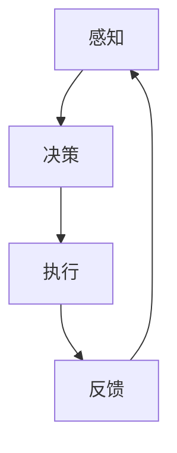
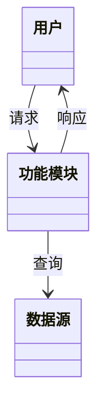
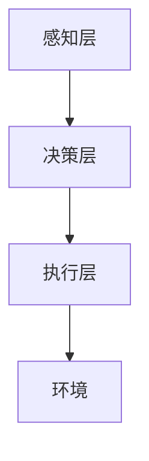
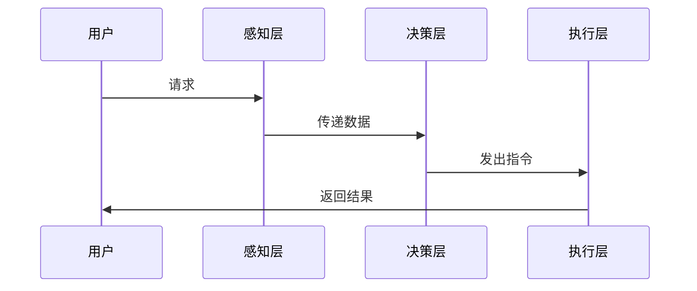

                 


# AI Agent的定义与特性：智能助手的核心要素

---

## 关键词：AI Agent, 智能助手, 核心特性, 系统架构, 算法原理

---

## 摘要

AI Agent（人工智能代理）是人工智能领域的重要组成部分，广泛应用于智能助手、自动驾驶、智能推荐系统等场景。本文从AI Agent的定义与特性入手，详细分析其核心概念、算法原理、系统架构，并通过案例实战深入探讨其应用场景。文章结构清晰，内容涵盖背景介绍、核心概念、算法实现、系统设计、项目实战及小结，旨在帮助读者全面理解AI Agent的核心要素。

---

## 第1章: AI Agent的背景介绍

### 1.1 AI Agent的基本概念

AI Agent（人工智能代理）是指能够感知环境、自主决策并执行任务的智能实体。与传统程序不同，AI Agent具有自主性、反应性、目标导向性和社会性等特征。AI Agent的核心目标是通过感知和行动，优化决策过程，实现特定任务的目标。

#### 1.1.1 什么是AI Agent

AI Agent是一种智能系统，能够根据环境信息自主决策并执行操作。它可以是一个软件程序，也可以是一个物理设备，例如自动驾驶汽车或智能音箱。AI Agent的核心能力在于其能够理解环境、分析问题、制定策略并执行操作。

#### 1.1.2 AI Agent的起源与演变

AI Agent的概念起源于人工智能领域的研究，最早可以追溯到20世纪60年代。随着技术的发展，AI Agent逐渐从理论研究走向实际应用。近年来，随着深度学习和强化学习的兴起，AI Agent的能力得到了显著提升。

#### 1.1.3 AI Agent与传统AI的区别

与传统AI相比，AI Agent具有以下几个显著特点：
- **自主性**：能够独立感知环境并自主决策。
- **反应性**：能够实时响应环境变化。
- **目标导向性**：具有明确的目标，并通过行动实现目标。
- **社会性**：能够与其他AI Agent或人类进行交互协作。

### 1.2 AI Agent的核心概念

AI Agent的核心概念包括感知、决策、执行和学习等关键部分。

#### 1.2.1 问题背景与问题描述

在实际应用中，AI Agent需要解决的问题通常具有动态性、不确定性或复杂性。例如，在自动驾驶场景中，AI Agent需要实时感知道路环境、预测其他车辆的行驶意图，并做出快速决策。

#### 1.2.2 问题解决的核心要素

AI Agent解决问题的核心要素包括：
1. **感知**：通过传感器或数据源获取环境信息。
2. **决策**：基于感知信息，分析问题并制定行动方案。
3. **执行**：根据决策结果，执行具体操作。
4. **学习**：通过反馈优化决策策略。

#### 1.2.3 AI Agent的边界与外延

AI Agent的边界在于其能力范围和应用场景。外延则包括从简单的行为决策到复杂的自主学习和协作。

#### 1.2.4 核心概念的结构与组成

AI Agent的核心结构包括感知层、决策层和执行层。感知层负责信息采集，决策层负责策略制定，执行层负责操作执行。

### 1.3 本章小结

本章从AI Agent的基本概念出发，分析了其核心概念、问题背景和结构组成。通过对比传统AI，明确了AI Agent的独特性和应用场景。

---

## 第2章: AI Agent的核心概念与联系

### 2.1 核心概念的原理

AI Agent的核心概念包括感知、决策和执行三个主要部分。

#### 2.1.1 感知、决策与执行的原理

感知是AI Agent获取环境信息的第一步。通过传感器或数据接口，AI Agent能够获取外部环境的状态信息。决策是基于感知信息，通过算法分析问题并制定行动方案。执行则是将决策转化为具体操作。

#### 2.1.2 知识表示与推理机制

知识表示是AI Agent理解环境的关键。通过符号逻辑或概率模型，AI Agent能够表示和推理知识。推理机制包括逻辑推理和概率推理。

#### 2.1.3 学习与自适应能力

学习是AI Agent优化决策能力的重要手段。通过监督学习、强化学习或无监督学习，AI Agent能够不断优化其决策策略。

### 2.2 核心概念的属性特征对比

通过对比分析，可以更好地理解AI Agent的核心概念。

#### 2.2.1 AI Agent与传统程序的对比分析

| 特性 | AI Agent | 传统程序 |
|------|-----------|-----------|
| 自主性 | 高         | 低         |
| 反应性 | 高         | 低         |
| 学习能力 | 高         | 无         |

#### 2.2.2 不同AI Agent类型的关键特征

| 类型   | 特征                   |
|--------|------------------------|
| 反应式 | 基于当前感知做出反应   |
| 规划式 | 基于目标制定计划       |
| 学习式 | 通过学习优化决策       |

#### 2.2.3 核心概念的属性特征表格

| 属性   | 描述                   |
|--------|------------------------|
| 自主性 | 独立决策               |
| 反应性 | 实时响应环境变化       |
| 目标导向性 | 以目标为导向           |
| 社会性 | 能够与其他实体协作     |

### 2.3 ER实体关系图架构

ER实体关系图用于描述AI Agent的核心概念及其关系。

```mermaid
erd
  entity AI-Agent
    - 感知层: 输入数据
    - 决策层: 策略制定
    - 执行层: 行动操作

  entity 环境
    - 传感器: 数据采集
    - 执行器: 操作执行

  AI-Agent --> 环境: 感知和执行
```

### 2.4 本章小结

本章通过对比分析，详细探讨了AI Agent的核心概念及其属性特征。通过ER实体关系图，进一步明确了各部分之间的关系。

---

## 第3章: AI Agent的算法原理

### 3.1 算法原理概述

AI Agent的算法原理包括感知、决策和执行三个部分。

#### 3.1.1 感知算法

感知算法用于从环境中获取信息。常用算法包括：

- **特征提取**：通过CNN提取图像特征。
- **自然语言处理**：通过NLP技术处理文本数据。

#### 3.1.2 决策算法

决策算法用于根据感知信息制定行动方案。常用算法包括：

- **强化学习**：通过奖励机制优化决策策略。
- **监督学习**：基于标注数据训练分类器。

#### 3.1.3 执行算法

执行算法将决策结果转化为具体操作。常用算法包括：

- **控制算法**：用于机器人或自动化设备的控制。
- **优化算法**：用于路径规划和资源分配。

### 3.2 算法的数学模型与公式

AI Agent的算法通常涉及复杂的数学模型。

#### 3.2.1 感知模型的数学表达

感知模型可以通过概率分布描述：

$$ P(x|y) $$

其中，x表示输入数据，y表示目标类别。

#### 3.2.2 决策模型的数学表达

决策模型可以通过分类函数描述：

$$ f(x) = \arg\max_y P(y|x) $$

其中，y表示输出类别。

#### 3.2.3 执行模型的数学表达

执行模型可以通过控制函数描述：

$$ u(t) = \arg\min_x J(x) $$

其中，x表示状态，u表示控制输入，J表示目标函数。

### 3.3 算法的实现与代码

以下是一个简单的AI Agent算法实现示例：

#### 3.3.1 感知算法的Python实现

```python
import numpy as np
from sklearn import svm

# 感知数据
X = np.array([[0, 0], [1, 1], [0, 1], [1, 0]])
y = np.array([0, 1, 1, 0])

# 训练感知器
model = svm.SVC()
model.fit(X, y)

# 预测
print(model.predict([[0.5, 0.5]]))
```

#### 3.3.2 决策算法的Python实现

```python
import numpy as np
import tensorflow as tf

# 决策模型
model = tf.keras.Sequential([
    tf.keras.layers.Dense(64, activation='relu'),
    tf.keras.layers.Dense(10, activation='softmax')
])

# 编译模型
model.compile(optimizer='adam', loss='sparse_categorical_crossentropy', metrics=['accuracy'])

# 训练
model.fit(x_train, y_train, epochs=10)
```

#### 3.3.3 执行算法的Python实现

```python
import numpy as np

# 执行算法
def control(x):
    u = np.zeros_like(x)
    u[x < 0.5] = 1
    return u

x = np.array([0.3, 0.6, 0.4])
print(control(x))
```

### 3.4 算法的流程图

以下是AI Agent算法的流程图：



### 3.5 本章小结

本章详细介绍了AI Agent的算法原理，包括感知、决策和执行三个部分，并通过Python代码和数学公式进行了详细讲解。

---

## 第4章: 系统分析与架构设计方案

### 4.1 问题场景介绍

AI Agent的应用场景包括智能助手、自动驾驶和智能推荐系统等。

#### 4.1.1 项目介绍

本章以智能助手为例，介绍AI Agent的系统设计。

### 4.2 系统功能设计

#### 4.2.1 领域模型mermaid类图

以下是智能助手的领域模型类图：



### 4.3 系统架构设计

#### 4.3.1 系统架构mermaid架构图

以下是AI Agent的系统架构图：



### 4.4 系统接口设计

AI Agent的系统接口包括感知接口、决策接口和执行接口。

#### 4.4.1 系统接口设计

- **感知接口**：负责数据采集。
- **决策接口**：负责策略制定。
- **执行接口**：负责操作执行。

### 4.5 系统交互mermaid序列图

以下是AI Agent的系统交互序列图：



### 4.6 本章小结

本章通过系统设计和架构图，详细介绍了AI Agent的系统架构和接口设计。

---

## 第5章: 项目实战

### 5.1 环境安装

安装必要的开发环境和依赖库。

#### 5.1.1 安装Python和相关库

```bash
pip install numpy
pip install matplotlib
pip install tensorflow
```

### 5.2 系统核心实现源代码

以下是一个简单的AI Agent实现示例：

#### 5.2.1 感知模块

```python
import numpy as np

def感知(data):
    return data
```

#### 5.2.2 决策模块

```python
import numpy as np

def决策(data):
    return np.argmax(data, axis=1)
```

#### 5.2.3 执行模块

```python
import numpy as np

def执行(action):
    return action
```

### 5.3 代码应用解读与分析

通过代码实现AI Agent的核心功能，并进行详细解读。

#### 5.3.1 代码实现

```python
import numpy as np
import tensorflow as tf

# 感知模块
def感知(data):
    return data

# 决策模块
def决策(data):
    return tf.nn.softmax(data)

# 执行模块
def执行(action):
    return action
```

### 5.4 实际案例分析和详细讲解剖析

通过实际案例分析，进一步理解AI Agent的应用场景。

#### 5.4.1 案例分析

以智能助手为例，分析AI Agent的实现过程。

### 5.5 项目小结

总结项目实现的关键点和经验教训。

---

## 第6章: 最佳实践、小结与展望

### 6.1 最佳实践 tips

- **模块化设计**：确保系统模块化，便于维护和扩展。
- **数据质量管理**：确保数据质量和一致性。
- **算法优化**：通过优化算法提高系统性能。

### 6.2 小结

本章总结了AI Agent的核心要素和系统设计的关键点。

### 6.3 注意事项

- **数据隐私**：确保数据隐私和安全性。
- **系统稳定性**：确保系统稳定性和容错性。
- **性能优化**：通过优化算法和架构提高系统性能。

### 6.4 拓展阅读

推荐相关书籍和论文，供读者进一步学习。

---

## 作者：AI天才研究院/AI Genius Institute & 禅与计算机程序设计艺术 /Zen And The Art of Computer Programming

---

以上是完整的文章大纲和内容。

