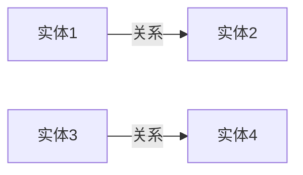

                 


# AI Agent的实体识别与关系抽取：深化语义理解

## 关键词：AI Agent，实体识别，关系抽取，自然语言处理，语义理解

## 摘要：  
本文详细探讨了AI Agent在实体识别与关系抽取中的应用，深入分析了其实体识别与关系抽取的核心算法原理，并结合系统架构设计与项目实战，帮助读者全面理解如何通过深化语义理解来提升AI Agent的智能水平。

---

## 正文部分

### 第一部分: AI Agent的实体识别与关系抽取概述

#### 第1章: 实体识别与关系抽取的背景与概念

##### 1.1 实体识别与关系抽取的背景
- **自然语言处理的发展历程**  
  自然语言处理（NLP）作为人工智能的核心领域，经历了从规则驱动到深度学习的演变，实体识别与关系抽取是NLP的两大核心任务。
- **AI Agent的角色**  
  AI Agent通过实体识别与关系抽取，能够理解文本中的关键信息，从而更好地执行任务。
- **实体识别与关系抽取的定义**  
  实体识别（NER）是识别文本中的命名实体，如人名、地名等；关系抽取是识别实体之间的关系，如“是”、“属于”等。

##### 1.2 实体识别与关系抽取的核心问题
- **实体识别的关键问题**  
  如何准确识别多样的实体类型，处理命名实体的模糊性。
- **关系抽取的挑战**  
  如何准确提取复杂的语义关系，处理上下文的歧义性。

##### 1.3 实体识别与关系抽取的核心要素
- **实体类型与关系类型**  
  实体类型包括人名、组织名、时间等，关系类型包括“位于”、“属于”等。
- **实体识别与关系抽取的特征分析**  
  包括位置信息、句法结构等。

#### 1.4 本章小结
- 介绍了实体识别与关系抽取的背景和定义。
- 分析了其实体识别与关系抽取的核心问题和要素。

---

### 第二部分: 实体识别与关系抽取的核心概念与联系

#### 第2章: 实体识别与关系抽取的核心概念

##### 2.1 实体识别的核心原理
- **基于规则的实体识别**  
  通过预定义的规则匹配文本中的实体。
- **基于统计的实体识别**  
  利用机器学习算法，从大量标注数据中学习模式。
- **基于深度学习的实体识别**  
  使用神经网络模型，如CRF和LSTM，捕捉上下文信息。

##### 2.2 关系抽取的核心原理
- **基于模式匹配的关系抽取**  
  通过预定义的模式匹配文本中的关系。
- **基于句法分析的关系抽取**  
  分析句子的语法结构，提取关系。
- **基于语义理解的关系抽取**  
  基于上下文语义，理解实体之间的关系。

##### 2.3 实体识别与关系抽取的联系
- **实体识别为关系抽取提供基础**  
  识别出实体后，才能进一步分析它们之间的关系。
- **关系抽取增强实体识别的语义理解**  
  通过关系抽取，可以更好地理解实体的上下文语义。

##### 2.4 概念对比
| 实体识别 | 关系抽取 |
|----------|----------|
| 识别文本中的实体 | 识别实体之间的关系 |
| 基于上下文和特征 | 基于上下文和句法结构 |

##### 2.5 ER实体关系图


#### 2.6 本章小结
- 详细介绍了实体识别与关系抽取的核心概念。
- 通过对比和实体关系图，展示了它们的联系。

---

### 第三部分: 实体识别与关系抽取的算法原理

#### 第3章: 实体识别的算法原理

##### 3.1 基于CRF的实体识别算法
- **CRF的基本原理**  
  CRF是一种条件随机场模型，常用于序列标注任务。
- **CRF在实体识别中的应用**  
  通过特征函数提取文本特征，进行实体识别。
- **优缺点分析**  
  优点：模型简单，效果稳定；缺点：特征工程依赖人工。

##### 3.2 基于LSTM的实体识别算法
- **LSTM的基本原理**  
  LSTM通过门控机制，捕捉长距离依赖。
- **LSTM在实体识别中的应用**  
  使用双向LSTM，捕捉前后文信息。
- **优缺点分析**  
  优点：效果优于CRF，适合处理长文本；缺点：训练时间较长。

##### 3.3 实体识别算法的对比与选择
- **CRF与LSTM的对比**  
  LSTM在效果上更优，但在小数据情况下，CRF更稳定。
- **算法选择建议**  
  根据数据量和任务需求选择合适的算法。

#### 3.4 本章小结
- 详细讲解了CRF和LSTM在实体识别中的应用。
- 分析了算法的优缺点，并提出了选择建议。

---

#### 第4章: 关系抽取的算法原理

##### 4.1 基于远程监督的关系抽取算法
- **远程监督的基本原理**  
  利用外部知识库中的关系进行监督学习。
- **远程监督在关系抽取中的应用**  
  通过预训练的关系模板，提取文本中的关系。
- **优缺点分析**  
  优点：简单高效；缺点：依赖于外部知识库的准确性。

##### 4.2 基于句法分析的关系抽取算法
- **句法分析的基本原理**  
  通过语法树分析句子结构，识别实体之间的关系。
- **句法分析在关系抽取中的应用**  
  结合句法树和实体识别结果，提取关系。
- **优缺点分析**  
  优点：准确率高；缺点：计算复杂。

##### 4.3 基于语义理解的关系抽取算法
- **语义理解的基本原理**  
  利用预训练的语义模型，如BERT，进行关系抽取。
- **语义理解在关系抽取中的应用**  
  通过上下文语义，识别复杂的实体关系。
- **优缺点分析**  
  优点：效果最佳；缺点：计算资源消耗大。

#### 4.4 本章小结
- 介绍了远程监督、句法分析和语义理解在关系抽取中的应用。
- 分析了各自优缺点，并提出了选择建议。

---

### 第四部分: 系统分析与架构设计

#### 第5章: 系统分析与架构设计

##### 5.1 问题场景介绍
- **需求分析**  
  用户需要一个能够自动识别实体及其关系的AI系统。
- **项目介绍**  
  开发一个基于深度学习的实体识别与关系抽取系统。

##### 5.2 系统功能设计
- **功能模块**  
  实体识别模块、关系抽取模块、语义理解模块。
- **领域模型类图**  
  ```mermaid
  classDiagram
      class 实体识别模块 {
          输入文本
          输出实体
      }
      class 关系抽取模块 {
          输入实体
          输出关系
      }
      class 语义理解模块 {
          输入关系
          输出语义
      }
  ```

##### 5.3 系统架构设计
- **系统架构图**  
  ```mermaid
  graph LR
      A(实体识别模块) --> B(关系抽取模块)
      B --> C(语义理解模块)
  ```

##### 5.4 系统接口设计
- **API接口**  
  提供RESTful API，供其他系统调用。

##### 5.5 系统交互序列图
- **交互流程**  
  ```mermaid
  sequenceDiagram
      用户 -> API接口: 发送文本
      API接口 -> 实体识别模块: 进行实体识别
      实体识别模块 -> 关系抽取模块: 提供实体列表
      关系抽取模块 -> 语义理解模块: 提供关系列表
      语义理解模块 -> 用户: 返回语义结果
  ```

#### 5.6 本章小结
- 详细描述了系统的功能设计和架构设计。
- 通过类图和序列图展示了系统的交互流程。

---

### 第五部分: 项目实战

#### 第6章: 项目实战

##### 6.1 环境安装
- **工具安装**  
  安装Python、TensorFlow、Keras等开发工具。
- **数据集准备**  
  使用公开数据集，如CoNLL、ACE等。

##### 6.2 系统核心实现
- **实体识别代码示例**  
  ```python
  import tensorflow as tf
  from tensorflow.keras import layers

  model = tf.keras.Sequential()
  model.add(layers.Embedding(input_dim=10000, output_dim=50))
  model.add(layers.Bidirectional(layers.LSTM(64, return_sequences=True)))
  model.add(layers.TimeDistributed(layers.Dense(40, activation='softmax')))
  model.compile(optimizer='adam', loss='sparse_categorical_crossentropy')
  ```

- **关系抽取代码示例**  
  ```python
  import spacy

  nlp = spacy.load("en_core_web_sm")
  doc = nlp("Apple is located in California.")
  for ent in doc.ents:
      print(ent.text, ent.label_)
  ```

##### 6.3 代码应用解读与分析
- **实体识别模型训练**  
  使用训练数据训练模型，调整超参数以优化性能。
- **关系抽取模型测试**  
  使用测试数据评估模型的准确率和召回率。

##### 6.4 案例分析
- **案例1**  
  输入文本：“张三在北京大学工作。”
  实体识别结果：张三（人名），北京大学（组织名）。
  关系抽取结果：张三在北京大学工作。

##### 6.5 项目小结
- 展示了如何通过代码实现实体识别与关系抽取。
- 通过案例分析，验证了系统的实际应用效果。

---

### 第六部分: 总结与展望

#### 第7章: 总结与展望

##### 7.1 总结
- 本文详细介绍了AI Agent的实体识别与关系抽取技术。
- 结合算法原理和系统设计，展示了其实际应用价值。

##### 7.2 展望
- **未来研究方向**  
  深化语义理解，探索更复杂的关系抽取任务。
- **技术发展趋势**  
  结合大语言模型，提升实体识别与关系抽取的准确率和效率。

##### 7.3 最佳实践Tips
- **数据质量的重要性**  
  高质量的标注数据是模型性能的关键。
- **模型选择的策略**  
  根据任务需求和数据量选择合适的算法。

#### 7.4 本章小结
- 总结了全文的主要内容。
- 展望了未来的研究方向和技术发展趋势。

---

## 作者：AI天才研究院/AI Genius Institute & 禅与计算机程序设计艺术 /Zen And The Art of Computer Programming

---

### 附录部分
#### 附录A: 实体识别与关系抽取的常见问题解答
- **问题1**：实体识别和关系抽取有什么区别？  
  实体识别是识别文本中的命名实体，而关系抽取是识别实体之间的关系。

- **问题2**：如何选择适合的实体识别算法？  
  根据数据量和任务需求选择CRF或LSTM。

- **问题3**：关系抽取的准确率如何提升？  
  提升数据质量，优化特征工程，尝试更复杂的模型。

#### 附录B: 参考文献与拓展阅读
- 建议阅读以下资料：
  - 经典论文：LSTM的论文，BERT的论文。
  - 开源库：spaCy、NLTK。
  - 在线课程：Coursera上的自然语言处理课程。

---

通过本文的详细分析，读者可以全面理解AI Agent的实体识别与关系抽取技术，掌握其核心算法和系统设计方法，并能够在实际项目中灵活应用。

