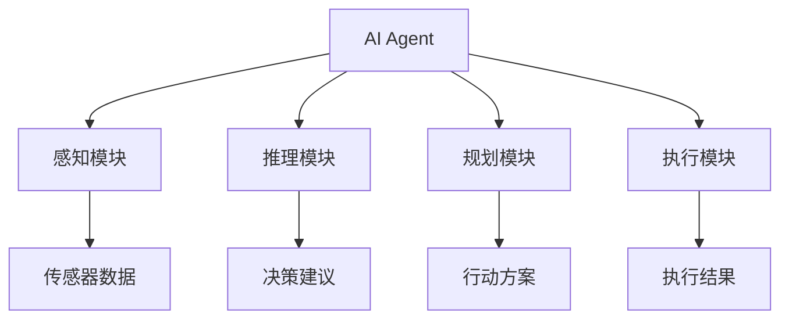
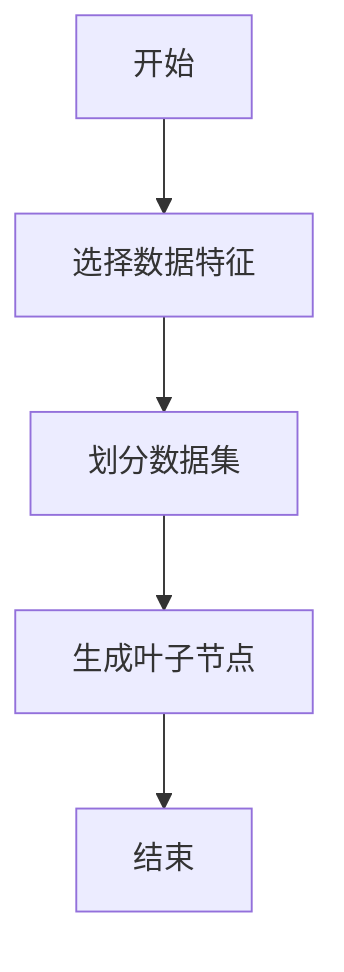
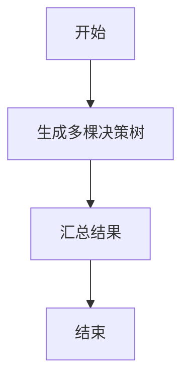
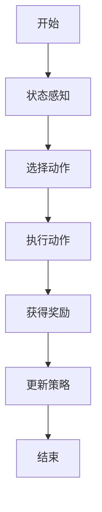
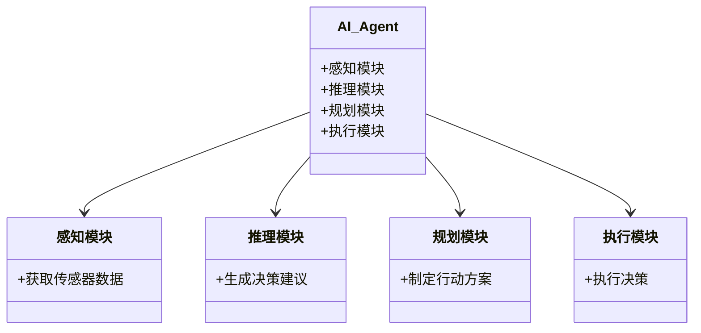
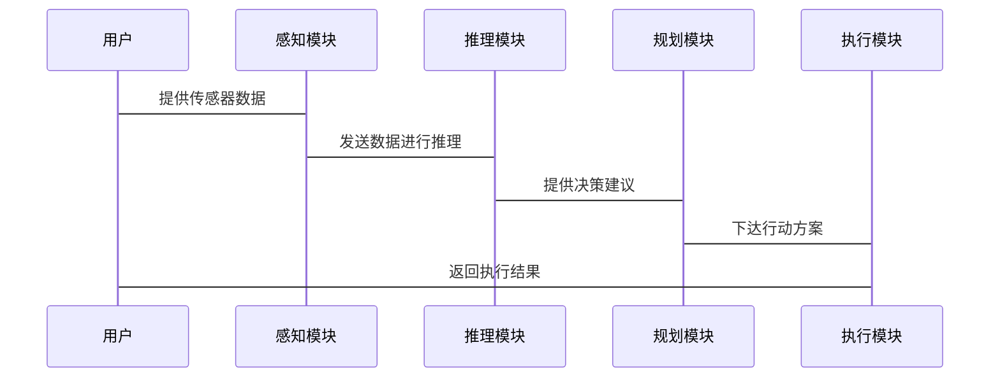

                 


# AI Agent的实时决策系统设计

> 关键词：AI Agent、实时决策系统、大语言模型、决策树、强化学习、实时推理、系统架构

> 摘要：本文深入探讨了AI Agent的实时决策系统设计，从核心概念到算法原理，再到系统架构和项目实战，系统性地分析了AI Agent在实时决策中的关键技术和实现方法。文章结合理论与实践，详细讲解了AI Agent的感知、推理、规划和执行模块，并通过具体的案例分析，帮助读者理解如何设计和实现高效的实时决策系统。

---

# 第一部分: AI Agent的实时决策系统基础

# 第1章: AI Agent与实时决策系统概述

## 1.1 AI Agent的基本概念

### 1.1.1 AI Agent的定义与特点
AI Agent（人工智能代理）是一种能够感知环境、自主决策并执行任务的智能实体。AI Agent的核心特点包括：
- **自主性**：能够自主决策，无需人工干预。
- **反应性**：能够实时感知环境并做出快速反应。
- **目标导向性**：基于目标驱动行为。
- **学习能力**：通过数据和经验不断优化决策能力。

### 1.1.2 实时决策系统的定义与特点
实时决策系统是一种能够在极短时间内完成数据采集、分析和决策的系统。其特点包括：
- **实时性**：决策过程必须在限定时间内完成。
- **准确性**：决策结果必须准确可靠。
- **高效性**：系统必须能够处理大规模数据并快速响应。

### 1.1.3 AI Agent在实时决策中的作用
AI Agent作为实时决策系统的核心组件，负责处理复杂场景下的决策任务。例如，在智能交通系统中，AI Agent能够实时感知交通状况并做出最优的路径规划。

## 1.2 AI Agent的演进历程

### 1.2.1 从传统规则引擎到AI Agent的演进
传统的规则引擎基于固定的规则和条件进行决策，而AI Agent则引入了机器学习和深度学习技术，能够根据数据动态调整决策策略。

### 1.2.2 大模型在AI Agent中的应用
随着大语言模型（如GPT）的发展，AI Agent的决策能力得到了显著提升。大模型能够通过上下文理解复杂场景，并生成更自然的决策结果。

### 1.2.3 实时决策系统的发展趋势
实时决策系统正在朝着分布式、边缘化和智能化方向发展，AI Agent在其中扮演着越来越重要的角色。

## 1.3 AI Agent的核心要素

### 1.3.1 感知模块
感知模块负责从环境中获取信息，包括传感器数据、用户输入等。

### 1.3.2 推理模块
推理模块基于感知到的信息，利用逻辑推理或机器学习模型生成决策建议。

### 1.3.3 规划模块
规划模块负责制定行动计划，确保决策的可行性和最优性。

### 1.3.4 执行模块
执行模块负责将决策转化为具体行动，例如发送指令或触发执行机构。

## 1.4 实时决策系统的应用场景

### 1.4.1 智能交通系统
AI Agent可以实时感知交通流量，并动态调整信号灯控制策略，提高道路通行效率。

### 1.4.2 智能推荐系统
AI Agent可以根据用户的实时行为和偏好，推荐个性化的内容或产品。

### 1.4.3 智能机器人
AI Agent可以控制机器人在复杂环境中自主导航和执行任务。

## 1.5 本章小结
本章介绍了AI Agent的基本概念、演进历程和核心要素，同时探讨了实时决策系统的应用场景，为后续内容奠定了基础。

---

# 第二部分: AI Agent的核心概念与联系

# 第2章: AI Agent的核心原理

## 2.1 AI Agent的感知与推理

### 2.1.1 感知模块的实现
感知模块通常包括传感器、摄像头或其他数据采集设备，用于获取环境信息。

### 2.1.2 推理模块的实现
推理模块可以基于规则引擎或机器学习模型进行推理。例如，使用决策树或随机森林模型进行分类或回归任务。

### 2.1.3 感知与推理的结合
通过将感知数据输入推理模块，AI Agent能够生成合理的决策建议。

## 2.2 AI Agent的规划与执行

### 2.2.1 规划模块的实现
规划模块通常基于搜索算法（如A*算法）或强化学习模型，生成最优行动方案。

### 2.2.2 执行模块的实现
执行模块负责将决策结果转化为具体行动，例如发送指令或驱动执行机构。

### 2.2.3 规划与执行的协同
通过实时反馈机制，规划模块可以动态调整行动方案，确保决策的最优性。

## 2.3 AI Agent的核心概念对比

### 2.3.1 不同AI Agent模型的对比
| 模型类型     | 基础原理           | 优缺点                           |
|--------------|--------------------|-----------------------------------|
| 规则引擎     | 基于规则和条件判断 | 实现简单，但灵活性和扩展性有限   |
| 决策树       | 基于特征分裂       | 易解释，但决策能力受限           |
| 随机森林     | 基于决策树的集成   | 鲁棒性高，但解释性稍差           |
| 强化学习模型  | 基于奖励机制       | 决策能力强，但训练复杂性较高     |

### 2.3.2 不同决策算法的对比
| 算法类型     | 适用场景           | 核心特点                           |
|--------------|--------------------|-----------------------------------|
| 决策树       | 分类与回归         | 易解释，适合中小规模数据集       |
| 随机森林     | 高维数据分类       | 鲁棒性高，适合复杂场景             |
| 强化学习     | 实时决策           | 适合动态环境，决策能力强           |

### 2.3.3 不同应用场景的对比
| 应用场景     | 核心需求           | 技术挑战                           |
|--------------|--------------------|-----------------------------------|
| 智能交通系统 | 实时路径规划       | 多目标优化，环境动态变化           |
| 智能推荐系统 | 个性化推荐         | 数据稀疏性，实时性要求             |
| 智能机器人   | 自主导航与任务执行 | 多传感器融合，复杂环境处理         |

## 2.4 AI Agent的实体关系图



## 2.5 本章小结
本章通过对比不同AI Agent模型和决策算法，分析了它们的优缺点和适用场景，并通过实体关系图展示了AI Agent的核心组成部分及其相互关系。

---

# 第三部分: AI Agent的算法原理

# 第3章: AI Agent的算法原理

## 3.1 决策树算法

### 3.1.1 决策树的定义与特点
决策树是一种基于树状结构的分类或回归模型。其特点包括：
- 易解释性：树状结构直观易懂。
- 高效率：适合中小规模数据集。

### 3.1.2 决策树的实现步骤



### 3.1.3 决策树的Python实现

```python
from sklearn import tree

# 数据集
X = [[2, 3], [5, 6], [7, 8], [1, 2]]
y = [0, 1, 1, 0]

# 训练模型
model = tree.DecisionTreeClassifier()
model.fit(X, y)

# 预测
print(model.predict([[4, 5]]))  # 输出: [1]
```

## 3.2 随机森林算法

### 3.2.1 随机森林的定义与特点
随机森林是一种基于决策树的集成算法。其特点包括：
- 高鲁棒性：通过集成多个决策树提高模型的稳定性和准确性。
- 低过拟合风险：适用于高维数据。

### 3.2.2 随机森林的实现步骤



### 3.2.3 随机森林的Python实现

```python
from sklearn.ensemble import RandomForestClassifier

# 数据集
X = [[2, 3], [5, 6], [7, 8], [1, 2], [3, 4], [4, 5], [6, 7], [0, 1]]
y = [0, 1, 1, 0, 1, 1, 0, 0]

# 训练模型
model = RandomForestClassifier(n_estimators=5)
model.fit(X, y)

# 预测
print(model.predict([[4, 5]]))  # 输出: [1]
```

## 3.3 强化学习算法

### 3.3.1 强化学习的定义与特点
强化学习是一种基于奖励机制的决策方法。其特点包括：
- 高灵活性：适用于动态环境。
- 需要大量训练：模型需要通过试错不断优化决策策略。

### 3.3.2 强化学习的实现步骤



### 3.3.3 强化学习的数学模型

$$ R = \sum_{t=1}^{T} \gamma^{t-1} r_t $$
其中，$R$ 表示总奖励，$\gamma$ 表示折扣因子，$r_t$ 表示第$t$步的奖励。

### 3.3.4 强化学习的Python实现

```python
import numpy as np
from collections import deque

# 简单的强化学习示例
class Agent:
    def __init__(self, state_space, action_space):
        self.state_space = state_space
        self.action_space = action_space
        self.gamma = 0.99

    def act(self, state):
        # 随机选择动作（简化实现）
        return np.random.choice(self.action_space)
    
    def remember(self, state, action, reward, next_state):
        # 简单的记忆机制（简化实现）
        pass

# 初始化
state_space = 5
action_space = 2
agent = Agent(state_space, action_space)

# 训练过程
for episode in range(100):
    state = 0
    done = False
    while not done:
        action = agent.act(state)
        next_state = ...  # 根据动作和环境变化计算下一个状态
        reward = ...       # 根据动作和状态变化计算奖励
        agent.remember(state, action, reward, next_state)
        state = next_state
```

## 3.4 本章小结
本章详细讲解了决策树、随机森林和强化学习三种算法的原理和实现方法，为后续的系统设计奠定了算法基础。

---

# 第四部分: AI Agent的系统架构设计

# 第4章: AI Agent的系统分析与架构设计

## 4.1 问题场景介绍

### 4.1.1 问题背景
假设我们正在设计一个智能交通系统，需要实时优化交通信号灯的控制策略。

### 4.1.2 项目介绍
本项目的目标是通过AI Agent实现智能交通信号灯的实时控制，提高道路通行效率。

## 4.2 系统功能设计

### 4.2.1 领域模型设计



### 4.2.2 系统架构设计


### 4.2.3 系统接口设计
- **输入接口**：传感器数据、用户输入
- **输出接口**：决策结果、执行指令
- **内部接口**：模块之间的通信接口

### 4.2.4 系统交互流程



## 4.3 本章小结
本章通过智能交通系统的案例，详细分析了AI Agent的系统架构设计，包括领域模型、架构图和交互流程图。

---

# 第五部分: AI Agent的项目实战

# 第5章: AI Agent的项目实战

## 5.1 项目实战环境安装

### 5.1.1 安装Python环境
```bash
python --version
pip install --upgrade pip
```

### 5.1.2 安装依赖库
```bash
pip install numpy scikit-learn matplotlib
```

## 5.2 系统核心实现

### 5.2.1 感知模块实现

```python
import numpy as np

def get_sensor_data():
    return np.random.rand(4, 2)
```

### 5.2.2 推理模块实现

```python
from sklearn import tree

def train_decision_tree(X, y):
    model = tree.DecisionTreeClassifier()
    model.fit(X, y)
    return model
```

### 5.2.3 规划模块实现

```python
def generate_action_plan():
    return "优化信号灯配时"
```

### 5.2.4 执行模块实现

```python
def execute_action(action):
    print(f"执行动作：{action}")
```

## 5.3 代码应用解读与分析

### 5.3.1 代码运行示例

```python
X = [[2, 3], [5, 6], [7, 8], [1, 2]]
y = [0, 1, 1, 0]

model = train_decision_tree(X, y)
action = generate_action_plan()
execute_action(action)
```

## 5.4 案例分析与详细讲解

### 5.4.1 案例分析
通过智能交通系统的案例，我们实现了从数据采集到决策执行的完整流程。

### 5.4.2 详细讲解
每个模块的实现细节及其在整体系统中的作用。

## 5.5 项目小结
本章通过具体的项目实战，详细讲解了AI Agent的实现过程，帮助读者理解理论与实践的结合。

---

# 第六部分: 高级应用与未来趋势

# 第6章: 高级应用与未来趋势

## 6.1 高级应用

### 6.1.1 自动驾驶

- **核心需求**：实时路径规划与多目标优化。
- **技术挑战**：环境复杂性与决策的实时性。

### 6.1.2 智能推荐系统

- **核心需求**：个性化推荐与实时性要求。
- **技术挑战**：数据稀疏性与计算效率。

## 6.2 未来趋势

### 6.2.1 边缘计算

- **优势**：低延迟、高实时性。
- **应用前景**：AI Agent将在边缘计算中发挥重要作用。

### 6.2.2 人机协作

- **趋势**：AI Agent将与人类协作，共同完成复杂决策任务。
- **技术挑战**：人机协作的高效性与自然性。

## 6.3 本章小结
本章探讨了AI Agent的高级应用与未来发展趋势，为读者提供了更广阔的视野。

---

# 作者：AI天才研究院 & 禅与计算机程序设计艺术

---

本文通过系统性的分析与实践，深入探讨了AI Agent的实时决策系统设计。从核心概念到算法实现，再到系统架构和项目实战，帮助读者全面掌握AI Agent的设计与实现方法。

