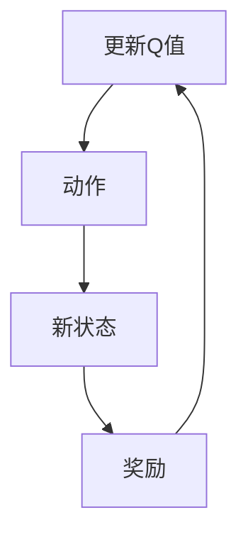
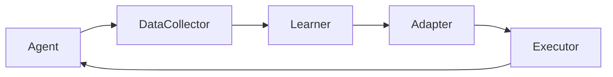
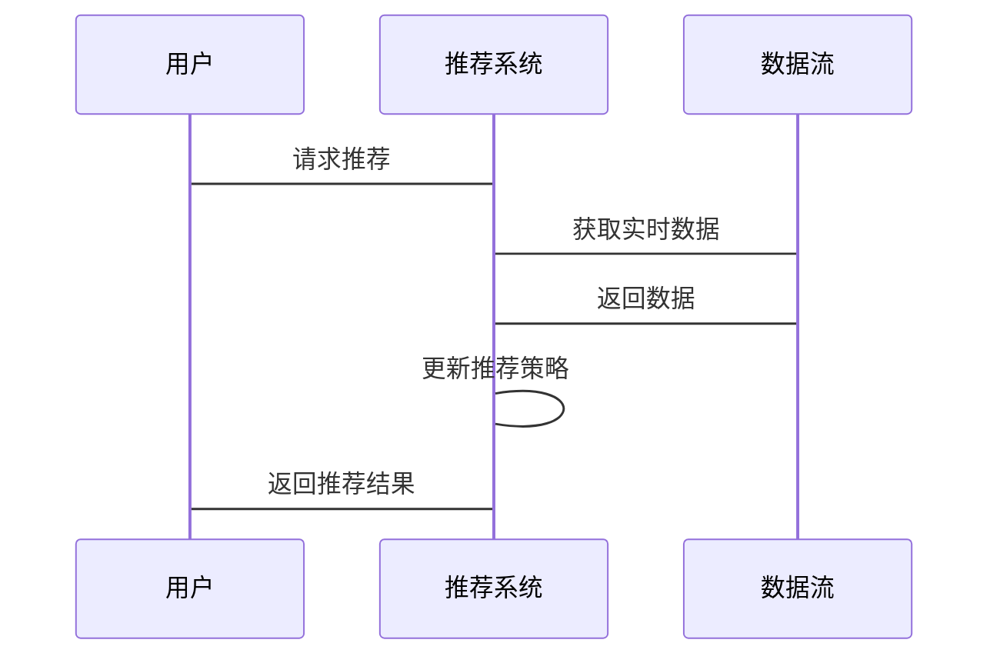

                 


# AI Agent的实时学习与适应机制

---

## 关键词：
AI Agent, 实时学习, 适应机制, 强化学习, 在线学习, 动态调整

---

## 摘要：
本文系统地探讨了AI Agent的实时学习与适应机制的核心原理、算法实现和实际应用。通过分析实时学习与适应机制的定义、核心要素、应用场景以及面临的挑战，结合强化学习、在线学习等算法，详细阐述了AI Agent如何通过动态调整策略和基于反馈的适应方法实现实时学习与适应。同时，本文通过具体案例分析和系统架构设计，展示了AI Agent在实际应用中的实现过程和注意事项，为读者提供了一套完整的理论与实践相结合的解决方案。

---

## 第1章: AI Agent的背景与核心概念

### 1.1 AI Agent的基本概念
#### 1.1.1 AI Agent的定义与特点
- AI Agent的定义：AI Agent是一种能够感知环境、自主决策并执行任务的智能体。
- AI Agent的特点：
  - 智能性：具备问题解决、学习和推理能力。
  - 实时性：能够快速响应环境变化。
  - 适应性：能够根据反馈动态调整行为策略。

#### 1.1.2 实时学习与适应机制的定义
- 实时学习：在动态环境中，AI Agent通过在线学习方法不断更新知识和模型。
- 适应机制：AI Agent根据实时反馈调整自身行为策略，以更好地适应环境变化。

#### 1.1.3 AI Agent的核心要素与组成
- 知识库：存储任务相关的知识和经验。
- 学习器：负责在线学习和知识更新。
- 适应器：根据反馈调整行为策略。
- 执行器：负责执行具体任务。

### 1.2 AI Agent的应用场景与挑战
#### 1.2.1 AI Agent在不同领域的应用
- 智能助手：如Siri、Alexa等。
- 自动驾驶：实时感知和决策。
- 金融交易：实时市场数据处理与投资决策。

#### 1.2.2 实时学习与适应机制的挑战
- 动态环境的不确定性。
- 高频数据处理的实时性要求。
- 策略调整的稳定性与高效性。

#### 1.2.3 技术与应用的边界与外延
- 技术边界：实时学习与适应的计算资源限制。
- 应用外延：AI Agent在复杂系统中的协同工作。

### 1.3 本章小结
- 核心概念总结：AI Agent是一种具备实时学习和适应能力的智能体。
- 问题背景与解决方向：实时学习与适应机制是应对动态环境的关键技术。
- 后续章节的逻辑框架：从原理到算法，从系统设计到实际应用。

---

## 第2章: AI Agent的实时学习与适应机制的核心原理

### 2.1 实时学习机制的原理与方法
#### 2.1.1 在线学习与离线学习的对比
- 在线学习：实时数据流处理，动态更新模型。
- 离线学习：批处理数据，离线训练模型。

#### 2.1.2 实时学习的数学模型
- 线性回归模型：$y = \theta x + b$
- 随机梯度下降算法：$\theta = \theta - \eta (\hat{y} - y)$

#### 2.1.3 实时学习的算法框架
- 强化学习框架：状态、动作、奖励的循环。
- 在线学习框架：实时数据流输入，模型动态更新。

### 2.2 适应机制的实现原理
#### 2.2.1 动态调整策略
- 基于反馈的策略调整：$\pi_{new} = \pi_{old} + \Delta\pi$
- 动态参数更新：$\theta = \theta + \alpha (\hat{\theta} - \theta)$

#### 2.2.2 基于反馈的适应方法
- 奖励机制：正向反馈强化策略。
- 惩罚机制：负向反馈修正策略。

#### 2.2.3 实时更新的知识表示
- 知识图谱：动态更新节点关系。
- 行为策略：基于反馈的策略调整。

### 2.3 核心概念对比表格
| 比较维度 | 实时学习 | 非实时学习 |
|----------|----------|------------|
| 数据来源 | 实时数据流 | 离线数据集 |
| 处理时间 | 实时更新 | 批量处理 |
| 灵活性   | 高 | 低 |

### 2.4 实时学习与适应机制的ER实体关系图
```mermaid
erDiagram
    agent : AI Agent
    environment : 环境
    data_stream : 数据流
    learner : 学习器
    adapter : 适应器
    agent --> data_stream : 接收
    data_stream --> learner : 输入
    learner --> adapter : 输出
    adapter --> agent : 更新
```

---

## 第3章: AI Agent实时学习与适应的算法原理

### 3.1 常见实时学习算法及其流程
#### 3.1.1 强化学习算法
- Q-Learning算法：$$Q(s, a) = Q(s, a) + \alpha (r + \max Q(s', a') - Q(s, a))$$

#### 3.1.2 在线学习算法
- 梯度下降法：$$\theta = \theta - \eta \nabla J(\theta)$$

#### 3.1.3 动态规划算法
- 状态转移矩阵：$$P = [p_{ij}]$$

### 3.2 算法流程图


### 3.3 算法实现代码示例
```python
import numpy as np

# 初始化参数
theta = np.random.randn(1)
learning_rate = 0.01

# 实时更新过程
for data in data_stream:
    prediction = theta * data
    loss = (prediction - target)**2
    gradient = 2 * (prediction - target) * data
    theta -= learning_rate * gradient
    print(f"更新后的theta: {theta}")
```

---

## 第4章: AI Agent的系统分析与架构设计

### 4.1 系统分析
#### 4.1.1 问题场景介绍
- 动态环境下的任务执行。
- 实时反馈驱动的策略调整。

#### 4.1.2 系统功能设计
- 数据采集与处理模块。
- 学习与适应模块。
- 策略执行模块。

#### 4.1.3 系统架构设计


### 4.2 系统架构图


---

## 第5章: AI Agent的项目实战

### 5.1 项目介绍
- 项目名称：实时推荐系统。
- 项目目标：基于用户行为实时调整推荐策略。

### 5.2 环境安装
- 安装依赖：Python、TensorFlow、Scikit-learn。

### 5.3 核心实现代码
```python
import tensorflow as tf
from sklearn.metrics import accuracy_score

# 定义模型
model = tf.keras.Sequential([
    tf.keras.layers.Dense(64, activation='relu'),
    tf.keras.layers.Dense(1, activation='sigmoid')
])

# 编译模型
model.compile(optimizer='adam', loss='binary_crossentropy', metrics=['accuracy'])

# 实时训练过程
for batch_data in data_generator():
    model.fit(batch_data, epochs=1, verbose=0)
    accuracy = accuracy_score(y_true, y_pred)
    print(f"当前准确率: {accuracy}")
```

### 5.4 系统交互图


---

## 第6章: 最佳实践与总结

### 6.1 最佳实践
- 定期模型更新：避免过时。
- 灵活策略调整：根据反馈动态优化。
- 资源优化配置：合理分配计算资源。

### 6.2 小结
- 本文系统地介绍了AI Agent的实时学习与适应机制，从原理到实践，全面解析了其实现过程。
- 提供了丰富的代码示例和系统设计图，帮助读者深入理解技术细节。

### 6.3 注意事项
- 数据质量：实时数据的准确性与完整性。
- 算法选择：根据场景选择合适的算法。
- 系统稳定性：确保实时更新的稳定性。

### 6.4 拓展阅读
- 推荐书籍：《强化学习入门》、《机器学习实战》。
- 推荐博客：[AI Genius Institute](https://www.aigeniusinstitute.com)

---

## 作者：AI天才研究院/AI Genius Institute & 禅与计算机程序设计艺术/Zen And The Art of Computer Programming

---

希望这篇文章能够为读者提供关于AI Agent实时学习与适应机制的全面解析，从理论到实践，帮助读者深入理解并掌握相关技术。

