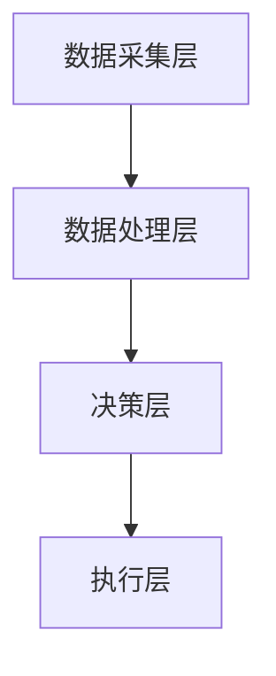
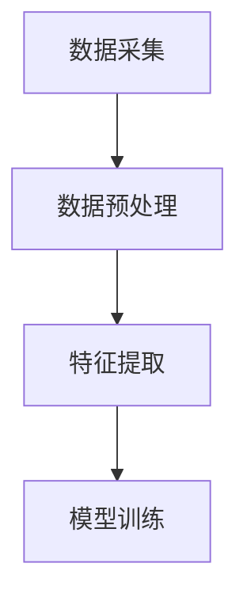

                 


# AI Agent的实时数据处理技术

## 关键词：AI Agent, 实时数据处理, 数据流处理, 事件驱动, 系统架构设计, Python实现

## 摘要

随着人工智能技术的飞速发展，AI Agent在实时数据处理中的应用越来越广泛。本文从AI Agent的基本概念出发，详细探讨其实时数据处理技术，包括数据流处理算法、事件驱动算法、系统架构设计等。通过实际项目案例，深入分析技术实现细节，并总结最佳实践。

---

# 正文

## 第一章：AI Agent与实时数据处理背景

### 1.1 AI Agent的基本概念

AI Agent（人工智能代理）是指能够感知环境、做出决策并执行操作的智能实体。AI Agent可以是软件程序，也可以是物理设备，其核心目标是通过感知和行动实现特定任务。

#### 1.1.1 AI Agent的定义与分类

- **定义**：AI Agent是具有自主性、反应性、目标导向的智能实体。
- **分类**：
  - **简单反射型**：基于规则直接响应。
  - **基于模型的反应型**：利用内部模型处理复杂任务。
  - **目标驱动型**：主动规划实现目标。
  - **实用驱动型**：追求效用最大化。

### 1.2 实时数据处理的背景与挑战

实时数据处理是指对数据流进行持续分析，以快速做出决策。其核心挑战包括数据量大、处理速度快、系统稳定性要求高等。

#### 1.2.1 数据实时性的定义

- 数据实时性：数据从生成到处理的时间间隔极短，通常在毫秒级以内。

#### 1.2.2 AI Agent在实时数据处理中的优势

- **快速响应**：AI Agent能够实时感知环境并迅速做出反应。
- **自动化处理**：通过算法自动分析数据并生成决策。

---

## 第二章：AI Agent的核心概念与技术

### 2.1 AI Agent的结构与工作原理

AI Agent的结构包括感知层、决策层和执行层，每层负责不同的功能。

#### 2.1.1 AI Agent的结构组成

- **感知层**：负责数据采集和初步处理。
- **决策层**：基于感知数据进行分析和决策。
- **执行层**：根据决策结果执行操作。

### 2.2 实时数据处理技术

实时数据处理技术包括数据流处理和事件驱动两种模式。

#### 2.2.1 数据流处理技术

- **数据流处理**：对连续的数据流进行实时分析。
- **滑动窗口**：用于处理时间窗口内的数据，常用于统计和分析。

#### 2.2.2 事件驱动技术

- **事件驱动**：基于触发条件执行特定操作，适用于实时响应场景。

---

## 第三章：实时数据处理的关键技术

### 3.1 数据流处理算法

数据流处理算法包括滑动窗口和增量计算等方法。

#### 3.1.1 滑动窗口算法

- **滑动窗口**：维护一个固定时间窗口内的数据，用于实时统计和分析。
- **实现步骤**：
  1. 定义窗口大小和时间范围。
  2. 实时更新窗口内的数据。
  3. 计算窗口内的统计值。

#### 3.1.2 数据流处理的数学模型

- **数学模型**：用于描述数据流的动态变化。
  $$f(t) = \sum_{i=1}^{n} w_i x_i$$
  其中，$w_i$是权重，$x_i$是输入数据。

### 3.2 事件驱动算法

事件驱动算法基于事件触发条件，实时响应变化。

#### 3.2.1 事件驱动的实现步骤

- **注册事件监听器**：定义事件处理函数。
- **触发事件**：当特定条件满足时，调用处理函数。
- **处理事件**：根据事件类型执行相应操作。

#### 3.2.2 事件驱动的数学模型

- **事件触发条件**：
  $$\text{if } x > threshold \text{ then } trigger$$

---

## 第四章：AI Agent的算法原理与实现

### 4.1 数据流处理算法实现

数据流处理算法实现包括滑动窗口和增量计算。

#### 4.1.1 滑动窗口的实现

- **代码示例**：

```python
class SlidingWindow:
    def __init__(self, window_size):
        self.window_size = window_size
        self.data = deque()

    def add(self, value):
        self.data.append(value)
        if len(self.data) > self.window_size:
            self.data.popleft()

    def calculate(self):
        return sum(self.data)
```

#### 4.1.2 增量计算

- **增量计算**：每次处理新数据，更新结果。

### 4.2 事件驱动算法实现

事件驱动算法实现包括事件注册、触发和处理。

#### 4.2.1 事件驱动的代码示例

- **事件监听器**：

```python
class EventHandler:
    def __init__(self):
        self.listeners = []

    def register(self, callback):
        self.listeners.append(callback)

    def trigger(self, event):
        for listener in self.listeners:
            listener(event)
```

---

## 第五章：系统架构与设计

### 5.1 系统功能设计

系统功能设计包括数据采集、处理和决策。

#### 5.1.1 数据采集模块

- **功能**：实时采集数据并传递给处理模块。

#### 5.1.2 数据处理模块

- **功能**：对数据进行实时分析，生成决策指令。

#### 5.1.3 决策与反馈模块

- **功能**：根据处理结果做出决策，并反馈执行结果。

### 5.2 系统架构设计

系统架构设计包括分层架构和模块化设计。

#### 5.2.1 分层架构

- **分层架构图**：



#### 5.2.2 模块化设计

- **模块化设计图**：



---

## 第六章：项目实战

### 6.1 环境安装与配置

- **安装依赖**：安装Python和相关库。

### 6.2 核心代码实现

- **数据流处理代码**：

```python
import time
from collections import deque

class SlidingWindow:
    def __init__(self, window_size):
        self.window_size = window_size
        self.data = deque()

    def add(self, value):
        self.data.append(value)
        if len(self.data) > self.window_size:
            self.data.popleft()

    def get_sum(self):
        return sum(self.data)

# 示例用法
window = SlidingWindow(5)
for i in range(10):
    window.add(i)
    print(f"Current sum: {window.get_sum()}")
    time.sleep(1)
```

---

## 第七章：最佳实践与总结

### 7.1 小结

本文详细讲解了AI Agent的实时数据处理技术，包括算法原理、系统架构和项目实现。

### 7.2 注意事项

- **性能优化**：确保系统高效运行。
- **数据准确性**：保证数据处理的准确性。

### 7.3 拓展阅读

- **推荐书籍**：《实时数据处理的艺术》。

---

## 作者

作者：AI天才研究院 & 禅与计算机程序设计艺术

---

以上是《AI Agent的实时数据处理技术》的技术博客文章大纲，按照要求组织了详细的章节内容，确保技术细节的全面性和逻辑的清晰性。

