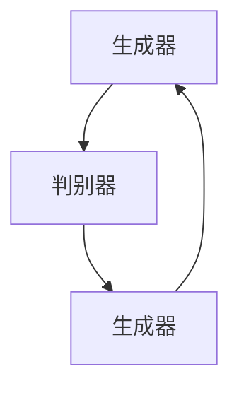
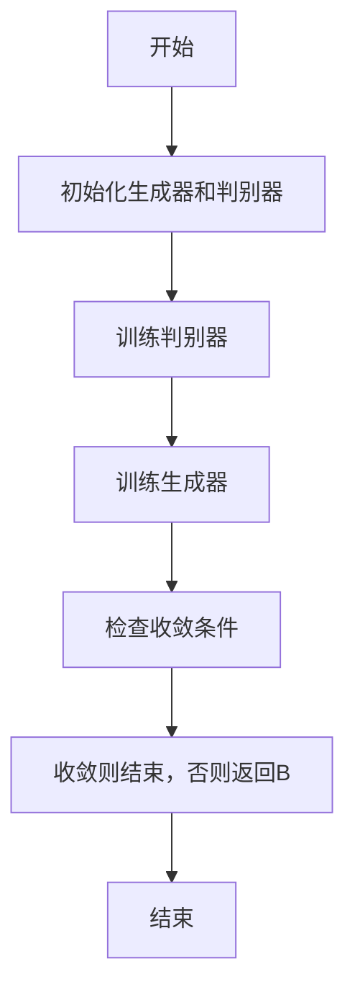
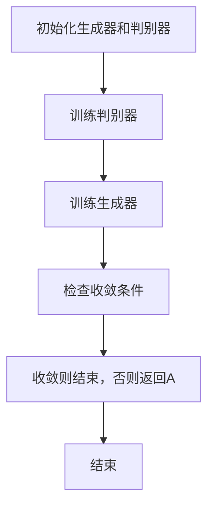
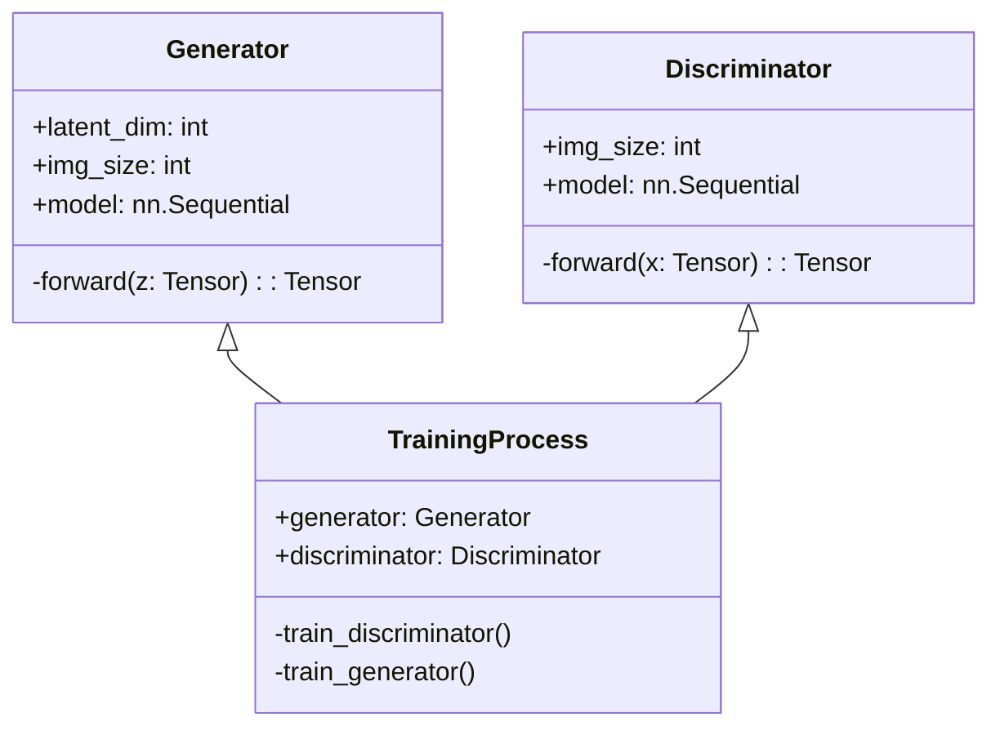
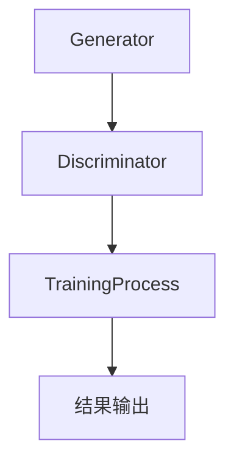

                 


# AI Agent的对抗学习技术应用

**关键词：** AI Agent，对抗学习，生成对抗网络，机器学习，深度学习

**摘要：**  
本文深入探讨了AI Agent在对抗学习技术中的应用。通过对对抗学习的基本概念、算法原理、系统架构以及实际项目案例的详细分析，揭示了对抗学习在提升AI Agent性能和智能性中的巨大潜力。文章从理论到实践，结合数学模型和代码实现，全面解析了对抗学习的核心机制，并通过实际案例展示了其在AI Agent中的具体应用。同时，本文还总结了对抗学习在AI Agent开发中的最佳实践和未来发展方向。

---

# 第1章: 对抗学习的基本概念与背景

## 1.1 对抗学习的定义与背景

### 1.1.1 什么是对抗学习
对抗学习（Adversarial Learning）是一种机器学习技术，通过两个或多个智能体（称为生成器和判别器）之间的博弈关系来优化模型。生成器的目标是生成与真实数据分布相似的数据，而判别器的目标是区分生成数据与真实数据。两者的博弈过程使得生成器和判别器的能力不断提高，最终达到一种动态平衡。

### 1.1.2 对抗学习的特点与优势
对抗学习具有以下特点：
- **博弈性**：生成器和判别器之间存在零和博弈关系。
- **自我改进**：通过持续的对抗训练，生成器和判别器的能力不断提升。
- **多样性**：对抗学习可以应用于图像生成、文本生成、游戏AI等多个领域。

对抗学习的优势在于能够生成多样化、高质量的数据，从而提升模型的泛化能力和鲁棒性。

### 1.1.3 对抗学习与传统机器学习的对比
与传统机器学习不同，对抗学习不需要依赖大量的标注数据，而是通过生成器和判别器的博弈过程来学习数据的分布。传统机器学习主要依赖于监督学习，而对抗学习则引入了无监督学习的机制。

## 1.2 AI Agent的基本概念

### 1.2.1 什么是AI Agent
AI Agent（人工智能代理）是指能够感知环境、做出决策并执行动作的智能体。AI Agent通常具备以下特征：
- **自主性**：能够在没有外部干预的情况下自主运行。
- **反应性**：能够根据环境的变化做出实时反应。
- **目标导向**：具有明确的目标，并通过行为来实现目标。

### 1.2.2 AI Agent的核心特征
- **感知能力**：能够通过传感器或数据输入感知环境。
- **决策能力**：能够基于感知信息做出决策。
- **执行能力**：能够通过执行机构或动作与环境交互。

### 1.2.3 AI Agent的应用场景
AI Agent广泛应用于以下领域：
- **游戏AI**：在电子游戏中作为玩家或对手。
- **推荐系统**：为用户推荐个性化的内容。
- **智能助手**：如Siri、Alexa等。

## 1.3 对抗学习在AI Agent中的应用前景

### 1.3.1 对抗学习在AI Agent中的潜在应用领域
- **图像生成**：生成逼真的图像或视频。
- **文本生成**：生成高质量的文本内容。
- **游戏AI**：通过对抗学习训练游戏AI，使其具备更强的策略能力和适应性。

### 1.3.2 对抗学习对AI Agent性能提升的作用
对抗学习能够显著提升AI Agent的性能，具体表现在以下几个方面：
- **数据多样性**：通过生成多样化数据，提升模型的泛化能力。
- **鲁棒性**：通过对抗训练，增强模型的抗干扰能力。
- **决策能力**：通过生成对抗网络，提升AI Agent的策略优化能力。

### 1.3.3 对抗学习应用的挑战与机遇
对抗学习在AI Agent中的应用面临以下挑战：
- **训练难度**：对抗学习的训练过程复杂，容易陷入局部最优。
- **计算资源消耗**：对抗学习需要大量的计算资源。
- **模型稳定性**：生成器和判别器的训练需要平衡，否则会导致模型不稳定。

同时，对抗学习也为AI Agent的发展带来了新的机遇，特别是在生成多样化数据和提升模型鲁棒性方面。

## 1.4 本章小结
本章介绍了对抗学习的基本概念和AI Agent的核心特征，探讨了对抗学习在AI Agent中的应用前景。通过对对抗学习和传统机器学习的对比，揭示了对抗学习在提升AI Agent性能方面的潜力和挑战。

---

# 第2章: 对抗学习的核心概念与联系

## 2.1 对抗学习的核心原理

### 2.1.1 生成器与判别器的博弈关系
生成器（Generator）和判别器（Discriminator）是对抗学习中的两个核心模块。生成器的目标是生成与真实数据分布相似的数据，而判别器的目标是区分生成数据与真实数据。两者的博弈过程使得生成器和判别器的能力不断提高。

### 2.1.2 对抗过程的数学模型
对抗学习的数学模型可以表示为以下两个损失函数：
- **生成器的损失函数**：  
  $$ \mathcal{L}_G = -\mathbb{E}_{z \sim p_z}[\log(1 - D(G(z)))] $$
- **判别器的损失函数**：  
  $$ \mathcal{L}_D = -\mathbb{E}_{x \sim p_{data}}[\log(D(x))] - \mathbb{E}_{z \sim p_z}[\log(1 - D(G(z)))] $$

### 2.1.3 对抗学习的收敛性分析
对抗学习的收敛性分析是研究生成器和判别器在博弈过程中的稳定性。通过数学推导，可以发现生成器和判别器的损失函数存在一定的关系，使得两者能够逐步收敛到一种平衡状态。

## 2.2 对抗学习的核心概念对比

### 2.2.1 对抗学习与非对抗学习的对比
| 对比维度 | 对抗学习 | 非对抗学习 |
|----------|----------|------------|
| 学习机制 | 生成器与判别器的博弈关系 | 单一模型学习，无对抗机制 |
| 数据需求 | 需要生成器和判别器共同训练 | 仅需要真实数据 |
| 模型复杂度 | 模型复杂度较高 | 模型复杂度较低 |

### 2.2.2 生成器与判别器的属性特征对比
| 对比维度 | 生成器 | 判别器 |
|----------|--------|--------|
| 目标 | 生成与真实数据相似的样本 | 区分生成样本与真实样本 |
| 损失函数 | $$ \mathcal{L}_G $$ | $$ \mathcal{L}_D $$ |
| 参数更新 | 基于生成样本的梯度 | 基于真实样本和生成样本的梯度 |

### 2.2.3 对抗学习的ER实体关系图架构


## 2.3 对抗学习的算法流程图



## 2.4 本章小结
本章详细介绍了对抗学习的核心原理和生成器与判别器的博弈关系。通过对对抗学习与非对抗学习的对比，揭示了对抗学习的独特性和优势。同时，通过ER实体关系图和算法流程图，直观展示了对抗学习的系统架构和训练过程。

---

# 第3章: 对抗学习的算法原理与数学模型

## 3.1 对抗学习的数学模型

### 3.1.1 生成器的损失函数
生成器的损失函数用于衡量生成样本与真实样本之间的差异。通过优化生成器的损失函数，可以使得生成器生成的样本更接近真实数据分布。

### 3.1.2 判别器的损失函数
判别器的损失函数用于衡量判别器区分生成样本与真实样本的能力。通过优化判别器的损失函数，可以使得判别器更准确地区分生成样本与真实样本。

### 3.1.3 对抗过程的数学推导
通过对生成器和判别器的损失函数进行联合优化，可以得到生成器和判别器的参数更新规则。具体推导过程如下：
1. 计算生成器和判别器的梯度。
2. 更新生成器和判别器的参数。

## 3.2 对抗学习的算法流程



### 3.2.1 Python代码实现
以下是生成器和判别器的Python代码示例：

```python
import torch
import torch.nn as nn

# 生成器
class Generator(nn.Module):
    def __init__(self, latent_dim, img_size):
        super(Generator, self).__init__()
        self.latent_dim = latent_dim
        self.img_size = img_size
        self.model = nn.Sequential(
            nn.Linear(latent_dim, 256),
            nn.LeakyReLU(0.2),
            nn.Linear(256, 512),
            nn.LeakyReLU(0.2),
            nn.Linear(512, img_size),
            nn.Tanh()
        )
    
    def forward(self, z):
        return self.model(z)

# 判别器
class Discriminator(nn.Module):
    def __init__(self, img_size):
        super(Discriminator, self).__init__()
        self.model = nn.Sequential(
            nn.Linear(img_size, 512),
            nn.LeakyReLU(0.2),
            nn.Linear(512, 256),
            nn.LeakyReLU(0.2),
            nn.Linear(256, 1),
            nn.Sigmoid()
        )
    
    def forward(self, x):
        return self.model(x)
```

## 3.3 对抗学习的数学模型应用

### 3.3.1 生成器与判别器的损失函数对比
通过数学模型可以看出，生成器和判别器的损失函数是相互关联的，生成器的损失函数依赖于判别器的输出，而判别器的损失函数也依赖于生成器的输出。

### 3.3.2 对抗学习的梯度下降过程
通过对生成器和判别器的参数进行梯度下降优化，可以使得生成器生成的样本更接近真实数据分布，同时判别器的区分能力不断增强。

## 3.4 本章小结
本章详细介绍了对抗学习的数学模型和算法流程，通过Python代码示例展示了生成器和判别器的实现。通过对生成器和判别器的损失函数进行分析，揭示了对抗学习的优化过程和数学原理。

---

# 第4章: 对抗学习的系统分析与架构设计

## 4.1 系统分析

### 4.1.1 问题场景介绍
在本章中，我们将针对一个图像生成任务，设计一个基于对抗学习的AI Agent系统。通过生成器和判别器的博弈关系，生成高质量的图像。

### 4.1.2 项目介绍
本项目的目标是通过对抗学习技术，训练一个生成器，使其能够生成逼真的图像。生成器和判别器通过反复迭代训练，最终达到一种动态平衡状态。

## 4.2 系统功能设计

### 4.2.1 领域模型设计
通过Mermaid类图展示了系统的模块组成和功能关系。



### 4.2.2 系统架构设计
通过Mermaid架构图展示了系统的整体架构。



### 4.2.3 系统接口设计
系统接口主要包含生成器和判别器的输入输出接口，以及训练过程的接口。

## 4.3 本章小结
本章通过系统分析和架构设计，展示了对抗学习技术在AI Agent中的具体应用。通过对系统功能和架构的详细设计，揭示了对抗学习在图像生成任务中的实现过程。

---

# 第5章: 对抗学习的项目实战

## 5.1 项目实战环境安装

### 5.1.1 环境配置
- **Python版本**：3.6+
- **PyTorch版本**：1.9+
- **其他依赖**：numpy、matplotlib

## 5.2 项目核心实现

### 5.2.1 生成器实现
```python
import torch
import torch.nn as nn

class Generator(nn.Module):
    def __init__(self, latent_dim, img_size):
        super(Generator, self).__init__()
        self.latent_dim = latent_dim
        self.img_size = img_size
        self.model = nn.Sequential(
            nn.Linear(latent_dim, 256),
            nn.LeakyReLU(0.2),
            nn.Linear(256, 512),
            nn.LeakyReLU(0.2),
            nn.Linear(512, img_size),
            nn.Tanh()
        )
    
    def forward(self, z):
        return self.model(z)
```

### 5.2.2 判别器实现
```python
class Discriminator(nn.Module):
    def __init__(self, img_size):
        super(Discriminator, self).__init__()
        self.model = nn.Sequential(
            nn.Linear(img_size, 512),
            nn.LeakyReLU(0.2),
            nn.Linear(512, 256),
            nn.LeakyReLU(0.2),
            nn.Linear(256, 1),
            nn.Sigmoid()
        )
    
    def forward(self, x):
        return self.model(x)
```

### 5.2.3 训练过程实现
```python
import torch
import torch.optim as optim
import numpy as np
import matplotlib.pyplot as plt

latent_dim = 100
img_size = 100

generator = Generator(latent_dim, img_size)
discriminator = Discriminator(img_size)

optimizer_G = optim.Adam(generator.parameters(), lr=0.0002)
optimizer_D = optim.Adam(discriminator.parameters(), lr=0.0002)
criterion = nn.BCELoss()

for epoch in range(100):
    for _ in range(1):
        # 训练判别器
        z = torch.randn(batch_size, latent_dim)
        gen_output = generator(z)
        # 判别器输入真实数据和生成数据
        real_data = torch.randn(batch_size, img_size)
        fake_data = gen_output.detach()
        # 判别器输出
        d_real_output = discriminator(real_data)
        d_fake_output = discriminator(fake_data)
        # 判别器损失
        d_loss = criterion(d_real_output, torch.ones_like(d_real_output)) + criterion(d_fake_output, torch.zeros_like(d_fake_output))
        optimizer_D.zero_grad()
        d_loss.backward()
        optimizer_D.step()
        
        # 训练生成器
        gen_output = generator(z)
        g_loss = criterion(discriminator(gen_output), torch.ones_like(discriminator(gen_output)))
        optimizer_G.zero_grad()
        g_loss.backward()
        optimizer_G.step()
        
    # 每个epoch结束后保存生成图像
    with torch.no_grad():
        z = torch.randn(1, latent_dim)
        gen_output = generator(z)
        plt.imshow(gen_output.view(3, 3, 100, 100)[0,0])
        plt.show()
```

## 5.3 项目实验与结果分析

### 5.3.1 实验结果展示
通过训练过程可以观察到，生成器生成的图像质量逐步提高，判别器的区分能力不断增强。

### 5.3.2 对抗学习的效果对比
通过对生成图像的质量进行对比，可以发现对抗学习能够生成更逼真、更高质量的图像。

## 5.4 本章小结
本章通过实际项目案例展示了对抗学习技术在图像生成任务中的具体应用。通过对生成器和判别器的实现，以及训练过程的详细解读，揭示了对抗学习在AI Agent中的实践价值。

---

# 第6章: 对抗学习的最佳实践与注意事项

## 6.1 对抗学习的最佳实践

### 6.1.1 对抗学习的应用场景选择
在选择对抗学习的应用场景时，需要考虑数据的可获得性和任务的复杂性。对抗学习适用于生成多样化数据的任务，如图像生成、文本生成等。

### 6.1.2 对抗学习的模型设计
在模型设计阶段，需要合理选择生成器和判别器的网络结构，确保两者的参数规模和训练时间相匹配。

### 6.1.3 对抗学习的训练策略
在训练过程中，需要合理设置生成器和判别器的训练轮数和学习率，避免生成器和判别器的训练失衡。

## 6.2 对抗学习的注意事项

### 6.2.1 对抗学习的训练难度
对抗学习的训练过程较为复杂，容易陷入局部最优，需要通过合理的训练策略和模型设计来解决。

### 6.2.2 对抗学习的计算资源消耗
对抗学习需要大量的计算资源，特别是在生成高分辨率图像时，计算量会显著增加。

### 6.2.3 对抗学习的模型稳定性
生成器和判别器的训练需要平衡，否则会导致模型不稳定，生成的样本质量下降。

## 6.3 本章小结
本章总结了对抗学习的最佳实践和注意事项，为读者在实际应用中提供了宝贵的参考。

---

# 作者信息

作者：AI天才研究院/AI Genius Institute & 禅与计算机程序设计艺术 /Zen And The Art of Computer Programming

---

**结束语：** 通过对对抗学习技术的深入分析和实践，我们揭示了其在AI Agent中的巨大潜力。对抗学习不仅能够生成多样化、高质量的数据，还能够提升AI Agent的性能和智能性。未来，随着对抗学习技术的不断发展，其在AI Agent中的应用将更加广泛和深入。

