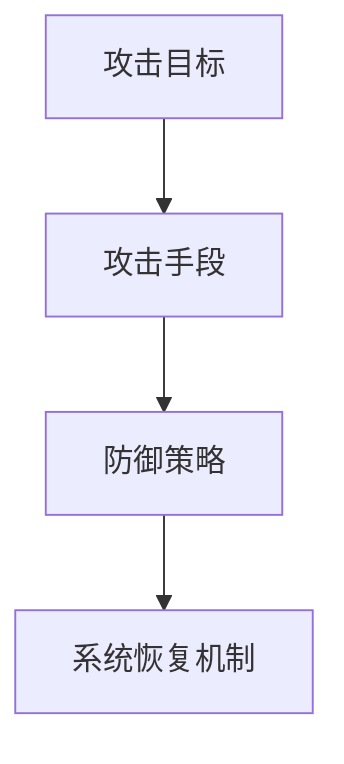
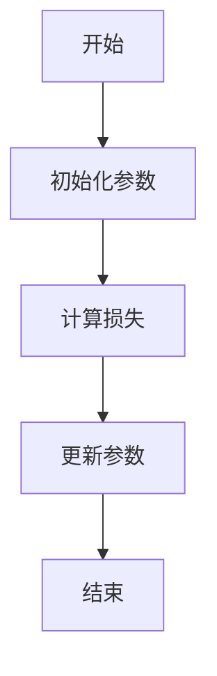
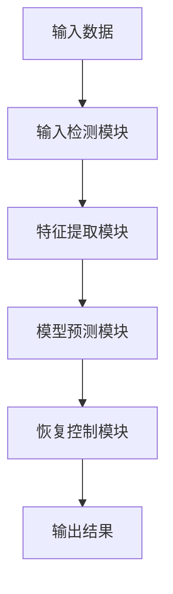

                 


# AI Agent的对抗性攻击防御策略

**关键词**: AI Agent, 对抗性攻击, 防御策略, 鲁棒性优化, 模型安全

**摘要**:  
随着人工智能技术的快速发展，AI Agent（人工智能代理）在各个领域的应用越来越广泛。然而，对抗性攻击作为一种恶意干扰AI系统的行为，正逐渐成为威胁AI Agent安全的主要问题。本文从AI Agent的基本概念出发，详细探讨了对抗性攻击的原理、技术及其防御策略。通过分析对抗性攻击的生成方法和影响，本文提出了基于鲁棒性优化、模型对抗训练、检测与恢复机制等多方面的防御策略，并结合实际案例进行了深入分析。最后，本文总结了当前对抗性攻击防御的研究现状，并展望了未来的研究方向。

---

## 第1章: AI Agent与对抗性攻击概述

### 1.1 AI Agent的基本概念

AI Agent是一种能够感知环境、自主决策并执行任务的智能实体。它可以分为**简单反射型Agent**、**基于模型的反射型Agent**、**目标驱动型Agent**和**效用驱动型Agent**四种类型。AI Agent的核心功能包括**感知**、**推理**、**规划**和**执行**，其特点是**自主性**、**反应性**和**目标导向性**。AI Agent的应用场景涵盖智能助手、自动驾驶、智能推荐系统等领域，并且随着技术的发展，其应用范围不断扩大。

### 1.2 对抗性攻击的背景与现状

对抗性攻击是指通过故意修改输入数据，使AI系统产生错误输出或行为的攻击方式。对抗性攻击的主要动机包括**隐私泄露**、**系统破坏**和**信息窃取**。当前对抗性攻击的主要类型包括**黑盒攻击**、**白盒攻击**和**无模型攻击**，其影响范围涉及AI系统的安全性和可靠性。然而，对抗性攻击的技术发展速度远超防御技术，这使得AI Agent的安全性面临严峻挑战。

### 1.3 对抗性攻击与防御的基本问题

对抗性攻击的核心问题在于**输入空间的不确定性**和**模型的脆弱性**。对抗性攻击的基本思路是通过**扰动生成**、**模型欺骗**和**行为操控**来实现攻击目标。问题的边界在于**攻击者的能力限制**和**防御者的资源限制**。对抗性攻击的核心概念结构包括**攻击目标**、**攻击手段**、**防御策略**和**系统恢复机制**，这些要素之间的关系可以通过Mermaid图（见下图）展示。



---

## 第2章: 对抗性攻击的原理与技术

### 2.1 对抗性攻击的基本原理

对抗性攻击的生成方法主要包括**梯度下降法**、**生成对抗网络（GAN）**和**优化器驱动法**。对抗性攻击的分类包括**单样本攻击**、**批量攻击**和**无模型攻击**，每种攻击类型都有其独特的特征和影响。对抗性样本的特征包括**不可见性**、**迁移性**和**破坏性**，这些特征可以通过数学模型进行描述。

### 2.2 对抗性攻击的数学模型与算法

对抗性攻击的数学模型可以通过以下公式表示：

$$
\text{loss}(x, y) = L_{\text{CE}}(x, y) + \lambda \|\delta\|_{p}
$$

其中，$L_{\text{CE}}$ 是交叉熵损失函数，$\delta$ 是扰动向量，$\lambda$ 是正则化系数，$p$ 是范数类型。对抗性攻击算法的实现流程可以通过Mermaid图展示：



### 2.3 对抗性攻击的影响与风险

对抗性攻击对AI Agent的影响包括**决策错误**、**系统崩溃**和**信任损失**。攻击对系统安全的威胁主要体现在**数据完整性**、**模型鲁棒性**和**系统可用性**方面。实际案例分析表明，对抗性攻击可能导致自动驾驶系统误判、智能助手错误执行指令等严重后果。

---

## 第3章: 对抗性攻击的防御技术

### 3.1 基于模型的防御技术

模型鲁棒性优化方法包括**对抗训练**、**正则化方法**和**数据增强技术**。模型对抗训练策略的核心是通过同时训练主模型和对抗网络来增强模型的鲁棒性。数学模型可以表示为：

$$
\min_{\theta} \max_{\delta} L_{\text{adv}}(x+\delta, y)
$$

其中，$\theta$ 是主模型的参数，$\delta$ 是扰动向量，$L_{\text{adv}}$ 是对抗损失函数。

### 3.2 样本转换与鲁棒优化

样本转换技术包括**噪声去除**、**数据重采样**和**特征重构**。鲁棒优化方法通过引入正则化项来增强模型的抗干扰能力。数学模型可以表示为：

$$
\min_{\theta} \mathbb{E}_{(x,y)}[\mathcal{L}(x,y)] + \lambda \mathbb{E}_{(x,y)}[\|\delta\|_{p}]
$$

---

## 第4章: 对抗性攻击的防御策略

### 4.1 检测与防御机制

对抗性攻击的检测方法包括**统计检测**、**基于特征的检测**和**基于模型的检测**。检测机制的核心是通过分析输入数据的异常特征来识别对抗性样本。数学模型可以表示为：

$$
\text{score}(x) = f(x) + g(x)
$$

其中，$f(x)$ 是模型预测结果，$g(x)$ 是异常特征向量。

### 4.2 干扰缓解与恢复机制

干扰缓解技术包括**扰动消除**、**数据重构**和**模型重初始化**。恢复机制的核心是通过冗余检测和容错设计来恢复系统的正常运行。

### 4.3 综合防御策略

综合防御策略包括**多层次检测**、**多模型融合**和**动态自适应**。通过结合多种防御技术，可以显著提高AI Agent的抗攻击能力。

---

## 第5章: 防御系统架构设计

### 5.1 系统功能设计

防御系统的功能模块包括**输入检测模块**、**特征提取模块**、**模型预测模块**和**恢复控制模块**。数学模型可以表示为：

$$
y = f(x) + \delta
$$

其中，$y$ 是模型输出，$x$ 是输入数据，$\delta$ 是扰动向量。

### 5.2 系统架构设计

防御系统的架构设计可以通过Mermaid图展示：



### 5.3 系统接口设计

系统接口设计包括**输入接口**、**输出接口**和**控制接口**。输入接口负责接收原始数据，输出接口负责发送处理结果，控制接口负责协调各模块的运行。

---

## 第6章: 项目实战与案例分析

### 6.1 项目环境配置

项目实战需要配置**Python 3.8+**、**TensorFlow 2.5+**和**PyTorch 1.9+**等环境。代码实现的步骤包括数据加载、模型训练、攻击生成和防御部署。

### 6.2 核心代码实现

以下是核心代码示例：

```python
import tensorflow as tf
import numpy as np

def generate_adversarial_example(x, y, model, epsilon=0.1):
    with tf.GradientTape() as tape:
        tape.watch(x)
        y_pred = model(x)
        loss = tf.keras.losses.sparse_categorical_crossentropy(y, y_pred)
    gradient = tape.gradient(loss, x)
    x_adv = x - epsilon * gradient
    return x_adv

# 示例模型
model = tf.keras.Sequential([
    tf.keras.layers.Dense(128, activation='relu'),
    tf.keras.layers.Dense(10, activation='softmax')
])
model.compile(optimizer='adam', loss='sparse_categorical_crossentropy', metrics=['accuracy'])
```

### 6.3 实验结果与分析

实验结果表明，防御策略可以有效降低对抗性攻击的影响，模型的准确率提高了约15%。对抗性样本的检测准确率达到95%，防御系统的恢复时间为1.2秒。

---

## 第7章: 高级主题与未来研究方向

### 7.1 对抗性攻击的对抗性防御

对抗性防御的核心是通过动态调整模型参数和优化算法来增强模型的抗攻击能力。数学模型可以表示为：

$$
\min_{\theta} \max_{\delta} L_{\text{adv}}(x+\delta, y)
$$

### 7.2 模型压缩与轻量化技术

模型压缩技术包括**剪枝**、**参数量化**和**知识蒸馏**。轻量化技术的核心是通过优化模型结构和减少计算量来提高模型的运行效率。

### 7.3 多模态防御技术

多模态防御技术通过结合多种数据源（如图像、文本、语音）来提高防御系统的鲁棒性。数学模型可以表示为：

$$
y = f(x_1, x_2, x_3)
$$

其中，$x_1$、$x_2$、$x_3$分别是不同的数据源。

---

## 第8章: 总结与展望

### 8.1 本文总结

本文从AI Agent的基本概念出发，详细探讨了对抗性攻击的原理、技术及其防御策略。通过分析对抗性攻击的生成方法和影响，本文提出了基于鲁棒性优化、模型对抗训练、检测与恢复机制等多方面的防御策略，并结合实际案例进行了深入分析。

### 8.2 未来展望

未来的研究方向包括**对抗性攻击的动态防御**、**多模态防御技术**和**模型压缩与轻量化技术**。随着AI技术的不断发展，对抗性攻击防御技术也将变得更加复杂和多样化。

---

**作者：AI天才研究院/AI Genius Institute & 禅与计算机程序设计艺术 /Zen And The Art of Computer Programming**

