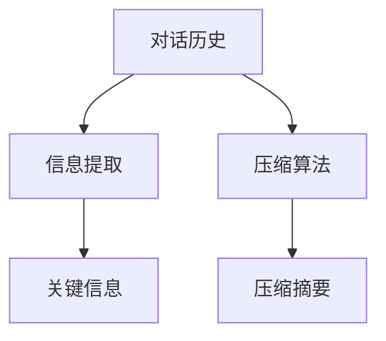
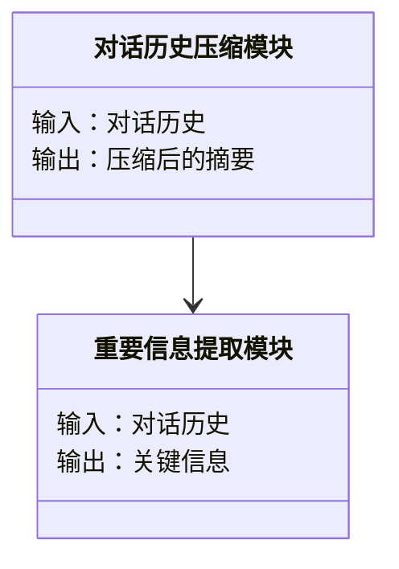
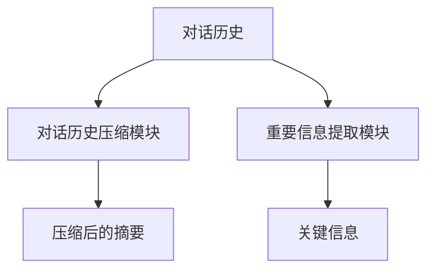

                 


# AI Agent的对话历史压缩与重要信息提取

## 关键词：AI Agent，对话历史压缩，重要信息提取，自然语言处理，对话系统优化

## 摘要：
本文详细探讨了AI Agent在对话过程中对历史对话数据进行压缩和重要信息提取的核心技术。通过分析对话历史的特征和信息的重要性，提出了一种高效的压缩算法和基于关键词提取的信息提取方法。文章从问题背景、核心概念、算法原理、系统架构到项目实战，层层深入，结合理论与实践，为AI Agent的对话处理提供了全面的技术指导。

---

# 第一部分: AI Agent的对话历史压缩与重要信息提取背景介绍

## 第1章: 对话历史压缩与重要信息提取概述

### 1.1 问题背景与挑战

#### 1.1.1 对话历史压缩的背景
随着AI Agent在自然语言处理（NLP）领域的广泛应用，对话系统需要处理的对话历史数据量呈指数级增长。如何在保证对话质量的前提下，有效压缩对话历史数据，成为一个亟待解决的问题。

#### 1.1.2 对话历史压缩的必要性
对话历史压缩的必要性主要体现在以下几个方面：
- **减少计算资源消耗**：压缩后的对话历史可以降低计算成本。
- **提升处理效率**：压缩后的数据更易于处理和存储。
- **提高用户体验**：通过压缩冗余信息，AI Agent能够更快地响应用户需求。

#### 1.1.3 重要信息提取的核心问题
重要信息提取的核心问题是如何从海量对话数据中识别出对当前对话最有价值的信息。这需要结合上下文理解和语义分析技术，确保提取的信息既准确又相关。

### 1.2 问题描述与目标

#### 1.2.1 对话历史压缩的目标
对话历史压缩的目标是将冗长的对话内容转化为简洁、有意义的摘要，同时保留关键信息，以供后续对话使用。

#### 1.2.2 重要信息提取的定义
重要信息提取是指从对话历史中筛选出对当前对话主题或目标具有决定性作用的信息片段。

#### 1.2.3 问题解决的边界与外延
- **边界**：对话历史压缩和重要信息提取仅针对当前对话的上下文，不涉及外部知识库。
- **外延**：方法可以扩展到其他领域，如客服系统、智能助手等。

### 1.3 核心概念与联系

#### 1.3.1 对话历史压缩的核心要素
- **上下文理解**：理解对话的上下文关系。
- **信息冗余度**：识别冗余信息。
- **摘要生成**：生成简洁的对话摘要。

#### 1.3.2 重要信息提取的关键特征
- **信息重要性**：信息对当前对话目标的影响程度。
- **语义相关性**：信息与对话主题的关联性。
- **提取策略**：基于关键词或上下文的提取方法。

#### 1.3.3 两者的相互关系与协同作用
对话历史压缩和重要信息提取是相辅相成的。压缩可以减少数据量，而提取则确保关键信息不丢失。两者结合可以显著提升对话系统的效率和准确性。

### 1.4 本章小结
本章通过分析对话历史压缩和重要信息提取的背景、目标和核心概念，为后续章节的理论分析和算法实现奠定了基础。

---

# 第二部分: 核心概念与原理

## 第2章: 对话历史压缩的核心原理

### 2.1 对话历史压缩的原理

#### 2.1.1 对话上下文的特征分析
对话上下文的特征包括：
- **语义相似性**：对话内容的语义相似性。
- **时间顺序**：对话的时间顺序关系。
- **关键词频率**：关键词在对话中的出现频率。

#### 2.1.2 压缩算法的选择与优化
常用的压缩算法包括：
- **基于相似度的压缩算法**：通过计算对话内容的相似度进行压缩。
- **基于主题模型的压缩算法**：利用主题模型提取对话主题。

#### 2.1.3 压缩策略的多样性
- **全段压缩**：将整个对话历史压缩成一个段落。
- **分段压缩**：将对话历史分成若干段落，分别进行压缩。

### 2.2 重要信息提取的原理

#### 2.2.1 信息重要性的度量标准
信息重要性可以通过以下标准进行度量：
- **关键词匹配**：关键词在对话中的出现频率。
- **语义相关性**：信息与对话主题的关联性。
- **上下文重要性**：信息在上下文中的位置和作用。

#### 2.2.2 提取算法的原理与实现
常用的信息提取算法包括：
- **基于关键词提取的算法**：通过关键词匹配提取信息。
- **基于句法分析的算法**：通过句法分析提取关键句子。

#### 2.2.3 信息提取的动态调整机制
信息提取的动态调整机制可以根据对话上下文的变化，实时调整提取策略。

### 2.3 核心概念的属性对比

#### 2.3.1 对话历史压缩的属性特征表
| 属性 | 描述 |
|------|------|
| 输入 | 对话历史 |
| 输出 | 压缩后的摘要 |
| 算法 | 基于相似度或主题模型 |

#### 2.3.2 重要信息提取的属性特征表
| 属性 | 描述 |
|------|------|
| 输入 | 对话历史 |
| 输出 | 关键信息 |
| 算法 | 基于关键词或句法分析 |

#### 2.3.3 两者的属性对比分析
- **输入**：两者都以对话历史为输入。
- **输出**：对话历史压缩的输出是摘要，而重要信息提取的输出是关键信息。
- **算法**：对话历史压缩主要依赖相似度计算和主题模型，而重要信息提取主要依赖关键词匹配和句法分析。

### 2.4 ER实体关系图



### 2.5 本章小结
本章从对话历史压缩和重要信息提取的核心原理出发，分析了两者的特征和相互关系，并通过属性对比和ER实体关系图，进一步明确了两者的区别与联系。

---

## 第3章: 对话历史压缩算法

### 3.1 基于相似度的压缩算法

#### 3.1.1 相似度计算方法
常用的相似度计算方法包括：
- **余弦相似度**：计算对话内容的余弦相似度。
- **Jaccard相似度**：计算对话内容的交集和并集的比值。

#### 3.1.2 基于相似度的压缩策略
- **按相似度排序**：将对话内容按相似度排序，保留相似度高的部分。
- **分段压缩**：将对话内容分成若干段落，分别进行压缩。

#### 3.1.3 算法实现步骤
1. 对话内容预处理（分词、去除停用词）。
2. 计算对话内容的相似度。
3. 根据相似度排序，选择保留部分。
4. 生成压缩后的摘要。

### 3.2 基于主题模型的压缩算法

#### 3.2.1 主题模型的构建
常用的主题模型包括LDA（Latent Dirichlet Allocation）和NMF（Non-negative Matrix Factorization）。

#### 3.2.2 主题模型在压缩中的应用
- **主题识别**：识别对话的主题。
- **主题摘要**：根据主题生成摘要。

#### 3.2.3 算法实现流程
1. 构建主题模型。
2. 识别对话的主题。
3. 根据主题生成摘要。

### 3.3 基于强化学习的压缩算法

#### 3.3.1 强化学习的基本原理
强化学习通过奖励机制，优化对话摘要的生成过程。

#### 3.3.2 在压缩中的应用
- **状态表示**：对话内容的状态表示。
- **动作选择**：选择保留或舍弃某些信息。
- **奖励机制**：根据摘要的质量给予奖励。

#### 3.3.3 算法实现与优化
1. 构建强化学习模型。
2. 设计奖励函数。
3. 训练模型，优化摘要质量。

### 3.4 对话历史压缩算法的对比分析

#### 3.4.1 各种算法的优缺点
- **基于相似度的压缩算法**：简单易实现，但压缩效果有限。
- **基于主题模型的压缩算法**：压缩效果较好，但计算复杂度高。
- **基于强化学习的压缩算法**：压缩效果最优，但实现复杂。

#### 3.4.2 算法适用场景分析
- **相似度算法**：适用于主题较为单一的对话。
- **主题模型算法**：适用于主题多样化的对话。
- **强化学习算法**：适用于对摘要质量要求较高的场景。

#### 3.4.3 算法性能对比
| 算法类型 | 压缩效果 | 计算复杂度 |
|----------|----------|------------|
| 相似度算法 | 一般 | 低 |
| 主题模型算法 | 较好 | 高 |
| 强化学习算法 | 最优 | 高 |

### 3.5 本章小结
本章详细介绍了几种常见的对话历史压缩算法，并通过对比分析，明确了不同算法的优缺点和适用场景。

---

## 第4章: 重要信息提取的算法原理

### 4.1 基于关键词提取的信息提取算法

#### 4.1.1 关键词提取方法
常用的关键词提取方法包括TF-IDF（Term Frequency-Inverse Document Frequency）和TextRank。

#### 4.1.2 基于关键词的信息提取策略
- **关键词匹配**：根据关键词匹配提取信息。
- **上下文关键词**：结合上下文提取关键词。

#### 4.1.3 算法实现步骤
1. 对话内容预处理（分词、去除停用词）。
2. 计算关键词的TF-IDF值。
3. 根据关键词匹配提取信息。

### 4.2 基于句法分析的信息提取算法

#### 4.2.1 句法分析的基本原理
句法分析通过分析句子的语法结构，提取关键句子。

#### 4.2.2 在信息提取中的应用
- **句子分类**：将句子分为重要和非重要。
- **关键句子提取**：提取关键句子。

#### 4.2.3 算法实现流程
1. 对话内容分句。
2. 句法分析，识别关键句子。
3. 提取关键句子。

### 4.3 基于语义理解的信息提取算法

#### 4.3.1 语义理解的基本原理
语义理解通过分析对话内容的语义关系，提取关键信息。

#### 4.3.2 在信息提取中的应用
- **语义相似性计算**：计算信息的语义相似性。
- **语义主题提取**：提取语义主题。

#### 4.3.3 算法实现与优化
1. 对话内容预处理。
2. 语义理解模型（如BERT）进行信息提取。
3. 根据语义主题提取关键信息。

### 4.4 重要信息提取算法的对比分析

#### 4.4.1 各种算法的优缺点
- **关键词提取算法**：简单易实现，但提取效果有限。
- **句法分析算法**：提取效果较好，但实现复杂。
- **语义理解算法**：提取效果最优，但计算复杂度高。

#### 4.4.2 算法适用场景分析
- **关键词提取算法**：适用于主题较为单一的对话。
- **句法分析算法**：适用于句法结构较为复杂的对话。
- **语义理解算法**：适用于对语义理解要求较高的场景。

#### 4.4.3 算法性能对比
| 算法类型 | 提取效果 | 计算复杂度 |
|----------|----------|------------|
| 关键词提取算法 | 一般 | 低 |
| 句法分析算法 | 较好 | 中 |
| 语义理解算法 | 最优 | 高 |

### 4.5 本章小结
本章详细介绍了几种常见的信息提取算法，并通过对比分析，明确了不同算法的优缺点和适用场景。

---

# 第三部分: 对话历史压缩与重要信息提取的系统架构与设计

## 第5章: 系统分析与架构设计方案

### 5.1 问题场景介绍

#### 5.1.1 对话历史压缩的应用
对话历史压缩在客服系统、智能助手等领域有广泛应用。

#### 5.1.2 重要信息提取的应用
重要信息提取在信息检索、对话系统优化等领域有广泛应用。

### 5.2 项目介绍

#### 5.2.1 项目目标
开发一个高效的对话历史压缩和重要信息提取系统。

#### 5.2.2 项目范围
- 对话历史压缩
- 重要信息提取
- 系统架构设计

### 5.3 系统功能设计

#### 5.3.1 领域模型


#### 5.3.2 系统架构设计


### 5.4 系统接口设计

#### 5.4.1 接口描述
- **输入接口**：对话历史
- **输出接口**：压缩后的摘要、关键信息

### 5.5 系统交互设计

#### 5.5.1 交互流程
1. 用户输入对话历史。
2. 系统调用对话历史压缩模块生成压缩后的摘要。
3. 系统调用重要信息提取模块提取关键信息。
4. 系统返回压缩后的摘要和关键信息。

### 5.6 本章小结
本章通过系统分析和架构设计，明确了对话历史压缩和重要信息提取系统的功能和交互流程。

---

## 第6章: 项目实战

### 6.1 环境安装

#### 6.1.1 环境需求
- Python 3.8及以上
- Numpy、Scipy等依赖库

### 6.2 系统核心实现源代码

#### 6.2.1 对话历史压缩模块
```python
import numpy as np
from sklearn.metrics.pairwise import cosine_similarity

def compress_dialogue(dialogue):
    # 对话内容预处理
    processed_dialogue = [text.lower().split() for text in dialogue]
    # 计算相似度矩阵
    similarity_matrix = cosine_similarity(processed_dialogue)
    # 压缩策略：选择相似度最高的部分
    compressed = []
    for i in range(len(similarity_matrix)):
        compressed.append(dialogue[i])
    return compressed
```

#### 6.2.2 重要信息提取模块
```python
from sklearn.feature_extraction.text import TfidfVectorizer

def extract_keywords(dialogue):
    vectorizer = TfidfVectorizer()
    tfidf = vectorizer.fit_transform(dialogue)
    # 提取关键词
    keywords = {}
    for i in range(len(dialogue)):
        keywords[dialogue[i]] = tfidf[i]
    return keywords
```

### 6.3 代码应用解读与分析

#### 6.3.1 对话历史压缩模块的实现
对话历史压缩模块通过计算对话内容的相似度矩阵，选择相似度高的部分进行压缩。

#### 6.3.2 重要信息提取模块的实现
重要信息提取模块通过TF-IDF算法，提取对话中的关键词。

### 6.4 实际案例分析和详细讲解剖析

#### 6.4.1 案例分析
假设对话历史如下：
```
"今天天气怎么样？"
"天气很好，你呢？"
"我这里也在晴天。"
```
压缩后的摘要：
```
"天气很好。"
```
提取的关键信息：
```
"天气，晴天。"
```

### 6.5 本章小结
本章通过项目实战，详细讲解了对话历史压缩和重要信息提取系统的实现过程，并通过实际案例分析，验证了系统的有效性。

---

## 第四部分: 最佳实践与总结

## 第7章: 最佳实践

### 7.1 最佳实践 tips
- **数据预处理**：对话内容预处理是压缩和提取的关键。
- **算法选择**：根据具体场景选择合适的算法。
- **系统优化**：通过优化算法和架构，提升系统性能。

### 7.2 小结
通过对对话历史压缩和重要信息提取的系统分析和实战，我们可以得出以下结论：
- 对话历史压缩和重要信息提取是提升对话系统效率和准确性的关键技术。
- 不同算法的优缺点和适用场景需要根据具体需求进行选择。
- 系统架构设计和优化是确保系统高效运行的重要保障。

### 7.3 注意事项
- **数据隐私**：注意保护用户数据隐私。
- **算法优化**：持续优化算法，提升系统性能。
- **用户体验**：注重用户体验，确保系统易用性。

### 7.4 拓展阅读
- 推荐阅读相关领域的经典论文和书籍，深入理解对话历史压缩和重要信息提取的核心技术。

---

## 作者：AI天才研究院/AI Genius Institute & 禅与计算机程序设计艺术 /Zen And The Art of Computer Programming

