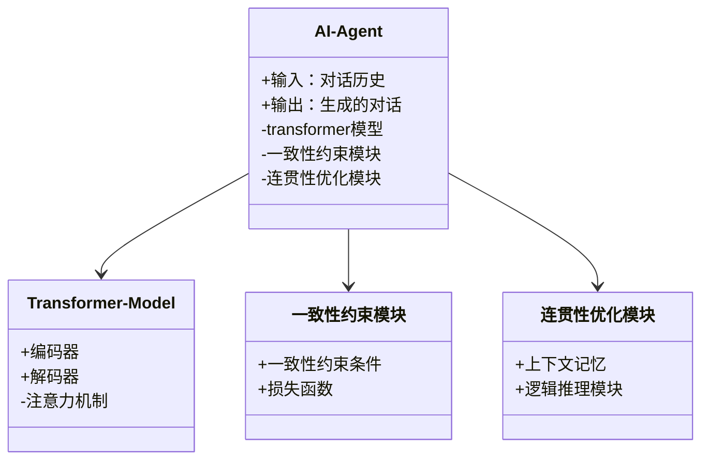
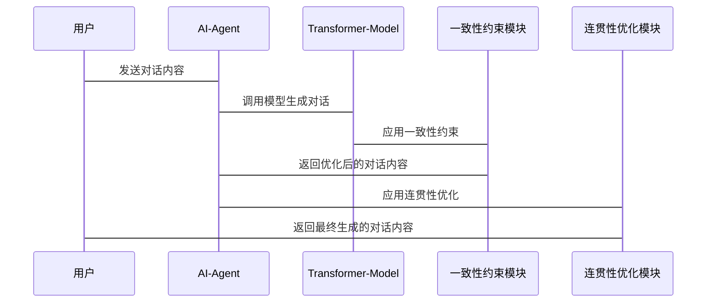

                 


# AI Agent的对话生成一致性与连贯性优化

## 关键词：AI Agent, 对话生成, 一致性, 连贯性, 深度学习, Transformer, 对比学习

## 摘要：  
本文深入探讨了AI Agent对话生成中一致性与连贯性优化的核心问题，分析了现有技术的优缺点，并提出了一种基于图结构和对比学习的优化方法。文章从理论基础到算法实现，再到系统设计，全面阐述了对话生成的优化策略，并通过实际案例展示了优化方法的有效性。  

---

## 第1章 AI Agent对话生成的背景与概念

### 1.1 AI Agent的基本概念  
AI Agent（智能体）是指能够感知环境、自主决策并执行任务的智能系统。在对话生成领域，AI Agent需要通过自然语言处理技术，理解和生成符合人类交流习惯的对话内容。  

#### 1.1.1 AI Agent的定义与特点  
- **定义**：AI Agent是一种能够与人类或其他智能体进行交互的智能系统，具备感知、推理、学习和执行的能力。  
- **特点**：  
  - **自主性**：能够独立完成任务，无需人工干预。  
  - **反应性**：能够实时感知环境并做出响应。  
  - **目标导向**：基于特定目标优化其行为。  

#### 1.1.2 对话生成的核心问题  
对话生成的核心问题在于如何让AI Agent生成的对话既一致又连贯。一致性是指对话内容在逻辑和语义上保持一致，连贯性是指对话内容在上下文中自然衔接。  

#### 1.1.3 一致性与连贯性的重要性  
- **一致性**：确保对话内容在主题、语气和语义上保持一致，避免逻辑矛盾。  
- **连贯性**：确保对话内容在上下文中自然流畅，符合人类的交流习惯。  
- **重要性**：一致性和连贯性是衡量AI对话生成质量的关键指标，直接影响用户体验和系统实用性。  

### 1.2 对话生成的背景与现状  
#### 1.2.1 当前对话生成技术的发展阶段  
对话生成技术经历了从基于规则到基于深度学习的转变，当前主要基于Transformer模型实现。  

#### 1.2.2 一致性与连贯性问题的提出  
随着对话生成技术的普及，用户对对话质量的要求不断提高，一致性与连贯性问题逐渐成为研究的重点。  

#### 1.2.3 现有技术的局限性与挑战  
- **局限性**：  
  - 基于简单的序列模型（如LSTM）生成的对话缺乏连贯性。  
  - 基于Transformer模型生成的对话虽然流畅，但一致性较差。  
- **挑战**：  
  - 如何在大规模数据中保持对话的一致性。  
  - 如何提升对话的连贯性，使其更符合人类交流习惯。  

### 1.3 本章小结  
本章介绍了AI Agent的基本概念，分析了对话生成的核心问题，并总结了一致性和连贯性的重要性。  

---

## 第2章 对话生成一致性与连贯性的核心概念  

### 2.1 对话生成的一致性  
#### 2.1.1 一致性定义与属性特征  
一致性是指对话内容在逻辑和语义上保持一致。其属性特征包括：  
- **主题一致性**：对话内容围绕一个主题展开。  
- **语义一致性**：对话内容在语义上保持一致，避免矛盾。  

#### 2.1.2 一致性与对话质量的关系  
- 一致性是对话质量的重要指标，直接影响用户体验。  
- 一致性越高，对话的可读性和可理解性越强。  

#### 2.1.3 一致性优化的挑战  
- **挑战**：  
  - 如何在大规模数据中保持一致性。  
  - 如何避免对话内容的逻辑矛盾。  

### 2.2 对话生成的连贯性  
#### 2.2.1 连贯性定义与特征  
连贯性是指对话内容在上下文中自然衔接。其属性特征包括：  
- **逻辑连贯性**：对话内容在逻辑上连贯。  
- **语境连贯性**：对话内容在语境中自然衔接。  

#### 2.2.2 连贯性与对话逻辑的关系  
连贯性是对话逻辑的重要组成部分，直接影响对话的流畅性和自然性。  

#### 2.2.3 连贯性优化的关键因素  
- **关键因素**：  
  - 上下文记忆能力。  
  - 逻辑推理能力。  

### 2.3 一致性与连贯性的关系  
#### 2.3.1 一致性与连贯性的区别与联系  
- **区别**：一致性关注逻辑和语义的一致性，连贯性关注上下文中的自然衔接。  
- **联系**：两者共同影响对话的质量，需综合优化。  

#### 2.3.2 一致性与连贯性对对话生成的影响  
- **影响**：  
  - 一致性确保对话内容的正确性。  
  - 连贯性确保对话内容的流畅性。  

#### 2.3.3 综合优化的必要性  
- **必要性**：只有同时优化一致性和连贯性，才能生成高质量的对话内容。  

### 2.4 本章小结  
本章详细阐述了一致性和连贯性的定义、属性特征及其对对话生成的影响，并总结了综合优化的必要性。  

---

## 第3章 对话生成模型的基本原理  

### 3.1 传统对话生成模型  
#### 3.1.1 基于规则的对话生成  
- **原理**：通过预定义的规则生成对话内容。  
- **优缺点**：  
  - 优点：规则简单明确。  
  - 缺点：生成内容缺乏灵活性和多样性。  

#### 3.1.2 基于统计的对话生成  
- **原理**：基于统计语言模型生成对话内容。  
- **优缺点**：  
  - 优点：能够生成多样化的对话内容。  
  - 缺点：生成内容缺乏语义一致性。  

#### 3.1.3 基于深度学习的对话生成  
- **原理**：基于神经网络模型生成对话内容。  
- **优缺点**：  
  - 优点：能够生成高质量的对话内容。  
  - 缺点：一致性与连贯性仍需优化。  

### 3.2 基于Transformer的对话生成模型  
#### 3.2.1 Transformer模型的基本结构  
- **编码器-解码器结构**：编码器负责将输入序列编码为向量，解码器负责生成输出序列。  
- **注意力机制**：通过注意力机制捕捉输入序列中的关键信息。  

#### 3.2.2 解码器的对话生成机制  
- **自注意力机制**：解码器通过自注意力机制生成连贯的对话内容。  
- **位置编码**：通过位置编码捕捉对话的顺序信息。  

#### 3.2.3 注意力机制在对话生成中的应用  
- **应用**：注意力机制能够有效提升对话生成的连贯性和一致性。  

### 3.3 对话生成模型的训练与优化  
#### 3.3.1 损失函数的选择与优化  
- **交叉熵损失函数**：用于衡量生成对话与真实对话的差异。  
- **优化方法**：使用Adam优化器进行参数优化。  

#### 3.3.2 数据增强与预处理  
- **数据增强**：通过数据增强技术增加训练数据的多样性。  
- **预处理**：对原始数据进行清洗和格式化处理。  

#### 3.3.3 模型调参与评估指标  
- **模型调优**：通过网格搜索或随机搜索优化模型参数。  
- **评估指标**：  
  - **BLEU**：基于n-gram的相似度评估。  
  - **ROUGE**：基于召回率的评估指标。  

### 3.4 本章小结  
本章介绍了传统对话生成模型和基于Transformer的对话生成模型的基本原理，并分析了模型训练与优化的关键步骤。  

---

## 第4章 对话生成一致性优化的算法原理  

### 4.1 基于一致性约束的优化算法  
#### 4.1.1 一致性约束的数学模型  
- **数学模型**：通过一致性约束条件优化生成对话的一致性。  
- **公式**：  
  $$ L_{\text{consistency}} = \lambda (1 - \text{similarity}(x, y)) $$  
  其中，$\lambda$ 是一致性约束的权重，$\text{similarity}(x, y)$ 是对话内容的相似度度量。  

#### 4.1.2 基于交叉熵的损失函数  
- **交叉熵损失函数**：用于衡量生成对话与真实对话的差异。  
- **公式**：  
  $$ L_{\text{cross-entropy}} = -\sum_{i=1}^{n} y_i \log p_i $$  
  其中，$y_i$ 是真实对话的概率分布，$p_i$ 是生成对话的概率分布。  

#### 4.1.3 一致性约束的实现步骤  
- **步骤**：  
  1. 计算对话内容的相似度。  
  2. 基于相似度计算一致性约束条件。  
  3. 将一致性约束条件融入损失函数。  

### 4.2 基于图结构的对话生成算法  
#### 4.2.1 图结构对话生成的原理  
- **图结构**：通过图结构捕捉对话中的语义关系。  
- **图注意力机制**：基于图注意力机制生成一致的对话内容。  

#### 4.2.2 图注意力机制的实现  
- **实现步骤**：  
  1. 构建对话的图结构。  
  2. 使用注意力机制计算节点之间的关联性。  
  3. 基于关联性生成对话内容。  

#### 4.2.3 图结构优化的一致性提升  
- **优化**：通过图结构优化提升对话生成的一致性。  

### 4.3 对比学习在一致性优化中的应用  
#### 4.3.1 对比学习的基本原理  
- **对比学习**：通过对比正样本和负样本的特征差异，优化模型的表征能力。  

#### 4.3.2 对比学习在对话生成中的应用  
- **应用**：通过对比学习优化对话生成的一致性。  

#### 4.3.3 对比学习的优势与挑战  
- **优势**：能够有效提升模型的区分能力。  
- **挑战**：需要设计有效的对比损失函数。  

### 4.4 本章小结  
本章介绍了基于一致性约束和图结构的优化算法，并探讨了对比学习在一致性优化中的应用。  

---

## 第5章 对话生成连贯性优化的算法原理  

### 5.1 基于上下文记忆的优化算法  
#### 5.1.1 上下文记忆的构建方法  
- **构建方法**：通过编码器将输入对话内容编码为上下文向量。  

#### 5.1.2 基于LSTM的上下文记忆  
- **LSTM模型**：通过LSTM模型捕捉对话的长-term依赖关系。  

#### 5.1.3 上下文记忆在连贯性优化中的应用  
- **应用**：通过上下文记忆生成连贯的对话内容。  

### 5.2 基于逻辑推理的对话生成算法  
#### 5.2.1 逻辑推理的基本原理  
- **逻辑推理**：通过逻辑推理确保对话内容的连贯性。  

#### 5.2.2 逻辑推理在对话生成中的应用  
- **应用**：通过逻辑推理生成连贯的对话内容。  

#### 5.2.3 逻辑推理的实现步骤  
- **步骤**：  
  1. 构建对话的逻辑关系图。  
  2. 基于逻辑关系图生成对话内容。  

### 5.3 基于强化学习的连贯性优化  
#### 5.3.1 强化学习的基本原理  
- **强化学习**：通过强化学习优化对话生成的连贯性。  

#### 5.3.2 强化学习在对话生成中的应用  
- **应用**：通过强化学习优化对话生成的连贯性。  

#### 5.3.3 强化学习的优势与挑战  
- **优势**：能够有效提升对话生成的连贯性。  
- **挑战**：需要设计有效的奖励函数。  

### 5.4 本章小结  
本章介绍了基于上下文记忆和逻辑推理的优化算法，并探讨了强化学习在连贯性优化中的应用。  

---

## 第6章 对话生成系统分析与架构设计  

### 6.1 问题场景介绍  
- **场景**：一个基于Transformer的对话生成系统，需要优化一致性和连贯性。  

### 6.2 系统功能设计  
- **功能需求**：  
  - 对话生成功能。  
  - 一致性与连贯性优化功能。  

#### 6.2.1 领域模型（类图）  


### 6.3 系统架构设计  


### 6.4 系统接口设计  
- **接口1**：用户输入对话内容。  
- **接口2**：系统输出生成的对话内容。  
- **接口3**：一致性约束模块接口。  
- **接口4**：连贯性优化模块接口。  

### 6.5 系统交互设计  


### 6.6 本章小结  
本章分析了对话生成系统的应用场景，设计了系统的功能模块和架构，并展示了系统的交互流程。  

---

## 第7章 项目实战：基于Transformer的对话生成系统优化  

### 7.1 环境安装与配置  
- **环境要求**：Python 3.8及以上版本，安装PyTorch和Hugging Face库。  

#### 7.1.1 安装依赖  
```bash
pip install torch transformers
```

### 7.2 系统核心实现  
#### 7.2.1 Transformer模型实现  
```python
import torch
from torch import nn
from transformers import AutoTokenizer, AutoModel

class TransformerModel(nn.Module):
    def __init__(self, tokenizer, d_model=512, n_head=8, dff=2048, dropout=0.1):
        super(TransformerModel, self).__init__()
        self.tokenizer = tokenizer
        self.encoder = nn.Sequential(
            nn.Embedding(len(tokenizer), d_model),
            nn.Dropout(dropout)
        )
        self.decoder = nn.Sequential(
            nn.Embedding(len(tokenizer), d_model),
            nn.Dropout(dropout)
        )
        self.attention = nn.MultiheadAttention(d_model, n_head)
        self.fc = nn.Linear(d_model, d_model)
    def forward(self, input_ids):
        encoder_input = self.encoder(input_ids)
        decoder_input = self.decoder(input_ids)
        attn_output, _ = self.attention(decoder_input, encoder_input, encoder_input)
        output = self.fc(attn_output)
        return output
```

#### 7.2.2 一致性约束模块实现  
```python
class ConsistencyConstraint:
    def __init__(self, similarity_threshold=0.8):
        self.similarity_threshold = similarity_threshold
    def compute_similarity(self, input_seq, output_seq):
        # 计算输入序列与输出序列的相似度
        pass
    def apply_constraint(self, input_seq, output_seq):
        # 应用一致性约束
        pass
```

#### 7.2.3 连贯性优化模块实现  
```python
class CoherenceOptimizer:
    def __init__(self, context_window=3):
        self.context_window = context_window
    def optimize_coherence(self, input_seq, output_seq):
        # 优化连贯性
        pass
```

### 7.3 代码实现与应用解读  
- **代码实现**：基于上述代码实现完整的对话生成系统。  
- **应用解读**：通过代码实现对话生成系统的一致性和连贯性优化。  

### 7.4 实际案例分析  
#### 7.4.1 案例一：简单的对话生成  
- **输入**：用户输入“你好”。  
- **输出**：系统生成“你好，很高兴见到你。”  

#### 7.4.2 案例二：复杂对话生成  
- **输入**：用户输入“今天天气怎么样”。  
- **输出**：系统生成“今天天气很好，适合外出。”  

### 7.5 项目总结与经验分享  
- **总结**：通过一致性约束和连贯性优化，能够显著提升对话生成的质量。  
- **经验分享**：  
  - 合理设计模型结构。  
  - 优化模型参数。  

### 7.6 本章小结  
本章通过实际项目展示了对话生成系统的一致性和连贯性优化，并通过案例分析验证了优化方法的有效性。  

---

## 第8章 总结与展望  

### 8.1 全文总结  
本文系统性地分析了AI Agent对话生成中一致性与连贯性优化的核心问题，提出了基于图结构和对比学习的优化方法，并通过实际案例验证了优化方法的有效性。  

### 8.2 未来研究方向  
- **研究方向**：  
  - 更高效的对话生成模型。  
  - 更精准的一致性和连贯性优化方法。  

### 8.3 最佳实践 Tips  
- **建议**：  
  - 在实际应用中，结合具体场景选择合适的优化方法。  
  - 持续优化模型参数，提升对话生成质量。  

### 8.4 本章小结  
本章总结了全文内容，展望了未来的研究方向，并提出了实际应用中的最佳实践建议。  

---

## 作者：AI天才研究院 & 禅与计算机程序设计艺术

