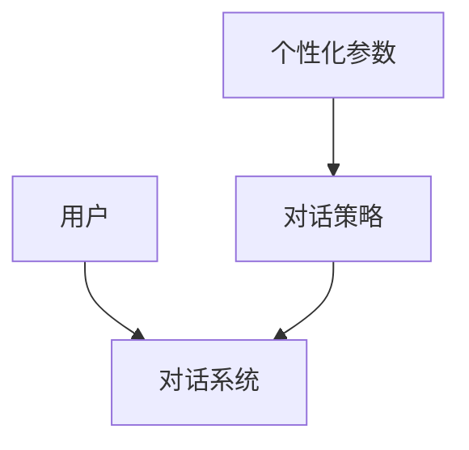

                 

# AI Agent的对话策略优化与个性化

## 关键词：AI Agent、对话策略优化、个性化对话、生成式模型、强化学习、对话系统、用户体验

## 摘要：  
本文深入探讨了AI Agent的对话策略优化与个性化实现的核心原理与技术细节。首先，从AI Agent的基本概念出发，详细介绍了对话策略优化的背景、问题和意义。接着，重点分析了对话策略优化的核心原理，包括生成式模型和强化学习在对话策略优化中的应用。通过对比不同对话策略的优缺点，结合ER实体关系图和Mermaid流程图，清晰地阐述了对话策略优化的数学模型与算法实现。最后，结合实际应用场景，详细讲解了系统架构设计、项目实战与案例分析，为读者提供了一套完整的对话策略优化与个性化实现的解决方案。

---

# 第一部分: AI Agent的对话策略优化与个性化基础

# 第1章: AI Agent与对话策略优化概述

## 1.1 AI Agent的基本概念

### 1.1.1 AI Agent的定义与特点  
AI Agent（人工智能代理）是一种能够感知环境、自主决策并执行任务的智能实体。其特点包括：  
1. **自主性**：能够在没有外部干预的情况下独立运作。  
2. **反应性**：能够根据环境变化实时调整行为。  
3. **目标导向**：具备明确的目标导向性，能够通过决策实现目标。  
4. **学习能力**：能够通过数据和经验不断优化自身的性能。  

### 1.1.2 对话系统的基本原理  
对话系统是一种典型的AI Agent应用，其核心在于通过自然语言处理技术实现人与机器之间的有效交流。对话系统通常包括以下三个关键环节：  
1. **输入解析**：将用户的输入（如文本或语音）转换为系统可理解的形式。  
2. **对话策略生成**：根据当前对话状态生成合适的回复。  
3. **输出生成**：将生成的回复转化为用户可理解的形式（如文本或语音）。  

### 1.1.3 对话策略优化的背景与意义  
随着自然语言处理技术的快速发展，对话系统在各个领域的应用越来越广泛。然而，现有的对话系统在用户体验方面仍存在诸多不足，如回复不够个性化、对话逻辑不够严谨等。对话策略优化的目标在于通过技术手段提升对话系统的智能化水平，使其能够更好地满足用户需求。

## 1.2 对话策略优化的核心问题

### 1.2.1 对话目标的设定  
对话目标是指对话系统在特定场景下需要实现的任务。例如：  
- **信息检索**：帮助用户获取特定信息（如天气预报、新闻资讯等）。  
- **任务执行**：帮助用户完成特定任务（如预约、下单等）。  
- **情感交流**：与用户进行情感交流，提升用户体验。  

### 1.2.2 对话策略的分类与对比  
对话策略可以按照不同的标准进行分类。以下从两个维度进行分析：  
1. **基于生成方式**：  
   - **生成式策略**：通过生成模型实时生成回复。  
   - **检索式策略**：从预定义的回复库中选择最优回复。  
2. **基于优化目标**：  
   - **最大化准确性**：优先保证回复的准确性。  
   - **最大化流畅性**：优先保证对话的流畅性。  

### 1.2.3 对话策略优化的挑战与机遇  
对话策略优化的挑战主要体现在以下两个方面：  
1. **数据依赖性**：优化需要大量高质量的数据支持。  
2. **计算复杂性**：优化过程涉及复杂的计算，对硬件要求较高。  
而机遇则体现在技术进步带来的性能提升，如生成式模型和强化学习的快速发展为对话策略优化提供了新的可能性。

## 1.3 个性化对话策略的必要性

### 1.3.1 用户需求的多样性  
用户在不同场景下的需求具有高度的多样性。例如，有些用户希望对话系统提供简洁明了的回复，而有些用户则希望获得详细的解释。因此，个性化的对话策略能够更好地满足用户的多样化需求。

### 1.3.2 个性化对话的实现方法  
个性化对话的实现方法主要包括以下几种：  
1. **基于用户画像的策略调整**：通过分析用户的历史行为数据，生成用户画像，并根据画像调整对话策略。  
2. **基于实时反馈的策略调整**：根据用户的实时反馈动态调整对话策略。  
3. **基于上下文的策略调整**：根据对话的上下文信息动态调整回复内容。  

### 1.3.3 个性化对话对用户体验的提升  
个性化对话能够显著提升用户体验，主要体现在以下几个方面：  
1. **提高对话效率**：通过个性化策略，减少不必要的信息冗余。  
2. **增强用户满意度**：个性化回复能够更好地满足用户的期望。  
3. **增强用户粘性**：通过个性化的对话体验，增强用户对产品的粘性。  

## 1.4 本章小结  
本章从AI Agent的基本概念出发，详细介绍了对话策略优化的背景、问题和意义。同时，分析了个性化对话策略的必要性和实现方法，并展望了其对用户体验的提升作用。

---

# 第二部分: 对话策略优化的核心概念与联系

# 第2章: 对话策略优化的核心原理

## 2.1 对话策略优化的数学模型

### 2.1.1 对话策略的数学表示  
对话策略可以表示为一个函数：  
$$ \pi(s) = a $$  
其中，$s$ 表示对话状态，$a$ 表示动作（即回复内容）。  

### 2.1.2 状态空间与动作空间的定义  
- **状态空间**：所有可能的对话状态的集合。  
- **动作空间**：所有可能的回复内容的集合。  

### 2.1.3 奖励函数的设计与实现  
奖励函数用于衡量对话策略的好坏。通常，奖励函数可以表示为：  
$$ R(s, a) = r $$  
其中，$r$ 表示奖励值，取值范围为 $[-1, 1]$。  

## 2.2 对话策略优化的算法原理

### 2.2.1 基于生成式模型的对话策略
生成式模型是一种通过生成新内容来实现对话策略的方法。其基本原理如下：  
1. **输入解析**：将用户输入转换为模型可理解的形式。  
2. **内容生成**：通过生成模型生成回复内容。  
3. **输出生成**：将生成的内容转换为用户可理解的形式。  

### 2.2.2 基于强化学习的对话策略优化  
强化学习是一种通过不断试错来优化对话策略的方法。其基本流程如下：  
1. **状态感知**：感知当前对话状态。  
2. **动作选择**：根据当前状态选择一个动作。  
3. **奖励获取**：根据动作执行的结果获取奖励。  
4. **策略更新**：根据奖励更新对话策略。  

### 2.2.3 对话策略优化的数学公式推导  
对话策略优化的目标是最大化期望奖励，即：  
$$ \max_{\pi} \mathbb{E}[R(s, a)] $$  
通过强化学习，我们可以不断更新策略，使其趋近于最优策略。

## 2.3 对话策略优化的核心概念对比

### 2.3.1 对话策略与生成模型的对比  
| 对比维度 | 对话策略 | 生成模型 |  
|----------|----------|----------|  
| 核心目标 | 选择最优回复 | 生成回复内容 |  
| 实现方式 | 基于策略优化 | 基于生成模型 |  
| 优缺点   | 精确性高，但计算复杂 | 生成能力强，但可能缺乏灵活性 |  

### 2.3.2 强化学习与监督学习的对比  
| 对比维度 | 强化学习 | 监督学习 |  
|----------|----------|----------|  
| 数据来源 | 环境反馈 | 标签数据 |  
| 学习目标 | 最大化奖励 | 最小化损失 |  
| 适用场景 | 对话策略优化 | 分类、回归等任务 |  

### 2.3.3 对话策略优化的优缺点分析  
- **优点**：能够根据用户反馈动态调整策略，提高对话质量。  
- **缺点**：需要大量数据和计算资源支持，实现复杂。  

## 2.4 对话策略优化的ER实体关系图  

## 2.5 本章小结  
本章详细分析了对话策略优化的核心原理，包括数学模型、算法原理以及核心概念的对比。通过对ER实体关系图的分析，进一步明确了对话策略优化的实现路径。

---

# 第三部分: 对话策略优化的算法原理与实现

# 第3章: 对话策略优化的算法原理

## 3.1 基于生成式模型的对话策略

### 3.1.1 生成式模型的基本原理  
生成式模型通过概率分布生成回复内容。其基本流程如下：  
1. **输入解析**：将用户输入转换为模型可理解的形式。  
2. **内容生成**：通过生成模型生成回复内容。  
3. **输出生成**：将生成的内容转换为用户可理解的形式。  

### 3.1.2 对话策略生成的流程  
对话策略生成的流程可以表示为：  
1. **状态感知**：感知当前对话状态。  
2. **内容生成**：根据对话状态生成回复内容。  
3. **策略优化**：通过强化学习不断优化对话策略。  

### 3.1.3 基于Transformer的对话生成模型  
Transformer是一种高效的生成模型，其核心在于自注意力机制。通过自注意力机制，模型能够更好地捕捉对话中的上下文信息，从而生成更自然的回复。

## 3.2 基于强化学习的对话策略优化

### 3.2.1 强化学习的基本原理  
强化学习通过不断试错来优化对话策略。其基本流程如下：  
1. **状态感知**：感知当前对话状态。  
2. **动作选择**：根据当前状态选择一个动作。  
3. **奖励获取**：根据动作执行的结果获取奖励。  
4. **策略更新**：根据奖励更新对话策略。  

### 3.2.2 对话策略优化的强化学习框架  
对话策略优化的强化学习框架可以表示为：  
1. **状态感知**：感知当前对话状态。  
2. **动作选择**：根据当前状态选择一个动作。  
3. **奖励获取**：根据动作执行的结果获取奖励。  
4. **策略更新**：根据奖励更新对话策略。  

### 3.2.3 奖励函数的设计与实现  
奖励函数用于衡量对话策略的好坏。通常，奖励函数可以表示为：  
$$ R(s, a) = r $$  
其中，$r$ 表示奖励值，取值范围为 $[-1, 1]$。  

## 3.3 对话策略优化的数学模型

### 3.3.1 对话策略的数学表示  
对话策略可以表示为一个函数：  
$$ \pi(s) = a $$  
其中，$s$ 表示对话状态，$a$ 表示动作（即回复内容）。  

### 3.3.2 状态空间与动作空间的定义  
- **状态空间**：所有可能的对话状态的集合。  
- **动作空间**：所有可能的回复内容的集合。  

### 3.3.3 奖励函数的设计与实现  
奖励函数用于衡量对话策略的好坏。通常，奖励函数可以表示为：  
$$ R(s, a) = r $$  
其中，$r$ 表示奖励值，取值范围为 $[-1, 1]$。  

---

# 作者：AI天才研究院/AI Genius Institute & 禅与计算机程序设计艺术 /Zen And The Art of Computer Programming

