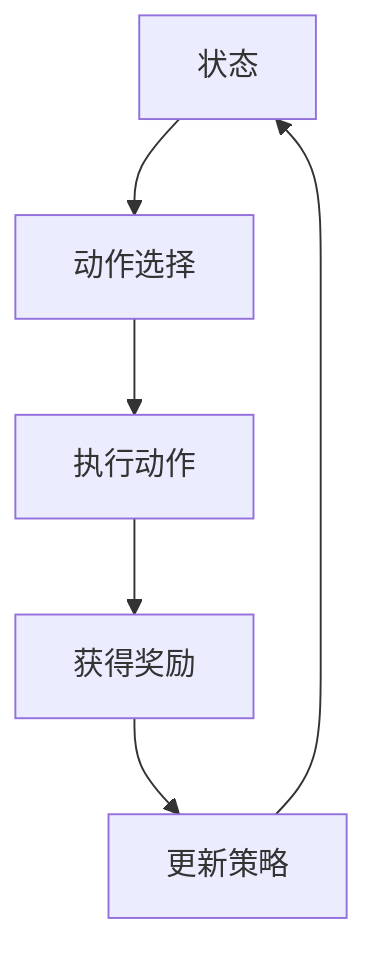
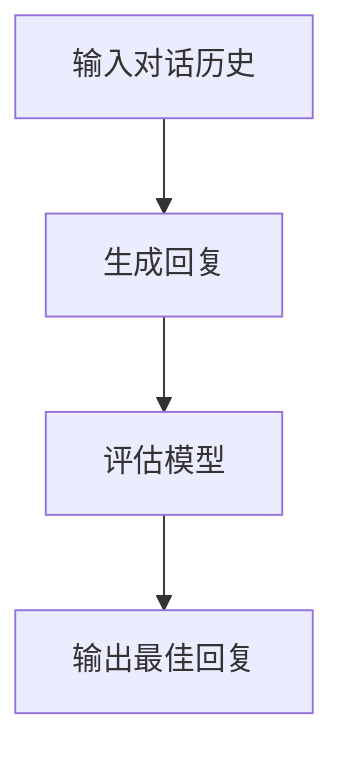
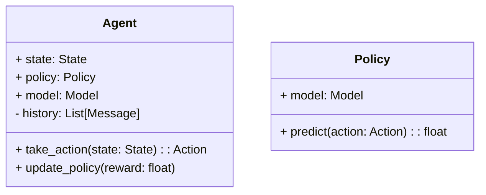
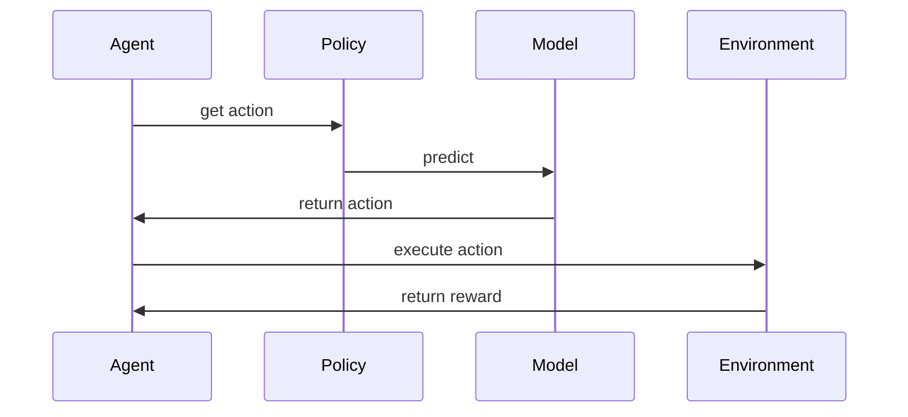

                 


# AI Agent的对话策略优化：提升用户体验

> 关键词：AI Agent, 对话策略优化, 用户体验, 强化学习, 自然语言处理, 系统架构设计

> 摘要：AI Agent的对话策略优化是提升用户体验的关键技术。本文系统地探讨了对话策略优化的核心概念、算法原理、系统架构设计以及项目实战，结合实际案例，深入分析了如何通过强化学习、监督学习和生成式模型等方法提升对话系统的性能，最终实现更自然、更智能的用户体验。

---

## 第1章 AI Agent与对话策略优化概述

### 1.1 AI Agent的基本概念

#### 1.1.1 AI Agent的定义与特点
- **定义**：AI Agent（人工智能代理）是指能够感知环境、自主决策并执行任务的智能体。
- **特点**：
  - **自主性**：无需外部干预，自主完成任务。
  - **反应性**：能够实时感知环境并做出反应。
  - **社交能力**：能够与人类或其他系统进行交互。
  - **学习能力**：通过数据和经验不断优化自身行为。

#### 1.1.2 对话策略的定义与作用
- **定义**：对话策略是指AI Agent在与用户交互过程中，根据当前对话状态、用户意图和历史记录，选择合适的回复或行动的策略。
- **作用**：
  - 提高对话的流畅性。
  - 增强用户体验。
  - 提升任务完成效率。

#### 1.1.3 对话策略优化的必要性
- **背景**：当前对话系统存在理解误差、回复不够自然、任务完成效率低等问题。
- **目标**：通过优化对话策略，提升对话系统的智能化水平和用户体验。

### 1.2 对话策略优化的背景与问题背景

#### 1.2.1 当前对话系统存在的问题
- **问题**：
  - 对话不连贯。
  - 回答不够精准。
  - 无法有效处理复杂对话场景。

#### 1.2.2 对话策略优化的目标与边界
- **目标**：通过优化对话策略，提高对话系统的理解和生成能力。
- **边界**：不涉及底层NLP技术的实现，专注于策略优化层面。

#### 1.2.3 对话策略优化的核心要素
- **要素**：
  - 对话上下文的处理。
  - 用户意图识别与建模。
  - 策略评估与反馈机制。

### 1.3 本章小结
- 本章介绍了AI Agent的基本概念和对话策略优化的背景，明确了对话策略优化的目标和核心要素。

---

## 第2章 对话策略优化的核心概念与联系

### 2.1 对话策略优化的原理与方法

#### 2.1.1 基于强化学习的对话策略优化
- **原理**：通过强化学习算法，AI Agent在与用户的交互中不断尝试不同的回复策略，根据反馈调整行为。
- **流程图**：
  ```mermaid
  graph TD
  A[状态] --> B[动作选择]
  B --> C[执行动作]
  C --> D[获得奖励]
  D --> E[更新策略]
  E --> A
  ```

#### 2.1.2 基于监督学习的对话策略优化
- **原理**：基于已标注的对话数据，训练模型预测最佳回复策略。
- **流程图**：
  ```mermaid
  graph TD
  A[输入对话历史] --> B[生成回复]
  B --> C[评估模型]
  C --> D[输出最佳回复]
  ```

#### 2.1.3 基于生成模型的对话策略优化
- **原理**：利用生成式模型（如GPT）生成多样化的回复，结合策略优化选择最佳回复。

### 2.2 对话策略优化的核心要素

#### 2.2.1 对话上下文的处理
- **方法**：通过上下文理解对话历史，提取关键信息用于策略选择。

#### 2.2.2 用户意图识别与建模
- **方法**：利用NLP技术识别用户的意图，并构建意图模型。

#### 2.2.3 策略评估与反馈机制
- **方法**：通过用户反馈和系统日志，评估对话策略的性能并进行优化。

### 2.3 对话策略优化与其他技术的关系

#### 2.3.1 自然语言处理（NLP）的关系
- **关系**：NLP技术为对话策略优化提供了语言理解和生成的基础。

#### 2.3.2 强化学习与对话策略优化的关系
- **关系**：强化学习是对话策略优化的核心技术之一，尤其在动态对话场景中表现突出。

#### 2.3.3 知识图谱与对话策略优化的关系
- **关系**：知识图谱为对话策略优化提供了丰富的背景知识和上下文信息。

### 2.4 本章小结
- 本章详细探讨了对话策略优化的核心原理与方法，分析了其与其他技术的关系。

---

## 第3章 基于强化学习的对话策略优化算法

### 3.1 强化学习基础

#### 3.1.1 强化学习的基本概念
- **定义**：强化学习是一种通过试错学习来优化决策策略的方法。
- **核心概念**：
  - **状态（State）**：环境中的当前情况。
  - **动作（Action）**：智能体采取的行动。
  - **奖励（Reward）**：智能体行动后获得的反馈。

#### 3.1.2 状态、动作、奖励的定义
- **状态**：当前对话的上下文信息。
- **动作**：生成的回复。
- **奖励**：用户对回复的满意度评分。

### 3.2 基于强化学习的对话策略优化算法

#### 3.2.1 算法流程图


#### 3.2.2 数学模型与公式
- **策略评估公式**：
  $$ V(s) = \max_a Q(s,a) $$
- **策略更新公式**：
  $$ Q(s,a) = r + \gamma \max_{a'} Q(s',a') $$

#### 3.2.3 算法实现与代码示例
```python
class Agent:
    def __init__(self):
        self.states = []
        self.rewards = []
    
    def take_action(self, state):
        # 根据策略选择动作
        action = self.policy(state)
        return action
    
    def update_policy(self, reward):
        # 更新策略
        self.policy.update(reward)
```

### 3.3 本章小结
- 本章详细讲解了基于强化学习的对话策略优化算法，包括算法流程和数学模型。

---

## 第4章 基于监督学习的对话策略优化

### 4.1 监督学习基础

#### 4.1.1 监督学习的基本概念
- **定义**：监督学习是一种通过标注数据训练模型的方法。

#### 4.1.2 对话数据的标注与处理
- **步骤**：
  - 数据收集。
  - 数据清洗。
  - 数据标注。

### 4.2 基于监督学习的对话策略优化算法

#### 4.2.1 算法流程图


#### 4.2.2 算法实现与代码示例
```python
def train_model(data):
    # 训练模型
    model = get_model()
    for batch in data:
        inputs, labels = batch
        model.train_on_batch(inputs, labels)
    return model
```

### 4.3 本章小结
- 本章介绍了基于监督学习的对话策略优化算法，包括算法流程和实现步骤。

---

## 第5章 对话策略优化的系统架构设计

### 5.1 系统功能设计

#### 5.1.1 领域模型


#### 5.1.2 系统架构设计
```mermaid
graph LR
    Agent -> Policy
    Policy -> Model
    Model -> Environment
    Environment -> Agent
```

### 5.2 系统交互设计

#### 5.2.1 序列图


### 5.3 本章小结
- 本章详细设计了对话策略优化系统的架构和交互流程。

---

## 第6章 项目实战：基于强化学习的对话策略优化

### 6.1 环境安装与配置

#### 6.1.1 安装依赖
```bash
pip install numpy matplotlib
```

### 6.2 系统核心实现

#### 6.2.1 策略网络实现
```python
class PolicyNetwork:
    def __init__(self):
        self.model = Sequential([
            Dense(64, activation='relu'),
            Dense(1, activation='sigmoid')
        ])
    
    def predict(self, state):
        return self.model.predict(state)
    
    def update(self, reward):
        # 更新权重
        self.model.fit(state, reward, epochs=10)
```

#### 6.2.2 训练过程与结果分析
```python
def train_agent():
    agent = Agent()
    for episode in range(1000):
        state = get_initial_state()
        reward = 0
        while not episode_over:
            action = agent.take_action(state)
            next_state, reward = get_reward(state, action)
            agent.update_policy(reward)
            state = next_state
```

### 6.3 案例分析与用户体验提升

#### 6.3.1 实际案例分析
- **案例1**：用户查询天气。
- **案例2**：用户预订机票。

### 6.4 本章小结
- 本章通过实际项目实战，详细讲解了对话策略优化的实现过程和效果。

---

## 第7章 对话策略优化的最佳实践与总结

### 7.1 本章小结
- 总结了对话策略优化的核心内容和实现方法。

### 7.2 注意事项
- **数据质量**：确保训练数据的多样性和代表性。
- **模型选择**：根据具体场景选择合适的优化算法。
- **用户体验**：始终以提升用户体验为目标。

### 7.3 拓展阅读
- 推荐阅读相关领域的书籍和论文，深入学习对话策略优化的前沿技术。

### 7.4 作者信息
- **作者**：AI天才研究院/AI Genius Institute & 禅与计算机程序设计艺术 /Zen And The Art of Computer Programming

---

通过以上详细目录，您可以系统地学习和理解AI Agent的对话策略优化技术，从基础概念到实际应用，逐步提升对话系统的智能化水平和用户体验。

