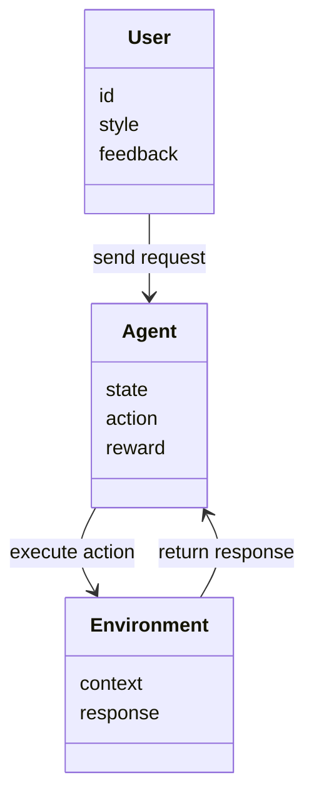
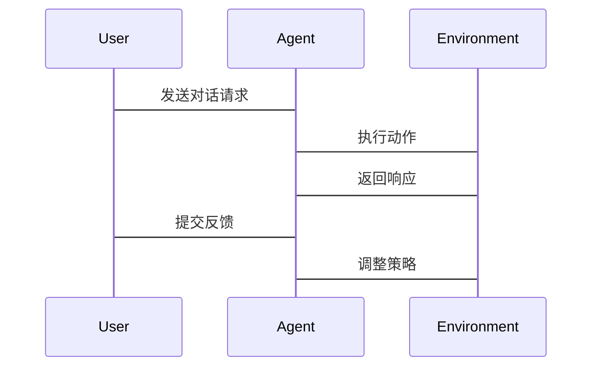

                 


# AI Agent的对话策略动态调整：适应用户风格

> 关键词：AI Agent，对话策略，动态调整，用户风格，自然语言处理，强化学习

> 摘要：本文探讨了AI Agent如何根据用户风格动态调整对话策略，分析了用户风格的分类与建模方法，提出了基于强化学习和用户反馈的策略调整算法，并通过系统架构设计与项目实战，展示了如何实现适应用户风格的动态对话策略。文章最后总结了最佳实践与未来研究方向。

---

# 第一部分: AI Agent的对话策略动态调整引言

## 第1章: 引言

### 1.1 AI Agent的基本概念

#### 1.1.1 什么是AI Agent

AI Agent（人工智能代理）是指能够感知环境、自主决策并执行任务的智能实体。在对话系统中，AI Agent通常表现为通过自然语言处理技术与用户进行交互，理解用户需求并提供相应的回应。

$$
\text{AI Agent} = \text{感知} \times \text{决策} \times \text{执行}
$$

#### 1.1.2 AI Agent的核心功能

1. **感知能力**：通过自然语言处理技术理解用户输入的文本。
2. **决策能力**：基于用户需求和上下文信息生成合适的回应策略。
3. **执行能力**：通过文本生成模块输出对话内容。

#### 1.1.3 对话策略的重要性

对话策略是AI Agent的核心组成部分，决定了其与用户交互的质量。有效的对话策略能够提高用户体验，增强系统的智能性。

### 1.2 动态调整对话策略的背景

#### 1.2.1 用户需求的多样性

用户的需求和期望因人而异，同一用户在不同场景下的需求也可能发生变化。

#### 1.2.2 对话场景的变化性

对话场景可能涉及多种主题和情感倾向，AI Agent需要能够灵活应对不同场景。

#### 1.2.3 动态调整的必要性

为了满足多样化的用户需求和应对多变的对话场景，AI Agent需要具备动态调整对话策略的能力。

### 1.3 本书的目标与结构

#### 1.3.1 本书的核心目标

通过理论与实践相结合的方式，探讨AI Agent如何动态调整对话策略以适应用户风格。

#### 1.3.2 本书的章节安排

1. 引言
2. 对话策略生成基础
3. 动态调整机制
4. 用户风格分析与建模
5. 基于强化学习的对话策略调整算法
6. 系统架构设计
7. 项目实战
8. 最佳实践与小结

#### 1.3.3 本书的适用读者

适合AI领域研究人员、软件开发人员以及对对话系统感兴趣的技术爱好者阅读。

---

# 第二部分: AI Agent对话策略动态调整的理论基础

## 第2章: 对话策略生成基础

### 2.1 对话策略的基本原理

#### 2.1.1 对话策略的定义

对话策略是指在特定对话情境下，AI Agent生成回应的规则和方法。

#### 2.1.2 对话策略的分类

1. **基于规则的策略**：通过预定义的规则生成回应。
2. **基于统计的策略**：通过分析历史数据生成概率化的回应。
3. **基于深度学习的策略**：通过神经网络模型生成复杂的非线性映射。

#### 2.1.3 对话策略的评估指标

1. **准确性**：回应是否准确满足用户需求。
2. **流畅性**：回应是否自然流畅。
3. **相关性**：回应是否与对话上下文相关。

### 2.2 基于用户风格的对话策略生成

#### 2.2.1 用户风格的定义

用户风格指用户在语言表达、思维方式和情感倾向上的独特特征。

#### 2.2.2 用户风格的分类

1. **语言风格**：包括词汇选择、句式结构等。
2. **思维风格**：包括逻辑性、创造性等。
3. **情感倾向**：包括情感色彩、情绪强度等。

#### 2.2.3 用户风格对对话策略的影响

用户风格影响AI Agent生成回应的方式，例如：
- **正式风格**：回应需要严谨、正式。
- **非正式风格**：回应可以轻松、随意。

---

## 第3章: 动态调整机制

### 3.1 动态调整的基本原理

#### 3.1.1 动态调整的触发条件

1. **用户反馈**：用户对当前回应的评价。
2. **对话上下文变化**：对话主题或情感倾向的变化。
3. **系统预设条件**：例如时间、地点等信息的变化。

#### 3.1.2 动态调整的实现方式

1. **实时反馈机制**：根据用户实时反馈调整策略。
2. **上下文感知机制**：根据对话上下文动态调整策略。
3. **预设条件触发机制**：根据预设条件自动调整策略。

#### 3.1.3 动态调整的优化策略

1. **渐进式调整**：逐步优化对话策略，避免突变。
2. **反馈循环机制**：利用反馈不断优化策略。
3. **多目标平衡**：在多个目标间寻找最优平衡点。

---

## 第4章: 用户风格分析与建模

### 4.1 用户风格的特征提取

#### 4.1.1 语言风格的特征

1. **词汇选择**：常用词汇的偏好。
2. **句式结构**：简单句、复合句的偏好。
3. **语气**：正式、非正式、疑问等。

#### 4.1.2 思维风格的特征

1. **逻辑性**：推理的严密程度。
2. **创造性**：思维方式的创新性。
3. **深度**：思考的深度。

#### 4.1.3 情感倾向的特征

1. **情感强度**：情感表达的强烈程度。
2. **情感类型**：正面、负面或中性情感的偏好。

### 4.2 用户风格的建模方法

#### 4.2.1 基于统计的建模方法

通过统计用户语言和行为数据，提取用户风格特征。

#### 4.2.2 基于深度学习的建模方法

使用神经网络模型（如LSTM、Transformer）学习用户风格的表示。

#### 4.2.3 基于规则的建模方法

通过预定义规则匹配用户风格特征。

---

## 第5章: 基于强化学习的对话策略调整算法

### 5.1 强化学习的基本原理

#### 5.1.1 强化学习的核心概念

1. **状态**：当前对话的上下文信息。
2. **动作**：AI Agent生成的回应。
3. **奖励**：用户对回应的反馈。

#### 5.1.2 基于强化学习的策略调整算法

1. **Q-learning算法**：通过状态和动作的组合学习最优策略。
2. **策略梯度法**：直接优化策略参数以最大化期望奖励。

### 5.2 基于反馈的动态调整方法

#### 5.2.1 用户反馈的收集与分析

通过用户满意度评分、情感分析等方法收集反馈。

#### 5.2.2 基于反馈的策略调整算法

1. **基于Q-learning的策略调整**：
   $$ Q(s, a) = Q(s, a) + \alpha (r + \max Q(s', a') - Q(s, a)) $$
2. **基于策略梯度的策略调整**：
   $$ \nabla \theta \log \pi_\theta(a|s) \cdot Q(s, a) $$

#### 5.2.3 反馈驱动的策略优化

通过持续收集用户反馈，优化对话策略，以提高用户体验。

---

## 第6章: 系统架构设计

### 6.1 系统功能设计

#### 6.1.1 领域模型类图



#### 6.1.2 系统架构图


#### 6.1.3 接口设计

1. **用户接口**：文本输入、反馈提交。
2. **系统接口**：对话状态管理、策略调整接口。

#### 6.1.4 交互序列图



---

## 第7章: 项目实战

### 7.1 环境安装

1. **Python环境**：建议使用Python 3.8及以上版本。
2. **依赖库安装**：
   ```bash
   pip install numpy tensorflow transformers
   ```

### 7.2 核心代码实现

#### 7.2.1 强化学习算法实现

```python
import numpy as np
import tensorflow as tf

class AI-Agent:
    def __init__(self):
        self.states = []
        self.actions = []
        self.rewards = []
        self.q_table = {}

    def perceive(self, state):
        # 处理当前状态，生成回应
        pass

    def learn(self, state, action, reward):
        # 基于强化学习更新Q表
        key = (state, action)
        if key not in self.q_table:
            self.q_table[key] = 0
        self.q_table[key] = self.q_table[key] + learning_rate * (reward + np.max([self.q_table.get((state, a), 0) for a in self.actions]) - self.q_table[key])
```

#### 7.2.2 用户风格分析实现

```python
from transformers import *

class StyleAnalyzer:
    def __init__(self):
        self.model = AutoModel.from_pretrained("bert-base-uncased")

    def analyze_style(self, text):
        # 分析用户风格，返回风格特征
        pass
```

### 7.3 代码解读与应用分析

通过上述代码，我们可以实现一个基于强化学习的动态调整策略AI Agent，并结合用户风格分析模块，实时优化对话策略。

### 7.4 实际案例分析

通过具体案例分析，展示动态调整策略在实际对话中的应用效果。

---

## 第8章: 最佳实践与小结

### 8.1 最佳实践

1. **持续优化**：定期收集用户反馈，优化对话策略。
2. **多模态融合**：结合语音、图像等多种模态信息，提升用户体验。
3. **隐私保护**：确保用户数据的安全性和隐私性。

### 8.2 小结

本文系统地探讨了AI Agent如何动态调整对话策略以适应用户风格，通过理论分析、算法设计、系统实现和项目实战，展示了实现这一目标的具体方法和步骤。

### 8.3 注意事项

1. **数据质量**：确保训练数据的多样性和代表性。
2. **算法选择**：根据具体需求选择合适的算法和模型。
3. **性能优化**：关注系统的实时性和响应速度。

### 8.4 拓展阅读

推荐一些相关领域的书籍和论文，供读者进一步学习和研究。

---

# 作者：AI天才研究院 & 禅与计算机程序设计艺术

---

通过以上内容，希望本文能为读者提供关于AI Agent对话策略动态调整的全面理解，并为实际应用提供有价值的参考和指导。

